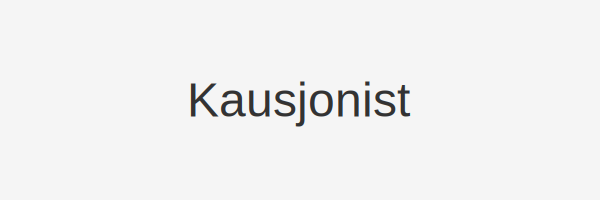

---
title: "Hva er en Kausjonist? Rolle, Ansvar og Risiko"
meta_title: "Hva er en Kausjonist? Rolle, Ansvar og Risiko"
meta_description: ''
slug: kausjonist
type: blog
layout: pages/single
---

En **kausjonist** er en person eller enhet som påtar seg **ansvar** for en annens gjeld ved å stille som kausjonist, også kjent som borgen eller garanti. Ved å signere en kausjonsavtale forplikter kausjonisten seg til å dekke kreditors krav dersom hovedskyldner ikke oppfyller sine forpliktelser.

## Typer kausjon

| Type kausjon      | Beskrivelse                                                                 | Ansvarsomfang               |
|-------------------|-----------------------------------------------------------------------------|-----------------------------|
| **Enkel kausjon** | Kausjonisten stiller kun sikkerhet etter at alle inkassotiltak er rettskraftig | Begrenset                   |
| **Full kausjon**  | Kausjonisten kan kreves erstatning umiddelbart sammen med hovedskyldner      | Ubegrenset                  |

## Juridisk ansvar

*Nøkkelpunkter* for kausjonistens ansvar:

* **Solidaransvar**: Kausjonisten kan holdes ansvarlig på lik linje med hovedskyldner.
* **Avgrensning**: Avtaleteksten avgjør hvilke fordringer og betingelser som omfattes.
* **Regress**: Kausjonisten har krav på regress mot hovedskyldner når kravet er oppfylt.

## Risikovurdering for kausjonist

Før man inngår en kausjonsavtale, bør man som kausjonist:

* Vurdere hovedskyldnerens betalingsevne.
* Forstå rekkevidden av forpliktelsen og eventuelle betingelser.
* Sjekke om avtalen krever dokumentasjon eller pant.

## Regnskapsmessige hensyn

Som betinget forpliktelse skal kausjonsansvar normalt ikke balanseføres, men omtales i noter som en **avsetning** dersom det er sannsynlig at kausjonisten må betale.

| Post                 | Beskrivelse                                        |
|----------------------|----------------------------------------------------|
| **Potensielt ansvar**| Maksimal sum kausjonisten kan bli holdt ansvarlig for |
| **Notehenvisning**    | Referanse til note om avsetning (f.eks. Note 12)     |

For mer om betingede forpliktelser og avsetning, se [Hva er Avsetning?](/blogs/regnskap/avsetning "Hva er Avsetning? Ulike typer og regnskapsføring").

## Relaterte artikler

* [Bankgaranti](/blogs/regnskap/bankgaranti "Bankgaranti - Oversikt over bankgarantier og sikkerhetsstillelse")
* [Gjeldsregisteret](/blogs/regnskap/gjeldsregisteret "Gjeldsregisteret - Oversikt over det norske gjeldsregisteret")
* [Hva er Internkontroll?](/blogs/regnskap/hva-er-internkontroll "Hva er Internkontroll? Prinsipper og krav")
* [Hva er Avsetning?](/blogs/regnskap/avsetning "Hva er Avsetning? Ulike typer og regnskapsføring")

