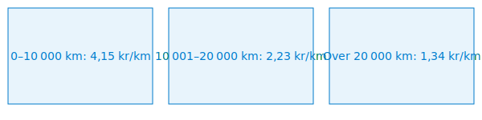

---
title: "Kjøregodtgjørelse"
meta_title: "Kjøregodtgjørelse"
meta_description: '**Kjøregodtgjørelse** er en **skattefri godtgjørelse per kilometer** for bruk av privatbil ved tjeneste- og yrkesrelatert kjøring. Riktig dokumentasjon og r...'
slug: kjoregodtgjorelse
type: blog
layout: pages/single
---

**Kjøregodtgjørelse** er en **skattefri godtgjørelse per kilometer** for bruk av privatbil ved tjeneste- og yrkesrelatert kjøring. Riktig dokumentasjon og regnskapsføring av kjøregodtgjørelse sikrer korrekt skattefradrag og compliance med norske regler.

## Hva er kjøregodtgjørelse?

**Kjøregodtgjørelse** kompenserer ansatte eller selvstendig næringsdrivende for kostnader knyttet til bruk av privat bil i tjeneste. Godtgjørelsen fastsettes som et beløp per kilometer i henhold til Skatteetatens satser.

## Lovgrunnlag og regelverk

>I henhold til **skatteloven § 6-2** og **skatteforvaltningsforskriften § 8-2-1** må alle som krever fradrag for bilkostnader dokumentere forretningsbruk med nøyaktig føring av kjørebok.

## Skatteregler og satser for 2024

>Skatteetaten fastsetter årlige **satser** for kjøregodtgjørelse som gir rett til skattefri dekning inntil fastsatt beløp per kilometer.

## Dokumentasjonskrav

For å få skattefri kjøregodtgjørelse må du dokumentere:

* **Reisens formål**, dato og destinasjon
* **Start- og sluttkilometerstand**
* **Total antall kilometer**
* **Knytning** til tjenestereise i [kjørebok](/blogs/regnskap/hva-er-kjorebok "Hva er kjørebok? Komplett Guide til Kjørebok for Bedrifter i Norge")

## Regnskapsføring av kjøregodtgjørelse

| Konto   | Beskrivelse                          | Oppgavepliktig |
|---------|--------------------------------------|----------------|
| **7330** | Godtgjørelse bil, oppgavepliktig    | Ja             |
| **7340** | Godtgjørelse bil, ikke oppgavepliktig | Nei          |

### Bokføringseksempel

| Transaksjon                     | Debet    | Kredit     |
|---------------------------------|----------|------------|
| Påløpt kjøregodtgjørelse        | 7330     | 2400       |
| Utbetaling av kjøregodtgjørelse | 2400     | 1920       |

## Praktiske rutiner

### Daglig føring

1. Registrer alle turer med korrekt kilometerstand i [kjørebok](/blogs/regnskap/hva-er-kjorebok "Hva er kjørebok? Komplett Guide til Kjørebok for Bedrifter i Norge").
2. Noter formål og eventuelle møter eller leveranser.
3. Kontroller totalsummer ved dagens slutt.

### Månedlig oppfølging

* Samle [reiseregninger](/blogs/regnskap/reiseregning "Reiseregning - Guide til reiseregninger i Norsk Regnskap") og kjørerapporter
* Verifiser at alle dager og turer er dokumentert
* Analyser kjømønster for optimalisering av kostnader

## Digitale løsninger og integrasjon

>Moderne løsninger kan automatisere registrering, beregning og integrasjon med regnskapssystemer.

Typiske funksjoner inkluderer:

* **GPS-basert sporing** av start, stopp og distanse
* **Automatisk kategorisering** av forretningsreiser
* **Direkte integrasjon** med [regnskapssystemer](/blogs/regnskap/api-integrasjon-automatisering-regnskap "API-integrasjon og automatisering i regnskap")

## Internlenker og relaterte emner

* [Diett](/blogs/regnskap/diett "Diett i regnskap: Guide til normaltariffer, regler og regnskapsføring")
* [Pendlerfradrag](/blogs/regnskap/pendlerfradrag "Pendlerfradrag i regnskap: Guide til regler, dokumentasjon og beregning")
* [Hva er en kjørebok?](/blogs/regnskap/hva-er-kjorebok "Hva er kjørebok? Komplett Guide til Kjørebok for Bedrifter i Norge")
* [Hva er bilag?](/blogs/regnskap/hva-er-bilag "Hva er Bilag i Regnskap? Komplett Guide til Regnskapsbilag og Dokumentasjon")
* [Hva er A-melding?](/blogs/regnskap/hva-er-a-melding "Hva er A-melding? Komplett Guide til A-meldingen")
* [Skatt](/blogs/regnskap/hva-er-skatt "Skatt - Komplett Guide til Skatteregler for Bedrifter")

## Oppsummering

**Kjøregodtgjørelse** er et sentralt verktøy for å sikre skattefri kompensasjon av bilkostnader ved tjenestekjøring. Ved å følge Skatteetatens satser, føre nøyaktig dokumentasjon i kjørebok og bokføre transaksjoner korrekt, kan virksomheter maksimere skattefordelene og redusere administrativt arbeid.

