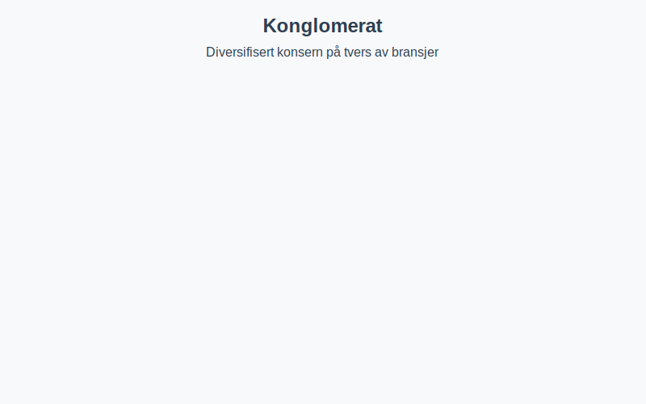

Et **konglomerat** er en *konsernstruktur* der **datterselskapene** opererer i helt ulike bransjer, ofte for å spre risiko og dra nytte av **synergier** på tvers av sektorer.

For mer om konsernstrukturer, se [Hva er et Konsern?](/blogs/regnskap/hva-er-konsern "Hva er et Konsern?").

## Definisjon av Konglomerat

Et konglomerat er en spesiell form for [konsern](/blogs/regnskap/hva-er-konsern "Hva er et Konsern?") hvor morselskapet eier datterselskaper i **ulike bransjer**. Dette skiller seg fra tradisjonelle konsern som typisk opererer innen samme eller beslektede næringer.

**Nøkkelkriterier:**

* *Diversifisering* av virksomhet for å redusere risiko.
* *Holdingselskap* som koordinerer eierstyringen.
* **Datterselskaper** innen flere sektorer.

## Konsern vs. Konglomerat

| **Type**    | **Karakteristikk**                     | **Eksempel**                  |
|-------------|----------------------------------------|-------------------------------|
| Konsern     | Selskaper innen samme bransje          | Et bilkonsern med flere merker|
| Konglomerat | Selskaper i forskjellige bransjer      | General Electric, Siemens     |

## Fordeler og Ulemper

### Fordeler

* **Risikospredning** gjennom diversifisering.
* **Økonomiske synergier** på tvers av selskaper.
* Bedre **finansiell fleksibilitet**.

### Ulemper

* Økt **kompleksitet** i ledelse og rapportering.
* Muligheter for **intern konkurranse** om ressurser.
* Potensielt **lavere fokus** på kjernevirksomhet.

## Eksempler på Norske Konglomerater

| **Selskap**        | **Bransjer**                            |
|--------------------|-----------------------------------------|
| Aker ASA           | Energi, sjømat, teknologi               |
| Orkla ASA          | Forbruksvarer, merkevarer, investeringer|
| Ferd Holding AS    | Finans, eiendom, industri               |

## Viktige hensyn ved etablering

1. Gjennomfør grundig *due diligence* for hver bransje.
2. Etabler klare **styringsrutiner** i holdingselskapet.
3. Vurdere **regnskapsmessige** og **skattemessige** konsekvenser.
4. Opprett robuste *internkontroll*-systemer (se [Hva er Internkontroll?](/blogs/regnskap/hva-er-internkontroll "Hva er Internkontroll? Komplett Guide til Internkontrollsystemer")).

## Konklusjon

Et **konglomerat** kan gi betydelige fordeler gjennom diversifisering og synergier, men krever omfattende styring og kompetanse. For norske foretak som vurderer en slik struktur, er det viktig å forstå både de *strategiske* og *regnskapsmessige* utfordringene.

