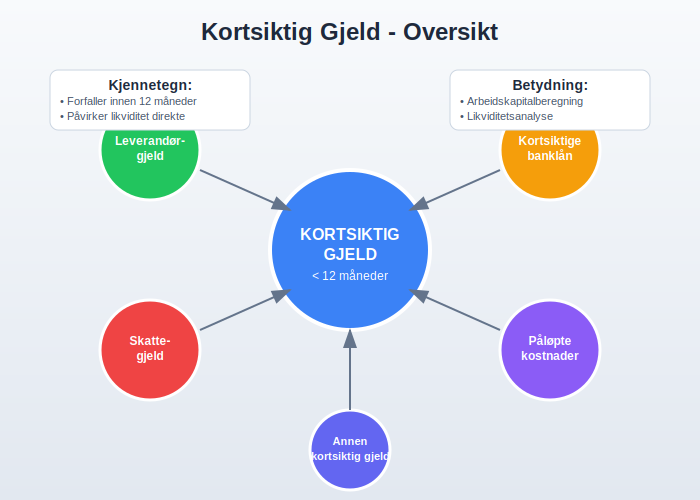
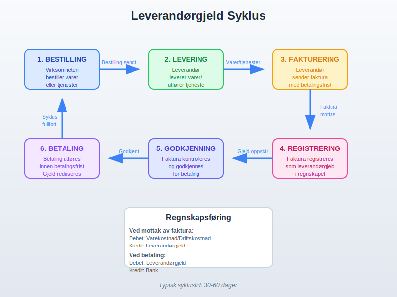
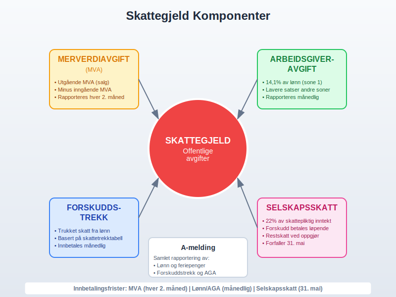
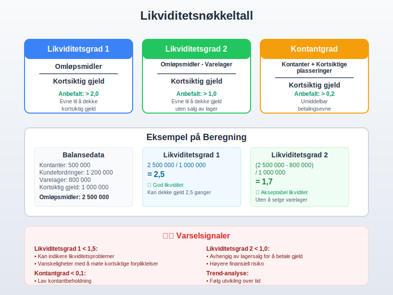
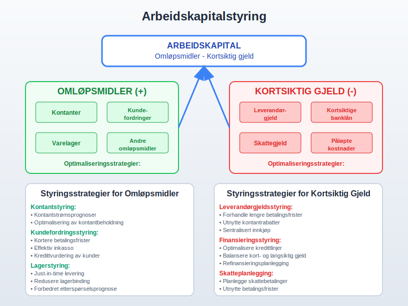
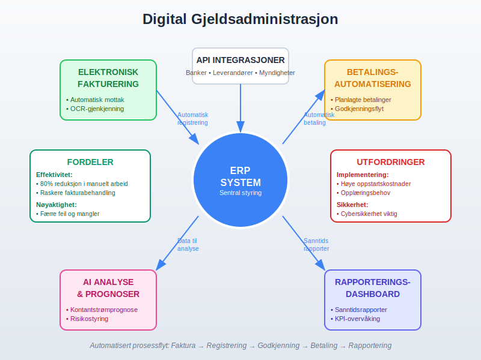

---
title: "Hva er Kortsiktig Gjeld?"
seoTitle: "Hva er Kortsiktig Gjeld?"
description: '**Kortsiktig gjeld** er en fundamental komponent i regnskapsføring som representerer virksomhetens forpliktelser som forfaller til betaling innen ett år fra b...'
summary: "Definisjon og regnskapsføring av kortsiktig gjeld: hovedtyper som leverandørgjeld, skattegjeld og kortsiktige lån, samt nøkkeltall for likviditet og arbeidskapital."
---

**Kortsiktig gjeld** er en fundamental komponent i regnskapsføring som representerer virksomhetens forpliktelser som forfaller til betaling innen ett år fra balansedagen. Som en kritisk del av [balansen](/blogs/regnskap/hva-er-balanse "Hva er Balanse i Regnskap? Komplett Guide til Balansens Oppbygging og Funksjon"), påvirker kortsiktig gjeld direkte virksomhetens [likviditet](/blogs/regnskap/hva-er-betalingsevne "Hva er Betalingsevne? Analyse av Likviditet og Finansiell Stabilitet") og [arbeidskapital](/blogs/regnskap/hva-er-arbeidskapital "Hva er Arbeidskapital? Beregning og Analyse av Driftskapital"). Denne artikkelen gir en omfattende gjennomgang av kortsiktig gjeld, dens komponenter, regnskapsføring og strategisk betydning.

**Høy andel kortsiktig gjeld kan øke risikoen for insolvens. Les mer i [Hva er Insolvens?](/blogs/regnskap/insolvens "Hva er Insolvens?").**

## Seksjon 1: Definisjon og Grunnleggende Prinsipper

**Kortsiktig gjeld** defineres som virksomhetens nåværende forpliktelser som forventes å bli gjort opp innen tolv måneder fra balansedagen. Dette skiller seg fra [langsiktig gjeld](/blogs/regnskap/langsiktig-gjeld "Hva er Langsiktig Gjeld? Komplett Guide til Langsiktige Forpliktelser") som har en forfallstid på mer enn ett år.

### 1.1 Klassifiseringskriterier

For at en forpliktelse skal klassifiseres som kortsiktig gjeld, må den oppfylle følgende kriterier:

* **Forfallstid:** Forpliktelsen forfaller innen 12 måneder fra balansedagen
* **Operasjonell syklus:** Forpliktelsen er del av virksomhetens normale operasjonelle syklus
* **Handelsformål:** Forpliktelsen holdes primært for handelsformål
* **Ingen utsettelsesrett:** Virksomheten har ikke ubetinget rett til å utsette oppgjør

### 1.2 Betydning for Finansiell Analyse

Kortsiktig gjeld er kritisk for vurdering av:

* **Likviditet:** Virksomhetens evne til å møte kortsiktige forpliktelser
* **Arbeidskapital:** Differansen mellom omløpsmidler og kortsiktig gjeld
* **Kontantstrømstyring:** Planlegging av kontantbehov
* **Kredittrisiko:** Vurdering av finansiell stabilitet

## Seksjon 2: Hovedtyper Kortsiktig Gjeld

### 2.1 Leverandørgjeld

**Leverandørgjeld** er den vanligste formen for kortsiktig gjeld og oppstår når virksomheten kjøper varer eller tjenester på kreditt.

#### Karakteristikker ved Leverandørgjeld:

* **Betalingsbetingelser:** Vanligvis 30-60 dager betalingsfrist
* **Kontantrabatter:** Rabatt for tidlig betaling (f.eks. 2/10 netto 30)
* **Ingen rentekostnad:** Normalt ingen eksplisitt rentekostnad
* **Handelskreditt:** Fungerer som kortsiktig finansiering

#### Regnskapsføring av Leverandørgjeld:

| **Transaksjon** | **Debet** | **Kredit** |
|-----------------|-----------|------------|
| Kjøp på kreditt | Varekostnad/Driftskostnad | Leverandørgjeld |
| Kontantrabatt | Leverandørgjeld | Bank + Finansinntekt |
| Betaling av gjeld | Leverandørgjeld | Bank |
| Retur av varer | Leverandørgjeld | Varekostnad |

### 2.2 Kortsiktige Banklån

Kortsiktige banklån inkluderer ulike former for kortsiktig finansiering fra finansinstitusjoner.

#### Typer Kortsiktige Banklån:

* **Driftskreditt:** Fleksibel kredittramme for daglig drift
* **Kontokortkreditt:** Overtrekk på bankkonto
* **Vekselkreditt:** Finansiering mot veksler
* **Kortsiktige terminlån:** Lån med fast løpetid under ett år
* **Byggelån:** Kortsiktig finansiering av byggeprosjekter

#### Regnskapsføring av Kortsiktige Banklån:

| **Hendelse** | **Debet** | **Kredit** |
|--------------|-----------|------------|
| Opptak av lån | Bank | Kortsiktig banklån |
| Påløpte renter | Rentekostnad | Påløpte renter |
| Rentebetaling | Påløpte renter | Bank |
| Nedbetaling | Kortsiktig banklån | Bank |

### 2.3 Skattegjeld og Offentlige Avgifter

Skatteforpliktelser utgjør en betydelig del av kortsiktig gjeld for de fleste virksomheter.

#### Hovedtyper Skattegjeld:

* **Skyldig merverdiavgift:** Innbetalt mva minus fradragsberettiget mva
* **Skyldig [arbeidsgiveravgift](/blogs/regnskap/hva-er-arbeidsgiveravgift "Hva er Arbeidsgiveravgift? Beregning, Satser og Regnskapsføring"):** Avgift på utbetalte lønn
* **[Forskuddstrekk](/blogs/regnskap/hva-er-forskuddstrekk "Hva er Forskuddstrekk? Beregning og Innbetaling av Skatt"):** Trukket skatt fra ansattes lønn
* **Skyldig selskapsskatt:** Beregnet skatt på årets resultat
* **Naturressursskatt:** For virksomheter i utvinningsindustrien

#### MVA-beregning og Regnskapsføring:

| **Periode** | **Utgående MVA** | **Inngående MVA** | **Til betaling** |
|-------------|------------------|-------------------|------------------|
| Januar | 125 000 | 87 500 | 37 500 |
| Februar | 150 000 | 95 000 | 55 000 |
| Mars | 135 000 | 78 000 | 57 000 |
| **1. kvartal** | **410 000** | **260 500** | **149 500** |

### 2.4 Påløpte Kostnader

**Påløpte kostnader** representerer kostnader som er pådratt men ikke betalt på balansedagen.

#### Vanlige Påløpte Kostnader:

* **Påløpte lønn:** Opptjent lønn som ikke er utbetalt
* **Påløpte [feriepenger](/blogs/regnskap/hva-er-feriepenger "Hva er Feriepenger? Beregning, Opptjening og Regnskapsføring"):** Opptjente feriepenger
* **Påløpte renter:** Renter som er pådratt men ikke betalt
* **Påløpte strømkostnader:** Forbrukt strøm som ikke er fakturert
* **Påløpte revisjonshonorar:** Utført revisjonsarbeid som ikke er fakturert

### 2.5 Kortsiktig Del av Langsiktig Gjeld

Den delen av langsiktig gjeld som forfaller til betaling innen ett år må reklassifiseres som kortsiktig gjeld.

#### Eksempler på Reklassifisering:

* **Avdrag på byggelån:** Neste års avdrag på langsiktig byggelån
* **Obligasjonsforfall:** Obligasjoner som forfaller innen ett år
* **Leasingavdrag:** Neste års leasingbetalinger
* **Pensjonspremier:** Forfalt pensjonspremie

## Seksjon 3: Regnskapsføring og Måling

### 3.1 Innregning av Kortsiktig Gjeld

Kortsiktig gjeld skal innregnes når:

* Virksomheten har en nåværende forpliktelse
* Forpliktelsen oppstår fra tidligere hendelser
* Det er sannsynlig at oppgjør krever utstrømning av ressurser
* Beløpet kan måles pålitelig

### 3.2 Måling av Kortsiktig Gjeld

#### Førstegangsinnregning:
* **Nominell verdi:** For de fleste kortsiktige forpliktelser
* **Virkelig verdi:** Når det er betydelig forskjell fra nominell verdi
* **Transaksjonskostnader:** Normalt ikke vesentlige for kortsiktig gjeld

#### Etterfølgende måling:
* **Amortisert kost:** Hovedregelen for finansielle forpliktelser
* **Nominell verdi:** For kortsiktige forpliktelser uten vesentlig rentekomponent

### 3.3 Valutaomregning

For kortsiktig gjeld i utenlandsk valuta:

| **Tidspunkt** | **Omregningskurs** | **Regnskapsføring** |
|---------------|-------------------|---------------------|
| Opptak | Spotkurs på opptak | Gjeld i NOK |
| Balansedagen | Spotkurs på balansedagen | Kursgevinst/-tap |
| Betaling | Spotkurs ved betaling | Endelig kursgevinst/-tap |

## Seksjon 4: Likviditetsanalyse og Nøkkeltall

### 4.1 Likviditetsnøkkeltall

Kortsiktig gjeld er sentral i beregning av viktige likviditetsnøkkeltall:

#### Primære Likviditetsnøkkeltall:

| **Nøkkeltall** | **Formel** | **Tolkning** | **Anbefalt nivå** |
|----------------|------------|--------------|-------------------|
| **Likviditetsgrad 1** | Omløpsmidler / Kortsiktig gjeld | Evne til å dekke kortsiktig gjeld | > 2,0 |
| **Likviditetsgrad 2** | (Omløpsmidler - Varelager) / Kortsiktig gjeld | Evne til å dekke gjeld uten salg av lager | > 1,0 |
| **Kontantgrad** | (Kontanter + Kortsiktige plasseringer) / Kortsiktig gjeld | Umiddelbar betalingsevne | > 0,2 |

### 4.2 Arbeidskapitalanalyse

**Arbeidskapital** = Omløpsmidler - Kortsiktig gjeld

#### Komponenter av Arbeidskapital:

* **Positive komponenter:** Kontanter, kundefordringer, varelager
* **Negative komponenter:** Leverandørgjeld, kortsiktige lån, påløpte kostnader
* **Netto arbeidskapital:** Differansen mellom positive og negative komponenter

### 4.3 Kontantkonverteringssyklus

Måler tiden fra investering i varelager til inngang av kontanter:

**Kontantkonverteringssyklus = Lageromløpstid + Kundefordringomløpstid - Leverandørgjeldperiode**

#### Beregningseksempel:

| **Komponent** | **Dager** | **Beregning** |
|---------------|-----------|---------------|
| Lageromløpstid | 45 dager | (Gjennomsnittlig lager / Varekostnad) × 365 |
| Kundefordringomløpstid | 30 dager | (Gjennomsnittlige kundefordringer / Omsetning) × 365 |
| Leverandørgjeldperiode | 40 dager | (Gjennomsnittlig leverandørgjeld / Varekjøp) × 365 |
| **Kontantkonverteringssyklus** | **35 dager** | 45 + 30 - 40 |

## Seksjon 5: Styring av Kortsiktig Gjeld

### 5.1 Arbeidskapitalstyring

Effektiv styring av kortsiktig gjeld er kritisk for [kontantstrømstyring](/blogs/regnskap/hva-er-kontantstrom "Hva er Kontantstrøm? Analyse og Styring av Kontantstrømmer"):

#### Strategier for Arbeidskapitalstyring:

* **Optimalisering av betalingsbetingelser:** Forhandle lengre betalingsfrister
* **Kontantrabattutnyttelse:** Utnytte rabatter for tidlig betaling når lønnsomt
* **Leverandørforhandlinger:** Sikre gunstige betalingsbetingelser
* **Kontantstrømsprognoser:** Planlegge kontantbehov

### 5.2 Finansieringsstrategier

#### Kortsiktige Finansieringsalternativer:

* **Handelskreditt:** Utnyttelse av leverandørgjeld
* **Bankkreditt:** Driftskreditt og kontokortkreditt
* **[Factoring](/blogs/regnskap/hva-er-factoring "Hva er Factoring? Finansiering gjennom Salg av Kundefordringer"):** Salg av kundefordringer
* **Kortsiktige lån:** Terminlån og vekselkreditt

### 5.3 Risikostyring

#### Risikoer knyttet til Kortsiktig Gjeld:

* **Likviditetsrisiko:** Risiko for ikke å kunne møte forpliktelser
* **Refinansieringsrisiko:** Risiko ved fornyelse av kredittlinjer
* **Renterisiko:** Risiko ved endringer i kortsiktige renter
* **Operasjonell risiko:** Risiko ved feil i gjeldsadministrasjon

## Seksjon 6: Bransjeforskjeller og Spesielle Forhold

### 6.1 Bransjevariasjoner

Kortsiktig gjeld varierer betydelig mellom bransjer:

#### Detaljhandel:
* **Høy leverandørgjeld:** Store innkjøp på kreditt
* **Sesongvariasjoner:** Høyere gjeld før høysesong
* **Lav kundefordringer:** Hovedsakelig kontantsalg

#### Produksjonsbedrifter:
* **Balansert gjeldsstruktur:** Både leverandør- og bankgjeld
* **Påløpte lønnskostnader:** Betydelige lønnsforpliktelser
* **Råvareleverandører:** Spesialiserte betalingsbetingelser

#### Tjenestebedrifter:
* **Lav leverandørgjeld:** Færre fysiske innkjøp
* **Høye lønnskostnader:** Store påløpte lønnsforpliktelser
* **Forskuddsbetalinger:** Mottatte forskudd fra kunder

### 6.2 Sesongvariasjoner

Mange virksomheter opplever sesongvariasjoner i kortsiktig gjeld:

| **Måned** | **Leverandørgjeld** | **Skattegjeld** | **Total Kortsiktig Gjeld** |
|-----------|-------------------|-----------------|---------------------------|
| Januar | 2 500 000 | 450 000 | 3 200 000 |
| April | 3 200 000 | 650 000 | 4 100 000 |
| Juli | 2 800 000 | 380 000 | 3 400 000 |
| Oktober | 4 100 000 | 720 000 | 5 200 000 |

## Seksjon 7: Rapportering og Noteopplysninger

### 7.1 Presentasjon i Balansen

Kortsiktig gjeld skal presenteres systematisk i balansen:

#### Standard Presentasjonsrekkefølge:

* **Kortsiktig del av langsiktig gjeld**
* **Leverandørgjeld**
* **Skyldig offentlige avgifter**
* **Kortsiktige banklån**
* **Annen kortsiktig gjeld**

### 7.2 Noteopplysninger

Viktige noteopplysninger om kortsiktig gjeld:

#### Obligatoriske Opplysninger:

* **Forfallsanalyse:** Når gjelden forfaller
* **Rentebetingelser:** Renter og sikkerhet for banklån
* **Valutaeksponering:** Gjeld i utenlandsk valuta
* **Sikkerhetsstillelse:** Pantsettelser og garantier

#### Eksempel på Forfallsanalyse:

| **Forfallsperiode** | **Beløp (NOK)** | **Andel (%)** |
|-------------------|-----------------|---------------|
| 0-3 måneder | 2 500 000 | 45% |
| 3-6 måneder | 1 800 000 | 32% |
| 6-12 måneder | 1 300 000 | 23% |
| **Total** | **5 600 000** | **100%** |

## Seksjon 8: Digitalisering og Automatisering

### 8.1 Moderne Gjeldsadministrasjon

Digitale løsninger transformerer håndtering av kortsiktig gjeld:

#### Digitale Verktøy:

* **[ERP-systemer](/blogs/regnskap/hva-er-erp-system "Hva er ERP-system? Komplett Guide til Enterprise Resource Planning"):** Integrert gjeldsadministrasjon
* **[Elektronisk fakturering](/blogs/regnskap/hva-er-elektronisk-fakturering "Hva er Elektronisk Fakturering? Fordeler og Implementering"):** Automatisert fakturabehandling
* **Betalingsautomatisering:** Automatiske betalinger basert på godkjenning
* **Kontantstrømsprognoser:** AI-baserte prognoser

### 8.2 Automatiserte Prosesser

#### Leverandørgjeldsprosess:

1. **Automatisk mottak:** [Elektroniske fakturaer](/blogs/regnskap/hva-er-efaktura "Hva er eFaktura? Elektronisk Fakturering og Digitale Betalingsløsninger")
2. **Automatisk matching:** Faktura mot bestilling og varemottak
3. **Automatisk godkjenning:** Basert på forhåndsdefinerte regler
4. **Automatisk betaling:** Planlagte betalinger

## Seksjon 9: Internkontroll og Compliance

### 9.1 Internkontrollsystemer

Effektiv internkontroll for kortsiktig gjeld:

#### Kontrollaktiviteter:

* **Segregering av oppgaver:** Skille mellom registrering og betaling
* **Autorisasjonsnivåer:** Definerte godkjenningsgrenser
* **Regelmessige avstemminger:** Avstemming mot leverandører
* **Dokumentasjonskrav:** Fullstendig dokumentasjon av transaksjoner

### 9.2 Compliance og Regulatoriske Krav

#### Viktige Regulatoriske Aspekter:

* **[Bokføringsloven](/blogs/regnskap/hva-er-bokforingsloven "Hva er Bokføringsloven? Regler og Krav til Regnskapsføring"):** Krav til registrering og dokumentasjon
* **Regnskapsloven:** Krav til presentasjon og noteopplysninger
* **Skatteloven:** Korrekt håndtering av skatteforpliktelser
* **[A-ordningen](/blogs/regnskap/hva-er-a-ordningen "Hva er A-ordningen? Komplett Guide til Rapportering av Lønn og Skatt"):** Rapportering av lønn og skatt

## Konklusjon

**Kortsiktig gjeld** er en kritisk komponent i virksomhetens finansielle struktur som krever nøye oppmerksomhet og profesjonell håndtering. Fra enkle leverandørforpliktelser til komplekse finansieringsarrangementer, påvirker kortsiktig gjeld direkte virksomhetens likviditet, arbeidskapital og operasjonelle fleksibilitet.

Effektiv håndtering av kortsiktig gjeld innebærer:

* **Systematisk klassifisering** og regnskapsføring i henhold til gjeldende standarder
* **Kontinuerlig overvåking** av likviditetsnøkkeltall og kontantstrømmer
* **Proaktiv arbeidskapitalstyring** for optimal kontantstrømsstyring
* **Implementering av digitale løsninger** for effektiv administrasjon
* **Robust internkontroll** for å sikre nøyaktighet og compliance

Ved å forstå kortsiktig gjeld grundig og implementere beste praksis for styring og rapportering, kan virksomheter optimalisere sin likviditetsstyring og sikre finansiell stabilitet. Kortsiktig gjeld er ikke bare en forpliktelse, men også et strategisk verktøy for effektiv arbeidskapitalstyring når det håndteres riktig.

For videre lesning om relaterte emner, se våre artikler om [gjeld generelt](/blogs/regnskap/hva-er-gjeld "Hva er Gjeld i Regnskap? Komplett Guide til Forpliktelser og Gjeldstyper"), [arbeidskapital](/blogs/regnskap/hva-er-arbeidskapital "Hva er Arbeidskapital? Beregning og Analyse av Driftskapital"), [likviditetsanalyse](/blogs/regnskap/hva-er-betalingsevne "Hva er Betalingsevne? Analyse av Likviditet og Finansiell Stabilitet"), og [kontantstrømstyring](/blogs/regnskap/hva-er-kontantstrom "Hva er Kontantstrøm? Analyse og Styring av Kontantstrømmer").

