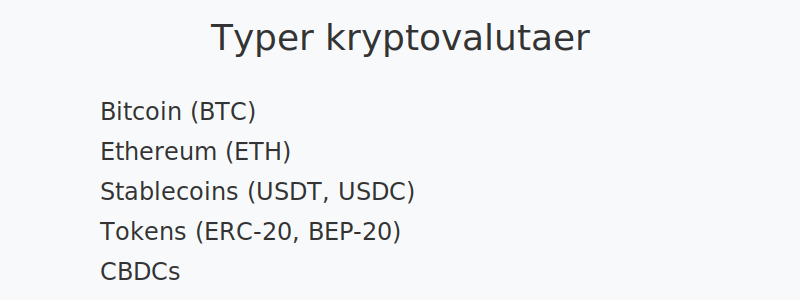

---
title: "kryptovaluta"
meta_title: "kryptovaluta"
meta_description: '**Kryptovaluta** er digitale verdienheter basert på kryptografi og distribuert på **blokkjeder** (blockchain). Kryptovalutaer muliggjør **desentraliserte** t...'
slug: kryptovaluta
type: blog
layout: pages/single
---

**Kryptovaluta** er digitale verdienheter basert på kryptografi og distribuert på **blokkjeder** (blockchain). Kryptovalutaer muliggjør **desentraliserte** transaksjoner uten behov for tradisjonelle finansinstitusjoner, og har blitt en viktig del av moderne finans- og regnskapspraksis.

## Definisjon og grunnleggende konsepter

Kryptovalutaer opererer på en **desentralisert** hovedbok kalt *blokkjede* (blockchain), som sikrer integritet og transparens gjennom kryptografiske metoder. De viktigste kjennetegnene inkluderer:

* **Desentralisering:** Ingen sentral myntutsteder eller myndighet.
* **Kryptografi:** Sikrer transaksjoner og eierskap.
* **Gjennomsiktighet:** Åpen tilgang til transaksjonslogg.
* **Immutability:** Uforanderlig historikk av transaksjoner.

## Typer kryptovalutaer

| Type             | Eksempel       | Hovedegenskap                     |
|------------------|----------------|-----------------------------------|
| **Bitcoin**      | BTC            | Desentralisert «digitalt gull»     |
| **Ethereum**     | ETH            | Smartkontrakter og DApps          |
| **Stablecoins**  | USDT, USDC     | Prisstabilitet knyttet til fiat   |
| **Tokens**       | ERC-20, BEP-20 | Bygger på eksisterende blokkjeder |
| **CBDCs**        | ”              | Sentralbank-utstedte digitale valutaer |

## Regnskapsmessig behandling

> Kryptovalutaer innregnes og måles i henhold til relevante standarder som [IFRS 9](/blogs/regnskap/hva-er-ifrs "Hva er IFRS? Komplett Guide til Internasjonale Regnskapsstandarder") eller norske regnskapsstandarder (NRS).

1. **Første gangs innregning:** Virkelig verdi ved anskaffelsestidspunkt.
2. **Etterfølgende måling:** Virkelig verdi eller kost, avhengig av klassifisering.
3. **Presentasjon:** Kan klassifiseres som omløpsmiddel eller anleggsmiddel i balansen.

| Behandlingssteg           | Metode                      |
|---------------------------|-----------------------------|
| **Anskaffelsestidspunkt** | Virkelig verdi              |
| **Etterfølgende måling**  | Kost eller virkelig verdi   |
| **Klassifisering**        | Omløpsmiddel / Anleggsmiddel |

## Skattemessig behandling

Kryptovalutaer anses som formuesobjekter for norske skattemyndigheter, med følgende hovedprinsipper:

* **Formuesverdsettelse:** Virkelig verdi ved årsskiftet (formuesbeskatning).
* **Avkastningsbeskatning:** Kapitalgevinst ved salg av kryptovaluta.
* **MVA-fritak:** Kryptovaluta er fritatt fra MVA i Norge. Se [MVA-plikt](/blogs/regnskap/hva-er-avgiftsplikt-mva "Hva er MVA-plikt? Komplett Guide til Merverdiavgift").

| Skattekategori       | Behandling                       |
|----------------------|----------------------------------|
| **Formuesskatt**     | Virkelig verdi ved årsskiftet    |
| **Gevinstbeskatning**| Kapitalinntekt ved salg          |
| **MVA**              | Fritatt                          |

## Risiko og muligheter

Markedsområdet for kryptovaluta preges av både **volatilitet**, **teknologisk innovasjon** og **regulatoriske endringer**:

* **Volatilitet:** Høye prissvingninger krever løpende oppfølging.
* **Teknologisk risiko:** Sårbarheter i smartkontrakter eller blokkjeder.
* **Regulatorisk usikkerhet:** Endringer i regelverk kan påvirke regnskap.
* **Muligheter i DeFi:** Desentraliserte finansapplikasjoner skaper nye forretningsmodeller.

## Beste praksis for regnskap og rapportering

For god regnskapsførsel av kryptovaluta anbefales det:

* **Dokumentasjon:** Nøyaktige bilag for hver transaksjon.
* **Revisjonsspor:** Oppretthold uforanderlig logg fra blokkjede.
* **Klare interne retningslinjer:** Klassifisering og målemetoder.
* **Bruk av spesialiserte verktøy:** Integrasjon med regnskapssystemer.

## Oppsummering

Kryptovaluta representerer en ny klasse av digitale eiendeler som krever tilpassede regnskaps- og skattemetoder. Ved å følge standarder for innregning, vurdering og dokumentasjon, kan virksomheter trygt integrere kryptovaluta i sine regnskapsprosesser.

