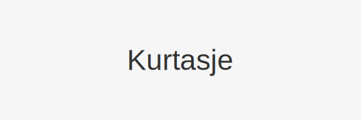

**Kurtasje**, også kalt *meglerprovisjon*, er avgiften som betales til en megler eller handelsplattform ved kjøp og salg av aksjer og andre **verdipapirer**.



## Seksjon 1: Definisjon og grunnleggende prinsipper

### 1.1 Hva er Kurtasje?

Kurtasje representerer kostnaden for å få utført handler i markedet. Den kan være fast eller variabel, avhengig av meglerens prisstruktur og handelsvolum.

### 1.2 Typer kurtasje

- **Fast kurtasje**: En avtalt avgift per handel, uavhengig av handelsvolum.
- **Prosentbasert kurtasje**: En variabel avgift beregnet som en prosentandel av handelsverdien.

## Seksjon 2: Beregning av kurtasje

Beregningen av kurtasje avhenger av om den er fast eller prosentbasert. Generelt gjelder:

```text
Kurtasje (fast) = Avtalefast beløp per handel
Kurtasje (prosent) = Handelsverdi × Kurtasje prosent
```

| Kurtasjetype         | Eksempelberegning                     |
| --------------------- | ------------------------------------- |
| Fast (kr)             | 100 kr per ordre                      |
| Prosent (0,1 %)       | 100 000 kr × 0,1 % = 100 kr           |

## Seksjon 3: Regnskapsmessig behandling

### 3.1 Innregning og klassifisering

Kurtasje føres som en finanskostnad under **driftskostnader** i resultatregnskapet.

```text
DEBET: Kurtasjekostnad (driftskostnader)    100
   KREDIT: Bank/kasse                        100
```

Se også [Hva er Driftskostnader?](/blogs/regnskap/hva-er-driftskostnader "Hva er Driftskostnader? Definisjon og Eksempler").

## Seksjon 4: Skattemessige aspekter

Skattemessig er kurtasje vanligvis fradragsberettiget som en nødvendig kostnad for å oppnå inntekt. Kostnaden følger realisasjonsprinsippet.

## Seksjon 5: Praktisk eksempel på beregning og regnskapsføring

En investor kjøper aksjer for 50 000 kr med en prosentbasert kurtasje på 0,2 %:

| Beskrivelse           | Beløp (kr)                        |
| --------------------- | --------------------------------- |
| Handelsverdi          | 50 000                            |
| Kurtasje (0,2 %)      | 100                               |
| Total kostnad         | 50 100                            |

Regnskapsføring av kurtasje:

```text
DEBET: Kurtasjekostnad                  100
   KREDIT: Bank/kasse                   100
```

## Se også

* [Hva er Børs?](/blogs/regnskap/bors "Hva er Børs? En Guide til Norsk Børs og Aksjehandel")
* [Hva er en aksje?](/blogs/regnskap/hva-er-en-aksje "Hva er en Aksje?")
* [Hva er Diskontering?](/blogs/regnskap/hva-er-diskontering "Hva er Diskontering? Prinsipper og Praktiske Eksempler")
* [Hva er Kurtasje?](/blogs/regnskap/kurtasje "Hva er Kurtasje? Megleravgift ved kjøp og salg av verdipapirer")


