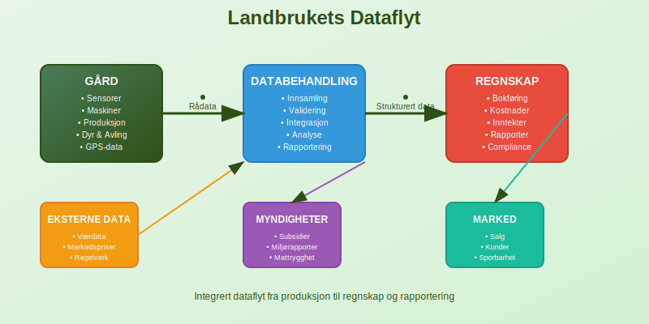
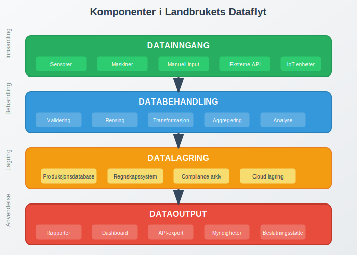
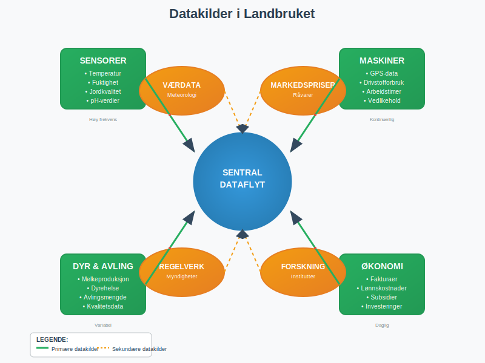
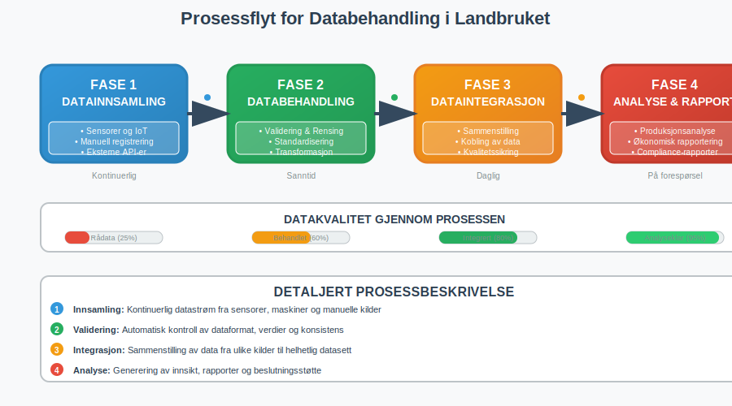
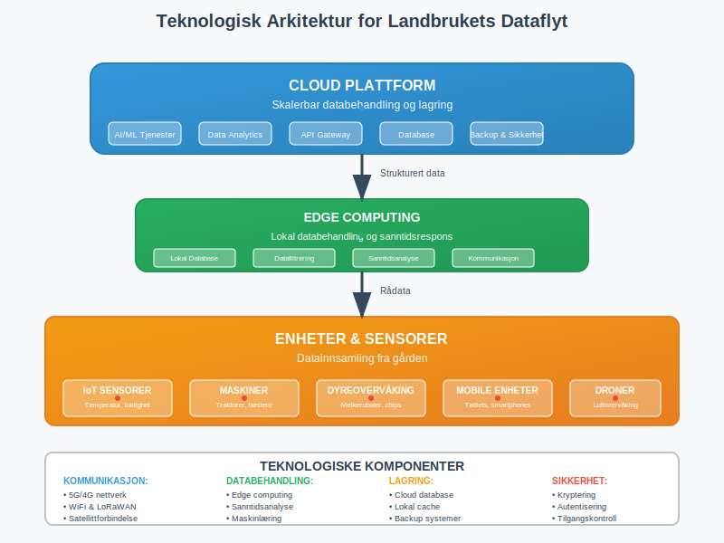
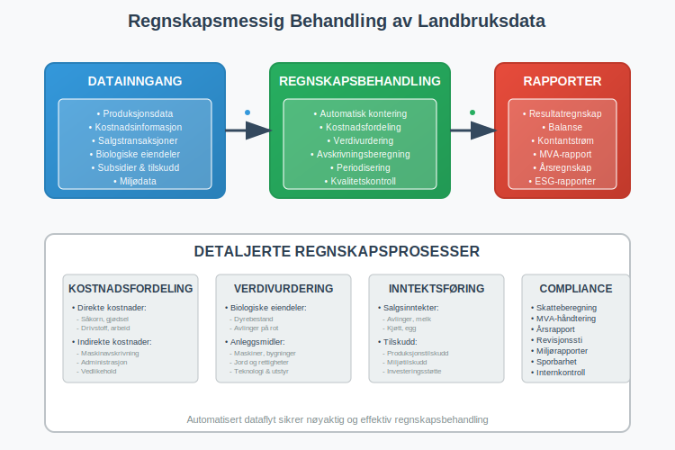
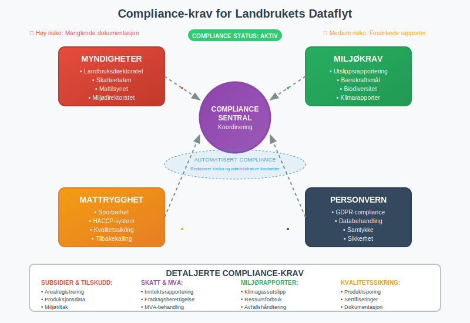
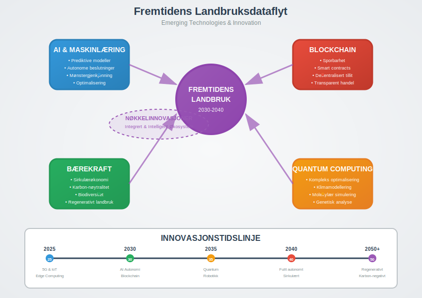

**Landbrukets dataflyt** refererer til den systematiske bevegelsen og behandlingen av informasjon gjennom hele den landbruksbaserte verdikjeden. Dette omfatter alt fra produksjonsdata på gården til [regnskapsføring](/blogs/regnskap/hva-er-regnskap "Hva er Regnskap? Komplett Guide til Regnskapsføring") og rapportering til myndigheter.

## Hva er Landbrukets Dataflyt?

Landbrukets dataflyt er den **digitale informasjonsstrømmen** som knytter sammen alle aspekter av landbruksvirksomhet. Dette inkluderer:

* **Produksjonsdata** fra sensorer og maskiner
* **Økonomiske transaksjoner** og [fakturaer](/blogs/regnskap/hva-er-en-faktura "Hva er en Faktura? En Guide til Norske Fakturakrav")
* **Regulatoriske rapporter** til myndigheter
* **Kvalitets- og sporbarhetsinformasjon**
* **Miljø- og bærekraftsdata**

### Betydningen for Moderne Landbruk

I dagens **digitaliserte landbruk** er effektiv dataflyt avgjørende for:

* Optimalisering av produksjon og ressursbruk
* Overholdelse av regelverk og rapporteringskrav
* Forbedret [internkontroll](/blogs/regnskap/hva-er-internkontroll "Hva er Internkontroll? Guide til Internkontrollsystemer") og sporbarhet
* Bedre grunnlag for økonomiske beslutninger

## Datakilder i Landbruket

### Primære Datakilder

Landbruksvirksomheter genererer data fra mange kilder:

#### Produksjonsdata
* **Sensorer** for temperatur, fuktighet og jordkvalitet
* **GPS-data** fra traktorer og andre maskiner
* **Avlingsdata** fra skurtresker og høsteutstyr
* **Dyredata** fra melkeroboter og fôringsanlegg

#### Økonomiske Data
* [Innkjøpsfakturaer](/blogs/regnskap/innganende-faktura "Inngående Faktura: Komplett Guide til Leverandørfakturaer") for såkorn, gjødsel og utstyr
* Salgsinntekter fra avlinger og animalske produkter
* [Lønnskostnader](/blogs/regnskap/hva-er-fastlonn "Hva er Fastlønn? Komplett Guide til Fastlønn i Norge") for sesongarbeidere
* Subsidier og tilskudd fra det offentlige

#### Regulatoriske Data
* **Miljørapporter** om utslipp og ressursbruk
* **Dyrevelferdsdokumentasjon**
* **Mattrygghetssporing** gjennom verdikjeden
* **Arealbruk** og avlingsregistrering

### Sekundære Datakilder

* **Værdata** fra meteorologiske tjenester
* **Markedspriser** på råvarer og produkter
* **Regulatoriske oppdateringer** fra myndigheter
* **Forskning og utviklingsdata** fra landbruksinstitutter

## Dataflyt-prosessen

### Fase 1: Datainnsamling

Den første fasen omfatter **systematisk innsamling** av data fra alle relevante kilder:

| Datakategori | Innsamlingsmetode | Frekvens | Lagring |
|--------------|-------------------|----------|---------|
| **Produksjonsdata** | Automatiske sensorer | Kontinuerlig | Lokal database |
| **Økonomiske data** | Manuell registrering/API | Daglig | [ERP-systemer](/blogs/regnskap/hva-er-erp-system "Hva er ERP-system? Komplett Guide til Enterprise Resource Planning") |
| **Regulatoriske data** | Kombinert | Månedlig/Årlig | Compliance-system |
| **Miljødata** | Sensorer/Rapporter | Ukentlig | Miljødatabase |

### Fase 2: Databehandling og Validering

Innsamlede data må **behandles og valideres** før videre bruk:

* **Datarensing** for å fjerne feil og inkonsistenser
* **Standardisering** av formater og enheter
* **Validering** mot kjente parametere og grenseverdier
* **Aggregering** av data på ulike nivåer

### Fase 3: Dataintegrasjon

Data fra forskjellige kilder **integreres** i et samlet system:

* Kobling mellom produksjonsdata og økonomiske resultater
* Sammenstilling av miljødata med regulatoriske krav
* Integrering med [regnskapssystemet](/blogs/regnskap/hva-er-bokforing "Hva er Bokføring? Komplett Guide til Bokføringsprinsipper") for automatisk [bilagsføring](/blogs/regnskap/hva-er-bilagsforing "Hva er Bilagsføring? Guide til Korrekt Bilagsregistrering")
* Spesialiserte [landbrukskontoplaner](/blogs/regnskap/landbrukskontoplan "Landbrukskontoplan - Komplett Guide til Regnskap for Landbruk") for korrekt kategorisering av landbrukstransaksjoner

### Fase 4: Analyse og Rapportering

Den integrerte dataen brukes til:

* **Produksjonsanalyse** og optimalisering
* **Økonomisk rapportering** og [budsjettering](/blogs/regnskap/hva-er-budsjettering "Hva er Budsjettering? Komplett Guide til Budsjettplanlegging")
* **Compliance-rapporter** til myndigheter
* **Bærekraftsrapportering** og miljødokumentasjon

## Teknologiske Løsninger

### Farm Management Systems (FMS)

**Gårdsstyringssystemer** er sentrale for dataflyt i moderne landbruk:

* Integrerer data fra alle kilder på gården
* Automatiserer rutineoppgaver og rapportering
* Gir sanntidsovervåking av produksjon
* Kobler seg til [regnskapssystemer](/blogs/regnskap/hva-er-hovedbok "Hva er Hovedbok? Komplett Guide til Hovedboken i Regnskap") for økonomisk styring

### IoT og Sensorer

**Internet of Things (IoT)** revolusjonerer datainnsamling:

* Trådløse sensorer for kontinuerlig overvåking
* Automatisk dataoverføring til sentrale systemer
* Sanntidsalarmer ved avvik eller problemer
* Redusert behov for manuell dataregistrering

### Cloud-baserte Plattformer

**Skybaserte løsninger** gir fleksibilitet og skalerbarhet:

* Tilgang til data fra hvor som helst
* Automatiske sikkerhetskopier og oppdateringer
* Integrering med eksterne tjenester og API-er
* Kostnadseffektiv skalering etter behov

### Kunstig Intelligens og Maskinlæring

**AI og ML** forbedrer dataanalyse og beslutningsstøtte:

* Prediktive modeller for avling og produksjon
* Automatisk gjenkjenning av mønstre og avvik
* Optimalisering av ressursbruk og kostnader
* Forbedret prognoser for planlegging

## Regnskapsmessige Aspekter

### Automatisering av Bokføring

Dataflyt muliggjør **automatisk bokføring** av landbrukstransaksjoner:

* Automatisk registrering av [innkjøp](/blogs/regnskap/hva-er-anskaffelser "Hva er Anskaffelser? Guide til Anskaffelsesprosessen") basert på leveranser
* Kobling mellom produksjonsdata og [kostpris](/blogs/regnskap/hva-er-kostpris "Hva er Kostpris? Komplett Guide til Kostpriskalkulation")
* Automatisk [avskrivning](/blogs/regnskap/hva-er-avskrivning "Hva er Avskrivning? Komplett Guide til Avskrivningsmetoder") av maskiner og utstyr
* Integrering med [mva-rapportering](/blogs/regnskap/hva-er-avgiftsplikt-mva "Hva er Avgiftsplikt MVA? Guide til Merverdiavgift") til myndighetene

### Kostnadsfordeling og Kalkulasjon

Detaljerte produksjonsdata gir grunnlag for **nøyaktig kostnadsfordeling**:

| Kostnadskategori | Datagrunnlag | Fordelingsnøkkel | Regnskapsføring |
|------------------|--------------|------------------|-----------------|
| **Såkorn og gjødsel** | Innkjøpsfakturaer | Areal/avling | [Direkte kostnader](/blogs/regnskap/hva-er-kostnader "Hva er Kostnader? Komplett Guide til Kostnadstyper") |
| **Drivstoff** | Forbruksdata | Maskintimer | Variable kostnader |
| **Arbeidskraft** | Timeregistrering | Aktivitet | [Lønnskostnader](/blogs/regnskap/hva-er-grunnlonn "Hva er Grunnlønn? Komplett Guide til Grunnlønn i Norge") |
| **Maskinavskrivning** | Brukstimer | Aktivitet | Faste kostnader |

### Verdivurdering av Biologiske Eiendeler

For landbruksvirksomheter er **biologiske eiendeler** en viktig del av [balansen](/blogs/regnskap/hva-er-balanse "Hva er Balanse? Komplett Guide til Balanseregnskapet"):

* Kontinuerlig overvåking av dyrebestand og avlinger
* Automatisk oppdatering av verdier basert på markedspriser
* Dokumentasjon av verdiendringer for regnskapsformål
* Kobling til [lagerbeholdning](/blogs/regnskap/hva-er-lagerbeholdning "Hva er Lagerbeholdning? Guide til Lagerregistrering og Verdivurdering") og produksjon

## Regulatoriske Krav og Compliance

### Landbrukssubsidier og Tilskudd

Dataflyt er avgjørende for **korrekt rapportering** av subsidier:

* Automatisk dokumentasjon av arealbruk
* Sporbarhet av miljøtiltak og bærekraftsinitiativer
* Integrering med offentlige rapporteringssystemer
* Redusert risiko for feil i tilskuddsrapporter

### Miljørapportering

**Miljødokumentasjon** krever systematisk datainnsamling:

* Utslippsdata fra produksjon og transport
* Ressursforbruk (vann, energi, gjødsel)
* Biodiversitets- og naturvernstiltak
* Karbon-fotavtrykk og klimagassutslipp

### Mattrygghet og Sporbarhet

**Fra jord til bord**-sporbarhet krever komplett dataflyt:

* Dokumentasjon av alle innsatsfaktorer
* Sporbarhet gjennom hele produksjonskjeden
* Rask respons ved tilbakekalling av produkter
* Overholdelse av mattrygghetsstandarder

### GDPR og Personvern

Håndtering av **personopplysninger** i landbruksdataflyt:

* Anonymisering av sensitive data
* Sikker lagring og overføring av informasjon
* Rett til innsyn og sletting av data
* Samtykke for databehandling

## Utfordringer og Løsninger

### Tekniske Utfordringer

#### Dataintegrasjon
* **Problem**: Ulike systemer med inkompatible formater
* **Løsning**: Standardiserte API-er og dataformater
* **Implementering**: Bruk av åpne standarder og integrasjonsplattformer

#### Datakvalitet
* **Problem**: Inkonsistente eller ufullstendige data
* **Løsning**: Automatisk validering og kvalitetskontroll
* **Implementering**: Implementering av datagovernance-prosedyrer

#### Skalerbarhet
* **Problem**: Økende datamengder og kompleksitet
* **Løsning**: Cloud-baserte løsninger og moderne arkitektur
* **Implementering**: Gradvis migrering til skalerbare plattformer

### Økonomiske Utfordringer

#### Investeringskostnader
* **Problem**: Høye kostnader for teknologiimplementering
* **Løsning**: Gradvis utbygging og ROI-fokuserte investeringer
* **Implementering**: Prioritering av høy-verdi bruksområder

#### Kompetanseutvikling
* **Problem**: Mangel på digital kompetanse
* **Løsning**: Opplæring og støttesystemer
* **Implementering**: Partnerskap med teknologileverandører

### Regulatoriske Utfordringer

#### Personvern og Datasikkerhet
* **Problem**: Komplekse personvernkrav
* **Løsning**: Privacy-by-design og sikkerhetsfokus
* **Implementering**: Regelmessige sikkerhetsrevisjoner og oppdateringer

## Fremtidsperspektiver

### Emerging Technologies

**Nye teknologier** vil forme fremtidens landbruksdataflyt:

* **Blockchain** for sporbarhet og tillit
* **5G-nettverk** for sanntidskommunikasjon
* **Edge computing** for lokal databehandling
* **Quantum computing** for komplekse optimaliseringsproblemer

### Bærekraft og Sirkulærøkonomi

Dataflyt vil være sentralt for **bærekraftig landbruk**:

* Optimalisering av ressursbruk og avfallsreduksjon
* Dokumentasjon av miljøpåvirkning og forbedringer
* Støtte for sirkulære forretningsmodeller
* Integrering med [ESG-rapportering](/blogs/regnskap/hva-er-esg "Hva er ESG? Komplett Guide til Environmental, Social og Governance")

### Automatisering og Robotikk

**Autonome systemer** vil generere nye datastrømmer:

* Selvkjørende traktorer og høsteutstyr
* Droner for overvåking og sprøyting
* Roboter for planting og høsting
* AI-drevne beslutningssystemer

## Konklusjon

**Landbrukets dataflyt** representerer en fundamental endring i hvordan landbruksvirksomheter drives og administreres. Ved å integrere data fra alle aspekter av produksjonen - fra jord og dyr til [regnskap](/blogs/regnskap/hva-er-finansregnskap "Hva er Finansregnskap? Komplett Guide til Finansregnskapet") og rapportering - kan landbrukere:

* **Optimalisere** produksjon og ressursbruk
* **Forbedre** økonomisk styring og lønnsomhet
* **Sikre** overholdelse av regulatoriske krav
* **Dokumentere** bærekraft og miljøpåvirkning
* **Forberede** seg på fremtidens utfordringer

Suksessfull implementering av dataflyt krever en **helhetlig tilnærming** som kombinerer teknologi, prosesser og kompetanse. For [foretak](/blogs/regnskap/hva-er-foretak "Hva er et Foretak? Komplett Guide til Foretaksformer") i landbrukssektoren er dette ikke lenger et spørsmål om "hvis", men "når" og "hvordan".

Investering i robust dataflyt-infrastruktur vil være avgjørende for konkurranseevne og bærekraft i fremtidens landbruk. Ved å starte med enkle løsninger og gradvis bygge ut kompleksiteten, kan landbruksvirksomheter dra nytte av digitaliseringens muligheter samtidig som de håndterer utfordringene på en kontrollert måte.

