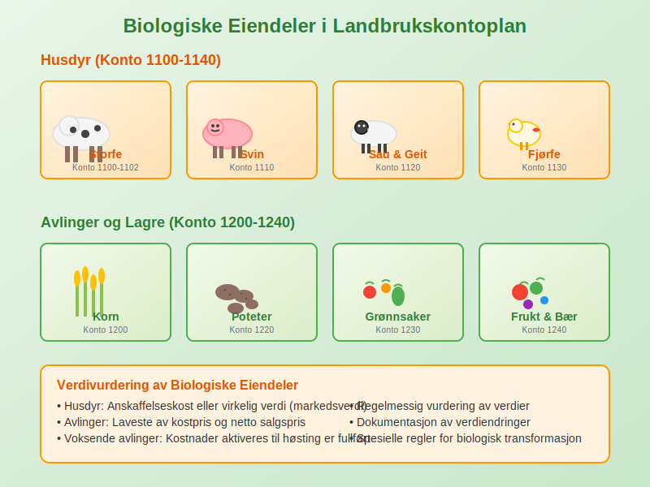

En **landbrukskontoplan** er en spesialisert [kontoplan](/blogs/regnskap/hva-er-kontoplan "Hva er en Kontoplan? Komplett Guide til Kontoplaner i Norsk Regnskap") som er tilpasset landbrukssektorens unike behov og krav. Den tar hensyn til landbrukets særegne inntektskilder, kostnadsstrukturer og regnskapsmessige utfordringer som skiller seg fra andre næringer.

## Hva er en Landbrukskontoplan?

En landbrukskontoplan er en **systematisk oversikt** over alle kontoer som brukes i [regnskapet](/blogs/regnskap/hva-er-regnskap "Hva er Regnskap? Komplett Guide til Regnskapsføring i Norge") for landbruksvirksomheter. Den bygger på den norske standardkontoplanen, men er utvidet og tilpasset for å håndtere landbrukets spesielle forhold som:

* **Produksjonstilskudd** og offentlige støtteordninger
* **Sesongbaserte inntekter** og kostnader
* **Biologiske eiendeler** som husdyr og avlinger
* **Jordbruksfradrag** og spesielle skattefordeler
* **Naturressurser** og arealbruk

### Særtrekk ved Landbruksregnskap

Landbruksregnskap skiller seg fra vanlig [bokføring](/blogs/regnskap/hva-er-bokforing "Hva er Bokføring? Komplett Guide til Bokføringsregler og -praksis") på flere områder:

* **Biologisk produksjon** - levende dyr og planter som endrer verdi over tid
* **Værforhold** - påvirker både inntekter og kostnader betydelig
* **Lange produksjonssykluser** - fra såing til høsting kan ta måneder
* **Komplekse støtteordninger** - mange ulike tilskudd og refusjoner
* **Kombinert virksomhet** - ofte både planteproduksjon og husdyrhold

## Struktur og Oppbygging av Landbrukskontoplan

### Hovedklasser i Landbrukskontoplan

Landbrukskontoplanen følger den samme grunnstrukturen som standardkontoplanen, men med spesialiserte underkontoer:

| Klasse | Beskrivelse | Landbruksspesifikke Tillegg |
|--------|-------------|----------------------------|
| **1** | [Eiendeler](/blogs/regnskap/hva-er-eiendel "Hva er Eiendeler? Komplett Guide til Eiendeler i Regnskap") | Biologiske eiendeler, jord, bygninger, maskiner |
| **2** | [Gjeld](/blogs/regnskap/hva-er-gjeld "Hva er Gjeld? Komplett Guide til Gjeld i Regnskap") og [Egenkapital](/blogs/regnskap/hva-er-egenkapital "Hva er Egenkapital? Komplett Guide til Egenkapital i Regnskap") | Investeringslån, driftskreditt |
| **3** | [Driftsinntekter](/blogs/regnskap/hva-er-driftsinntekter "Hva er Driftsinntekter? Komplett Guide til Driftsinntekter i Regnskap") | Salg av produkter, tilskudd, refusjoner |
| **4** | [Driftskostnader](/blogs/regnskap/hva-er-driftskostnader "Hva er Driftskostnader? Komplett Guide til Driftskostnader i Regnskap") | Fôr, såvarer, veterinær, drivstoff |
| **5-8** | Finansposter og skatt | Jordbruksfradrag, særskilte skatteordninger |

### Detaljert Kontostruktur for Landbruk

#### Klasse 1: Eiendeler (Spesialisert for Landbruk)

**Biologiske Eiendeler:**

| Kontonummer | Kontobeskrivelse | Forklaring |
|-------------|------------------|------------|
| **1100** | Storfe | Melkekyr, ammekyr, okser |
| **1101** | Melkekyr | Produserende melkekyr |
| **1102** | Ungdyr storfe | Kalver og kviger |
| **1110** | Svin | Purker, råner, slaktesvin |
| **1120** | Sau og geit | Søyer, bukker, lam, kje |
| **1130** | Fjørfe | Høner, kalkun, ender |
| **1140** | Hest | Ridhester, travhester |

**Avlinger og Lagre:**

| Kontonummer | Kontobeskrivelse | Forklaring |
|-------------|------------------|------------|
| **1200** | Korn på lager | Hvete, bygg, havre |
| **1210** | Grovfôr på lager | Høy, ensilasje, halm |
| **1220** | Poteter på lager | Spisepoteter, settepotet |
| **1230** | Grønnsaker på lager | Ulike grønnsakslag |
| **1240** | Frukt og bær på lager | Epler, bær, andre frukter |

#### Klasse 3: Driftsinntekter (Landbruksspesifikk)

**Salg av Produkter:**

| Kontonummer | Kontobeskrivelse | Forklaring |
|-------------|------------------|------------|
| **3000** | Salg melk | Leveranser til meieri |
| **3010** | Salg storfe | Slakt og levende dyr |
| **3020** | Salg svin | Slaktesvin og avlsdyr |
| **3030** | Salg sau/geit | Slakt og ull |
| **3040** | Salg fjørfe | Slaktekylling og egg |
| **3100** | Salg korn | Hvete, bygg, havre |
| **3110** | Salg poteter | Spisepoteter og industripoteter |
| **3120** | Salg grønnsaker | Ulike grønnsakslag |
| **3130** | Salg frukt og bær | Epler, bær, andre frukter |

**Tilskudd og Støtteordninger:**

| Kontonummer | Kontobeskrivelse | Forklaring |
|-------------|------------------|------------|
| **3500** | Produksjonstilskudd | Husdyrtilskudd, arealstøtte |
| **3510** | Distriktstilskudd | Tilskudd for drift i distriktene |
| **3520** | Miljøtilskudd | SMIL-midler og miljøordninger |
| **3530** | Investeringsstøtte | Tilskudd til bygninger og utstyr |
| **3540** | Refusjoner | Veterinærrefusjon, transportstøtte |
| **3550** | EU-tilskudd | Direkte støtte fra EU |

#### Klasse 4: Driftskostnader (Landbruksspesifikk)

**Fôrkostnader:**

| Kontonummer | Kontobeskrivelse | Forklaring |
|-------------|------------------|------------|
| **4000** | Kraftfôr | Konsentrat til ulike dyreslag |
| **4010** | Grovfôr kjøpt | Høy, ensilasje, halm |
| **4020** | Fôrtilsetning | Mineraler, vitaminer |
| **4030** | Beite og utmarksbruk | Leie av beiteområder |

**Såvarer og Plantemidler:**

| Kontonummer | Kontobeskrivelse | Forklaring |
|-------------|------------------|------------|
| **4100** | Såkorn | Frø til kornproduksjon |
| **4110** | Settepotet | Potet til setting |
| **4120** | Plantemidler | Gjødsel, sprøytemidler |
| **4130** | Såvarer grønnsaker | Frø og planter |

**Veterinær og Helse:**

| Kontonummer | Kontobeskrivelse | Forklaring |
|-------------|------------------|------------|
| **4200** | Veterinærkostnader | Behandling og forebygging |
| **4210** | Medisiner | Antibiotika og andre medisiner |
| **4220** | Inseminering | Kunstig befruktning |
| **4230** | Helsekontroll | Obligatoriske helseprogram |

## Spesielle Regnskapsområder i Landbruk

### Biologiske Eiendeler og Verdivurdering

**Verdivurdering av Husdyr:**

Husdyr skal vurderes til:

* **Anskaffelseskost** - opprinnelig kjøpspris eller produksjonskost
* **Virkelig verdi** - markedsverdi på balansedagen
* **Nedskrevet verdi** - ved verdifall

**Behandling av Avlinger:**

* **Voksende avlinger** - kostnader [aktiveres](/blogs/regnskap/hva-er-aktivering "Hva er Aktivering i Regnskap?") til høsting
* **Høstede produkter** - vurderes til laveste av kost og netto salgspris
* **Lagertap** - føres som kostnad når det oppstår

### Produksjonstilskudd og Støtteordninger

**Regnskapsføring av Tilskudd:**

| Tilskuddstype | Regnskapsbehandling | Kontoføring |
|---------------|-------------------|-------------|
| **Produksjonstilskudd** | Inntektsføres når opptjent | Konto 3500 |
| **Investeringsstøtte** | Reduserer [anskaffelseskost](/blogs/regnskap/hva-er-anskaffelseskost "Hva er Anskaffelseskost? Komplett Guide til Anskaffelseskost i Regnskap") | Motpost til anleggsmiddel |
| **Miljøtilskudd** | Inntektsføres når vilkår oppfyllt | Konto 3520 |
| **Refusjoner** | Reduserer relaterte kostnader | Konto 3540 |

**Dokumentasjon og Oppfølging:**

* **Søknader** - oppbevar alle søknader og vedtak
* **Rapportering** - følg opp rapporteringskrav
* **Kontroll** - forbered deg på offentlig kontroll
* **Tilbakebetaling** - avsett midler ved usikkerhet

### Jordbruksfradrag og Skattefordeler

**Jordbruksfradrag:**

[Jordbruksfradrag](/blogs/regnskap/hva-er-jordbruksfradrag "Hva er Jordbruksfradrag? Komplett Guide til Jordbruksfradrag i Norge") er en særskilt skattefordel for landbruk:

* **Maksimalt fradrag** - 166 400 kr (2024-satser)
* **Beregningsgrunnlag** - nettoinntekt fra landbruk
* **Dokumentasjon** - krav til regnskapsføring

**Regnskapsføring:**

| Kontonummer | Kontobeskrivelse | Forklaring |
|-------------|------------------|------------|
| **8050** | Jordbruksfradrag | Reduksjon av skattekostnad |
| **8051** | Skogfradrag | Fradrag for skogbruk |

## Sesongvariasjoner og Periodisering

### Håndtering av Sesongbaserte Inntekter

**Melkeproduksjon:**

* **Månedlige leveranser** - jevn inntektsføring
* **Kvalitetstillegg** - periodiseres over året
* **Prisutjevning** - håndteres som periodiseringer

**Planteproduksjon:**

* **Såing til høsting** - kostnader [aktiveres](/blogs/regnskap/hva-er-aktivering "Hva er Aktivering i Regnskap?")
* **Høstesalg** - konsentrert inntektsføring
* **Lagersalg** - jevnere inntektsfordeling

**Husdyrproduksjon:**

* **Kontinuerlig produksjon** - egg, melk
* **Sesongbasert** - lam, kalver
* **Årlig syklus** - sau, storfe

### Periodisering og Avsetninger

**Typiske Periodiseringer:**

| Type | Beskrivelse | Regnskapsbehandling |
|------|-------------|-------------------|
| **Påløpte tilskudd** | Opptjente men ikke mottatte | Fordring |
| **Forskuddsbetaling** | Mottatte tilskudd for neste år | Kortsiktig gjeld |
| **Avsetninger** | Forventede kostnader | Avsetning for forpliktelser |
| **Lagerverdier** | Verdi av produkter på lager | Omløpsmidler |

## Digitale Løsninger for Landbruksregnskap

### Spesialiserte Regnskapsprogrammer

**Landbrukstilpassede Systemer:**

* **Integrerte løsninger** - regnskap, produksjon, tilskudd
* **Automatisk kontering** - basert på transaksjonstype
* **Rapportering** - til myndigheter og støtteordninger
* **Produksjonsoppfølging** - kobling til driftsdata

**Populære Systemer:**

* **Landbruksregnskap** - spesialiserte løsninger
* **[ERP-systemer](/blogs/regnskap/hva-er-erp-system "Hva er ERP-system? Komplett Guide til Enterprise Resource Planning")** - helhetlige løsninger
* **Skybaserte tjenester** - tilgjengelig overalt
* **Mobile apper** - registrering i felt

### Integrasjon med Andre Systemer

**Datakilder:**

* **Tine/Nortura** - automatisk import av leveranser
* **Landbruksdirektoratet** - tilskuddsdata
* **Skatteetaten** - rapportering og oppgjør
* **Banker** - automatisk bankavstemming

## Juridiske Krav og Regelverk

### Bokføringsloven og Landbruk

**Spesielle Krav:**

[Bokføringsloven](/blogs/regnskap/hva-er-bokforingsloven "Hva er Bokføringsloven? Komplett Guide til Bokføringsregler i Norge") gjelder også for landbruk, men med noen særregler:

* **Forenklet bokføring** - for små bruk under visse grenser
* **Kontantprinsipp** - tillatt for mindre virksomheter
* **Periodisering** - påkrevd for større virksomheter
* **Dokumentasjon** - særlige krav til tilskuddsdokumentasjon

### Skatteloven og Landbruk

**Særregler:**

* **Jordbruksfradrag** - maksimalt 166 400 kr
* **Skogfradrag** - for skogbruksvirksomhet
* **Næringsfradrag** - generelt næringsfradrag
* **Avskrivningsregler** - spesielle satser for landbruk

**Regnskapsplikt:**

| Omsetning | Regnskapsplikt | Krav |
|-----------|----------------|------|
| **Under 5 mill** | Forenklet | Kontantprinsipp tillatt |
| **5-70 mill** | Ordinær | Periodisering påkrevd |
| **Over 70 mill** | Revisjon | Revisorplikt |

## Praktiske Tips for Landbruksregnskap

### Organisering av Regnskapsarbeidet

**Månedlige Rutiner:**

* **Bilagsregistrering** - løpende registrering av [bilag](/blogs/regnskap/hva-er-bilag "Hva er Bilag? Komplett Guide til Bilag i Regnskap")
* **Bankavstemming** - månedlig avstemming
* **Lagerregistrering** - oppdatering av lagerverdier
* **Tilskuddsoppfølging** - kontroll av innbetalinger

**Kvartalsvise Oppgaver:**

* **Mva-oppgjør** - innlevering av mva-melding
* **Periodisering** - justering av periodiseringer
* **Resultatoppfølging** - analyse av drift
* **Budsjettsammenligning** - avvik og prognoser

**Årlige Oppgaver:**

* **Årsregnskap** - utarbeidelse av årsregnskap
* **Skattemelding** - innlevering til Skatteetaten
* **Tilskuddsrapporter** - rapportering til Landbruksdirektoratet
* **Revisjonsoppfølging** - hvis revisjonspliktig

### Vanlige Feil og Fallgruver

**Typiske Feil:**

* **Manglende periodisering** - ikke hensynta opptjente tilskudd
* **Feil lagervurdering** - ikke oppdaterte lagerverdier
* **Blandet privat/næring** - manglende skille
* **Dokumentasjon** - manglende bilag og dokumentasjon

**Beste Praksis:**

* **Løpende registrering** - ikke utsett regnskapsarbeidet
* **God dokumentasjon** - oppbevar alle bilag
* **Faglig oppdatering** - følg med på regelverksendringer
* **Profesjonell hjelp** - bruk regnskapsfører eller revisor

## Spesialiserte Landbruksområder

### Melkeproduksjon

**Særlige Forhold:**

* **Daglige leveranser** - kontinuerlig inntektsstrøm
* **Kvalitetstillegg** - variable priser basert på kvalitet
* **Kvoteordning** - begrensninger på produksjon
* **Investeringer** - dyre spesialiserte anlegg

**Kontospesifikke Behov:**

| Område | Spesielle Kontoer | Beskrivelse |
|--------|------------------|-------------|
| **Inntekter** | 3000-3009 | Melkeleveranser, kvalitetstillegg |
| **Kostnader** | 4000-4099 | Fôr, veterinær, melkeutstyr |
| **Anleggsmidler** | 1200-1299 | Melkeanlegg, roboter, tanker |

### Kornproduksjon

**Karakteristika:**

* **Sesongbasert** - såing vår, høsting høst
* **Værfølsom** - store årlige variasjoner
* **Lagringsutfordringer** - tørking og oppbevaring
* **Maskinintensiv** - store investeringer i utstyr

**Regnskapsmessige Utfordringer:**

* **Kostnadspåløp** - fra såing til høsting
* **Lagervurdering** - prissvingninger på korn
* **Avlingsforsikring** - håndtering av forsikringsoppgjør
* **Tørkekostnader** - betydelige kostnader enkelte år

### Grønnsaksproduksjon

**Spesielle Forhold:**

* **Arbeidsintensiv** - høye lønnskostnader
* **Kort holdbarhet** - raske omsetningskrav
* **Sesongarbeid** - varierende arbeidskraftbehov
* **Kvalitetskrav** - strenge standarder

## Fremtiden for Landbruksregnskap

### Digitalisering og Automatisering

**Teknologiske Trender:**

* **IoT-sensorer** - automatisk datainnsamling
* **Kunstig intelligens** - prediktiv analyse
* **Blockchain** - sporbarhet i verdikjeden
* **Satellittdata** - overvåking av avlinger

**Regnskapsmessige Konsekvenser:**

* **Sanntidsdata** - kontinuerlig oppdatering av verdier
* **Automatisk kontering** - mindre manuelt arbeid
* **Prediktiv analyse** - bedre prognoser og budsjetter
* **Integrerte systemer** - helhetlig dataflyt

### Bærekraft og ESG-rapportering

**Nye Krav:**

* **Klimaregnskap** - rapportering av utslipp
* **Bærekraftsmål** - dokumentasjon av miljøtiltak
* **Sporbarhet** - fra jord til bord
* **Sertifiseringer** - økologisk, miljøvennlig

**Regnskapsmessige Utfordringer:**

* **Nye kontoer** - for miljøkostnader og -investeringer
* **Rapporteringskrav** - til myndigheter og kunder
* **Verdivurdering** - av miljøtiltak og sertifiseringer
* **Dokumentasjon** - omfattende krav til sporbarhet

## Konklusjon

En **velutformet landbrukskontoplan** er avgjørende for effektiv regnskapsføring i landbrukssektoren. Den må håndtere sektorens unike utfordringer som:

* **Biologiske eiendeler** - levende dyr og planter
* **Sesongvariasjoner** - store svingninger i inntekter og kostnader
* **Komplekse støtteordninger** - mange ulike tilskudd og refusjoner
* **Spesielle skatteordninger** - jordbruksfradrag og andre fordeler

**Suksessfaktorer:**

* **Tilpasset struktur** - reflekterer virksomhetens art
* **Løpende oppdatering** - følger regelverksendringer
* **God dokumentasjon** - sikrer etterlevelse av krav
* **Profesjonell støtte** - bruk av fagkompetanse

Ved å investere i en god landbrukskontoplan og holde seg oppdatert på regelverket, kan landbruksbedrifter sikre korrekt regnskapsføring, optimalisere skatteposisjonen og få bedre grunnlag for økonomisk styring av virksomheten.

