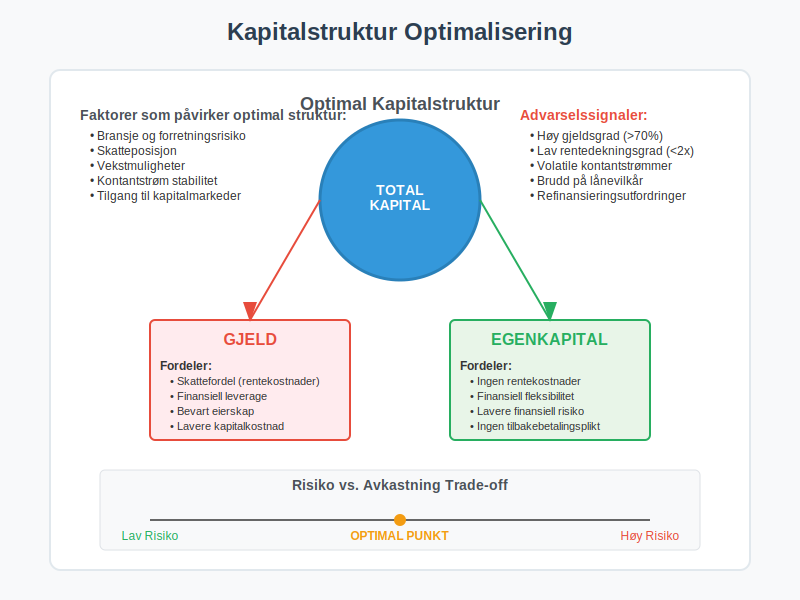

**Langsiktig gjeld** er en fundamental komponent i virksomhetens finansieringsstruktur som representerer forpliktelser med forfallstid på mer enn ett år fra balansedagen. Som en kritisk del av [balansen](/blogs/regnskap/hva-er-balanse "Hva er Balanse i Regnskap? Komplett Guide til Balansens Oppbygging og Funksjon"), påvirker langsiktig gjeld virksomhetens [kapitalstruktur](/blogs/regnskap/hva-er-kapital "Hva er Kapital? Komplett Guide til Kapitaltyper og Kapitalforvaltning"), finansielle fleksibilitet og langsiktige strategiske muligheter. Denne artikkelen gir en omfattende gjennomgang av langsiktig gjeld, dens komponenter, regnskapsføring og strategisk betydning for virksomheten.

## Seksjon 1: Definisjon og Grunnleggende Prinsipper

**Langsiktig gjeld** defineres som virksomhetens nåværende forpliktelser som forfaller til betaling mer enn tolv måneder fra balansedagen. Dette skiller seg fra [kortsiktig gjeld](/blogs/regnskap/kortsiktig-gjeld "Hva er Kortsiktig Gjeld? Komplett Guide til Kortsiktige Forpliktelser") som forfaller innen ett år, og utgjør sammen med [egenkapital](/blogs/regnskap/hva-er-egenkapital "Hva er Egenkapital? Komplett Guide til Egenkapital i Regnskap") virksomhetens langsiktige finansiering.

### 1.1 Klassifiseringskriterier

For at en forpliktelse skal klassifiseres som langsiktig gjeld, må den oppfylle følgende kriterier:

* **Forfallstid:** Forpliktelsen forfaller mer enn 12 måneder fra balansedagen
* **Ikke operasjonell syklus:** Forpliktelsen er ikke del av virksomhetens normale operasjonelle syklus
* **Strategisk finansiering:** Forpliktelsen er del av langsiktig finansieringsstrategi
* **Utsettelsesrett:** Virksomheten har rett til å utsette oppgjør utover 12 måneder

### 1.2 Betydning for Finansiell Analyse

Langsiktig gjeld er kritisk for vurdering av:

* **Kapitalstruktur:** Forholdet mellom gjeld og egenkapital
* **Finansiell stabilitet:** Virksomhetens langsiktige betalingsevne
* **Rentebæreevne:** Evne til å betjene gjeld over tid
* **Finansiell fleksibilitet:** Mulighet for fremtidig finansiering
* **Investeringskapasitet:** Evne til å finansiere vekst og utvikling

## Seksjon 2: Hovedtyper Langsiktig Gjeld

### 2.1 Langsiktige Banklån

**Langsiktige banklån** er den vanligste formen for langsiktig gjeld og omfatter ulike typer lån fra finansinstitusjoner.

#### Typer Langsiktige Banklån:

* **Investeringslån:** Finansiering av [anleggsmidler](/blogs/regnskap/hva-er-anleggsmidler "Hva er Anleggsmidler? Komplett Guide til Faste Eiendeler") og utstyr
* **Eiendomslån:** Finansiering av næringseiendommer
* **Refinansieringslån:** Refinansiering av eksisterende gjeld
* **Ekspansjonslån:** Finansiering av virksomhetsutvidelse
* **Oppkjøpslån:** Finansiering av oppkjøp og fusjoner

#### Regnskapsføring av Langsiktige Banklån:

| **Transaksjon** | **Debet** | **Kredit** |
|-----------------|-----------|------------|
| Opptak av lån | Bank | Langsiktig banklån |
| Påløpte renter | Rentekostnad | Påløpte renter |
| Rentebetaling | Påløpte renter | Bank |
| Avdrag | Langsiktig banklån | Bank |
| Reklassifisering | [Kortsiktig gjeld](/blogs/regnskap/kortsiktig-gjeld "Hva er Kortsiktig Gjeld? Komplett Guide til Kortsiktige Forpliktelser") | Langsiktig banklån |

### 2.2 Obligasjonslån

**Obligasjonslån** er en form for langsiktig gjeld hvor virksomheten utsteder obligasjoner til investorer i kapitalmarkedet.

#### Karakteristikker ved Obligasjonslån:

* **Standardiserte vilkår:** Faste renter, løpetid og avdragsprofil
* **Omsettelige verdipapirer:** Kan handles i annenhåndsmarkedet
* **Større lånebeløp:** Vanligvis større enn banklån
* **Bredere investorbase:** Tilgang til institusjonelle investorer
* **Offentlig rapportering:** Krav til løpende rapportering

#### Typer Obligasjonslån:

* **Selskapsobligasjoner:** Tradisjonelle obligasjoner med fast rente
* **Konvertible obligasjoner:** Kan konverteres til [aksjer](/blogs/regnskap/hva-er-en-aksje "Hva er en Aksje? Komplett Guide til Aksjer og Eierskap")
* **Flytende rente obligasjoner:** Rente som justeres periodisk
* **Nullkupong obligasjoner:** Ingen løpende renteutbetalinger
* **Grønne obligasjoner:** Finansiering av miljøvennlige prosjekter

### 2.3 Leasingforpliktelser

Med innføringen av **IFRS 16** må de fleste leasingavtaler regnskapsføres som langsiktig gjeld.

#### Regnskapsføring av Leasingforpliktelser:

| **Hendelse** | **Debet** | **Kredit** |
|--------------|-----------|------------|
| Oppstart leasing | Bruksretteiendel | Leasingforpliktelse |
| Månedlig avskrivning | Avskrivning | Bruksretteiendel |
| Rentekostnad | Rentekostnad | Leasingforpliktelse |
| Leasingbetaling | Leasingforpliktelse | Bank |

#### Typer Leasingavtaler:

* **Eiendomsleasing:** Langsiktig leie av kontorer og produksjonslokaler
* **Utstyrsleasing:** Leasing av maskiner og teknisk utstyr
* **Kjøretøyleasing:** Leasing av firmabiler og transportmidler
* **IT-leasing:** Leasing av datautstyr og programvare

### 2.4 Pensjonsforpliktelser

**Pensjonsforpliktelser** representerer virksomhetens forpliktelser overfor ansatte knyttet til fremtidige pensjonsutbetalinger.

#### Typer Pensjonsordninger:

* **Innskuddsbaserte ordninger:** Virksomheten betaler faste innskudd
* **Ytelsesbaserte ordninger:** Virksomheten garanterer bestemte ytelser
* **Hybridordninger:** Kombinasjon av innskudd og ytelser
* **AFP-ordninger:** Avtalefestet pensjon

#### Regnskapsføring av Pensjonsforpliktelser:

| **Element** | **Beskrivelse** | **Regnskapsføring** |
|-------------|-----------------|---------------------|
| Tjenestekostnad | Opptjening inneværende år | Lønnskostnad |
| Rentekostnad | Rente på pensjonsforpliktelse | Finanskostnad |
| Aktuarielle gevinster/tap | Endringer i forutsetninger | Totalresultat |
| Tidligere tjeneste | Endringer i pensjonsplan | Lønnskostnad |

### 2.5 Utsatt Skatt

**Utsatt skatt** oppstår når det er forskjeller mellom regnskapsmessige og skattemessige verdier.

#### Årsaker til Utsatt Skatt:

* **Avskrivningsforskjeller:** Ulike avskrivningsmetoder
* **Nedskrivninger:** Regnskapsmessige nedskrivninger
* **Avsetninger:** Ikke fradragsberettigede avsetninger
* **Inntektsføring:** Forskjeller i inntektsføring
* **Underskudd:** Fremførbare skattemessige underskudd

## Seksjon 3: Strategisk Betydning av Langsiktig Gjeld

### 3.1 Kapitalstrukturoptimalisering

Langsiktig gjeld spiller en sentral rolle i virksomhetens **kapitalstruktur** og påvirker både risiko og avkastning.

#### Fordeler med Langsiktig Gjeld:

* **Skattefordel:** Rentekostnader er fradragsberettigede
* **Finansiell leverage:** Økt avkastning på egenkapital
* **Bevart eierskap:** Ingen utvanning av eierandeler
* **Forutsigbare kostnader:** Faste rentekostnader
* **Langsiktig finansiering:** Stabil finansiering av investeringer

#### Ulemper med Langsiktig Gjeld:

* **Finansiell risiko:** Økt risiko ved høy gjeldsgrad
* **Rentekostnader:** Løpende finanskostnader
* **Covenants:** Lånevilkår som begrenser handlingsrom
* **Refinansieringsrisiko:** Risiko ved refinansiering
* **Konkursrisiko:** Økt konkursrisiko ved høy gjeld

### 3.2 Gjeldsgrad og Nøkkeltall

Analyse av langsiktig gjeld krever bruk av relevante **finansielle nøkkeltall**.

#### Viktige Gjeldsgradsanalyser:

| **Nøkkeltall** | **Formel** | **Tolkning** |
|----------------|------------|--------------|
| Gjeldsgrad | Total gjeld / Total kapital | Andel gjeld av total finansiering |
| Egenkapitalandel | Egenkapital / Total kapital | Andel egenkapital av total finansiering |
| Rentedekningsgrad | EBIT / Rentekostnader | Evne til å betjene gjeld |
| Gjeldsgrad EK | Total gjeld / Egenkapital | Gjeld i forhold til egenkapital |
| Langsiktig gjeldsgrad | Langsiktig gjeld / Total kapital | Andel langsiktig gjeld |

### 3.3 Refinansiering og Gjeldsforvaltning

**Gjeldsforvaltning** er en kontinuerlig prosess som krever strategisk planlegging.

#### Refinansieringsstrategier:

* **Tidlig refinansiering:** Refinansiere før forfall
* **Diversifisering:** Spre gjeld på flere kilder
* **Renteoptimalisering:** Optimalisere rentekostnader
* **Løpetidsforlengelse:** Forlenge gjeldsprofil
* **Gjeldskonsolidering:** Samle gjeld hos færre långivere

## Seksjon 4: Regnskapsføring og Rapportering

### 4.1 Måling og Verdsettelse

Langsiktig gjeld måles normalt til **amortisert kost** ved bruk av **[Effektiv rente](/blogs/regnskap/hva-er-effektiv-rente "Hva er Effektiv rente? Komplett Guide til Beregning av Effektiv rente i Regnskap")**-metoden.

#### Regnskapsprinsipper:

* **Førstegangsregnskapsføring:** Virkelig verdi minus transaksjonskostnader
* **Etterfølgende måling:** Amortisert kost ved **[Effektiv rente](/blogs/regnskap/hva-er-effektiv-rente "Hva er Effektiv rente? Komplett Guide til Beregning av Effektiv rente i Regnskap")**
* **Valutaomregning:** Omregning av utenlandsk gjeld
* **Sikringsbokføring:** Spesiell behandling av sikrede poster

### 4.2 Noteopplysninger

Virksomheter må gi omfattende **noteopplysninger** om langsiktig gjeld.

#### Påkrevde Opplysninger:

* **Forfallsanalyse:** Når gjeld forfaller til betaling
* **Rentevilkår:** Rentesatser og rentetyper
* **Sikkerhetsstillelse:** Pantsettelser og garantier
* **Lånevilkår:** Covenants og andre vilkår
* **Valutaeksponering:** Gjeld i utenlandsk valuta

### 4.3 Reklassifisering

Den delen av langsiktig gjeld som forfaller innen ett år må **reklassifiseres** til kortsiktig gjeld.

#### Reklassifiseringsprosess:

| **Tidspunkt** | **Handling** | **Regnskapsføring** |
|---------------|--------------|---------------------|
| Årsskifte | Identifiser avdrag neste år | Analyser låneavtaler |
| Reklassifisering | Overfør til kortsiktig gjeld | Debet kortsiktig, kredit langsiktig |
| Rapportering | Vis korrekt klassifisering | Balanse og noter |

## Seksjon 5: Risikostyring og Overvåking

### 5.1 Finansiell Risiko

Langsiktig gjeld medfører ulike typer **finansiell risiko** som må styres aktivt.

#### Hovedtyper Risiko:

* **Renterisiko:** Risiko for endringer i rentesatser
* **Refinansieringsrisiko:** Risiko ved refinansiering
* **Likviditetsrisiko:** Risiko for manglende likviditet
* **Valutarisiko:** Risiko ved gjeld i utenlandsk valuta
* **Kredittrisiko:** Risiko for brudd på lånevilkår

### 5.2 Covenant-overvåking

**Lånevilkår (covenants)** må overvåkes kontinuerlig for å unngå mislighold.

#### Vanlige Covenants:

* **Finansielle covenants:** Krav til finansielle nøkkeltall
* **Negative covenants:** Forbud mot visse handlinger
* **Positive covenants:** Krav til visse handlinger
* **Informasjonscovenants:** Krav til rapportering
* **Sikkerhetsstillelse:** Krav til pantsettelser

### 5.3 Stresstesting

**Stresstesting** av gjeldsporteføljen er viktig for risikostyring.

#### Stresstest-scenarioer:

* **Renteøkning:** Effekt av høyere rentesatser
* **Refinansieringsutfordringer:** Problemer med refinansiering
* **Redusert lønnsomhet:** Lavere evne til gjeldsservice
* **Markedsvolatilitet:** Effekt av markedsendringer
* **Regulatoriske endringer:** Nye reguleringer

## Seksjon 6: Praktiske Eksempler og Casestudier

### 6.1 Case: Investeringslån for Produksjonsutstyr

**Situasjon:** Et produksjonsselskap tar opp et investeringslån på 10 millioner kroner for nytt produksjonsutstyr.

#### Lånevilkår:
* **Lånebeløp:** 10 000 000 kroner
* **Rente:** 4,5% fast rente
* **Løpetid:** 7 år
* **Avdragsprofil:** Annuitetslån
* **Sikkerhet:** Pant i utstyret

#### Regnskapsføring ved Opptak:

| **Konto** | **Debet** | **Kredit** |
|-----------|-----------|------------|
| Bank | 10 000 000 | |
| Langsiktig banklån | | 10 000 000 |

### 6.2 Case: Obligasjonsutstedelse

**Situasjon:** Et større selskap utsteder obligasjoner for å finansiere ekspansjon.

#### Obligasjonsvilkår:
* **Nominelt beløp:** 100 millioner kroner
* **Kupongrente:** 3,8% årlig
* **Løpetid:** 5 år
* **Utstedelseskurs:** 98% (rabatt)
* **Tilbakebetaling:** 100% ved forfall

#### Beregning av Effektiv Rente:

| **År** | **Kontantstrøm** | **Nåverdi (4,2%)** |
|--------|------------------|---------------------|
| 0 | -98 000 000 | -98 000 000 |
| 1-5 | 3 800 000 | 15 789 474 |
| 5 | 100 000 000 | 82 210 526 |
| **Sum** | | **0** |

## Seksjon 7: Fremtidige Utviklingstrekk

### 7.1 Bærekraftig Finansiering

**Grønn finansiering** blir stadig viktigere for langsiktig gjeld.

#### Utviklingstrekk:

* **Grønne obligasjoner:** Finansiering av miljøprosjekter
* **Bærekraftslån:** Lån knyttet til bærekraftsmål
* **ESG-kriterier:** Miljø-, sosiale og styringsaspekter
* **Klimarisiko:** Vurdering av klimarelatert risiko
* **Regulatoriske krav:** Nye krav til bærekraftsrapportering

### 7.2 Teknologisk Utvikling

**Fintech** og digitalisering påvirker gjeldsmarkedet.

#### Teknologiske Endringer:

* **Digital finansiering:** Online låneplattformer
* **Blockchain:** Nye former for gjeldsregistrering
* **Kunstig intelligens:** Automatisert kredittvurdering
* **Big data:** Forbedret risikoanalyse
* **Regtech:** Automatisert compliance

## Konklusjon

**Langsiktig gjeld** er en kompleks og kritisk komponent i virksomhetens finansieringsstruktur som krever grundig forståelse og aktiv forvaltning. Fra tradisjonelle banklån til innovative finansieringsinstrumenter, må virksomheter navigere et stadig mer sofistikert marked for langsiktig finansiering.

Effektiv håndtering av langsiktig gjeld krever:

* **Strategisk planlegging:** Langsiktig finansieringsstrategi
* **Risikostyring:** Aktiv overvåking og styring av finansiell risiko
* **Regnskapsføring:** Korrekt måling og rapportering
* **Compliance:** Overholdelse av lånevilkår og reguleringer
* **Markedsforståelse:** Kunnskap om finansmarkedene

Ved å mestre disse aspektene kan virksomheter bruke langsiktig gjeld som et kraftfullt verktøy for vekst og verdiskaping, samtidig som de opprettholder finansiell stabilitet og fleksibilitet for fremtiden.

For virksomheter som ønsker å optimalisere sin gjeldsportefølje og kapitalstruktur, er det essensielt å ha en helhetlig tilnærming som balanserer risiko, kostnad og strategiske mål. Langsiktig gjeld er ikke bare en finansieringskilde, men en strategisk ressurs som kan bidra til å realisere virksomhetens langsiktige ambisjoner.

