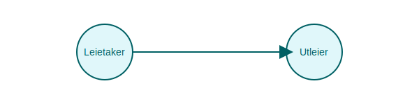

---
title: "Leasing"
seoTitle: "Leasing"
meta_description: '**Leasing** er en finansieringsteknikk som gir tilgang til eiendeler uten å måtte kjøpe dem kontant. I norsk regnskap har leasing gjennomgått en betydelig e...'
slug: leasing
type: blog
layout: pages/single
---

**Leasing** er en finansieringsteknikk som gir tilgang til eiendeler uten å måtte kjøpe dem kontant. I norsk regnskap har leasing gjennomgått en betydelig endring etter innføringen av **IFRS 16**, hvor de fleste leasingavtaler nå må balanseføres som **leasingforpliktelser** og **bruksretteiendeler**.

*Se også: [Hva er varige driftsmidler?](/blogs/regnskap/hva-er-varige-driftsmidler "Hva er varige driftsmidler? Komplett Guide til Avskrivbare Anleggsmidler")*  
*Se også: [Hva er fremmedkapital?](/blogs/regnskap/hva-er-fremmedkapital "Hva er Fremmedkapital? Komplett Guide til Gjeld og Lånefinansiering")*  
*Se også: [Hva er anleggsmidler?](/blogs/regnskap/hva-er-anleggsmidler "Hva er Anleggsmidler? Komplett Guide til Varige Driftsmidler")*

## 1. Typer Leasing

Leasing deles ofte inn i to hovedkategorier i regnskapsføringen:

| Type leasing         | Balanseføring | Kontroll og risiko                         |
|----------------------|--------------|--------------------------------------------|
| Finansiell leasing   | Ja           | Overføres til leietaker                    |
| Operasjonell leasing | Nei          | Forblir hos utleier                        |

## 2. Regnskapsføring etter IFRS 16

Under **IFRS 16 Leieavtaler** må leietaker balanseføre de fleste leasingavtaler som:

* En **bruksretteiendel** (Right-of-Use Asset) målt til nåverdien av fremtidige leasingbetalinger.
* En **leasingforpliktelse** (Lease Liability) tilsvarende nåverdien av de samme betalingene.

## 3. Fordeler og ulemper med leasing

### Fordeler

* **Lavere kapitalbinding**: Bevarer likviditet ved å unngå store forhåndsbetalinger.
* **Fleksibilitet**: Mulighet til å oppgradere eller endre eiendeler ved slutten av kontraktsperioden.
* **Skattefordeler**: Leiebetalinger kan være fradragsberettiget som driftkostnad.

### Ulemper

* **Total kostnad** kan bli høyere enn ved kjøp.
* **Balanseføring** kan øke gjeldsgrad og påvirke nøkkeltall.
* **Langsiktige forpliktelser** binder opp fremtidig likviditet.

## 4. Praktisk eksempel

Anta at en bedrift inngår en leasingavtale med månedlige betalinger på 20 000 kr i 3 år, med en diskonteringsrente på 5 %:

| Periode | Månedlig betaling | Nåverdi av betalinger |
|---------|-------------------|-----------------------|
| 1“36    | 20 000 kr         | 640 000 kr            |

## 5. Konklusjon

Leasing er et fleksibelt alternativ til kjøp som kan forbedre likviditet og skatteposisjon, men krever nøye vurdering av totale kostnader og balanseføring etter IFRS 16.

