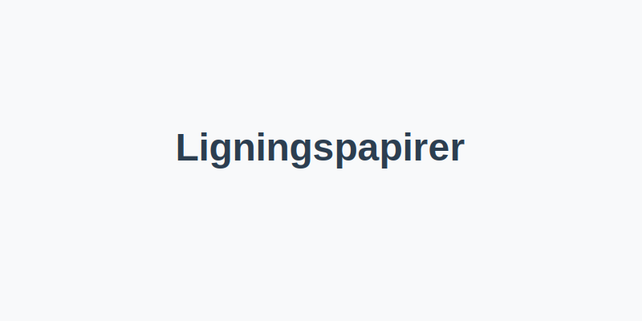

---
title: "Ligningspapirer – Hva er, krav og oppbevaring"
seoTitle: "Ligningspapirer | Hva er det, krav og oppbevaring"
description: "Ligningspapirer er dokumenter som brukes av skattemyndighetene for å vurdere skattepliktig inntekt og skatteposisjoner. Lær hvilke dokumenter som inngår, krav og oppbevaringstider."
summary: "Hva ligningspapirer er, lovkrav, oppbevaringstider og hvordan de brukes i skattemeldingen."
---

**Ligningspapirer** er dokumenter som brukes i forbindelse med skattemyndighetenes vurdering av en virksomhets eller en persons skattepliktige inntekt og skatteposisjoner. De underbygger opplysningene i [skattemeldingen](/blogs/regnskap/hva-er-skattemelding "Hva er Skattemelding? Komplett Guide til Skattemelding og Skatteoppgaver") og sikrer korrekt beregning av skatt.

## Hva er ligningspapirer?

Ligningspapirer fungerer som grunnlaget for skattemyndighetenes kontroll og fastsettelse av skatt. I Norge omfatter ligningspapirer blant annet:

* **Selvangivelse** “ årlig rapportering av personlig inntekt og formue
* **Næringsoppgave** “ næringsdrivendes oversikt over inntekter og kostnader for skatteformål ([Hva er Næringsoppgave?](/blogs/regnskap/hva-er-naeringsoppgave "Hva er Næringsoppgave? Komplett Guide til Næringsoppgave for Næringsdrivende"))
* **Fradragspapirer** “ dokumentasjon av fradragsberettigede kostnader, som kvitteringer og fakturaer
* **Avskrivningsbilag** “ dokumentasjon av avskrivninger på varige driftsmidler
* **Dokumentasjon av lønn og godtgjørelser** “ lønnsslipper og andre lønnsbilag
* **Andre støttebilag** “ avtaler, kontrakter, erklæringer og andre underlagsdokumenter

## Juridisk grunnlag og krav

Skatteloven og tilhørende forskrifter stiller krav til innhold, dokumentasjon og oppbevaring av ligningspapirer:

| **Lovverk**                        | **Krav**                                                       |
|------------------------------------|----------------------------------------------------------------|
| **Skatteloven § 4-10**             | Dokumentasjonsplikt for all rapportering til Skatteetaten      |
| **Skatteforvaltningsloven § 8-12** | Oppbevaringsplikt: Ligningspapirer skal oppbevares i minst 10 år |

## Oppbevaringskrav for ligningspapirer

Ligningspapirer må oppbevares i samsvar med skatteforvaltningsloven og bokføringsregelverket:

| **Dokumenttype**   | **Oppbevaringstid** | **Lovgrunnlag**                           |
|--------------------|---------------------|-------------------------------------------|
| Ligningspapirer    | 10 år               | Skatteforvaltningsloven § 8-12            |
| Regnskapsbilag     | 5 år                | Bokføringsloven § 13                      |
| Årsregnskap        | 10 år               | Regnskapsloven § 3-10                     |

## Bruk av ligningspapirer i skattemeldingen

Ved innsending av skattemeldingen skal relevante ligningspapirer vedlegges som dokumentasjon av oppgitte tall:

1. **Selvangivelse/Næringsoppgave**: Lastes opp sammen med bilag for fradrag.
2. **Budsjett og prognoser**: For forventet inntekt og kostnader.
3. **Annen dokumentasjon**: For eksempel avtaler, erklæringer eller andre papirer som underbygger opplysninger i skattemeldingen.

## Hvordan digitalisere ligningspapirer

Moderne regnskapssystemer og arkivløsninger forenkler håndtering og oppbevaring av ligningspapirer:

* Skann og lagre fradragsbilag digitalt
* Bruk integrerte [ERP-systemer](/blogs/regnskap/hva-er-erp-system "Hva er ERP-system? Komplett Guide til Enterprise Resource Planning") for automatisk arkivering
* Sørg for lesbarhet, integritet og autentisitet gjennom hele oppbevaringsperioden

Ligningspapirer er essensielle for korrekt skatteberegning, revisjon og eventuell etterkontroll fra skattemyndighetene. Å ha gode rutiner for dokumentasjon og oppbevaring reduserer risikoen for avvik og kontrolltiltak.

