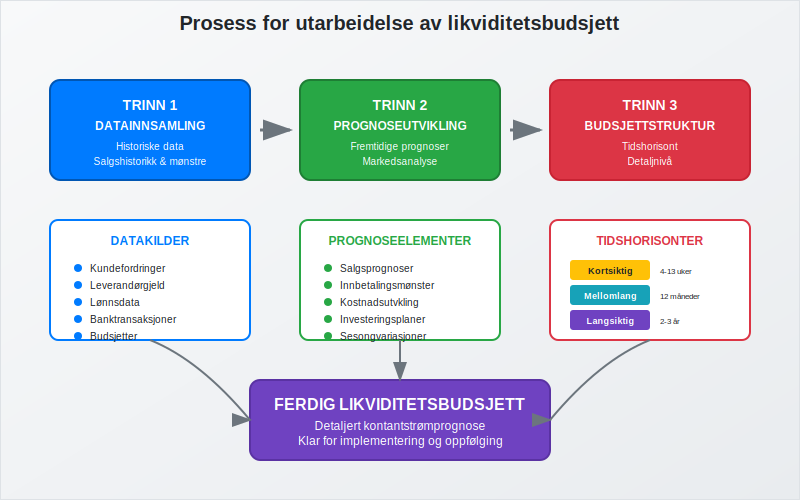
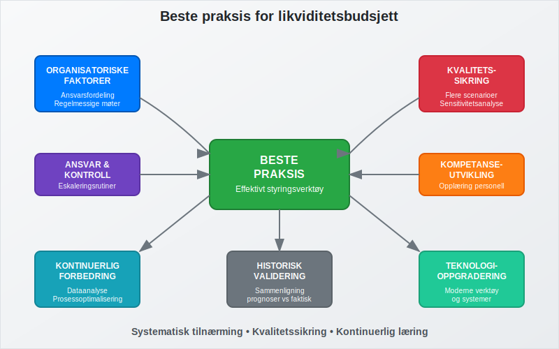
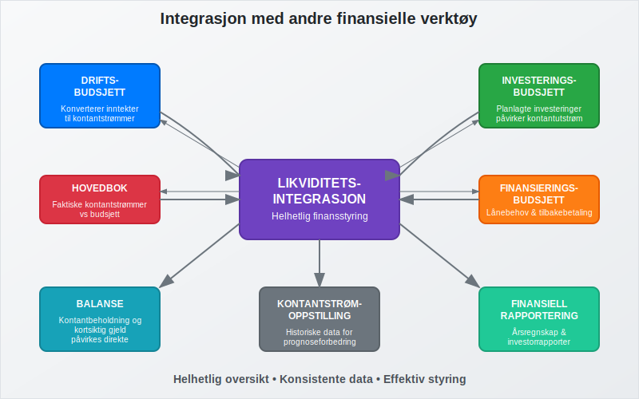

**Likviditetsbudsjett** er et spesialisert finansielt planleggingsverktøy som fokuserer på å forutsi og styre bedriftens kontantstrømmer over en bestemt periode. Dette budsjettet er kritisk for å sikre at bedriften har tilstrekkelig [arbeidskapital](/blogs/regnskap/hva-er-arbeidskapital "Hva er Arbeidskapital? Beregning og Betydning for Bedriftens Likviditet") til å møte sine løpende forpliktelser og opprettholde god [betalingsevne](/blogs/regnskap/hva-er-betalingsevne "Hva er Betalingsevne? Analyse av Likviditet og Finansiell Stabilitet"). Likviditetsbudsjettet er en sentral del av [budsjettering](/blogs/regnskap/hva-er-budsjettering "Hva er Budsjettering? Komplett Guide til Budsjettplanlegging for Bedrifter") og arbeider tett sammen med [kontantstrømanalyse](/blogs/regnskap/hva-er-kontantstromanalyse "Hva er Kontantstrømanalyse? Komplett Guide til Analyse av Bedriftens Kontantstrøm") for å gi ledelsen full oversikt over bedriftens likviditetssituasjon.

For å få oversikt over bedriftens samlede **kapitalbehov**, se vår artikkel om [Kapitalbehov](/blogs/regnskap/kapitalbehov "Hva er Kapitalbehov? Guide til Kapitalbehov og Finansieringsplan for Norske Bedrifter").

## Hva er et likviditetsbudsjett?

Et likviditetsbudsjett er en detaljert prognose over alle inn- og utbetalinger som forventes i en fremtidig periode, vanligvis oppdelt på måneds- eller ukebasis. I motsetning til [driftsregnskapet](/blogs/regnskap/hva-er-driftsregnskap "Hva er Driftsregnskap? Komplett Guide til Driftsregnskapet i Norge") som fokuserer på inntekter og kostnader, konsentrerer likviditetsbudsjettet seg utelukkende om faktiske **kontantbevegelser**.

Hovedformålet med likviditetsbudsjettet er å:

* Sikre tilstrekkelig [kontantbeholdning](/blogs/regnskap/hva-er-kontantbeholdning "Hva er Kontantbeholdning? Betydning og Håndtering av Likvide Midler") til å møte forpliktelser
* Identifisere perioder med likviditetsutfordringer på forhånd
* Planlegge finansieringsbehov og investeringsmuligheter
* Optimalisere [kontantstrøm](/blogs/regnskap/hva-er-kontantstrom "Hva er Kontantstrøm? Komplett Guide til Kontantstrømmer i Regnskap") gjennom bedre timing av inn- og utbetalinger
* Redusere finansieringskostnader ved å unngå unødvendig lånebehov

## Komponenter i likviditetsbudsjettet

Et komplett likviditetsbudsjett består av flere hovedkomponenter som sammen gir et helhetlig bilde av bedriftens kontantstrømsituasjon.

### Innbetalinger (kontantinnstrøm)

Innbetalingsdelen av budsjettet inkluderer alle forventede kontantinnstrømmer:

* **Salgsinnbetalinger:** Kontantbetaling fra [kunder](/blogs/regnskap/hva-er-kunde "Hva er Kunde i Regnskap? Kundehåndtering og Regnskapsføring") og innbetaling av [kundefordringer](/blogs/regnskap/hva-er-kundefordring "Hva er Kundefordring? Håndtering og Regnskapsføring av Utestående Fordringer")
* **Låneopptakk:** Nye lån og kredittfasiliteter
* **Egenkapitaltilførsel:** Kapitalinnskudd fra eiere eller investorer
* **Salg av [anleggsmidler](/blogs/regnskap/hva-er-anleggsmidler "Hva er Anleggsmidler? Komplett Guide til Varige Driftsmidler"):** Kontantinngang fra salg av varige driftsmidler
* **Andre innbetalinger:** Forsikringsutbetalinger, tilbakebetalinger og diverse inntekter

### Utbetalinger (kontantutstrøm)

Utbetalingsdelen omfatter alle planlagte kontantutstrømmer:

* **Leverandørbetalinger:** Betaling til [leverandører](/blogs/regnskap/hva-er-leverandor "Hva er Leverandør i Regnskap? Leverandørhåndtering og Regnskapsføring") og [kreditorer](/blogs/regnskap/hva-er-kreditor "Hva er Kreditor? Håndtering av Leverandørgjeld og Betalingsforpliktelser")
* **Lønnsutbetalinger:** [Lønn](/blogs/regnskap/hva-er-grunnlonn "Hva er Grunnlønn? Beregning og Regnskapsføring av Grunnlønn"), [feriepenger](/blogs/regnskap/hva-er-feriepenger "Hva er Feriepenger i Regnskap? Beregning, Regnskapsføring og Praktiske Eksempler"), og [arbeidsgiveravgift](/blogs/regnskap/hva-er-arbeidsgiveravgift "Hva er Arbeidsgiveravgift? Komplett Guide til Beregning og Regnskapsføring")
* **Skatter og avgifter:** [MVA](/blogs/regnskap/hva-er-avgiftsplikt-mva "Hva er Avgiftsplikt MVA? Komplett Guide til Merverdiavgift"), forskuddsskatt og andre offentlige avgifter
* **[Driftskostnader](/blogs/regnskap/hva-er-driftskostnader "Hva er Driftskostnader? Typer, Beregning og Regnskapsføring - Komplett Guide"):** Husleie, forsikring, strøm og andre løpende utgifter
* **Investeringer:** Kjøp av maskiner, utstyr og andre anleggsmidler
* **Finanskostnader:** Renteutbetalinger og lånegebyrer

## Utarbeidelse av likviditetsbudsjett

Prosessen med å utarbeide et likviditetsbudsjett krever systematisk tilnærming og nøye planlegging for å sikre nøyaktighet og relevans.

### Trinn 1: Datainnsamling og analyse

Før utarbeidelse av budsjettet må bedriften samle inn og analysere historiske data:

| Datatype | Kilde | Formål |
|----------|-------|--------|
| Salgshistorikk | [Kundefordringer](/blogs/regnskap/hva-er-kundereskontro "Hva er Kundereskontro? Håndtering og Oppfølging av Kundefordringer") | Estimere innbetalingsmønster |
| Leverandørdata | [Leverandørreskontro](/blogs/regnskap/hva-er-kreditor "Hva er Kreditor? Håndtering av Leverandørgjeld og Betalingsforpliktelser") | Planlegge utbetalinger |
| Lønnsdata | [Lønnssystem](/blogs/regnskap/hva-er-lett-salaer "Hva er Lett Salær? Forenklet Lønnsrapportering for Små Bedrifter") | Budsjettere personalkostnader |
| Banktransaksjoner | [Bankavstemming](/blogs/regnskap/hva-er-bankavstemming "Hva er Bankavstemming? Prosess og Betydning for Regnskapsføring") | Identifisere mønstre |

### Trinn 2: Prognoseutvikling

Basert på historiske data og fremtidige planer utvikles prognoser for:

* **Salgsprognoser:** Estimering av fremtidige salg basert på markedsforhold og [konjunktur](/blogs/regnskap/hva-er-konjunktur "Hva er Konjunktur? En Komplett Guide til Økonomiske Sykluser")
* **Innbetalingsmønster:** Analyse av hvor raskt kunder betaler sine [fakturaer](/blogs/regnskap/hva-er-en-faktura "Hva er en Faktura? En Guide til Norske Fakturakrav")
* **Kostnadsutvkling:** Forventede endringer i [kostpris](/blogs/regnskap/hva-er-kostpris "Hva er Kostpris? Beregning og Betydning for Lønnsomhet") og driftskostnader
* **Investeringsplaner:** Planlagte kjøp av anleggsmidler og utstyr

### Trinn 3: Budsjettstruktur og tidshorisont

Likviditetsbudsjettet struktureres vanligvis som følger:

* **Kortsiktig:** Ukentlig eller daglig for de nærmeste 4-13 ukene
* **Mellomlang sikt:** Månedlig for de neste 12 månedene
* **Langsiktig:** Kvartalsvis for 2-3 år fremover

## Praktisk eksempel på likviditetsbudsjett

Her er et forenklet eksempel på hvordan et månedlig likviditetsbudsjett kan se ut:

### MÃ¥nedlig likviditetsbudsjett (NOK 1000)

| Post | Januar | Februar | Mars | April |
|------|--------|---------|------|-------|
| **INNBETALINGER** | | | | |
| Kontantsalg | 150 | 180 | 200 | 220 |
| Kundefordringer (30 dager) | 300 | 350 | 400 | 450 |
| Kundefordringer (60 dager) | 200 | 250 | 280 | 320 |
| Andre innbetalinger | 50 | 20 | 30 | 40 |
| **Sum innbetalinger** | **700** | **800** | **910** | **1030** |
| | | | | |
| **UTBETALINGER** | | | | |
| Leverandører | 250 | 300 | 350 | 400 |
| Lønn og sosiale kostnader | 200 | 200 | 200 | 200 |
| Husleie og drift | 80 | 80 | 80 | 80 |
| Skatter og avgifter | 100 | 50 | 150 | 75 |
| Investeringer | 0 | 200 | 0 | 100 |
| **Sum utbetalinger** | **630** | **830** | **780** | **855** |
| | | | | |
| **Netto kontantstrøm** | **70** | **-30** | **130** | **175** |
| Kontantbeholdning start | 100 | 170 | 140 | 270 |
| **Kontantbeholdning slutt** | **170** | **140** | **270** | **445** |

Dette eksemplet viser hvordan bedriften kan identifisere at februar vil ha negativ kontantstrøm, men at den samlede kontantbeholdningen fortsatt er positiv.

## Likviditetsstyring og oppfølging

Effektiv likviditetsstyring krever kontinuerlig oppfølging og justering av budsjettet basert på faktiske resultater og endrede forutsetninger.

### Daglig likviditetsoppfølging

For bedrifter med stram likviditet er daglig oppfølging kritisk:

* **Kontantposisjon:** Daglig avstemming av [bankinnskudd](/blogs/regnskap/hva-er-bankinnskudd "Hva er Bankinnskudd? Håndtering og Regnskapsføring av Bankmidler")
* **Forventede innbetalinger:** Oppfølging av forfallne [kundefordringer](/blogs/regnskap/hva-er-kundefordring "Hva er Kundefordring? Håndtering og Regnskapsføring av Utestående Fordringer")
* **Planlagte utbetalinger:** Kontroll av betalingsforpliktelser
* **Kredittfasiliteter:** Overvåking av tilgjengelig kreditt

### Ukentlig og månedlig analyse

* **Avviksanalyse:** Sammenligning av faktiske tall mot budsjett
* **Rullende prognoser:** Oppdatering av fremtidige perioder
* **Scenarioanalyse:** Vurdering av best-case og worst-case scenarioer
* **Handlingsplaner:** Tiltak for å håndtere identifiserte utfordringer

## Utfordringer og løsninger i likviditetsplanlegging

Likviditetsplanlegging innebærer flere utfordringer som bedrifter må håndtere proaktivt for å opprettholde god finansiell helse.

### Sesongvariasjoner og sykliske svingninger

Mange bedrifter opplever betydelige **sesongvariasjoner** i kontantstrømmen:

* **Detaljhandel:** Høy aktivitet i desember, lav i januar-februar
* **Byggebransjen:** Redusert aktivitet i vintermånedene
* **Turisme:** Sesongavhengige inntekter

**Løsningsstrategier:**
* Oppbygging av kontantreserver i gode perioder
* Fleksible kredittfasiliteter for å håndtere svingninger
* Diversifisering av inntektskilder
* Planlegging av investeringer i lavsesongen

### Kundebetalingsatferd og kreditrisiko

Forsinket betaling fra kunder er en av de største utfordringene for likviditetsstyring:

| Utfordring | Påvirkning | Løsning |
|------------|------------|---------|
| Lange betalingsfrister | Redusert kontantstrøm | Kortere kredittid, kontantrabatter |
| Betalingsforsinkelser | Uforutsigbar innbetaling | Aktiv [inkasso](/blogs/regnskap/hva-er-inkasso "Hva er Inkasso? Prosess og Regelverk for Innkreving av Fordringer"), kredittvurdering |
| Kundekonkurser | Tap av fordringer | Kreditforsikring, diversifisering |
| Valutasvingninger | Usikre innbetalinger | Valutasikring, fakturering i NOK |

### Leverandørforhold og betalingsbetingelser

Optimalisering av leverandørbetalinger kan forbedre likviditeten betydelig:

* **Forhandling av betalingsbetingelser:** Forlengelse av kredittid fra 30 til 45-60 dager
* **Utnyttelse av kontantrabatter:** Vurdering av lønnsomhet ved tidlig betaling
* **Leverandørfinansiering:** Bruk av [factoring](/blogs/regnskap/hva-er-factoring "Hva er Factoring? Finansieringsløsning for Bedrifter") eller andre finansieringsformer

## Teknologi og verktøy for likviditetsplanlegging

Moderne teknologi har revolusjonert måten bedrifter håndterer likviditetsplanlegging på, med automatiserte systemer som gir sanntidsdata og forbedrede prognoser.

### ERP-systemer og integrasjon

[ERP-systemer](/blogs/regnskap/hva-er-erp-system "Hva er ERP-system? Komplett Guide til Enterprise Resource Planning") gir integrert håndtering av likviditetsplanlegging:

* **Automatisk datainnsamling** fra salg, innkjøp og regnskap
* **Sanntidsrapportering** av kontantposisjon og prognoser
* **Integrerte arbeidsflyter** for godkjenning av betalinger
* **Historisk analyse** for forbedring av prognosekvalitet

### Automatisering av betalingsprosesser

* **[Avtalegiro](/blogs/regnskap/hva-er-avtalegiro "Hva er Avtalegiro? Automatisk Betaling og Regnskapsføring"):** Forutsigbare innbetalinger fra kunder
* **[eFaktura](/blogs/regnskap/hva-er-efaktura "Hva er eFaktura? Digital Fakturering og Automatisering"):** Raskere fakturaprosessering og betaling
* **Automatiske leverandørbetalinger:** Optimalisering av utbetalingstiming
* **[Banktransaksjoner](/blogs/regnskap/hva-er-banktransaksjoner "Hva er Banktransaksjoner? Håndtering og Regnskapsføring av Banktransaksjoner") i sanntid:** Umiddelbar oppdatering av kontantposisjon

## Regulatoriske krav og compliance

Likviditetsplanlegging må også ta hensyn til ulike regulatoriske krav og rapporteringsforpliktelser som påvirker kontantstrømmen.

### Skatter og avgifter

Systematisk planlegging av skatte- og avgiftsbetalinger er kritisk:

* **MVA-terminer:** Månedlige eller toårige innbetalinger avhengig av omsetning
* **Forskuddsskatt:** Kvartalsvise innbetalinger basert på forventet resultat
* **[Arbeidsgiveravgift](/blogs/regnskap/hva-er-arbeidsgiveravgift "Hva er Arbeidsgiveravgift? Komplett Guide til Beregning og Regnskapsføring"):** Månedlige innbetalinger sammen med [A-melding](/blogs/regnskap/hva-er-a-melding "Hva er A-melding? Komplett Guide til Innrapportering av Lønn og Avgifter")
* **Særskilte avgifter:** Bransjespecifikke avgifter og gebyrer

### Rapportering og dokumentasjon

* **[Årsregnskap](/blogs/regnskap/hva-er-regnskap "Hva er Regnskap? Komplett Guide til Norsk Regnskapsføring"):** Likviditetsbudsjettet støtter utarbeidelse av [kontantstrømoppstilling](/blogs/regnskap/hva-er-kontantstromoppstilling "Hva er Kontantstrømoppstilling? Komplett Guide til Kontantstrømrapportering")
* **Kredittrapportering:** Banker krever ofte likviditetsbudsjetter ved lånesøknader
* **Investorrapportering:** Regelmessig rapportering til eiere og investorer

## Beste praksis for likviditetsbudsjett

Implementering av beste praksis sikrer at likviditetsbudsjettet blir et effektivt styringsverktøy som bidrar til bedriftens finansielle stabilitet og vekst.

### Organisatoriske faktorer

* **Tydelig ansvarsfordeling:** Definerte roller for utarbeidelse, godkjenning og oppfølging
* **Regelmessige møter:** Ukentlige eller månedlige gjennomganger av likviditetsstatus
* **Eskaleringsrutiner:** Klare prosedyrer når likviditeten blir kritisk
* **Kompetanseutvikling:** Opplæring av nøkkelpersonell i likviditetsstyring

### Kvalitetssikring og kontroll

* **Flere scenarioer:** Utarbeidelse av optimistiske, realistiske og pessimistiske prognoser
* **Sensitivitetsanalyse:** Vurdering av hvordan endringer i nøkkelvariabler påvirker likviditeten
* **Historisk validering:** Sammenligning av prognoser med faktiske utfall for å forbedre nøyaktighet
* **Uavhengig gjennomgang:** Ekstern validering av forutsetninger og metoder

### Kontinuerlig forbedring

* **Dataanalyse:** Bruk av historiske data til å identifisere mønstre og trender
* **Prosessoptimalisering:** Kontinuerlig forbedring av prognosemetoder og -verktøy
* **Benchmarking:** Sammenligning med bransjestandard og beste praksis
* **Teknologioppgradering:** Investering i moderne verktøy og systemer

## Sammenheng med andre finansielle verktøy

Likviditetsbudsjettet fungerer ikke isolert, men er en integrert del av bedriftens samlede finansielle planlegging og styring.

### Forhold til andre budsjetter

* **[Driftsbudsjett](/blogs/regnskap/hva-er-budsjettering "Hva er Budsjettering? Komplett Guide til Budsjettplanlegging for Bedrifter"):** Likviditetsbudsjettet konverterer driftsinntekter og -kostnader til kontantstrømmer
* **Investeringsbudsjett:** Planlagte investeringer påvirker kontantutstrøm og fremtidig [avskrivning](/blogs/regnskap/hva-er-avskrivning "Hva er Avskrivning? Metoder, Beregning og Regnskapsføring")
* **Finansieringsbudsjett:** Koordinering av lånebehov og tilbakebetalinger

### Regnskapsintegrasjon

* **[Hovedbok](/blogs/regnskap/hva-er-hovedbok "Hva er Hovedbok? Sentral Regnskapsbok og Kontostruktur"):** Faktiske kontantstrømmer registreres og sammenlignes med budsjett
* **[Balanse](/blogs/regnskap/hva-er-balanse "Hva er Balanse? Komplett Guide til Balanseoppstilling og Finansiell Posisjon"):** Kontantbeholdning og kortsiktig gjeld påvirkes direkte
* **[Kontantstrømoppstilling](/blogs/regnskap/hva-er-kontantstromoppstilling "Hva er Kontantstrømoppstilling? Komplett Guide til Kontantstrømrapportering"):** Historiske data brukes til å validere og forbedre prognoser

## Konklusjon

Likviditetsbudsjett er et uunnværlig verktøy for moderne bedriftsledelse som sikrer finansiell stabilitet og støtter strategisk beslutningstaking. Gjennom systematisk planlegging av kontantstrømmer kan bedrifter:

* **Unngå likviditetskriser** ved å identifisere potensielle problemer på forhånd
* **Optimalisere finansieringskostnader** gjennom bedre timing av lån og investeringer
* **Forbedre forhandlingsposisjon** med banker, leverandører og kunder
* **Støtte vekststrategier** ved å sikre tilstrekkelig finansiering for ekspansjon

Suksessfull implementering krever kombinasjon av riktige verktøy, kompetent personell og systematiske prosesser. Med økende digitalisering og automatisering blir likviditetsplanlegging stadig mer sofistikert og nøyaktig, noe som gir bedrifter bedre grunnlag for å ta informerte finansielle beslutninger.

For bedrifter som ønsker å styrke sin finansielle posisjon og sikre langsiktig bærekraft, er investering i profesjonell likviditetsplanlegging en av de mest verdifulle tiltakene de kan gjennomføre.

