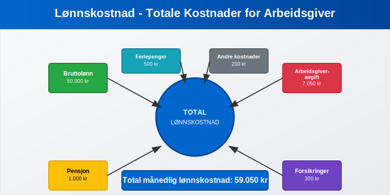
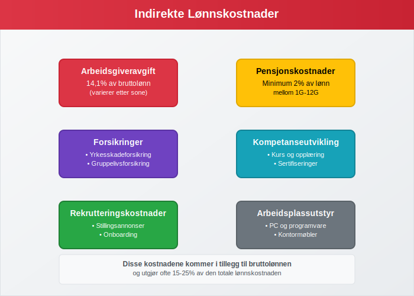
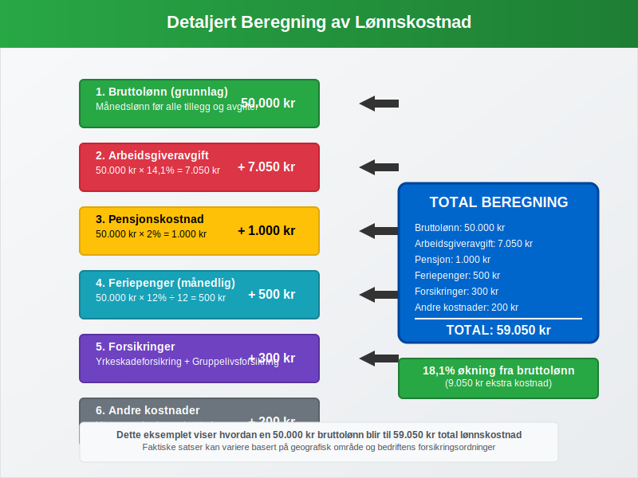
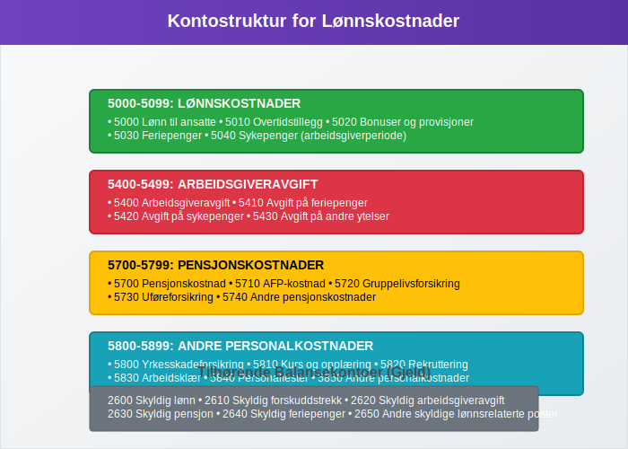
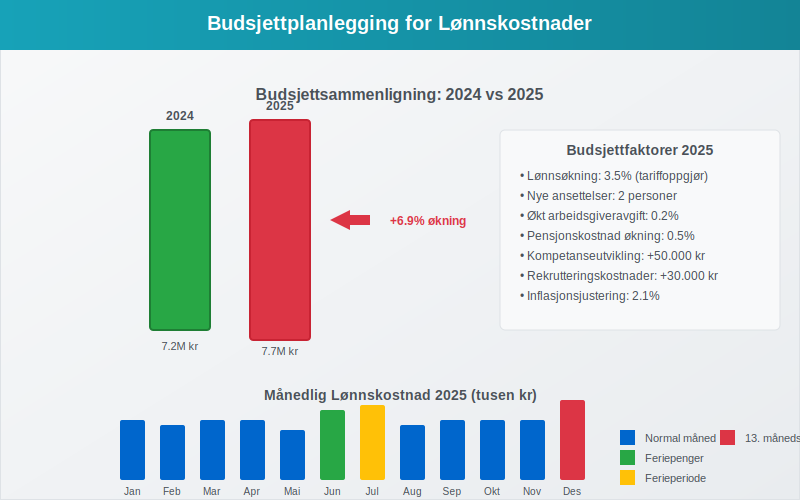
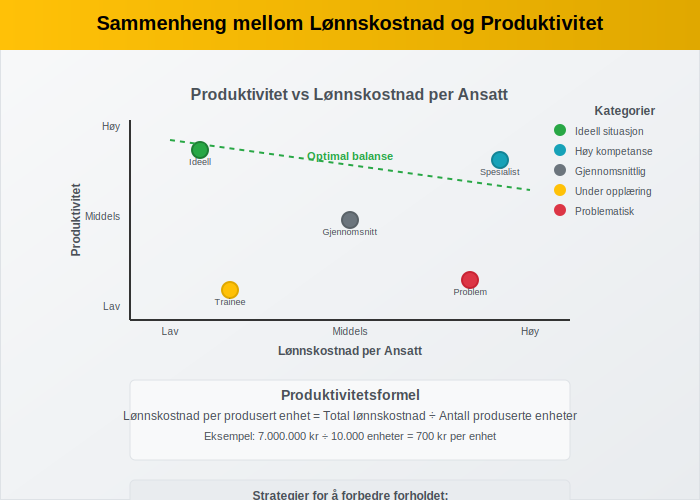
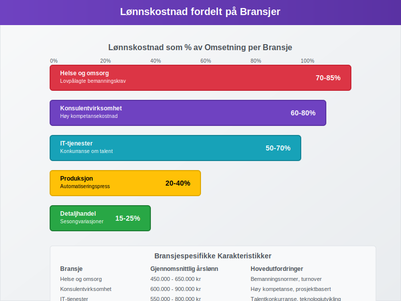

---
title: "Hva er Lønnskostnad i Regnskap?"
meta_title: "Hva er Lønnskostnad i Regnskap?"
meta_description: '**Lønnskostnad** er den totale kostnaden en arbeidsgiver har for sine ansatte, og omfatter langt mer enn bare den utbetalte lønnen. Lønnskostnader inkluderer...'
slug: lonnskostnad
type: blog
layout: pages/single
---

**Lønnskostnad** er den totale kostnaden en arbeidsgiver har for sine ansatte, og omfatter langt mer enn bare den utbetalte lønnen. Lønnskostnader inkluderer **bruttolønn**, **arbeidsgiveravgift**, **[pensjonskostnader](/blogs/regnskap/hva-er-pensjon "Hva er Pensjon? Komplett Guide til Norsk Pensjonssystem")**, **forsikringer** og andre personalrelaterte utgifter. For mange bedrifter utgjør lønnskostnader den største kostnadsposten og kan representere 50-70% av de totale [driftskostnadene](/blogs/regnskap/hva-er-driftskostnader "Hva er Driftskostnader? Komplett Guide til Kostnadstyper og Regnskapsføring").
 
 Se [Hva er Lønn](/blogs/regnskap/hva-er-lonn "Hva er Lønn i Regnskap? Komplett Guide til Lønnsformer, Beregning og Regnskapsføring").



## Komponenter i Lønnskostnad

Lønnskostnad består av flere komponenter som sammen utgjør den totale kostnaden for arbeidsgiveren:

### Direkte Lønnskostnader

* **Bruttolønn** - den faktiske lønnen til den ansatte før trekk
* **[Fastlønn](/blogs/regnskap/hva-er-fastlonn "Hva er Fastlønn i Regnskap?")** eller **[produksjonslønn](/blogs/regnskap/hva-er-produksjonslonn "Hva er Produksjonslønn? Komplett Guide til Produksjonsbasert Lønn")** avhengig av ansettelsesform
* **[Provisjon](/blogs/regnskap/hva-er-provisjon "Hva er Provisjon? Komplett Guide til Provisjon i Regnskap og Lønn")** for prestasjonsbasert lønn
* **[Tungt salær](/blogs/regnskap/hva-er-tungt-salaer "Hva er Tungt Salær? Guide til Betydelige Honorarer og Vederlag")** for betydelige honorarer og spesielle engasjementer
* **Overtidstillegg** og andre lønnstillegg
* **[Feriepenger](/blogs/regnskap/hva-er-feriepenger "Hva er Feriepenger? Beregning og Regnskapsføring")** (12% av opptjent lønn)
* **Sykepenger** som arbeidsgiveren dekker (arbeidsgiverperioden)

### Indirekte Lønnskostnader



* **[Arbeidsgiveravgift](/blogs/regnskap/hva-er-arbeidsgiveravgift "Hva er Arbeidsgiveravgift? Satser og Beregning")** (14,1% i de fleste områder) - som utgjør en del av [trygdeavgiften](/blogs/regnskap/hva-er-trygdeavgift "Hva er Trygdeavgift? Komplett Guide til Beregning og Regnskapsføring") til folketrygden
* **[Pensjonskostnader](/blogs/regnskap/hva-er-pensjon "Hva er Pensjon? Komplett Guide til Norsk Pensjonssystem")** (minimum 2% av lønn mellom 1G-12G) - se også [tjenestepensjon](/blogs/regnskap/hva-er-tjenestepensjon "Hva er Tjenestepensjon? Komplett Guide til Bedriftspensjon og Regnskapsføring") og [pensjonsrapportering](/blogs/regnskap/hva-er-pensjonsrapportering "Hva er Pensjonsrapportering? Komplett Guide til Pensjon i Regnskap")
* **Forsikringer** (yrkesskadeforsikring, gruppelivsforsikring)
* **Kompetanseutvikling** og opplæringskostnader
* **Rekrutteringskostnader** og onboarding
* **Arbeidsplassutstyr** og verktøy

## Beregning av Total Lønnskostnad

### Grunnleggende Beregning

Den totale lønnskostnaden beregnes ved å legge sammen alle komponenter:

```
Total lønnskostnad = Bruttolønn + Arbeidsgiveravgift + Pensjon + Forsikringer + Andre kostnader
```

### Detaljert Beregningseksempel



**Eksempel for en ansatt med månedslønn på 50.000 kr:**

| Kostnadskomponent | Beregning | Beløp |
|-------------------|-----------|-------|
| **Bruttolønn** | 50.000 kr | 50.000 kr |
| **Arbeidsgiveravgift** | 50.000 × 14,1% | 7.050 kr |
| **[Pensjon](/blogs/regnskap/hva-er-pensjon "Hva er Pensjon? Komplett Guide til Norsk Pensjonssystem")** | 50.000 × 2% | 1.000 kr |
| **Feriepenger** | 50.000 × 12% ÷ 12 | 500 kr |
| **Forsikringer** | Fast beløp | 300 kr |
| **Andre kostnader** | Estimat | 200 kr |
| **Total månedlig lønnskostnad** | | **59.050 kr** |

Dette betyr at en ansatt med 50.000 kr i månedslønn faktisk koster bedriften **59.050 kr per måned**, eller **18,1% mer** enn bruttolønnen.

### Årlig Lønnskostnad

For å beregne årlig lønnskostnad må man også inkludere:

* **13. månedslønn** (hvis aktuelt)
* **Ekstra feriepenger** ved ferieavvikling
* **Bonuser** og andre variable tillegg
* **Sykepenger** utover arbeidsgiverperioden (refunderes delvis)

## Lønnskostnad i Regnskapet

### Regnskapsmessig Behandling

Lønnskostnader klassifiseres som **[driftskostnader](/blogs/regnskap/hva-er-driftskostnader "Hva er Driftskostnader? Komplett Guide til Kostnadstyper og Regnskapsføring")** i [resultatregnskapet](/blogs/regnskap/hva-er-driftsregnskap "Hva er Driftsregnskap? En Komplett Guide til Driftsresultat") og føres i følgende kontoklasser:



| Kontotype | Kontonummer | Beskrivelse |
|-----------|-------------|-------------|
| **Lønnskostnader** | 5000-5099 | Bruttolønn til ansatte |
| **Arbeidsgiveravgift** | 5400-5499 | Avgift til NAV |
| **Pensjonskostnader** | 5700-5799 | Pensjon og AFP |
| **Andre personalkostnader** | 5800-5899 | Forsikringer, kurs, etc. |

### Månedlig Bokføring

Typisk bokføring av lønnskostnader:

```
Debet: Lønnskostnad (5000)                 50.000 kr
Debet: Arbeidsgiveravgift (5400)            7.050 kr
Debet: Pensjonskostnad (5700)               1.000 kr
Debet: Andre personalkostnader (5800)         500 kr
    Kredit: Skyldig lønn (2600)                    45.000 kr
    Kredit: Skyldig forskuddstrekk (2610)           5.000 kr
    Kredit: Skyldig arbeidsgiveravgift (2620)       7.050 kr
    Kredit: Skyldig pensjon (2630)                  1.000 kr
    Kredit: Skyldig feriepenger (2640)                500 kr
```

### Periodisering og Avsetninger

Lønnskostnader må **[periodiseres](/blogs/regnskap/hva-er-periodisering "Hva er Periodisering i Regnskap? Komplett Guide til Periodiseringsprinsippet")** korrekt:

* **Opptjente feriepenger** avsettes løpende
* **13. månedslønn** [periodiseres](/blogs/regnskap/hva-er-periodisering "Hva er Periodisering i Regnskap? Komplett Guide til Periodiseringsprinsippet") over året
* **Bonuser** avsettes når de er opptjent
* **Sykepenger** i arbeidsgiverperioden kostnadsføres umiddelbart

## Lønnskostnad og Budsjettering

### Budsjettplanlegging



Ved [budsjettering](/blogs/regnskap/hva-er-budsjettering "Hva er Budsjettering? En Komplett Guide til Budsjettarbeid") av lønnskostnader må følgende faktorer vurderes:

* **Lønnsøkninger** (typisk 2-4% årlig)
* **Nye ansettelser** eller reduksjoner
* **Endringer i arbeidsgiveravgift** eller pensjonssatser
* **Overtidsbehov** og sesongvariasjoner
* **Kompetanseutvikling** og kursvirksomhet

### Lønnskostnad per Ansatt

| Stillingskategori | Gjennomsnittlig årslønn | Total lønnskostnad | Kostnadsfaktor |
|-------------------|------------------------|-------------------|----------------|
| **Leder** | 800.000 kr | 950.000 kr | 1,19 |
| **Spesialist** | 600.000 kr | 710.000 kr | 1,18 |
| **Konsulent** | 500.000 kr | 590.000 kr | 1,18 |
| **Assistent** | 400.000 kr | 470.000 kr | 1,18 |

## Optimalisering av Lønnskostnader

### Kostnadseffektive Strategier

* **Fleksible ansettelsesformer** - bruk av deltid og midlertidige stillinger
* **Kompetanseutvikling** for å øke produktivitet
* **Automatisering** av rutineoppgaver
* **Outsourcing** av ikke-kjerneaktiviteter
* **Hjemmekontor** for å redusere kontorkostnader

### Lønnskostnad og Produktivitet



Forholdet mellom lønnskostnad og produktivitet er kritisk for lønnsomhet:

```
Lønnskostnad per produsert enhet = Total lønnskostnad ÷ Antall produserte enheter
```

## Juridiske Aspekter

### Lovpålagte Minimumskrav

* **Minstelønn** i tariffbundne bransjer
* **Arbeidsgiveravgift** - obligatorisk for alle arbeidsgivere
* **[Obligatorisk tjenestepensjon](/blogs/regnskap/obligatorisk-tjenestepensjon "Hva er Obligatorisk Tjenestepensjon? Komplett Guide til OTP")** - minimum 2% av lønn mellom 1G-12G
* **Yrkesskadeforsikring** - lovpålagt for alle ansatte
* **Feriepenger** - 12% av opptjent lønn

### Rapportering og Dokumentasjon

Lønnskostnader må dokumenteres gjennom:

* **[A-melding](/blogs/regnskap/hva-er-a-melding "Hva er A-melding? En Komplett Guide til Rapportering")** til NAV og Skatteetaten
* **Ã…rsoppgave** for hver ansatt
* **[Ansattreskontro](/blogs/regnskap/hva-er-ansattreskontro "Hva er Ansattreskontro? En Guide til Ansattkontoer i Regnskap")** med detaljert oversikt
* **Lønnsslipp** til den ansatte

## Lønnskostnad i Ulike Bransjer

### Bransjespesifikke Forskjeller



| Bransje | Lønnskostnad som % av omsetning | Typiske utfordringer |
|---------|--------------------------------|---------------------|
| **Konsulentvirksomhet** | 60-80% | Høy kompetansekostnad |
| **Detaljhandel** | 15-25% | Sesongvariasjoner |
| **Produksjon** | 20-40% | Automatiseringspress |
| **IT-tjenester** | 50-70% | Konkurranse om talent |
| **Helse og omsorg** | 70-85% | Lovpålagte bemanningskrav |

### Spesielle Hensyn

* **Sesongbedrifter** må planlegge for variable lønnskostnader
* **Vekstbedrifter** må budsjettere for rask økning i personalkostnader
* **Internasjonale selskaper** må håndtere ulike lønnskostnadsnivåer

## Fremtidige Trender

### Digitalisering og Automatisering

* **Automatisering** av lønnsadministrasjon
* **AI-baserte** rekrutteringsverktøy
* **Digitale** kompetanseplattformer
* **Fleksible** arbeidsformer og hjemmekontor

### Regulatoriske Endringer

* **Nye pensjonskrav** og AFP-ordninger
* **Endringer** i arbeidsgiveravgift
* **Økt fokus** på bærekraft og ESG-rapportering
* **Digitale** rapporteringskrav

## Konklusjon

Lønnskostnad er en kompleks og kritisk kostnadspost som krever grundig planlegging og oppfølging. Ved å forstå alle komponentene i lønnskostnad kan bedrifter:

* **Budsjettere** mer nøyaktig
* **Optimalisere** kostnadsstrukturen
* **Overholde** juridiske krav
* **Planlegge** for fremtidig vekst

Effektiv håndtering av lønnskostnader er essensielt for bedriftens **lønnsomhet** og **konkurranseevne** i markedet.

## Relaterte Artikler

* [Hva er Obligatorisk Tjenestepensjon?](/blogs/regnskap/obligatorisk-tjenestepensjon "Hva er Obligatorisk Tjenestepensjon? Komplett Guide til OTP")
* [Hva er Fastlønn i Regnskap?](/blogs/regnskap/hva-er-fastlonn "Hva er Fastlønn i Regnskap?")
* [Hva er Arbeidsgiveravgift?](/blogs/regnskap/hva-er-arbeidsgiveravgift "Hva er Arbeidsgiveravgift? Satser og Beregning")
* [Hva er Feriepenger?](/blogs/regnskap/hva-er-feriepenger "Hva er Feriepenger? Beregning og Regnskapsføring")
* [Hva er Driftskostnader?](/blogs/regnskap/hva-er-driftskostnader "Hva er Driftskostnader? Komplett Guide til Kostnadstyper og Regnskapsføring")
* [Hva er Ansattreskontro?](/blogs/regnskap/hva-er-ansattreskontro "Hva er Ansattreskontro? En Guide til Ansattkontoer i Regnskap")


