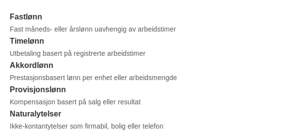

---
title: "Hva er Lønnstype? Oversikt over ulike lønnstyper i Regnskap"
meta_title: "Hva er Lønnstype? Oversikt over ulike lønnstyper i Regnskap"
meta_description: '**Lønnstype** refererer til klassifisering av ulike **lønnsformer** som bedrifter i Norge bruker for å kompensere ansatte. Å forstå de forskjellige lønnst...'
slug: lonnstype
type: blog
layout: pages/single
---

**Lønnstype** refererer til klassifisering av ulike **lønnsformer** som bedrifter i Norge bruker for å kompensere ansatte. Å forstå de forskjellige lønnstypene er viktig for korrekt [bokføring](/blogs/regnskap/hva-er-bokforing "Hva er Bokføring? Komplett Guide til Regnskapsføring"), lønnsplanlegging og budsjettering.

## Oversikt over lønnstyper

| Lønnstype         | Beskrivelse                                            | Artikkel                                                          |
|-------------------|--------------------------------------------------------|-------------------------------------------------------------------|
| **Fastlønn**      | Fast måneds- eller årslønn uavhengig av arbeidstimer   | [Hva er Fastlønn?](/blogs/regnskap/hva-er-fastlonn "Hva er Fastlønn i Regnskap?") |
| **Timelønn**      | Utbetaling basert på registrerte arbeidstimer          | [Hva er Timelønn?](/blogs/regnskap/hva-er-timelonn "Hva er Timelønn i Regnskap?") |
| **Akkordlønn**    | Prestasjonsbasert lønn per enhet eller arbeidsmengde   | [Hva er Akkordlønn?](/blogs/regnskap/hva-er-akkordlonn "Hva er Akkordlønn? En Guide til Prestasjonslønn") |
| **Provisjonslønn**| Kompensasjon basert på salg eller resultat             | [Hva er Provisjon?](/blogs/regnskap/hva-er-provisjon "Provisjon - Guide til Prestasjonsbasert Lønn") |
| **Naturalytelser**| Ikke-kontantytelser som firmabil, bolig eller telefon  | [Fordelsbeskatning](/blogs/regnskap/fordelsbeskatning "Fordelsbeskatning - Komplett Guide til Skattemessig Fordel og Regnskapsføring") |

## Andre lønnstyper

Noen lønnstyper som ikke dekkes av tabellen over:

* **Bonuslønn** “ ekstra kompensasjon basert pÃ¥ mÃ¥loppnÃ¥else.
* **Overtidslønn** “ tillegg for arbeid utenfor normal arbeidstid.

Se også [Hva er Lønn?](/blogs/regnskap/hva-er-lonn "Hva er Lønn i Regnskap?") for en dypere gjennomgang av **lønnsformer** og regnskapsmessig behandling.

