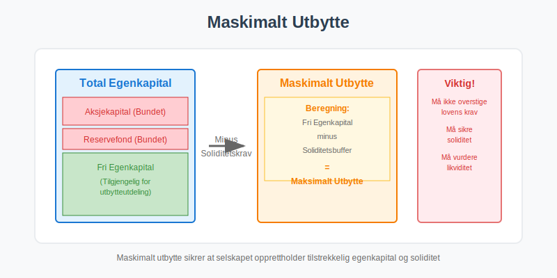
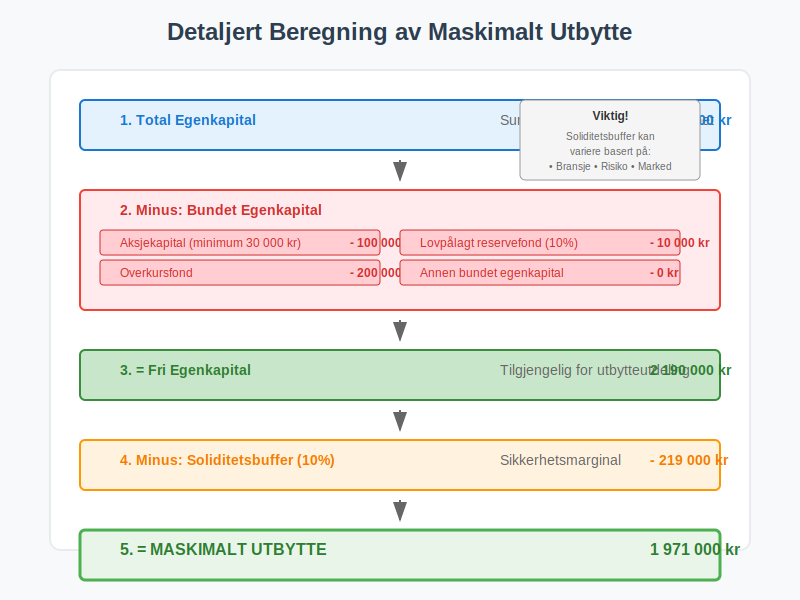
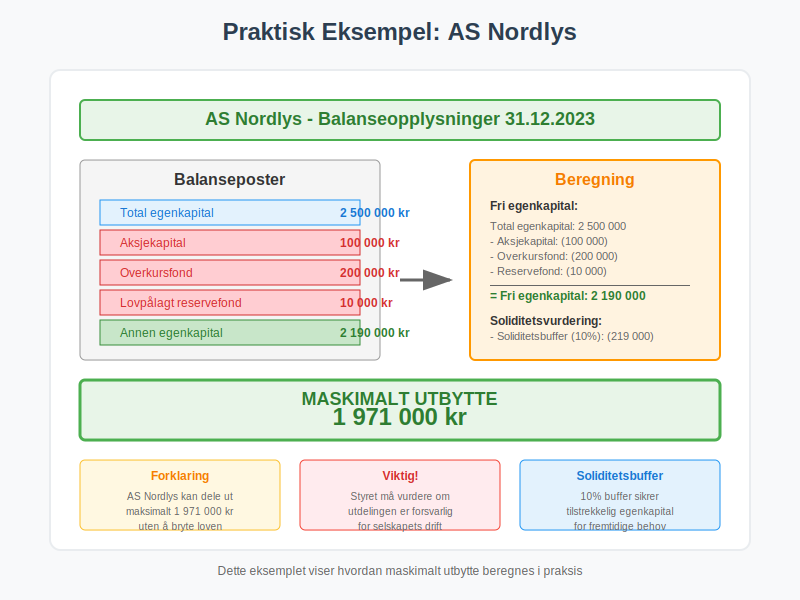
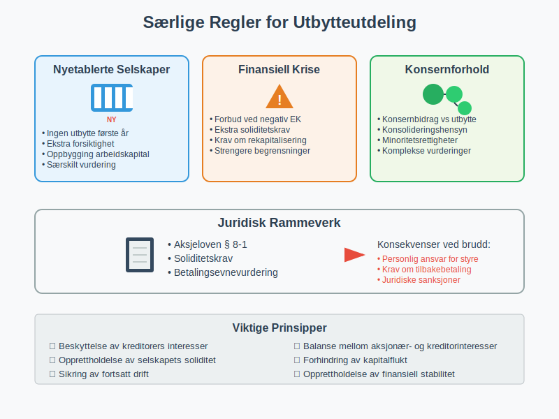
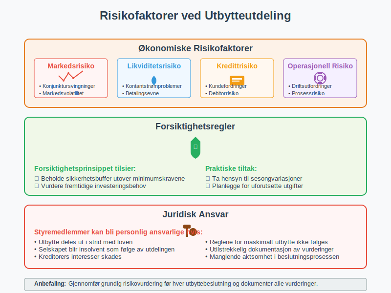
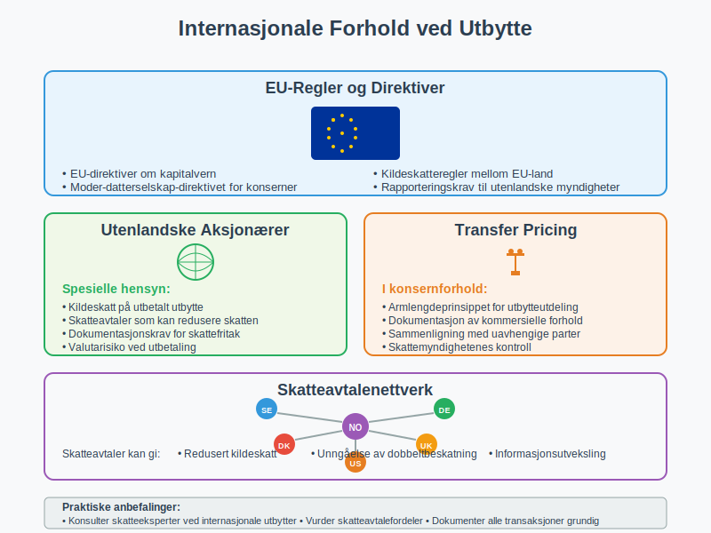
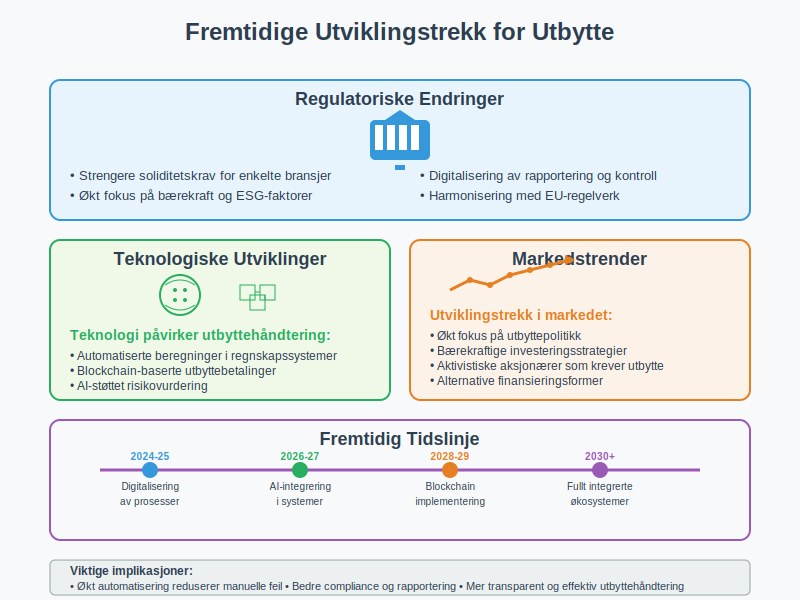

**Maskimalt utbytte** er det høyeste beløpet et [aksjeselskap](/blogs/regnskap/hva-er-et-aksjeselskap "Hva er et Aksjeselskap (AS)? Komplett Guide til Selskapsformen") kan dele ut til aksjonærene uten å bryte lovens krav til [egenkapital](/blogs/regnskap/hva-er-egenkapital "Hva er Egenkapital? Komplett Guide til Egenkapital i Regnskap") og soliditet. Dette er et sentralt begrep i norsk selskapsrett og regnskapspraksis som sikrer at selskaper opprettholder tilstrekkelig finansiell stabilitet.

For informasjon om hvordan utbytte beskattes og påvirker aksjonærene, se vår [Aksjonærmodellen - Komplett Guide til Norsk Aksjebeskatning](/blogs/regnskap/aksjonaermodellen-guide "Aksjonærmodellen - Komplett Guide til Norsk Aksjebeskatning").

For mer informasjon om [Ekstraordinært Utbytte](/blogs/regnskap/ekstraordinart-utbytte "Ekstraordinært Utbytte - Alt du trenger å vite om ekstraordinært utbytte"), se egen artikkel om temaet.

For mer om oppjustering av utbytte etter vedtak, se [Oppjustering av aksjeutbytte](/blogs/regnskap/oppjustering-av-aksjeutbytte "Oppjustering av aksjeutbytte – Guide til justering av utbytte for norsk AS").



For en oversikt over ulike typer fond og deres regnskapsmessige behandling, se [Hva er Fond? Ulike Typer Fond og Regnskapsbehandling](/blogs/regnskap/hva-er-fond "Hva er Fond? Ulike Typer Fond og Regnskapsbehandling").

## Definisjon av Maskimalt Utbytte

Maskimalt utbytte defineres som det **maksimale beløpet** et aksjeselskap kan dele ut til sine aksjonærer uten å:

* Redusere [aksjekapitalen](/blogs/regnskap/hva-er-aksjekapital "Hva er Aksjekapital? Komplett Guide til Aksjekapital i Aksjeselskap") under lovens minimumskrav
* Bryte **soliditetskravene** i aksjeloven
* Sette selskapets **betalingsevne** i fare
* Redusere den **bundne egenkapitalen**

### Juridisk Grunnlag

Reglene for maskimalt utbytte er forankret i **aksjeloven § 8-1** som fastsetter at utbytte kun kan deles ut av:

* **Årets overskudd** etter fradrag for tap fra tidligere år
* **Annen egenkapital** som ikke er bundet
* **Fri egenkapital** som overstiger kravene til soliditet


## Beregning av Maskimalt Utbytte

### Grunnleggende Formel

Den grunnleggende formelen for beregning av maskimalt utbytte er:

**Maskimalt utbytte = Fri egenkapital - Soliditetskrav**

Hvor:
* **Fri egenkapital** = Total egenkapital - Bundet egenkapital
* **Soliditetskrav** = Minimum egenkapital som må beholdes

### Detaljert Beregningsmetode

| Komponent | Beskrivelse | Beløp |
|-----------|-------------|-------|
| **Total egenkapital** | Sum av all egenkapital | XXX |
| **Minus: Aksjekapital** | Lovpålagt minimum | (XXX) |
| **Minus: Overkursfond** | Bundet egenkapital | (XXX) |
| **Minus: Lovpålagt reservefond** | 10% av aksjekapital | (XXX) |
| **Minus: Annen bundet egenkapital** | Vedtektsfestet eller lovpålagt | (XXX) |
| **= Fri egenkapital** | Tilgjengelig for utdeling | XXX |
| **Minus: Soliditetsbuffer** | Sikkerhetsmarginal | (XXX) |
| **= Maskimalt utbytte** | **Maksimalt utdelingsbeløp** | **XXX** |



## Faktorer som Påvirker Maskimalt Utbytte

### Bundet Egenkapital

**Bundet egenkapital** kan ikke deles ut som utbytte og omfatter:

* **Aksjekapital** - lovpålagt minimum 30 000 kr for AS
* **Overkursfond** - innbetalt beløp utover pålydende
* **Lovpålagt reservefond** - minimum 10% av aksjekapitalen
* **Vedtektsfestet reservefond** - hvis fastsatt i vedtektene
* **Oppskrivningsfond** - fra oppskrivning av [anleggsmidler](/blogs/regnskap/hva-er-anleggsmidler "Hva er Anleggsmidler? Komplett Guide til Anleggsmidler i Regnskap")

### Soliditetskrav

Selskapet må opprettholde **tilstrekkelig soliditet** for å:

* Dekke fremtidige [kostnader](/blogs/regnskap/hva-er-kostnader "Hva er Kostnader? Komplett Guide til Kostnader i Regnskap") og forpliktelser
* Håndtere uforutsette tap
* Opprettholde [likviditet](/blogs/regnskap/hva-er-likviditet "Hva er Likviditet? Komplett Guide til Likviditet og Likviditetsstyring")
* Sikre fortsatt drift

### Regnskapsmessige Hensyn

Ved beregning av maskimalt utbytte må følgende regnskapsmessige forhold vurderes:

* **Årsresultat** og dets påvirkning på egenkapitalen
* **Balanseførte verdier** vs. virkelige verdier
* **Avsetninger** for fremtidige forpliktelser
* **Usikre poster** i regnskapet


## Praktisk Eksempel på Beregning

### Eksempel: AS Nordlys

La oss se på et praktisk eksempel med AS Nordlys:

#### Balanseopplysninger (31.12.2023)

| Post | Beløp (NOK) |
|------|-------------|
| **Total egenkapital** | 2 500 000 |
| **Aksjekapital** | 100 000 |
| **Overkursfond** | 200 000 |
| **Lovpålagt reservefond** | 10 000 |
| **Annen egenkapital** | 2 190 000 |

#### Beregning av Maskimalt Utbytte

```
Fri egenkapital:
Total egenkapital:           2 500 000
- Aksjekapital:               (100 000)
- Overkursfond:               (200 000)
- Lovpålagt reservefond:       (10 000)
= Fri egenkapital:           2 190 000

Soliditetsvurdering:
Fri egenkapital:             2 190 000
- Soliditetsbuffer (10%):     (219 000)
= Maskimalt utbytte:         1 971 000
```

**Konklusjon**: AS Nordlys kan maksimalt dele ut **1 971 000 kr** i utbytte.



## Særlige Regler og Unntak

### Nyetablerte Selskaper

For **nyetablerte selskaper** gjelder spesielle regler:

* Ingen utbytte første driftsår uten særskilt vurdering
* Ekstra forsiktighet ved vurdering av soliditet
* Krav om oppbygging av [arbeidskapital](/blogs/regnskap/hva-er-arbeidskapital "Hva er Arbeidskapital? Komplett Guide til Arbeidskapital og Likviditetsstyring")

### Selskaper i Finansiell Krise

Selskaper med **finansielle utfordringer** har strengere begrensninger:

* Forbud mot utbytte ved **negativ egenkapital**
* Ekstra soliditetskrav ved lav egenkapitalandel
* Krav om **rekapitalisering** før utbytteutdeling

### Konsernforhold

I **konsernselskaper** må følgende vurderes:

* [Konsernbidrag](/blogs/regnskap/hva-er-konsernbidrag "Hva er Konsernbidrag? Komplett Guide til Konsernbidrag og Skatteoptimalisering") vs. utbytte
* Konsolideringshensyn
* Minoritetsaksjonærers rettigheter



## Prosess for Utbytteutdeling

### Styrets Rolle

**Styret** har ansvar for:

* Vurdere selskapets **økonomiske situasjon**
* Beregne maskimalt utbytte
* Foreslå utbytteutdeling til generalforsamlingen
* Sikre at utdelingen ikke setter selskapet i fare

### Generalforsamlingens Vedtak

**Generalforsamlingen** må:

* Vedta årsregnskapet
* Beslutte utbytteutdeling basert på styrets forslag
* Ikke overstige maskimalt utbytte
* Fastsette utbetalingsdato

### Dokumentasjon og Rapportering

Følgende dokumentasjon kreves:

* **Styreprotokoll** med utbyttevurdering
* **Generalforsamlingsprotokoll** med vedtak
* **Beregning** av maskimalt utbytte
* **Regnskapsnotater** som forklarer grunnlaget


## Skattemessige Konsekvenser

### For Selskapet

Utbytteutdeling har følgende skattemessige konsekvenser for selskapet:

* **Ingen fradragsrett** for utbetalt utbytte
* Utbytte utbetales av **beskattede midler**
* Påvirker ikke selskapets **skattepliktige inntekt**

### For Aksjonærene

Aksjonærene må forholde seg til:

* [**Utbytteskatt**](/blogs/regnskap/skatt-pa-utbytte "Skatt på utbytte – Guide til beskatning av utbytte i Norge") på mottatt utbytte
* **Skjermingsrente** for personlige aksjonærer
* **Fritaksmetoden** for selskapsaksjonærer
* **Kildeskatt** for utenlandske aksjonærer

### Skatteoptimalisering

Strategier for skatteoptimal utbytteutdeling:

* **Timing** av utbytteutdeling
* **Kombinasjon** med lønn og andre ytelser
* **Reinvestering** vs. utdeling
* **Holdingselskap**-strukturer


## Risikofaktorer og Forsiktighetsregler

### Økonomiske Risikofaktorer

Ved vurdering av maskimalt utbytte må følgende risikofaktorer vurderes:

* **Konjunktursvingninger** og markedsrisiko
* **Likviditetsrisiko** og [kontantstrøm](/blogs/regnskap/hva-er-kontantstrom "Hva er Kontantstrøm? Komplett Guide til Kontantstrømanalyse")
* **Kredittrisiko** fra kunder og [debitorer](/blogs/regnskap/hva-er-debitor "Hva er en Debitor? Komplett Guide til Debitorhåndtering")
* **Operasjonell risiko** i virksomheten

### Forsiktighetsregler

**Forsiktighetsprinsippet** tilsier at selskaper bør:

* Beholde en **sikkerhetsbuffer** utover minimumskravene
* Vurdere **fremtidige investeringsbehov**
* Ta hensyn til **sesongvariasjoner** i virksomheten
* Planlegge for **uforutsette utgifter**

### Juridisk Ansvar

Styremedlemmer kan bli **personlig ansvarlige** hvis:

* Utbytte deles ut i strid med loven
* Selskapet blir **insolvent** som følge av utdelingen
* **Kreditorers interesser** skades
* Reglene for maskimalt utbytte ikke følges



## Internasjonale Forhold

### EU-Regler

For selskaper med **internasjonal virksomhet** gjelder:

* **EU-direktiver** om kapitalvern
* **Moder-datterselskap-direktivet** for konserner
* **Kildeskatteregler** mellom EU-land
* **Rapporteringskrav** til utenlandske myndigheter

### Utenlandske Aksjonærer

Spesielle hensyn for **utenlandske aksjonærer**:

* **Kildeskatt** på utbetalt utbytte
* **Skatteavtaler** som kan redusere skatten
* **Dokumentasjonskrav** for skattefritak
* **Valutarisiko** ved utbetaling

### Transfer Pricing

I **konsernforhold** må vurderes:

* **Armlengdeprinsippet** for utbytteutdeling
* **Dokumentasjon** av kommersielle forhold
* **Sammenligning** med uavhengige parter
* **Skattemyndighetenes kontroll**



## Praktiske Råd og Anbefalinger

### For Små og Mellomstore Bedrifter

**SMB-selskaper** bør:

* Utarbeide **årlig utbyttestrategi**
* Konsultere [regnskapsfører](/blogs/regnskap/hva-er-en-regnskapsforer "Hva er en Regnskapsfører? Komplett Guide til Regnskapsføring") eller revisor
* Vurdere **likviditetsbehov** før utdeling
* Dokumentere alle **styrevurderinger**

### For Vekstselskaper

**Vekstselskaper** må balansere:

* **Reinvestering** i virksomheten
* **Aksjonærenes avkastningsforventninger**
* **Fremtidig finansieringsbehov**
* **Markedets verdsettelse** av selskapet

### For Familieselskaper

**Familieselskaper** har særlige hensyn:

* **Generasjonsskifte** og arveplanlegging
* **Familiemedlemmers** ulike økonomiske behov
* **Selskapets langsiktige** interesser
* **Konfliktforebygging** mellom familiemedlemmer

### Digitale Verktøy

Moderne verktøy for utbytteberegning:

* **Regnskapssystemer** med innebygde beregninger
* **Skatteberegningsprogrammer**
* **Juridiske databaser** med oppdaterte regler
* **Revisjonsverktøy** for dokumentasjon


## Fremtidige Utviklingstrekk

### Regulatoriske Endringer

Forventede endringer i regelverket:

* **Strengere soliditetskrav** for enkelte bransjer
* **Økt fokus** på bærekraft og ESG-faktorer
* **Digitalisering** av rapportering og kontroll
* **Harmonisering** med EU-regelverk

### Teknologiske Utviklinger

Teknologi påvirker utbyttehåndtering:

* **Automatiserte beregninger** i regnskapssystemer
* **Blockchain-baserte** utbyttebetalinger
* **AI-støttet** risikovurdering
* **Sanntids-rapportering** til myndigheter

### Markedstrender

Utviklingstrekk i markedet:

* **Økt fokus** på utbyttepolitikk
* **Bærekraftige** investeringsstrategier
* **Aktivistiske aksjonærer** som krever utbytte
* **Alternative** finansieringsformer



## Konklusjon

**Maskimalt utbytte** er et komplekst regnskapsmessig og juridisk begrep som krever grundig forståelse av:

* **Juridiske rammer** i aksjeloven
* **Regnskapsmessige prinsipper** og beregningsmetoder
* **Skattemessige konsekvenser** for selskap og aksjonærer
* **Praktiske hensyn** ved utbytteutdeling

Korrekt beregning og håndtering av maskimalt utbytte er avgjørende for:

* **Å overholde** lovens krav
* **Å beskytte** kreditorers interesser
* **Å optimalisere** aksjonærenes avkastning
* **Å sikre** selskapets langsiktige stabilitet

For å sikre korrekt håndtering anbefales det å:

* **Konsultere** kvalifiserte rådgivere
* **Dokumentere** alle vurderinger og beslutninger
* **Følge** utviklingen i regelverk og praksis
* **Implementere** gode rutiner for utbyttehåndtering

Ved å følge disse prinsippene kan selskaper sikre at utbytteutdelingen skjer på en **lovlig**, **forsvarlig** og **optimal** måte som ivaretar alle interessenters behov.
