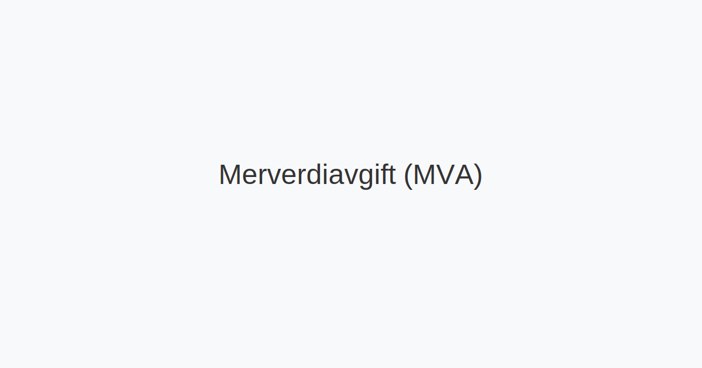
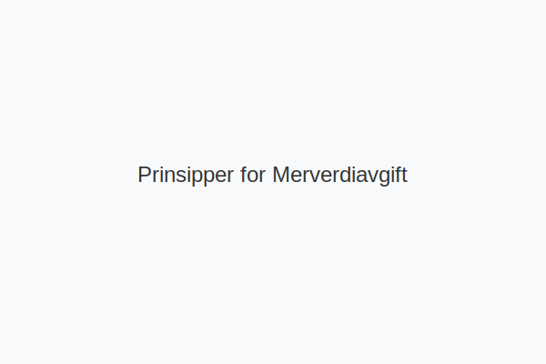
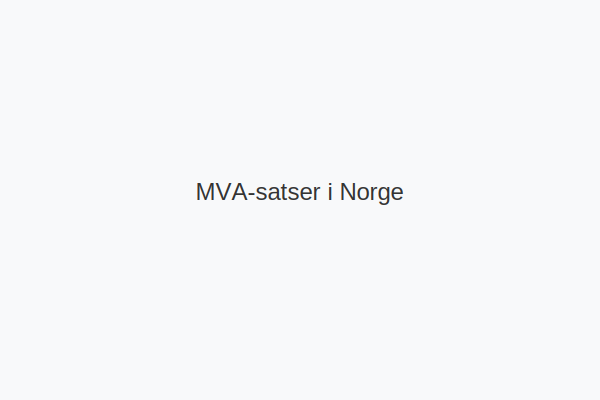
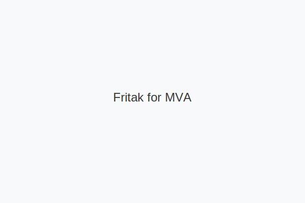
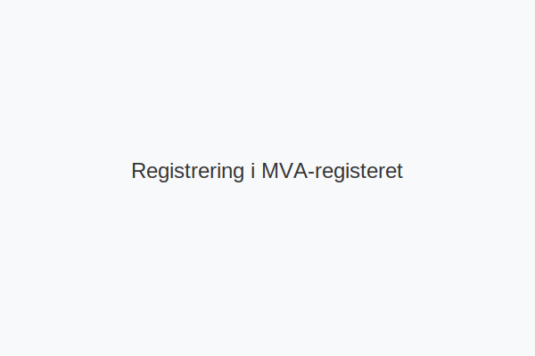
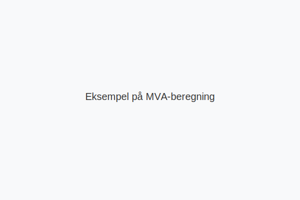
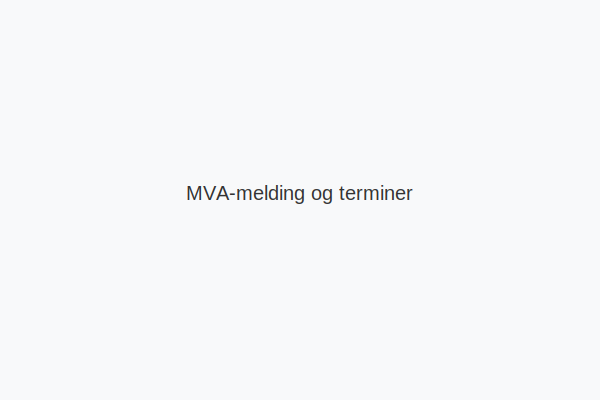
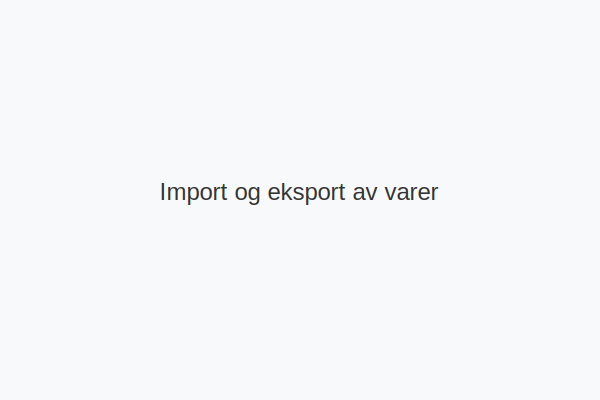
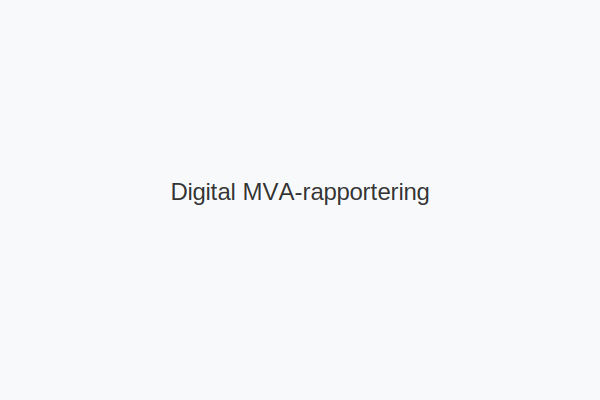

---
title: "Merverdiavgift: Komplett Guide til MVA i Norge"
meta_title: "Merverdiavgift: Komplett Guide til MVA i Norge"
meta_description: '**Merverdiavgift (MVA)**, eller **moms**, er en indirekte forbruksavgift som pålegges omsetning av varer og tjenester i Norge. Systemet sikrer at avgiften kun ...'
slug: merverdiavgift
type: blog
layout: pages/single
---

**Merverdiavgift (MVA)**, eller **moms**, er en indirekte forbruksavgift som pålegges omsetning av varer og tjenester i Norge. Systemet sikrer at avgiften kun betales av sluttforbrukeren, men bedrifter har ansvar for å beregne, innkreve og rapportere MVA til Skatteetaten.

For en komplett guide til **Merverdiavgift**, se [Merverdiavgift: Komplett Guide til MVA i Norge](/blogs/regnskap/merverdiavgift "Merverdiavgift: Komplett Guide til MVA i Norge").

## Grunnleggende prinsipper

Merverdiavgift bygger på følgende prinsipper:

* **Nøytralitet** – avgiften påvirker ikke konkurranse mellom virksomheter.
* **Fradragsrett** – virksomheter får fradrag for MVA på sine kjøp.
* **Destinasjonsprinsippet** – avgiften ilegges der varen eller tjenesten konsumeres.
* **Bred avgiftsbase** – de fleste varer og tjenester er omfattet.

## MVA-satser i Norge

Norge har flere MVA-satser basert på vare- eller tjenestetype:

| Sats       | Prosent | Eksempler                                   |
|------------|--------:|---------------------------------------------|
| **Ordinær**|     25% | Klær, elektronikk, frisørtjenester           |
| **Redusert**|    15% | Matvarer, overnatting, persontransport       |
| **Lav**    |     12% | Bøker, aviser, kringkasting                  |
| **Null**   |      0% | Eksport, utenriksfart                        |

## MVA-fritak og unntak

Visse varer og tjenester er fritatt for MVA:

| Type                   | Eksempler                             |
|------------------------|---------------------------------------|
| Finansielle tjenester  | Bank, forsikring, verdipapirhandel    |
| Helse- og sosialtjenester | Lege, tannlege, fysioterapi         |
| Undervisning           | Skole, universiteter, godkjente kurs   |
| Eiendomsomsetning      | Brukte boliger, utleie av bolig        |

## Registreringsplikt

Virksomheter må registrere seg i MVA-registeret når omsetning av avgiftspliktige varer og tjenester overstiger **50 000 kr** i løpet av 12 måneder. Se [Hva er Avgiftsplikt (MVA)?](/blogs/regnskap/hva-er-avgiftsplikt-mva "Hva er Avgiftsplikt (MVA)?").

| Virksomhetstype            | Omsetningsgrense                     |
|----------------------------|--------------------------------------|
| Alminnelig næring          | 50 000 kr                            |
| Primærnæring               | 70 000 kr                            |
| Ideelle organisasjoner     | 140 000 kr                           |

## Praktisk MVA-beregning

**Utgående MVA** = Salgspris × MVA-sats ÷ (100 + MVA-sats)  
**Inngående MVA** = Kjøpspris × MVA-sats ÷ (100 + MVA-sats)

Eksempel for 25% MVA:

| Beregning                   | Formeltegn               | Resultat |
|-----------------------------|--------------------------|---------:|
| Utgående MVA                | 1 250 × 25 ÷ 125         | 250      |
| Inngående MVA               | 625 × 25 ÷ 125           | 125      |

## MVA-melding og rapportering

Virksomheter leverer MVA-melding elektronisk via Altinn eller integrerte [regnskapssystemer](/blogs/regnskap/hva-er-erp-system "Hva er ERP-system? Komplett Guide til Enterprise Resource Planning").

| Ã…rlig omsetning    | Termin        | Innleveringsfrist    | Betalingsfrist          |
|---------------------|--------------:|----------------------|-------------------------|
| Under 1 mill. kr    | Årlig         | 31. januar           | 31. januar              |
| 1–5 mill. kr        | To måneder    | 10. i måneden etter  | 15. i måneden etter     |
| Over 5 mill. kr     | Månedlig      | 10. i måneden etter  | 15. i måneden etter     |

## Import og eksport

Ved import beregnes importmva ved innførsel til Norge. Ved eksport til land utenfor EØS er MVA nullsats, forutsatt dokumentasjon på utførsel.

Se også [Omvendt avgiftsplikt](/blogs/regnskap/omvendt-avgiftsplikt "Omvendt avgiftsplikt: Når kjøper beregner MVA").

## Digitalisering og automatisering

Moderne løsninger gir automatisk MVA-beregning og rapportering:

* **Automatisk kategorisering** av transaksjoner.
* **Integrasjon** med kassasystemer.
* **Sanntidskontroller** og feildeteksjon.
* **API-basert** innlevering til Skatteetaten.

## Praktiske råd for bedrifter

1. Velg et **regnskapssystem** med god MVA-støtte.
2. Planlegg **prissetting** med MVA i tankene.
3. Etabler rutiner for **bilagshåndtering** og avstemming.
4. Følg **regelendringer**, og oppdater systemer fortløpende.
5. Søk **rådgivning** ved kompliserte problemstillinger.

## Relaterte artikler

For mer detaljert informasjon, se også:

* [MVA-plikt](/blogs/regnskap/mva-plikt "MVA-plikt: Hva innebærer momsplikt i Norge?")
* [MVA-melding](/blogs/regnskap/hva-er-mva-melding "Hva er MVA-melding? Slik rapporterer du moms")
* [MVA-registeret](/blogs/regnskap/hva-er-mva-registeret "Hva er MVA-registeret? Registreringskrav")
* [Inngående MVA](/blogs/regnskap/inngaaende-mva "Hva er inngående MVA?")
* [Forholdsmessig MVA](/blogs/regnskap/forholdsmessig-mva "Forholdsmessig MVA: Fordeling av inngående MVA")
