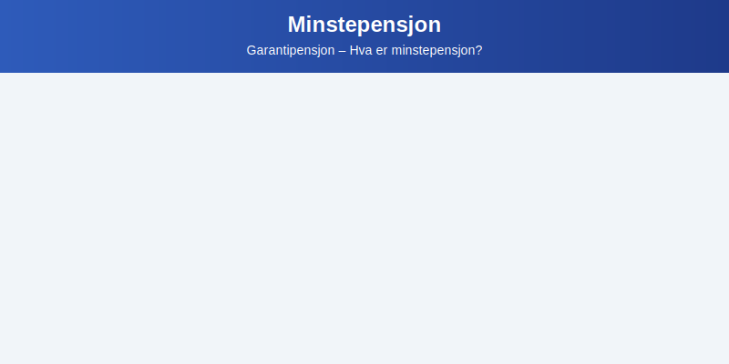

---
title: "Minstepensjon"
meta_title: "Minstepensjon"
meta_description: 'Minstepensjon, ofte omtalt som **garantipensjon**, er en garantert minimumspensjon i [folketrygden](/blogs/regnskap/hva-er-folketrygden "Hva er folketrygden? En...'
slug: minstepensjon
type: blog
layout: pages/single
---

Minstepensjon, ofte omtalt som **garantipensjon**, er en garantert minimumspensjon i [folketrygden](/blogs/regnskap/hva-er-folketrygden "Hva er folketrygden? En introduksjon til Norges offentlige pensjonssystem") for personer med lav eller ingen opptjening.

## Hva er minstepensjon?

Minstepensjon er den delen av folketrygden som sikrer alle et **grunnleggende økonomisk sikkerhetsnett** i alderdommen. Personer som ikke har tilstrekkelig opptjening gjennom arbeidslivet, eller som har lav pensjonspoengopptjening, får utbetalt minstepensjon for å nå et minimumsnivå.

## Hvem har rett til minstepensjon?

Rett til full minstepensjon forutsetter:

* Bosted i Norge i minst 40 år før pensjonsalder.
* Alder på minst 67 år.
* Opptjening under minstekrav, dvs. lave eller ingen pensjonspoeng.

Ved kortere botid reduseres minstepensjonen proporsjonalt med antall år under 40.

## Hvordan beregnes minstepensjon?

Beregningsgrunnlaget for minstepensjon tar utgangspunkt i grunnbeløpet (G) i folketrygden og levealdersjustering:

| Element                     | Beskrivelse                                                                 |
|-----------------------------|-----------------------------------------------------------------------------|
| Grunnbeløpet (G)            | 1 G i 2023 utgjør 111 477 NOK                                                |
| Garantipensjonsprosent      | Prosentandel av G (vanligvis 0,366 av G for full sats)                       |
| Levealdersjustering         | Justeres etter levealdersjusteringstabell                                    |
| Maksimal minstepensjon      | Omtrent 40 825 NOK per år (før levealdersjustering)                         |

## Skatt og regnskapsmessig behandling

Minstepensjon påvirker ikke direkte bedriftens regnskap, men rettigheter og utbetalinger behandles av NAV og regnskapsføres som pensjonskostnad i [pensjonsrapportering](/blogs/regnskap/hva-er-pensjonsrapportering "Hva er pensjonsrapportering? Komplett guide til pensjon i regnskapet") for offentlige pensjonsytelser.

## Se også

* [Hva er pensjon?](/blogs/regnskap/hva-er-pensjon "Hva er pensjon? En oversikt over norsk pensjonssystem") for en helhetlig gjennomgang av alle pensjonssøyler.
* [Obligatorisk tjenestepensjon (OTP)](/blogs/regnskap/obligatorisk-tjenestepensjon "Obligatorisk tjenestepensjon: Regler og regnskapsføring") for bedriftens pensjonsforpliktelser.
* [Individuell pensjonssparing](/blogs/regnskap/hva-er-individuell-pensjonssparing "Hva er individuell pensjonssparing? IPS og andre spareformer") for privat sparing i tredje søyle.

