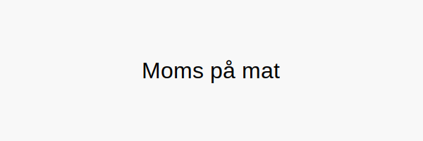

**Moms på mat** er et komplekst tema innen norsk **merverdiavgift (MVA)**, der ulike typer matvarer og serveringstjenester har forskjellige satser, unntak og spesielle regler. Denne artikkelen gir deg en grundig gjennomgang av:

* **Dagligvarer** i butikk (mat og drikke til hjemmebruk)
* **Serveringsmat** og kantinetjenester
* **Barnemat** og spesialprodukter
* **Unntak og fritak** for enkelte varer

## 1. MVA-satser for matvarer

| **Kategori**                 | **MVA-sats** | **Eksempler**                             |
|------------------------------|--------------|-------------------------------------------|
| **Dagligvarer**              | 15%          | Brød, melk, ost, frukt, grønnsaker        |
| **Serveringsmat & Kantine** | 25%          | Restaurant-, kiosk- og kantinemat         |
| **Barnemat (baby)**          | 15%          | Babymat på glass og pulver                |
| **Fisk & sjømat (eksport)**   | 0%           | Fersk fisk til eksport, fiskeindustrien   |

## 2. Definisjoner og eksempler

**Dagligvarer** omfatter mat og drikke som konsumeres hjemme. Dette er typisk *næringsmidler* som selges i dagligvarebutikker og supermarkeder.

**Serveringsmat** dekker tjenester der maten konsumeres på stedet eller som takeaway, inkludert kafé, restaurant, kantine og foodtruck.

**Barnemat** (spesialprodukter for små barn) behandles som dagligvarer med 15% sats, selv om de ofte selges i apotek og helsekostbutikker.

**Fisk og sjømat** som eksporteres fra Norge har nullsats (0%) og krever dokumentasjon for å oppnå fritak.

## 3. Unntak og fritak

Noen matvarer og relaterte produkter er unntatt MVA eller har **nullsats**:

* **Medisinsk ernæring** til sykehus og helseinstitusjoner
* **Dyrefôr** og pelsdyrfôr
* **Kosttilskudd** og visse helseprodukter

For en fullstendig oversikt over varer og tjenester som er unntatt MVA, se [Unntatt MVA](/blogs/regnskap/unntatt-mva "Unntatt MVA").

## 4. Praktiske råd

1. **Kontroller MVA-satsen** på leverandørfaktura (sørg for at satsen er korrekt merket).
2. **Bruk egne regnskapskontoer** for ulike matvarekategorier (se [Konto 2702](/blogs/kontoplan/2702-utgaende-merverdiavgift-middels-sats "Konto 2702 - Utgående merverdiavgift middels sats")).
3. **Ta vare på dokumentasjon** ved eksport (fraktdokumenter og tollkvitteringer).
4. **Følg opp regelverk** for kantinedrift og servering, da disse kan endres.

## 5. Videre lesning

Se også vår hovedartikkel om [merverdiavgift i Norge](/blogs/regnskap/hva-er-moms-mva "Hva er Moms (MVA)? Komplett Guide til Merverdiavgift i Norge") for en helhetlig innføring i MVA-regler.
