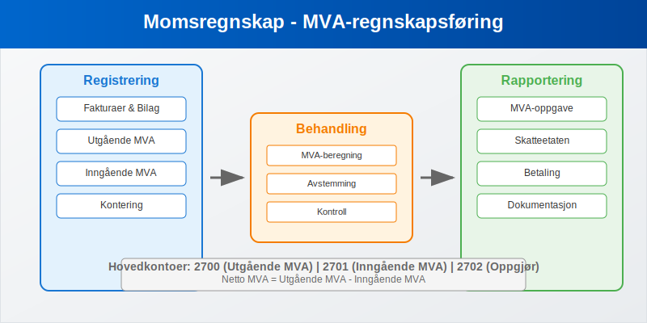
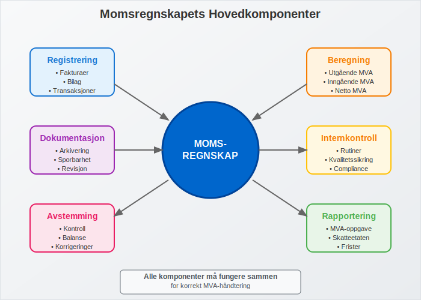
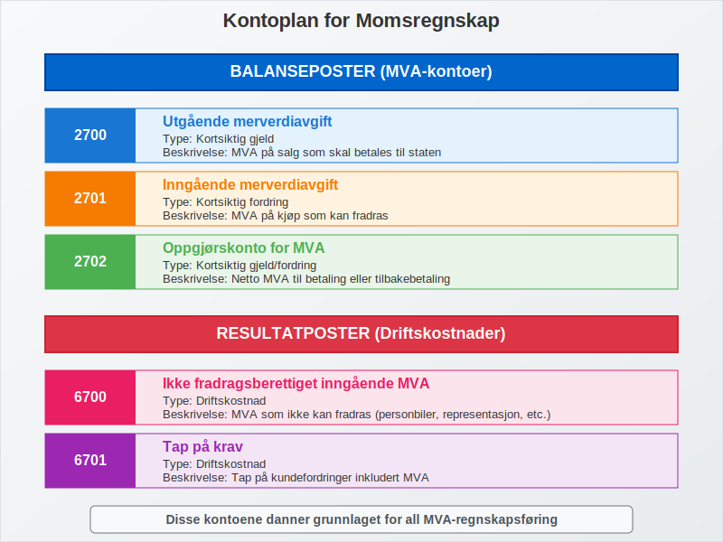
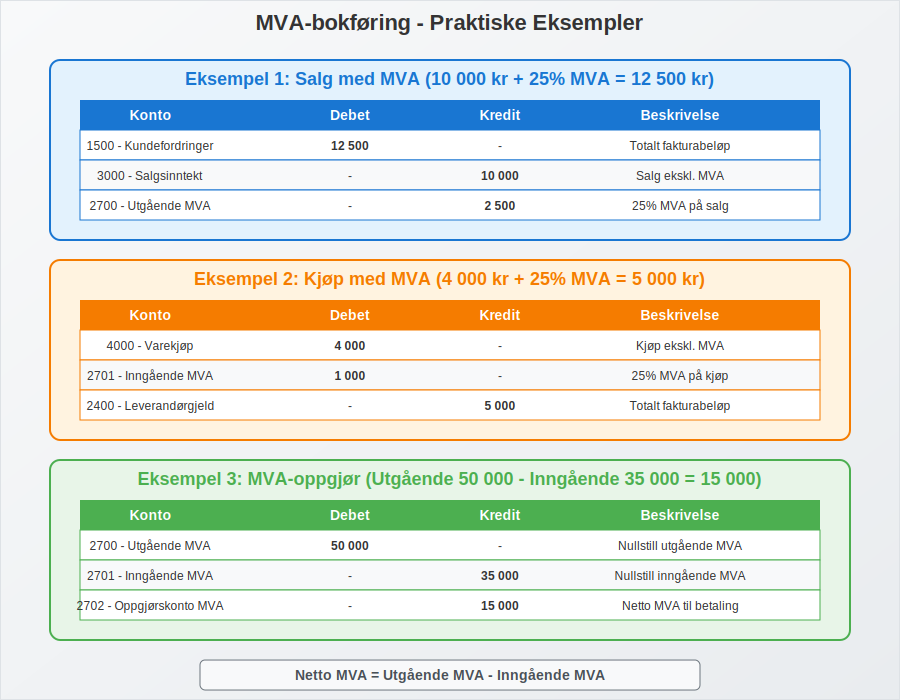
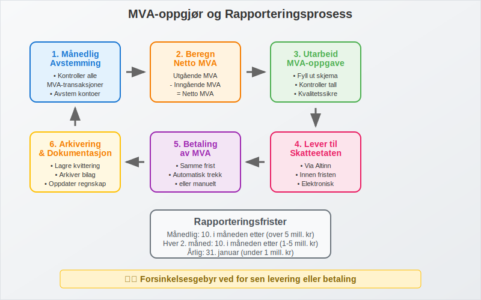
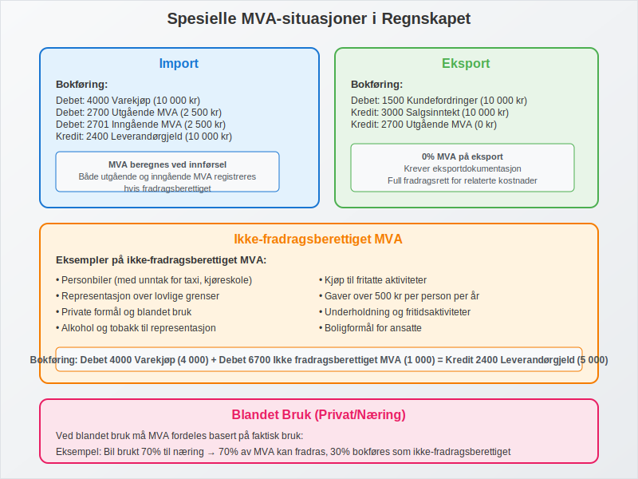
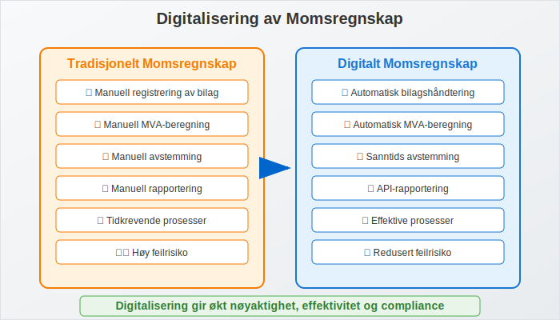
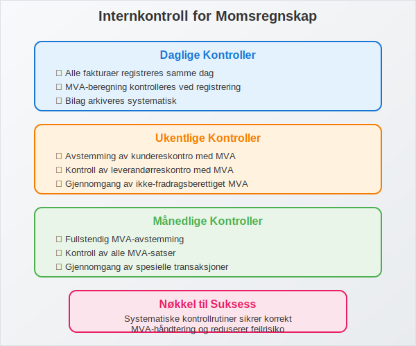
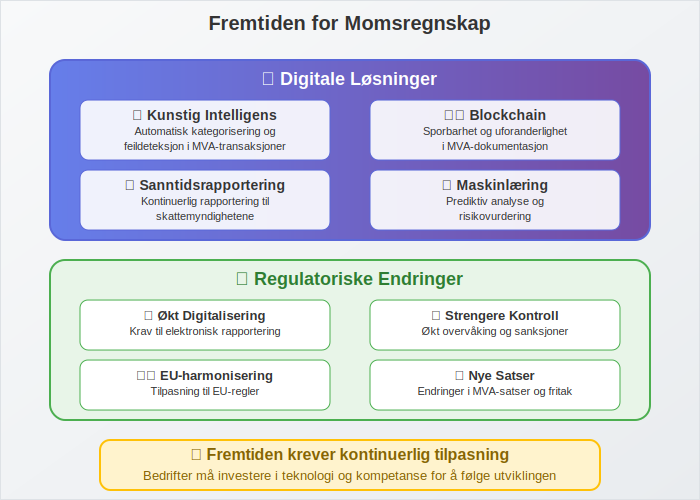

---
title: "Momsregnskap - Komplett Guide til MVA-regnskapsføring"
meta_title: "Momsregnskap - Komplett Guide til MVA-regnskapsføring"
meta_description: '**Momsregnskap** er det systematiske arbeidet med å registrere, beregne og rapportere merverdiavgift (MVA) i bedriftens [regnskap](/blogs/regnskap/hva-er-regns...'
slug: momsregnskap
type: blog
layout: pages/single
---

**Momsregnskap** er det systematiske arbeidet med å registrere, beregne og rapportere merverdiavgift (MVA) i bedriftens [regnskap](/blogs/regnskap/hva-er-regnskap "Hva er Regnskap? En komplett guide"). Dette er en kritisk del av [regnskapsføringen](/blogs/regnskap/hva-er-bokforing "Hva er Bokføring? Komplett Guide til Regnskapsføring") som krever nøyaktighet og forståelse av komplekse MVA-regler.

For en grundig innføring i [Merverdiavgift](/blogs/regnskap/merverdiavgift "Merverdiavgift: Komplett Guide til MVA i Norge"), se vår detaljerte guide til MVA.
For en omfattende gjennomgang av moms (MVA) i Norge, se [Hva er Moms (MVA)?](/blogs/regnskap/hva-er-moms-mva "Hva er Moms? Komplett Guide til Merverdiavgift (MVA) i Norge").



### Hva er Momsregnskap?

Momsregnskap omfatter alle **regnskapsrutiner** knyttet til håndtering av merverdiavgift, inkludert:

- **Registrering** av alle MVA-transaksjoner
- **Beregning** av utgående og inngående MVA
- **Rapportering** til Skatteetaten
- **Avstemming** av MVA-kontoer
- **Dokumentasjon** av alle MVA-relaterte [bilag](/blogs/regnskap/hva-er-bilag "Hva er Bilag i Regnskap? Komplett Guide til Regnskapsbilag")

Momsregnskapet må følge [bokføringsloven](/blogs/regnskap/hva-er-bokforingsloven "Hva er Bokføringsloven? Regler og Krav til Regnskapsføring") og [god regnskapsskikk](/blogs/regnskap/god-regnskapsskikk "God Regnskapsskikk: Prinsipper og Retningslinjer for Norsk Regnskap"), og er underlagt [avgiftsplikten](/blogs/regnskap/hva-er-avgiftsplikt-mva "Hva er Avgiftsplikt (MVA)? Komplett Guide til Merverdiavgift i Norge") som gjelder for de fleste bedrifter.



### Kontoplan for Momsregnskap

#### Balanseposter (MVA-kontoer)

| Kontonummer | Kontonavn | Type | Beskrivelse |
|-------------|-----------|------|-------------|
| **2700** | Utgående merverdiavgift | Kortsiktig gjeld | MVA på salg som skal betales |
| **2701** | Inngående merverdiavgift | Kortsiktig fordring | MVA på kjøp som kan fradras |
| **2702** | Oppgjørskonto for MVA | Kortsiktig gjeld/fordring | Netto MVA til betaling/tilbakebetaling |

#### Resultatposter (Driftskostnader)

| Kontonummer | Kontonavn | Beskrivelse |
|-------------|-----------|-------------|
| **6700** | Ikke fradragsberettiget inngående MVA | MVA som ikke kan fradras |
| **6701** | Tap på krav | Tap på [kundefordringer](/blogs/regnskap/hva-er-kundefordring "Hva er Kundefordring? Regnskapsføring og Håndtering av Utestående Fakturaer") inkl. MVA |
| **6702** | MVA-korrigeringer | Justeringer og korrigeringer |



### Bokføring av MVA-transaksjoner

#### Salg med MVA (Utgående MVA)

**Eksempel:** Salg for 10 000 kr + 25% MVA = 12 500 kr

| Konto | Debet | Kredit | Beskrivelse |
|-------|-------|--------|-------------|
| 1500 - [Kundefordringer](/blogs/regnskap/hva-er-kundefordring "Hva er Kundefordring? Regnskapsføring og Håndtering av Utestående Fakturaer") | 12 500 | | Totalt fakturabeløp |
| 3000 - Salgsinntekt | | 10 000 | Salg ekskl. MVA |
| 2700 - Utgående MVA | | 2 500 | 25% MVA på salg |

#### Kjøp med MVA (Inngående MVA)

**Eksempel:** Kjøp for 4 000 kr + 25% MVA = 5 000 kr

| Konto | Debet | Kredit | Beskrivelse |
|-------|-------|--------|-------------|
| 4000 - Varekjøp | 4 000 | | Kjøp ekskl. MVA |
| 2701 - Inngående MVA | 1 000 | | 25% MVA på kjøp |
| 2400 - [Leverandørgjeld](/blogs/regnskap/hva-er-leverandorgjeld "Hva er Leverandørgjeld? Regnskapsføring og Håndtering av Leverandørfakturaer") | | 5 000 | Totalt fakturabeløp |



### MVA-oppgjør og Rapportering

#### Beregning av Netto MVA

```
Netto MVA = Utgående MVA - Inngående MVA
```

**Eksempel på MVA-oppgjør:**

| Beskrivelse | Beløp |
|-------------|-------|
| **Utgående MVA** (salg) | 50 000 kr |
| **Inngående MVA** (kjøp) | 35 000 kr |
| **Netto MVA til betaling** | 15 000 kr |

#### Bokføring av MVA-oppgjør

**Ved positivt oppgjør (betaling til staten):**

| Konto | Debet | Kredit |
|-------|-------|--------|
| 2700 - Utgående MVA | 50 000 | |
| 2701 - Inngående MVA | | 35 000 |
| 2702 - Oppgjørskonto MVA | | 15 000 |

**Ved betaling:**

| Konto | Debet | Kredit |
|-------|-------|--------|
| 2702 - Oppgjørskonto MVA | 15 000 | |
| 1900 - [Bankinnskudd](/blogs/regnskap/hva-er-bankinnskudd "Hva er Bankinnskudd? Regnskapsføring og Håndtering av Banktransaksjoner") | | 15 000 |



### Rapporteringsperioder og Frister

#### Rapporteringsfrekvens

| Ã…rlig omsetning | Rapporteringsperiode | Leveringsfrist |
|-----------------|---------------------|----------------|
| **Under 1 mill. kr** | Ã…rlig | 31. januar |
| **1-5 mill. kr** | Hver 2. måned | 10. i måneden etter |
| **Over 5 mill. kr** | Månedlig | 10. i måneden etter |
| **Over 17 mill. kr** | Månedlig | 10. i måneden etter |

#### Praktisk Rapporteringsrutine

1. **MÃ¥nedlig avstemming** av MVA-kontoer
2. **Kontroll** av alle [bilag](/blogs/regnskap/hva-er-bilag "Hva er Bilag i Regnskap? Komplett Guide til Regnskapsbilag") og registreringer
3. **Utarbeidelse** av MVA-oppgave
4. **Levering** via Altinn eller regnskapssystem
5. **Betaling** innen fristen
6. **Arkivering** av dokumentasjon

### Spesielle MVA-situasjoner i Regnskapet

#### Import og Eksport

**Import:**
- MVA beregnes ved innførsel
- Bokføres som både utgående og inngående MVA
- Krever spesiell dokumentasjon

**Eksempel importbokføring:**

| Konto | Debet | Kredit | Beskrivelse |
|-------|-------|--------|-------------|
| 4000 - Varekjøp | 10 000 | | Importerte varer |
| 2700 - Utgående MVA | 2 500 | | MVA ved import |
| 2701 - Inngående MVA | 2 500 | | Fradragsberettiget MVA |
| 2400 - Leverandørgjeld | | 10 000 | Skyldig leverandør |

**Eksport:**
- 0% MVA på eksport
- Krever eksportdokumentasjon
- Full fradragsrett for relaterte kostnader

#### Ikke-fradragsberettiget MVA

Visse kjøp gir ikke rett til MVA-fradrag:

- **Personbiler** (med unntak)
- **Representasjon** over grenser
- **Private formål**
- **Fritatte aktiviteter**

**Bokføring av ikke-fradragsberettiget MVA:**

| Konto | Debet | Kredit |
|-------|-------|--------|
| 4000 - Varekjøp | 4 000 | |
| 6700 - Ikke fradragsberettiget MVA | 1 000 | |
| 2400 - Leverandørgjeld | | 5 000 |



### Kontroll og Avstemming

#### MÃ¥nedlig MVA-avstemming

**Kontrollpunkter:**

1. **Balanse på MVA-kontoer** stemmer med rapporterte tall
2. **Alle fakturaer** er korrekt registrert
3. **MVA-satser** er riktig anvendt
4. **Fradragsrett** er korrekt vurdert
5. **Dokumentasjon** er komplett

#### Ã…rsavstemminger

- **Sammenligning** med MVA-oppgaver
- **Kontroll** av [Ã¥rsregnskap](/blogs/regnskap/hva-er-regnskap "Hva er Regnskap? En komplett guide") mot MVA-rapporter
- **Justering** av eventuelle avvik
- **Dokumentasjon** av alle korrigeringer

### Digitalisering av Momsregnskap

#### ERP-systemer og Automatisering

Moderne [ERP-systemer](/blogs/regnskap/hva-er-erp-system "Hva er ERP-system? Komplett Guide til Enterprise Resource Planning") tilbyr:

- **Automatisk MVA-beregning** på alle transaksjoner
- **Integrert rapportering** til Skatteetaten
- **Sanntids avstemming** av MVA-kontoer
- **Automatisk [bilagshåndtering](/blogs/regnskap/hva-er-bilagsforing "Hva er Bilagsføring? Komplett Guide til Registrering av Regnskapsbilag")**

#### [API-integrasjon](/blogs/regnskap/api-integrasjon-automatisering-regnskap "API-integrasjon og Automatisering i Regnskap: Moderne Løsninger for Effektiv Regnskapsføring") med Skatteetaten

- **Direkte rapportering** fra regnskapssystem
- **Automatisk validering** av MVA-oppgaver
- **Redusert feilrisiko** og administrativt arbeid
- **Raskere behandling** og tilbakemelding



### Vanlige Feil i Momsregnskap

#### Typiske Feilkilder

1. **Feil MVA-sats** på varer og tjenester
2. **Manglende registrering** av inngående MVA
3. **Feil periodisering** av MVA-transaksjoner
4. **Ukorrekt fradragsvurdering** for blandede formål
5. **Manglende dokumentasjon** for eksport/import

#### Konsekvenser av Feil

- **[Forsinkelsesgebyr](/blogs/regnskap/hva-er-forsinkelsesgebyr "Hva er Forsinkelsesgebyr? Regler og Beregning av Gebyrer ved Forsinket Betaling")** ved for sen rapportering
- **Tilleggsskatt** ved feil i MVA-oppgaver
- **Rentekostnader** på for lite betalt MVA
- **Revisjonsmerknader** i [Ã¥rsregnskapet](/blogs/regnskap/hva-er-regnskap "Hva er Regnskap? En komplett guide")

### Internkontroll for Momsregnskap

#### Kontrollrutiner

**Daglige kontroller:**
- Alle [fakturaer](/blogs/regnskap/hva-er-en-faktura "Hva er en Faktura? En Guide til Norske Fakturakrav") registreres samme dag
- MVA-beregning kontrolleres ved registrering
- [Bilag](/blogs/regnskap/hva-er-bilag "Hva er Bilag i Regnskap? Komplett Guide til Regnskapsbilag") arkiveres systematisk

**Ukentlige kontroller:**
- Avstemming av [kundereskontro](/blogs/regnskap/hva-er-kundereskontro "Hva er Kundereskontro? Komplett Guide til Kundefordringer og Oppfølging") med MVA
- Kontroll av [leverandørreskontro](/blogs/regnskap/hva-er-leverandorreskontro "Hva er Leverandørreskontro? Håndtering av Leverandørgjeld og Betalinger") med MVA
- Gjennomgang av ikke-fradragsberettiget MVA

**MÃ¥nedlige kontroller:**
- Fullstendig MVA-avstemming
- Kontroll av alle MVA-satser
- Gjennomgang av spesielle transaksjoner



### Revisjon og Momsregnskap

#### Revisorens Kontroll

Revisor vil typisk kontrollere:

- **Korrekthet** i MVA-beregninger
- **Fullstendighet** i registreringer
- **Dokumentasjon** av alle transaksjoner
- **Samsvar** mellom regnskap og MVA-oppgaver
- **[Internkontroll](/blogs/regnskap/hva-er-internkontroll "Hva er Internkontroll? Systemer og Rutiner for Økonomisk Kontroll")** for MVA-håndtering

#### Revisjonshandlinger

1. **Analytisk gjennomgang** av MVA-utviklingen
2. **Detaljkontroll** av utvalgte transaksjoner
3. **Avstemming** mot offentlige registre
4. **Kontroll** av beregninger og satser
5. **Vurdering** av regnskapsestimater

### Fremtidige Utviklingstrekk

#### Digitale Løsninger

- **Kunstig intelligens** for automatisk kategorisering
- **Maskinlæring** for feildeteksjon
- **Blockchain** for sporbarhet og kontroll
- **Sanntidsrapportering** til myndighetene

#### Regulatoriske Endringer

- **Økt digitalisering** av rapporteringskrav
- **Strengere kontroll** og sanksjoner
- **Harmonisering** med EU-regler
- **Nye MVA-satser** og fritak



### Praktiske Tips for Momsregnskap

#### Beste Praksis

1. **Implementer robuste rutiner** for daglig registrering
2. **Bruk moderne regnskapssystemer** med MVA-automatikk
3. **Utfør regelmessige avstemminger** og kontroller
4. **Hold deg oppdatert** på regelverksendringer
5. **Invester i kompetanse** og opplæring

#### Ressurser og Verktøy

- **Skatteetatens veiledere** og rundskriv
- **Regnskapsstandarder** og tolkningsuttalelser
- **Faglige nettverk** og kursvirksomhet
- **Digitale verktøy** for beregning og kontroll

#### Når Søke Profesjonell Hjelp

Kontakt [regnskapsfører](/blogs/regnskap/hva-er-en-regnskapsforer "Hva er en Regnskapsfører? Komplett Guide til Regnskapsføring") eller revisor ved:

- **Komplekse MVA-situasjoner**
- **Usikkerhet om regelverket**
- **Feil i tidligere rapportering**
- **Implementering av nye systemer**
- **Forberedelse til revisjon**

Momsregnskap er en kritisk del av enhver bedrifts økonomistyring. Med riktige rutiner, systemer og kompetanse kan bedrifter sikre korrekt håndtering av MVA og unngå kostbare feil og sanksjoner.


