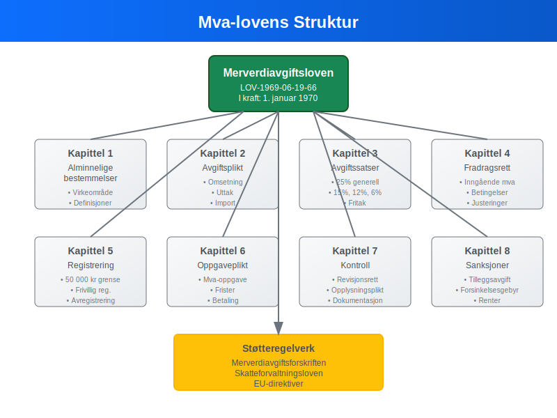
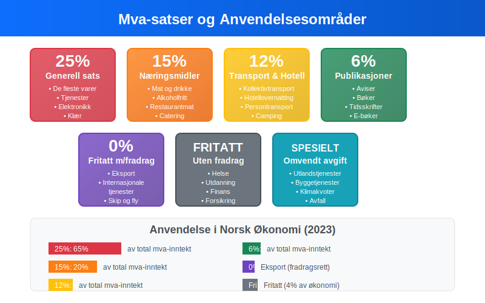
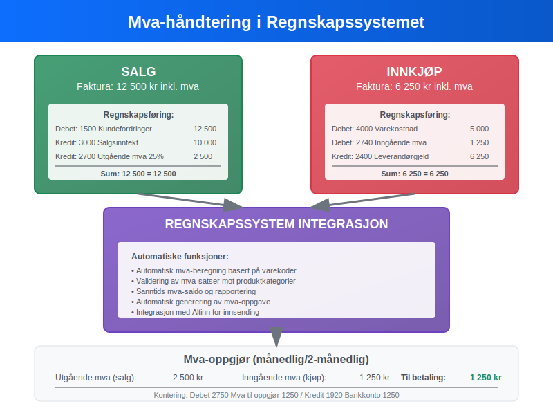
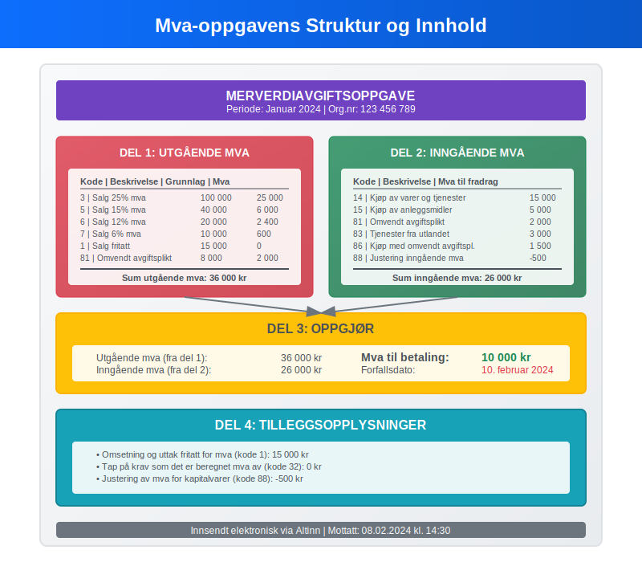
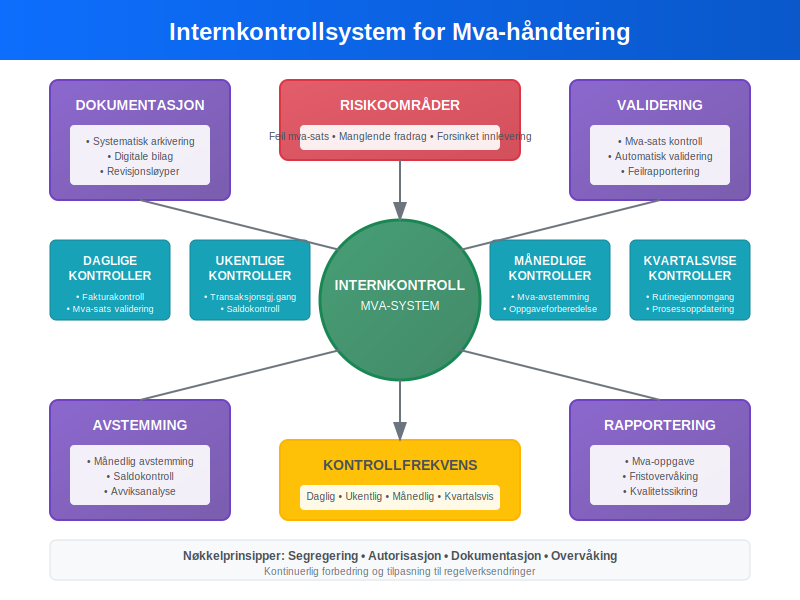
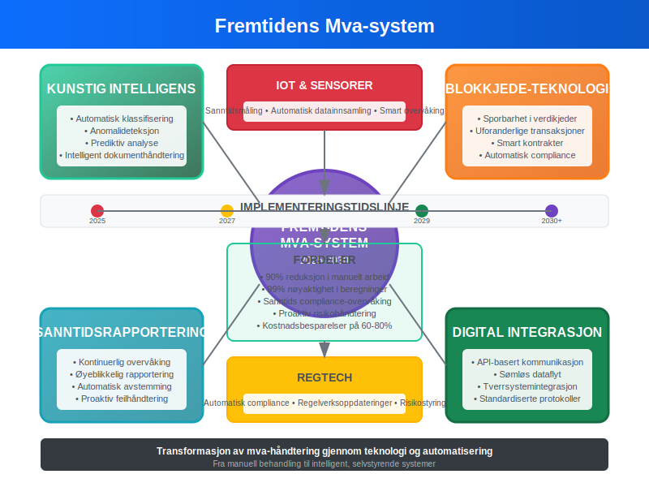

---
title: "Mva-loven"
seoTitle: "Mva-loven"
meta_description: '**Mva-loven** (merverdiavgiftsloven) er det sentrale regelverket som regulerer merverdiavgift i Norge. Loven fastsetter reglene for når bedrifter må registrer...'
slug: mva-loven
type: blog
layout: pages/single
---

**Mva-loven** (merverdiavgiftsloven) er det sentrale regelverket som regulerer merverdiavgift i Norge. Loven fastsetter reglene for når bedrifter må registrere seg i Merverdiavgiftsregisteret, hvilke satser som gjelder, og hvordan [merverdiavgift skal håndteres i regnskapet](/blogs/regnskap/hva-er-bokforing "Hva er Bokføring? Komplett Guide til Regnskapsføring og Bokføringsregler"). For norske bedrifter er forståelse av mva-loven essensielt for korrekt [regnskapsføring](/blogs/regnskap/hva-er-regnskap "Hva er Regnskap? Komplett Guide til Regnskapsføring og Finansiell Rapportering") og unngåelse av sanksjoner.

For en grundig innføring i [Merverdiavgift](/blogs/regnskap/merverdiavgift "Merverdiavgift: Komplett Guide til MVA i Norge"), se vår omfattende guide.

Mva-loven påvirker alle aspekter av bedriftens økonomi, fra [fakturering](/blogs/regnskap/hva-er-en-faktura "Hva er en Faktura? En Guide til Norske Fakturakrav") til [årsregnskap](/blogs/regnskap/hva-er-finansregnskap "Hva er Finansregnskap? Komplett Guide til Eksternregnskap og Årsregnskap"), og krever systematisk håndtering i bedriftens [internkontroll](/blogs/regnskap/hva-er-internkontroll "Hva er Internkontroll? Komplett Guide til Internkontrollsystemer").

## Seksjon 1: Grunnleggende om Mva-loven

Merverdiavgiftsloven trådte i kraft 1. januar 1970 og har siden gjennomgått flere revisjoner for å tilpasse seg EU-direktiver og moderne forretningspraksis.



### Lovens Formål og Virkeområde

**Mva-loven** har som hovedformål å sikre statens inntekter gjennom en generell forbruksavgift som pålegges omsetning av varer og tjenester. Loven gjelder for:

* Omsetning av varer og tjenester i Norge
* Uttak av varer og tjenester fra virksomheten
* Innførsel av varer til Norge
* Kjøp av varer og tjenester fra utlandet (omvendt avgiftsplikt)

### Registreringsplikt

Bedrifter må registrere seg i Merverdiavgiftsregisteret når omsetningen overstiger **50 000 kroner** i løpet av 12 måneder. Dette gjelder både:

* **Frivillig registrering:** Bedrifter under grensen kan velge å registrere seg
* **Obligatorisk registrering:** Bedrifter over grensen må registrere seg innen en måned

Registreringen påvirker direkte hvordan [leverandørgjeld](/blogs/regnskap/hva-er-leverandorgjeld "Hva er Leverandørgjeld? Komplett Guide til Kreditorhåndtering") og [kundefordringer](/blogs/regnskap/hva-er-kundefordring "Hva er Kundefordring? Komplett Guide til Debitorhåndtering") skal behandles i regnskapet.

## Seksjon 2: Mva-satser og Beregning

Norge opererer med et differensiert mva-system med ulike satser avhengig av vare- eller tjenestetype.



### Gjeldende Mva-satser

| Mva-sats | Anvendelsesområde | Eksempler |
|----------|-------------------|-----------|
| **25%** | Generell sats | De fleste varer og tjenester |
| **15%** | Næringsmidler | Mat, alkoholfrie drikkevarer |
| **12%** | Transport og overnatting | Kollektivtransport, hotell |
| **6%** | Trykte publikasjoner | Aviser, bøker, tidsskrifter |
| **0%** | Fritatt med fradragsrett | Eksport, internasjonale tjenester |
| **Fritatt** | Fritatt uten fradragsrett | Helse, utdanning, finans |

### Beregning av Utgående Mva

Utgående mva beregnes på grunnlag av **vederlag eksklusiv mva**:

```
Utgående mva = Vederlag × (Mva-sats / 100)
Totalt vederlag = Vederlag + Utgående mva
```

**Eksempel på beregning:**
* Salg av tjeneste: 10 000 kr ekskl. mva
* Mva-sats: 25%
* Utgående mva: 10 000 × 0,25 = 2 500 kr
* Totalt fakturabeløp: 12 500 kr

### Inngående Mva og Fradragsrett

Bedrifter med **fradragsrett** kan trekke fra mva på innkjøp som brukes i avgiftspliktig virksomhet:

* **Full fradragsrett:** For innkjøp utelukkende til avgiftspliktig virksomhet
* **Delvis fradragsrett:** Ved blandet anvendelse (avgiftspliktig og fritatt virksomhet)
* **Ingen fradragsrett:** For innkjøp til fritatt virksomhet eller private formål

## Seksjon 3: Regnskapsmessig Behandling

Mva-håndtering krever systematisk [bilagsføring](/blogs/regnskap/hva-er-bilagsforing "Hva er Bilagsføring? Komplett Guide til Bilagsbehandling og Dokumentasjon") og korrekt [kontering](/blogs/regnskap/hva-er-kontering "Hva er Kontering? Komplett Guide til Regnskapskontering og Bilagsbehandling") i henhold til [kontoplanen](/blogs/regnskap/hva-er-kontoplan "Hva er Kontoplan? Komplett Guide til Regnskapskontoer og Kontostruktur").



### Kontostruktur for Mva

Standard kontoplan for mva-håndtering:

| Kontonummer | Kontobeskrivelse | Type |
|-------------|------------------|------|
| **2700** | Utgående merverdiavgift høy sats (25%) | Gjeldskonto |
| **2701** | Utgående merverdiavgift middels sats (15%) | Gjeldskonto |
| **2702** | Utgående merverdiavgift lav sats (12%) | Gjeldskonto |
| **2703** | Utgående merverdiavgift særskilt sats (6%) | Gjeldskonto |
| **2740** | Inngående merverdiavgift | Fordringskonto |
| **2750** | Merverdiavgift til oppgjør | Gjeldskonto |

### Bokføring av Salg med Mva

Ved salg på 12 500 kr inkl. 25% mva:

```
Debet: Kundefordringer    12 500 kr
Kredit: Salgsinntekt      10 000 kr
Kredit: Utgående mva 25%   2 500 kr
```

### Bokføring av Innkjøp med Mva

Ved innkjøp på 6 250 kr inkl. 25% mva:

```
Debet: Varekostnad         5 000 kr
Debet: Inngående mva       1 250 kr
Kredit: Leverandørgjeld    6 250 kr
```

## Seksjon 4: Mva-oppgave og Rapportering

Mva-registrerte bedrifter må levere **mva-oppgave** til Skatteetaten med jevne mellomrom, avhengig av omsetningens størrelse.

### Rapporteringsperioder

| Omsetning (årlig) | Rapporteringsperiode | Frist |
|-------------------|---------------------|-------|
| Under 1 million kr | Årlig | 31. januar |
| 1-5 millioner kr | Hver 2. måned | 10. i måneden etter |
| Over 5 millioner kr | Månedlig | 10. i måneden etter |

### Innhold i Mva-oppgaven

Mva-oppgaven skal inneholde:

* **Utgående mva** fordelt på satser og koder
* **Inngående mva** som kan fradras
* **Netto mva til betaling** eller tilgode
* **Grunnlag** for beregningene
* **Spesielle poster** som omvendt avgiftsplikt



### Automatisering av Mva-rapportering

Moderne [ERP-systemer](/blogs/regnskap/hva-er-erp-system "Hva er ERP-system? Enterprise Resource Planning for Bedrifter") kan automatisere mva-rapportering:

* **Automatisk kategorisering** av transaksjoner etter mva-koder
* **Sanntidsoppfølging** av mva-saldo
* **Direkte innsending** til Altinn via [API-integrasjon](/blogs/regnskap/api-integrasjon-automatisering-regnskap "API-integrasjon og Automatisering i Regnskap")
* **Avstemming** mot [hovedbok](/blogs/regnskap/hva-er-hovedbok "Hva er Hovedbok? Komplett Guide til Hovedbokføring og Regnskapsoppfølging")

## Seksjon 5: Spesielle Mva-regler

Mva-loven inneholder flere spesialbestemmelser som påvirker regnskapsbehandlingen.

### Omvendt Avgiftsplikt

Ved kjøp av tjenester fra utlandet plikter norske bedrifter å beregne og betale mva selv:

```
Debet: Tjenestekostnad     10 000 kr
Debet: Inngående mva       2 500 kr
Kredit: Utgående mva      2 500 kr
Kredit: Leverandørgjeld   10 000 kr
```

### Justering av Inngående Mva

Ved endret anvendelse av [anleggsmidler](/blogs/regnskap/hva-er-anleggsmidler "Hva er Anleggsmidler? Komplett Guide til Varige Driftsmidler") kan det oppstå justeringsplikt:

* **5-årsregelen:** For fast eiendom og skip
* **Forholdsmessig justering:** Ved endret fradragsrett (se [Forholdsmessig MVA](/blogs/regnskap/forholdsmessig-mva "Forholdsmessig MVA"))
* **Tilbakeføring:** Ved salg eller uttak til private formål

### Mva ved Uttak

Uttak av varer eller tjenester til private formål utløser mva-plikt:

* **Vareutttak:** Til markedsverdi
* **Tjenesteuttak:** Til kostpris eller markedsverdi
* **Representasjon:** Over fastsatte grenser

## Seksjon 6: Internkontroll og Compliance

Effektiv mva-håndtering krever robust internkontroll og systematiske kontrollrutiner.



### Kontrollrutiner for Mva

**Månedlige kontroller:**
* Avstemming av mva-kontoer mot [saldobalanse](/blogs/regnskap/hva-er-saldobalanse "Hva er Saldobalanse? Komplett Guide til Saldooppstilling og Regnskapsbalanse")
* Kontroll av mva-satser på [fakturaer](/blogs/regnskap/hva-er-en-faktura "Hva er en Faktura? En Guide til Norske Fakturakrav")
* Gjennomgang av omvendt avgiftsplikt-transaksjoner
* Kontroll av [bilag](/blogs/regnskap/hva-er-bilag "Hva er Bilag? Komplett Guide til Regnskapsbilag og Dokumentasjon") og dokumentasjon

**Kvartalsvise kontroller:**
* Analyse av mva-saldo og avvik
* Kontroll av fradragsrett og justeringer
* Gjennomgang av spesielle mva-transaksjoner
* Oppdatering av mva-rutiner og prosedyrer

### Dokumentasjonskrav

Mva-loven stiller strenge krav til dokumentasjon:

* **Fakturaer:** Må inneholde alle påkrevde opplysninger
* **Regnskapsbilag:** Systematisk arkivering i 10 år
* **Mva-oppgaver:** Oppbevaring med underliggende dokumentasjon
* **Korrespondanse:** Med Skatteetaten og rådgivere

## Seksjon 7: Sanksjoner og Konsekvenser

Brudd på mva-loven kan medføre betydelige økonomiske konsekvenser for bedrifter.

### Typer Sanksjoner

| Overtredelse | Sanksjon | Beløp/Prosent |
|--------------|----------|---------------|
| **Forsinket innlevering** | Forsinkelsesgebyr | 1% per påbegynt måned |
| **Uriktig oppgave** | Tilleggsavgift | 20% av beløpet |
| **Grov uaktsomhet** | Tilleggsavgift | 40% av beløpet |
| **Forsett** | Tilleggsavgift | 60% av beløpet |

### Regnskapsmessig Behandling av Sanksjoner

Mva-sanksjoner skal behandles som [kostnader](/blogs/regnskap/hva-er-kostnader "Hva er Kostnader? Komplett Guide til Kostnadsbegreper og Kostnadsføring") i regnskapet:

```
Debet: Forsinkelsesgebyr mva    500 kr
Kredit: Leverandørgjeld        500 kr
```

Sanksjoner er **ikke fradragsberettiget** i skatteregnskapet og må reverseres ved [skatteavstemmingen](/blogs/regnskap/hva-er-forskuddstrekk "Hva er Forskuddstrekk? Komplett Guide til Trekk og Skatteberegning").

## Seksjon 8: Digitalisering og Fremtidige Endringer

Mva-området gjennomgår kontinuerlig digitalisering og modernisering.

### E-faktura og Automatisering

Innføring av [e-faktura](/blogs/regnskap/hva-er-efaktura "Hva er E-faktura? Komplett Guide til Elektronisk Fakturering") påvirker mva-håndtering:

* **Strukturerte data:** Automatisk utlesing av mva-informasjon
* **Sanntidsvalidering:** Kontroll av mva-satser og beregninger
* **Integrert bokføring:** Direkte overføring til regnskapssystem
* **Redusert feilrisiko:** Mindre manuell behandling

### Kommende Regelverksendringer

Flere endringer er planlagt i mva-regelverket:

* **EU-harmonisering:** Tilpasning til nye EU-direktiver
* **Digitale tjenester:** Nye regler for grenseoverskridende handel
* **Miljøavgifter:** Integrering med klimarelaterte avgifter
* **Sanntidsrapportering:** Mulig innføring av kontinuerlig rapportering



### Kunstig Intelligens i Mva-håndtering

AI-teknologi kan forbedre mva-compliance:

* **Automatisk klassifisering** av transaksjoner
* **Anomalideteksjon** for å identifisere feil
* **Prediktiv analyse** for mva-planlegging
* **Intelligent dokumenthåndtering** for bilagsbehandling

## Seksjon 9: Praktiske Råd og Best Practice

Effektiv mva-håndtering krever systematisk tilnærming og gode rutiner.

### Implementering av Mva-rutiner

**Oppstartsfase:**
1. **Kartlegging:** Identifiser alle mva-relevante transaksjoner
2. **Systemoppsett:** Konfigurer [regnskapssystem](/blogs/regnskap/hva-er-regnskap "Hva er Regnskap? Komplett Guide til Regnskapsføring og Finansiell Rapportering") for mva-håndtering
3. **Opplæring:** Sikre at personalet forstår mva-reglene
4. **Dokumentasjon:** Etabler klare prosedyrer og rutiner

**Løpende drift:**
* **Daglig:** Kontroll av mva-satser på fakturaer
* **Ukentlig:** Gjennomgang av mva-transaksjoner
* **Månedlig:** Avstemming og forberedelse av mva-oppgave
* **Årlig:** Gjennomgang av rutiner og oppdatering

### Vanlige Feil og Hvordan Unngå Dem

| Feiltype | Konsekvens | Forebyggende tiltak |
|----------|------------|-------------------|
| **Feil mva-sats** | Tilleggsavgift | Automatisk validering |
| **Manglende fradrag** | Tapt refusjon | Systematisk gjennomgang |
| **Feil tidspunkt** | Rentekostnader | Kalenderoppfølging |
| **Manglende dokumentasjon** | Avvist fradrag | Digital arkivering |

### Samarbeid med Rådgivere

Komplekse mva-spørsmål bør håndteres i samarbeid med kvalifiserte rådgivere:

* **Autoriserte regnskapsførere:** For løpende mva-håndtering
* **Revisorer:** For kontroll og kvalitetssikring
* **Skatterådgivere:** For komplekse mva-spørsmål
* **Advokater:** Ved tvister med Skatteetaten

Mva-loven representerer et komplekst, men essensielt regelverk for norske bedrifter. Korrekt håndtering av merverdiavgift krever samme grad av systematikk og nøyaktighet som annen [regnskapsføring](/blogs/regnskap/hva-er-bokforing "Hva er Bokføring? Komplett Guide til Regnskapsføring og Bokføringsregler"), men er avgjørende for å unngå sanksjoner og sikre optimal [kontantstrøm](/blogs/regnskap/hva-er-kontantstrom "Hva er Kontantstrøm? Komplett Guide til Kontantstrømanalyse og Likviditetsstyring").

Moderne digitale verktøy og systematiske rutiner kan betydelig forenkle mva-compliance, mens kontinuerlig oppdatering på regelverksendringer sikrer at bedriften alltid opererer i henhold til gjeldende bestemmelser. For bedrifter som investerer i robust mva-håndtering, blir dette en konkurransefordel gjennom redusert administrativ byrde og økt fokus på kjernevirksomheten.


