---
title: "MVA-plikt (Momsplikt)"
meta_title: "MVA-plikt (Momsplikt)"
meta_description: '**MVA-plikt**, også kalt **momsplikt**, er den juridiske forpliktelsen som pålegger bedrifter og organisasjoner å registrere seg for, beregne, kreve inn og b...'
slug: mva-plikt
type: blog
layout: pages/single
---

**MVA-plikt**, også kalt **momsplikt**, er den juridiske forpliktelsen som pålegger bedrifter og organisasjoner å registrere seg for, beregne, kreve inn og betale merverdiavgift til norske skattemyndigheter. Dette er en sentral del av det norske [skattesystemet](/blogs/regnskap/hva-er-regnskap "Hva er Regnskap? En komplett guide") som sikrer statens inntekter og regulerer økonomisk aktivitet.

For en grunnleggende innføring i selve [Merverdiavgift](/blogs/regnskap/merverdiavgift "Merverdiavgift: Komplett Guide til MVA i Norge"), se vår omfattende guide.

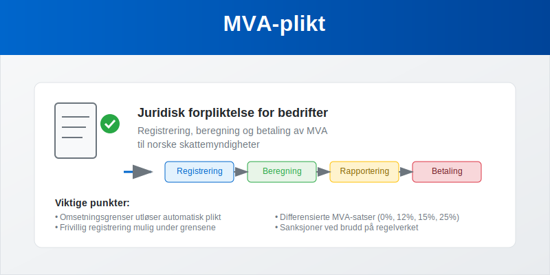

### Hva Innebærer MVA-plikt?

MVA-plikt omfatter flere **juridiske forpliktelser** som virksomheter må oppfylle:

- **Registreringsplikt** når omsetningsgrenser overskrides
- **Beregningsplikt** for korrekt MVA på alle transaksjoner
- **Innkrevingsplikt** fra kunder ved salg
- **Rapporteringsplikt** gjennom periodiske MVA-oppgaver
- **Betalingsplikt** til Skatteetaten innen frister
- **Dokumentasjonsplikt** for alle MVA-relaterte transaksjoner

Denne plikten er **lovpålagt** og regulert gjennom merverdiavgiftsloven, som definerer hvem som er omfattet, hvilke unntak som gjelder, og hvilke konsekvenser brudd på plikten medfører.

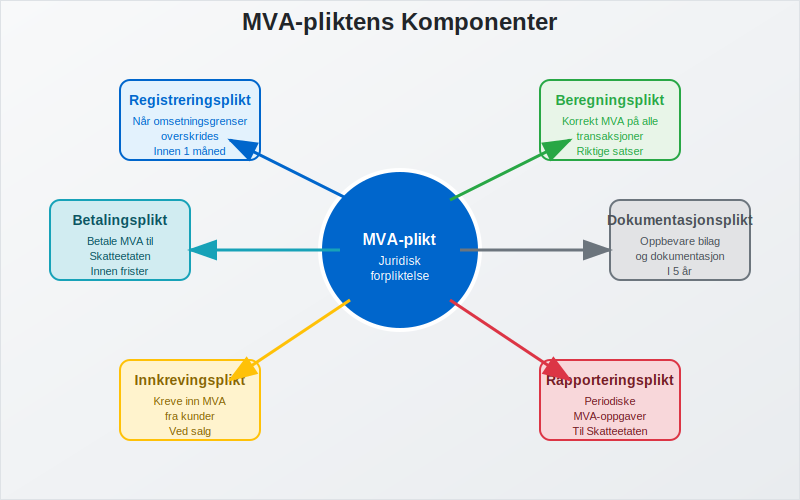

For mer om hvordan **inngående MVA** fordeles når virksomheten har både avgiftspliktige og avgiftsfrie omsetninger, se [Forholdsmessig MVA](/blogs/regnskap/forholdsmessig-mva "Forholdsmessig MVA").

For en nærmere gjennomgang av regler ved videresalg av varer på vegne av andre, se også [Medsalgsplikt](/blogs/regnskap/medsalgsplikt "Hva er Medsalgsplikt? Komplett Guide til Medsalgsplikt og Merverdiavgift").

### Hvem Har MVA-plikt?

#### Automatisk MVA-plikt

Følgende virksomheter får **automatisk MVA-plikt** når de når omsetningsgrensene:

| Virksomhetstype | Omsetningsgrense | Registreringsfrist |
|-----------------|------------------|-------------------|
| **Alminnelig næring** | 50 000 kr | Innen 1 måned |
| [**Primærnæring**](/blogs/regnskap/primarnaring "Hva er primærnæring? Komplett Guide til Primærnæring i Regnskap") | 70 000 kr | Innen 1 måned |
| **[Enkeltpersonforetak](/blogs/regnskap/hva-er-enkeltpersonforetak "Hva er Enkeltpersonforetak? Komplett Guide til Etablering og Drift")** | 50 000 kr | Innen 1 måned |
| **[Aksjeselskap](/blogs/regnskap/hva-er-et-aksjeselskap "Hva er et Aksjeselskap? Komplett Guide til Selskapsformen")** | 50 000 kr | Innen 1 måned |
| **Ideelle organisasjoner** | 140 000 kr | Innen 1 måned |

#### Frivillig MVA-plikt

Virksomheter under omsetningsgrensene kan **velge MVA-plikt** hvis:

- De har betydelige **fradragsberettigede kostnader**
- De planlegger **rask vekst** mot omsetningsgrensen
- De ønsker å **fremstå profesjonelt** overfor kunder
- De handler primært med **andre MVA-registrerte virksomheter**

#### Unntak fra MVA-plikt

Visse aktiviteter er **fritatt** fra MVA-plikt uavhengig av omsetning:

- **Finansielle tjenester** (bank, forsikring, verdipapir)
- **Helse- og sosialtjenester** (leger, tannleger, fysioterapeuter)
- **Undervisning** (skoler, universiteter, kursvirksomhet)
- **Utleie av boliger** til private
- **Ideelle aktiviteter** under visse betingelser

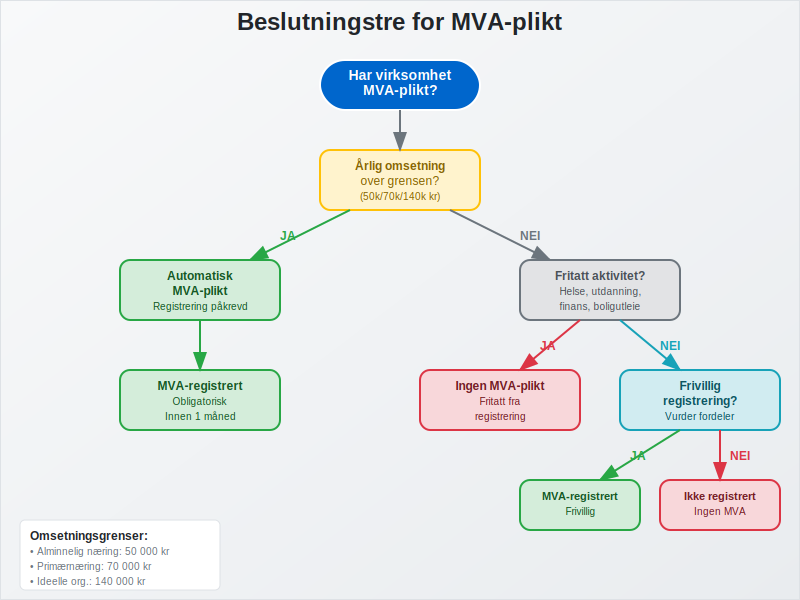

### Registrering for MVA-plikt

#### Registreringsprosessen

**Trinn 1: Vurdering av plikt**
- Beregn **årlig omsetning** basert på siste 12 måneder
- Identifiser **virksomhetstype** og relevant omsetningsgrense
- Vurder om aktiviteten er **MVA-pliktig** eller fritatt

**Trinn 2: Søknad om registrering**
- Søk via **[Altinn](/blogs/regnskap/hva-er-altinn "Hva er Altinn? Digital Kommunikasjon med Offentlige Myndigheter")** eller direkte til Skatteetaten
- Oppgi **organisasjonsnummer** (søk om dette først hvis nødvendig)
- Beskriv **virksomhetens aktiviteter** detaljert
- Angi **forventet omsetning** og MVA-grunnlag

**Trinn 3: Godkjenning og oppstart**
- Motta **MVA-nummer** fra Skatteetaten
- Få tildelt **rapporteringsperiode** basert på omsetning
- Start **MVA-registrering** i regnskapssystemet
- Implementer **rutiner** for MVA-håndtering

#### Nødvendig Dokumentasjon

- **Organisasjonsnummer** eller søknad om dette
- **Firmaattest** fra Brønnøysundregistrene
- **Beskrivelse av virksomheten** og hovedaktiviteter
- **Budsjett** eller prognoser for omsetning
- **Regnskapsopplysninger** hvis virksomheten er etablert
- **Fullmakt** hvis andre søker på vegne av virksomheten

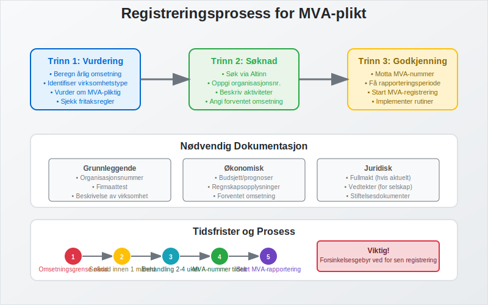

### Beregning og Håndtering av MVA

#### MVA-satser og Anvendelse

Norge opererer med **differensierte MVA-satser** basert på type vare eller tjeneste:

| Sats | Anvendelsesområde | Typiske Eksempler |
|------|------------------|-------------------|
| **25%** | Alminnelig sats | Klær, elektronikk, tjenester |
| **15%** | Næringsmidler | Mat, ikke-alkoholiske drikkevarer |
| **12%** | Redusert sats | Transport, hotell, kino |
| **0%** | Nullsats | Bøker, aviser, eksport |
| **Fritatt** | Ingen MVA | Helse, utdanning, finans |

#### Praktisk MVA-beregning

**Utgående MVA (på salg):**
```
Utgående MVA = Salgspris × MVA-sats ÷ (100 + MVA-sats)
```

**Eksempel med 25% MVA:**
- Salgspris inkl. MVA: 1 250 kr
- Utgående MVA: 1 250 × 25 ÷ 125 = **250 kr**
- Salgspris ekskl. MVA: 1 000 kr

**Inngående MVA (på kjøp):**
```
Inngående MVA = Kjøpspris × MVA-sats ÷ (100 + MVA-sats)
```

**Eksempel med 25% MVA:**
- Kjøpspris inkl. MVA: 625 kr
- Inngående MVA: 625 × 25 ÷ 125 = **125 kr**
- Kjøpspris ekskl. MVA: 500 kr

**Netto MVA til betaling:**
```
Netto MVA = Utgående MVA - Inngående MVA
Eksempel: 250 kr - 125 kr = 125 kr til betaling
```

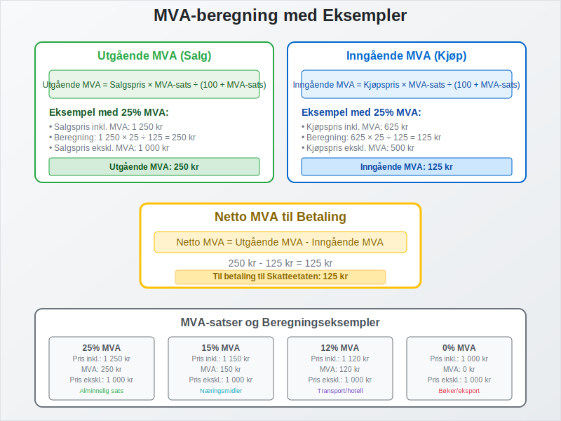

### Fradragsrett og Begrensninger

#### Generelle Fradragsregler

**Full fradragsrett** gjelder for:

- **Råvarer og handelsvarer** til videresalg
- **Driftsmidler** som maskiner, verktøy, inventar
- **Tjenester** til virksomheten (regnskap, juridisk, markedsføring)
- **Driftskostnader** som strøm, telefon, husleie til næring
- **Transport** i forbindelse med virksomheten

**Ingen fradragsrett** for:

- **Private utgifter** og blandet bruk uten dokumentert fordeling
- **Representasjon** over lovlige grenser
- **Personbiler** (med visse unntak for varebiler)
- **Kjøp til fritatte aktiviteter**
- **Alkohol og tobakk** til representasjon

#### Spesielle Fradragssituasjoner

**Delvis fradragsrett:**
- **Blandet bruk** privat/næring krever dokumentert fordeling
- **Hjemmekontor** kan gi delvis fradrag basert på areal
- **Firmabil** med privat bruk har spesielle regler

**Justeringsregler:**
- **Investeringer over 100 000 kr** kan kreve justering over tid
- **Endret bruk** av eiendeler kan utløse justeringsplikt
- **Salg av driftsmidler** kan kreve MVA-justering

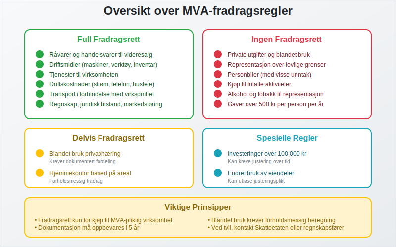

### Rapportering og Oppgjør

#### Rapporteringsperioder

Rapporteringsfrekvensen avhenger av **årlig omsetning**:

| Årlig Omsetning | Rapporteringsperiode | Leveringsfrist |
|-----------------|---------------------|----------------|
| **Under 1 mill. kr** | Årlig | 31. januar |
| **1-5 mill. kr** | Hver 2. måned | 10. i måneden etter |
| **Over 5 mill. kr** | Månedlig | 10. i måneden etter |
| **Over 17 mill. kr** | Månedlig | 10. i måneden etter |

#### Innhold i MVA-oppgaven

**Obligatoriske opplysninger:**

1. **Utgående MVA** spesifisert per sats og kode
2. **Inngående MVA** som kan fradras
3. **Netto MVA** til betaling eller tilbakebetaling
4. **Omsetning** per MVA-kode og sats
5. **Kjøp** med fradragsberettiget MVA
6. **Justeringer** og korrigeringer fra tidligere perioder

**Tilleggsopplysninger ved behov:**
- **Import** og eksport av varer
- **Tjenester** til og fra utlandet
- **Investeringer** i varige driftsmidler
- **Spesielle transaksjoner** som krever særskilt rapportering

#### Betaling og Oppgjør

**Betalingsmetoder:**
- **Automatisk trekk** fra registrert bankkonto (anbefalt)
- **Manuell betaling** via nettbank eller bank
- **Avtalegiro** for regelmessige betalinger

**Betalingsfrister:**
- **Samme dato** som leveringsfristen for MVA-oppgaven
- **Forsinkelsesgebyr** ved for sen betaling (1% per påbegynt måned)
- **Tilleggsavgift** ved uriktige opplysninger (20-60%)

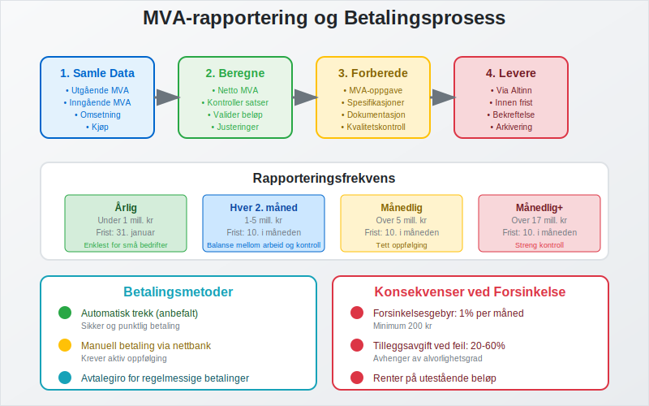

### Regnskapsføring av MVA-plikt

#### Kontoplan for MVA

**Balanseposter:**
- **2700 - Utgående merverdiavgift** (kortsiktig gjeld)
- **2701 - Inngående merverdiavgift** (kortsiktig fordring)
- **2740 - Oppgjørskonto for MVA** (netto posisjon)

**Resultatposter:**
- MVA påvirker **ikke** resultatet direkte
- Kun **kontantstrømeffekten** påvirker likviditeten

#### Praktiske Bokføringseksempler

**Ved salg med 25% MVA:**
```
Debet: Kundefordringer 1 250 kr
Kredit: Salgsinntekt 1 000 kr
Kredit: Utgående MVA (2700) 250 kr
```

**Ved kjøp med 25% MVA:**
```
Debet: Varekjøp 500 kr
Debet: Inngående MVA (2701) 125 kr
Kredit: Leverandørgjeld 625 kr
```

**Ved MVA-oppgjør:**
```
Debet: Utgående MVA (2700) 250 kr
Kredit: Inngående MVA (2701) 125 kr
Kredit: Oppgjørskonto MVA (2740) 125 kr
```

**Ved betaling til Skatteetaten:**
```
Debet: Oppgjørskonto MVA (2740) 125 kr
Kredit: Bank 125 kr
```

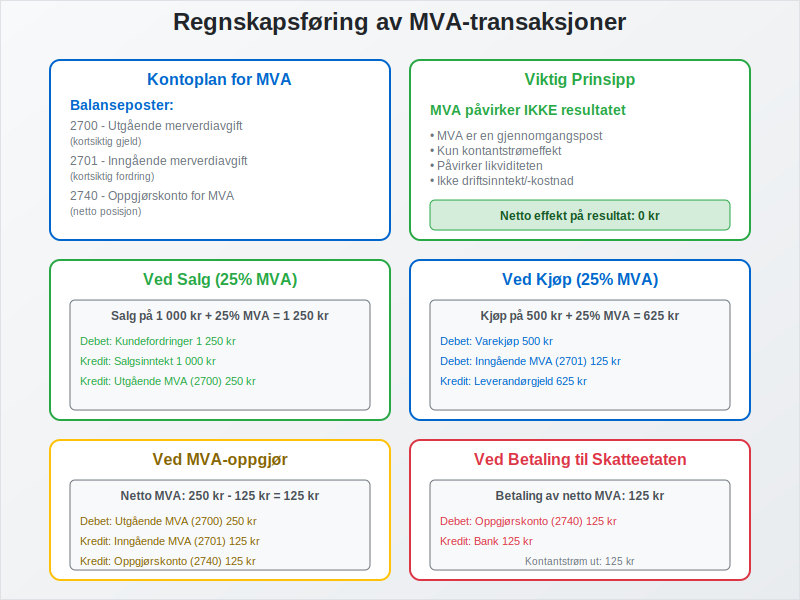

### Kontroll og Sanksjoner

#### Skatteetatens Kontrollmyndighet

**Kontrollformer:**
- **Skrivebordskontroll** basert på innsendte oppgaver
- **Stedlig kontroll** på virksomhetens lokaler
- **Regnskapsrevisjon** med gjennomgang av alle bilag
- **Tverrkontroll** mot andre databaser og registre

**Kontrollområder:**
- **MVA-beregninger** og anvendelse av riktige satser
- **Fradragsberegninger** og dokumentasjon
- **Registreringsplikt** og overholdelse av frister
- **Dokumentasjon** og oppbevaring av bilag
- **Systemkontroll** av regnskaps- og kassasystemer

#### Vanlige Feil og Mangler

**Beregningsfeil:**
- **Feil MVA-sats** på varer og tjenester
- **Feil fradragsberegning** for inngående MVA
- **Manglende MVA** på enkelte transaksjoner
- **Dobbel MVA-beregning** på samme transaksjon

**Registrerings- og rapporteringsfeil:**
- **For sen registrering** ved overskridelse av grenser
- **Manglende rapportering** eller for sen levering
- **Uriktige opplysninger** i MVA-oppgaver
- **Manglende dokumentasjon** for fradrag

#### Sanksjoner og Konsekvenser

| Type Overtredelse | Sanksjon | Størrelse |
|------------------|----------|-----------|
| **For sen levering** | Forsinkelsesgebyr | 1% per påbegynt måned |
| **Uriktige opplysninger** | Tilleggsavgift | 20% av beløpet |
| **Grov uaktsomhet** | Tilleggsavgift | 40% av beløpet |
| **Forsett** | Tilleggsavgift | 60% av beløpet |
| **Manglende registrering** | Tvangsregistrering | + tilleggsavgift |

**Tilleggssanksjoner:**
- **Renter** på utestående beløp
- **Inndragning** av urettmessige fordeler
- **Straff** ved grove overtredelser
- **Konkurs** ved alvorlige mislighold

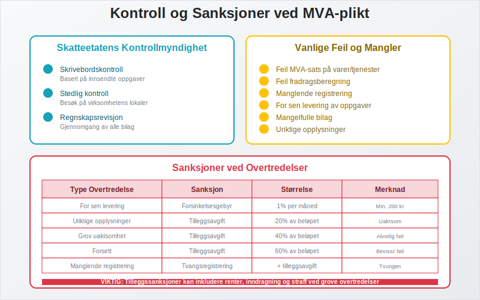

### Spesielle Situasjoner og Unntak

#### Import og Eksport

**Import til Norge:**
- **MVA beregnes** ved innførsel (tollbehandling)
- **Samme sats** som ved innenlandsk salg
- **Fradragsrett** for importør hvis MVA-registrert
- **Dokumentasjonskrav** for tolldeklarasjon

**Eksport fra Norge:**
- **0% MVA** på eksport til land utenfor EU/EØS
- **Dokumentasjonskrav** for å bevise eksport
- **Full fradragsrett** for kostnader knyttet til eksport
- **Spesielle regler** for tjenester til utlandet

#### Tjenester til Utlandet

**Hovedprinsipp:** Tjenester leveres der **kjøper er etablert**

**0% MVA gjelder for:**
- **Konsulenttjenester** til utenlandske bedrifter
- **IT-tjenester** og programvareutvikling
- **Markedsføringstjenester** rettet mot utlandet
- **[Fjernleverbare tjenester](/blogs/regnskap/hva-er-fjernleverbare-tjenester "Hva er Fjernleverbare Tjenester i Regnskap? MVA-regler og Bokføring")** med spesielle regler

**Unntak med norsk MVA:**
- **Transport** innenfor Norge
- **Eiendomsrelaterte tjenester** i Norge
- **Kultur- og underholdningstjenester** i Norge

#### Omvendt Avgiftsplikt

**Når gjelder omvendt avgiftsplikt:**
- **Kjøp av tjenester** fra utlandet
- **Import av visse varer** uten tollbehandling
- **Bygge- og anleggstjenester** i visse tilfeller
- **Handel med klimakvoter** og lignende

**Praktisk håndtering:**
- **Kjøper beregner MVA** i stedet for selger
- **Både utgående og inngående MVA** registreres
- **Netto effekt** ofte null for MVA-registrerte
- **Spesiell rapportering** i MVA-oppgaven

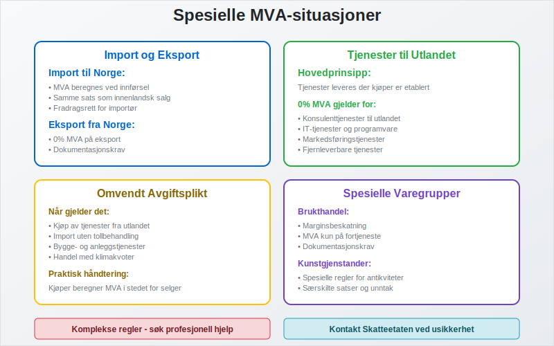

### Digitalisering og Fremtidige Endringer

#### Teknologiske Løsninger

**Moderne regnskapssystemer:**
- **Automatisk MVA-beregning** basert på varegrupper
- **Integrasjon** med kassasystemer og nettbutikker
- **Automatisk rapportering** til Skatteetaten
- **Sanntidsvalidering** av MVA-beregninger

**Kunstig intelligens og automatisering:**
- **Automatisk kategorisering** av transaksjoner
- **Feildeteksjon** og kvalitetskontroll
- **Prediktiv analyse** for MVA-planlegging
- **Chatbots** for MVA-relaterte spørsmål

#### Fremtidige Regelverksendringer

**Kontinuerlig rapportering:**
- **Sanntidsrapportering** av alle transaksjoner
- **Automatisk kontroll** og validering
- **Redusert administrativt arbeid** for bedrifter
- **Økt transparens** og kontrollmuligheter

**Digitale kvitteringer:**
- **Elektronisk dokumentasjon** av alle kjøp
- **Automatisk registrering** i regnskapssystemer
- **Bedre sporbarhet** og kontrollmuligheter
- **Miljøvennlige løsninger**

**Internasjonale standarder:**
- **Harmonisering** med EU-regler
- **Digitale løsninger** for grensehandel
- **Blockchain-teknologi** for sikker dokumentasjon
- **API-basert** kommunikasjon mellom systemer

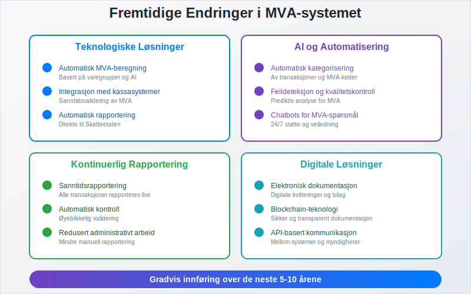

### Praktiske Råd for Bedrifter

#### For Oppstartsbedrifter

**Før oppstart:**
1. **Vurder MVA-plikt** basert på forventet omsetning
2. **Velg regnskapssystem** med god MVA-funksjonalitet
3. **Planlegg prissetting** med MVA inkludert
4. **Sett opp rutiner** for MVA-håndtering fra dag én
5. **Få profesjonell rådgivning** ved komplekse situasjoner

**Ved registrering:**
1. **Søk i god tid** før omsetningsgrensen nås
2. **Forbered dokumentasjon** som kreves for registrering
3. **Implementer systemer** for MVA-beregning og rapportering
4. **Tren personale** i MVA-rutiner og regelverk
5. **Etabler kontakt** med regnskapsfører eller revisor

#### For Etablerte Bedrifter

**Løpende optimalisering:**
1. **Gjennomgå MVA-rutiner** regelmessig
2. **Kontroller MVA-satser** på alle produkter og tjenester
3. **Maksimer fradragsretten** gjennom korrekt dokumentasjon
4. **Automatiser prosesser** der det er mulig og lønnsomt
5. **Hold deg oppdatert** på regelverksendringer

**Ved endringer:**
1. **Vurder MVA-konsekvenser** ved nye produkter/tjenester
2. **Oppdater systemer** ved regelverksendringer
3. **Revider rutiner** ved organisasjonsendringer
4. **Kommuniser endringer** til alle berørte medarbeidere
5. **Dokumenter beslutninger** og vurderinger

#### Ved Problemer og Usikkerhet

**Proaktive tiltak:**
1. **Kontakt Skatteetaten** ved usikkerhet om regler
2. **Søk profesjonell hjelp** fra regnskapsfører eller revisor
3. **Korriger feil** så snart de oppdages
4. **Dokumenter alle vurderinger** og beslutninger
5. **Lær av feil** og forbedre rutinene kontinuerlig

**Ved kontroll:**
1. **Samarbeid konstruktivt** med kontrollørene
2. **Fremlegg dokumentasjon** på en oversiktlig måte
3. **Forklar vurderinger** og beslutninger tydelig
4. **Aksepter berettigede merknader** og korriger feil
5. **Klage** på vedtak du mener er feil, innen fristen

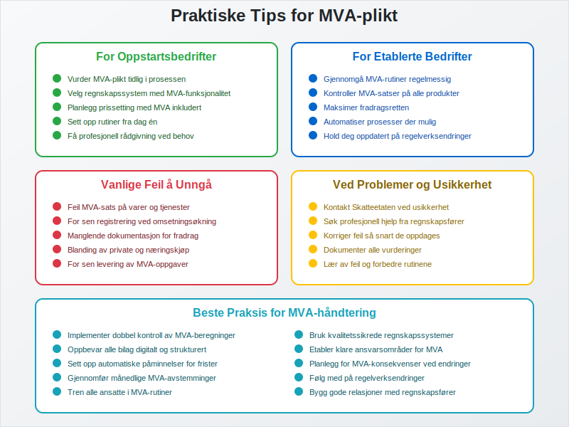

### Relaterte Begreper og Artikler

For å forstå MVA-plikt fullt ut, bør du også sette deg inn i:

- **[Avgiftsplikt (MVA)](/blogs/regnskap/hva-er-avgiftsplikt-mva "Hva er Avgiftsplikt (MVA)? Komplett Guide til Merverdiavgift i Norge")** - Detaljert om avgiftsplikten
- **[Regnskap](/blogs/regnskap/hva-er-regnskap "Hva er Regnskap? En komplett guide")** - Grunnlaget for MVA-rapportering
- **[Faktura](/blogs/regnskap/hva-er-en-faktura "Hva er en Faktura? En Guide til Norske Fakturakrav")** - Dokumentasjon av MVA-pliktige salg
- **[Bokføring](/blogs/regnskap/hva-er-bokforing "Hva er Bokføring? Komplett Guide til Regnskapsføring")** - Registrering av MVA-transaksjoner
- **[Altinn](/blogs/regnskap/hva-er-altinn "Hva er Altinn? Digital Kommunikasjon med Offentlige Myndigheter")** - Plattform for MVA-rapportering
- **[Aksjeselskap](/blogs/regnskap/hva-er-et-aksjeselskap "Hva er et Aksjeselskap? Komplett Guide til Selskapsformen")** - Selskapsform ofte omfattet av MVA-plikt
- **[Enkeltpersonforetak](/blogs/regnskap/hva-er-enkeltpersonforetak "Hva er Enkeltpersonforetak? Komplett Guide til Etablering og Drift")** - Enkleste selskapsform med MVA-plikt

### Oppsummering

MVA-plikt er en **fundamental juridisk forpliktelse** som påvirker de fleste norske bedrifter som selger varer og tjenester. Korrekt håndtering av MVA-plikten krever:

- **Grundig forståelse** av når plikten oppstår og hvilke krav som gjelder
- **Systematisk tilnærming** til registrering, beregning og rapportering
- **Gode rutiner** for dokumentasjon og oppbevaring av bilag
- **Oppdatert kunnskap** om regelverksendringer og nye krav
- **Profesjonell støtte** ved komplekse situasjoner og usikkerhet

Ved å etablere **solide systemer** og **gode rutiner** fra starten kan bedrifter håndtere MVA-plikten effektivt og **minimere risiko** for feil og sanksjoner. Dette bidrar til **trygg drift** og **god økonomi** i virksomheten.


