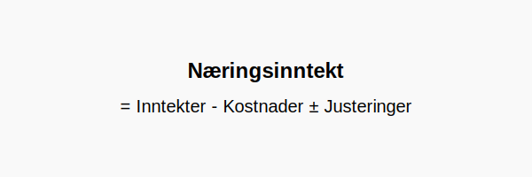

**Næringsinntekt** er resultatet av virksomhetens inntekter minus fradragsberettigede kostnader, med eventuelle skattemessige justeringer. For [selvstendig næringsdrivende](/blogs/regnskap/selvstendig-naeringsdrivende "Selvstendig næringsdrivende “ Guide til selvstendig næringsvirksomhet i Norge") utgjør **næringsinntekt** det grunnleggende skattegrunnlaget som rapporteres i næringsoppgaven (RF-1030).

For en mer generell forståelse av inntekter, se [Hva er inntekter?](/blogs/regnskap/hva-er-inntekter "Hva er Inntekter? Komplett Guide til Inntektstyper og Regnskapsføring").
For sammenligning med alminnelig inntekt, se [Alminnelig inntekt](/blogs/regnskap/alminnelig-inntekt "Alminnelig inntekt “ Komplett guide til skattemessig resultat og beregning").

## Hva er næringsinntekt?

**Næringsinntekt** er nettoresultatet fra en virksomhet som drives av en enkeltperson (enkeltpersonforetak) eller selvstendig næringsdrivende. Den beregnes ved å summere alle drifts- og finansinntekter, trekke fra alle kostnader som kan fradragsføres, og justere for periodisering og andre skattemessige korreksjoner.

## Hvem omfattes?

Begrepet **næringsinntekt** gjelder for:

* **Enkeltpersonforetak:** Personlig næringsdrivende uten eget rettssubjekt
* **Deltaker i ansvarlig selskap (ANS/DA):** Andel av resultatet som skattlegges hos deltakeren
* **Frilansere og konsulenter:** Som leverer tjenester uten å være ansatt

## Beregning av næringsinntekt

Næringsinntekt beregnes slik:

| Post                         | Beskrivelse                                           |
|------------------------------|-------------------------------------------------------|
| **Inntekter**                | Driftsinntekter + finansinntekter                     |
| **− Kostnader**              | Alle fradragsberettigede kostnader                    |
| **± Justeringer**            | Periodisering, avskrivninger og andre skattekorreksjoner |
| **= Næringsinntekt**         | Netto skattegrunnlag                                   |

Justeringene inkluderer blant annet avskrivninger på anleggsmidler, periodiseringsprinsipp og eventuelle korrigeringer for tidligere år.

## Skattemessige regler og næringsoppgave

Næringsinntekten rapporteres i næringsoppgaven (RF-1030) som del av skattemeldingen. Se [Hva er næringsspesifikasjon?](/blogs/regnskap/naringsspesifikasjon "Hva er næringsspesifikasjon? Guide til næringsspesifikasjon for selvstendig næringsdrivende").

Skattesatsen for alminnelig inntekt (22 %) gjelder også for næringsinntekt, men skattemessig overskudd kan påvirkes av personfradrag og trygdeavgift.

## Eksempel på beregning

| Post                             | Beløp (NOK) |
|----------------------------------|-------------|
| Inntekter                        | 800 000     |
| Kostnader                        | 500 000     |
| Avskrivninger og justeringer     | 50 000      |
| **Næringsinntekt**               | **250 000** |

## Ofte stilte spørsmål

### Hvordan skiller næringsinntekt seg fra alminnelig inntekt?

Alminnelig inntekt er et bredere skattegrunnlag som gjelder både selskaper og personlig næringsdrivende, mens næringsinntekt spesifikt refererer til personlig virksomhet før personlige fradrag og trygdeavgift.

### Hva er næringsoppgave (RF-1030)?

Næringsoppgave (RF-1030) er skjemaet der næringsinntekten spesifiseres og rapporteres til Skatteetaten. Se [Hva er næringsspesifikasjon?](/blogs/regnskap/naringsspesifikasjon "Hva er næringsspesifikasjon? Guide til næringsspesifikasjon for selvstendig næringsdrivende").

## Videre lesning

* [Hva er inntekter?](/blogs/regnskap/hva-er-inntekter "Hva er Inntekter? Komplett Guide til Inntektstyper og Regnskapsføring")
* [Alminnelig inntekt](/blogs/regnskap/alminnelig-inntekt "Alminnelig inntekt “ Komplett guide til skattemessig resultat og beregning")
* [Hva er næringsspesifikasjon?](/blogs/regnskap/naringsspesifikasjon "Hva er næringsspesifikasjon? Guide til næringsspesifikasjon for selvstendig næringsdrivende")
* [Fremførbart underskudd](/blogs/regnskap/fremforbart-underskudd "Fremførbart underskudd: Komplett guide til håndtering av underskudd i regnskap og skatt")
* [Betalbar skatt](/blogs/regnskap/betalbar-skatt "Betalbar skatt “ Komplett guide til beregning og hÃ¥ndtering")

