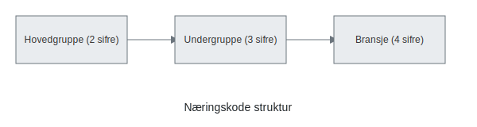

---
title: "Næringskode"
meta_title: "Næringskode"
meta_description: '**Næringskode** er et firesifret tall som klassifiserer virksomhetens **bransjetilhørighet** i norsk regnskap og offentlig registrering. Koden benyttes av [En...'
slug: naeringskode
type: blog
layout: pages/single
---

**Næringskode** er et firesifret tall som klassifiserer virksomhetens **bransjetilhørighet** i norsk regnskap og offentlig registrering. Koden benyttes av [Enhetsregisteret](/blogs/regnskap/enhetsregisteret "Enhetsregisteret “ Oversikt over virksomheters grunninformasjon i Norge") og [Brønnøysundregistrene](/blogs/regnskap/bronnoysundregistrene "Brønnøysundregistrene - Oversikt over Norske Registere") for Ã¥ systematisere økonomisk statistikk, skatter og avgifter.

## Hvorfor er næringskode viktig?

Næringskode sikrer at virksomheten kategoriseres korrekt i:

* **Skatteetaten** for beregning av næringsinntekt og skatter.
* **Statistisk sentralbyrå (SSB)** for næringsstatistikk og analyser.
* **Kommunal planlegging** og bransjerapporter.
* **Bank og finans** for bransjespesifikke lånebetingelser.

## Hvordan er næringskode bygget opp?

Koden består av fire sifre, der:

* De to første sifrene representerer **hovedgruppe**.
* Det tredje sifret angir **undergruppe**.
* Det fjerde sifret spesifiserer den eksakte **bransjen**.

## Hvordan finne riktig næringskode?

For å finne korrekt koder, bruk:

* [Enhetsregisteret](/blogs/regnskap/enhetsregisteret "Enhetsregisteret “ Oversikt over virksomheters grunninformasjon i Norge").
* Brønnøysundregistrenes kodekatalog for Standard for næringsgruppering (SN2007).
* Kontakt regnskapsfører eller revisor for veiledning.

## Eksempler på næringskoder

| **Kode** | **Beskrivelse**                                    |
|----------|----------------------------------------------------|
| 46.10    | **Engroshandel med maskiner**                       |
| 47.90    | **Detaljhandel, ikke spesifisert**                  |
| 62.01    | **Utvikling og publisering av programvare**         |
| 86.10    | **Arbeidskrafttjenester**                          |
| 49.50    | **Landtransport av gods**                          |

## Ofte stilte spørsmål

### Hva er forskjellen mellom hovedgruppe og bransje?

Hovedgruppe (to sifre) gir en grovkategorisering, mens full næringskode (fire sifre) definerer eksakt bransjetilhørighet.

### Kan jeg ha flere næringskoder?

En virksomhet kan ha én primær næringskode og flere sekundære koder for tilleggskategorier.

### Endres næringskode over tid?

Ja, du kan endre kode ved Ã¥ oppdatere opplysningene i [Enhetsregisteret](/blogs/regnskap/enhetsregisteret "Enhetsregisteret “ Oversikt over virksomheters grunninformasjon i Norge") hvis virksomhetens hovedaktivitet endrer seg.

For mer om rapportering, se [Hva er næringsoppgave?](/blogs/regnskap/hva-er-naeringsoppgave "Hva er en næringsoppgave?").

