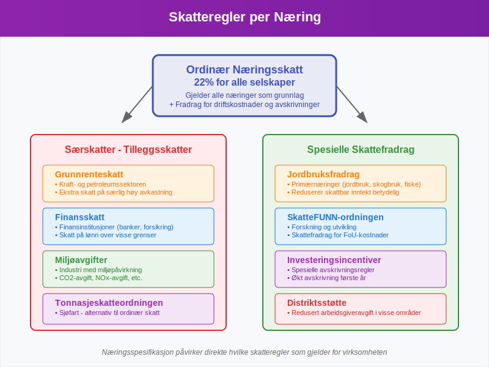
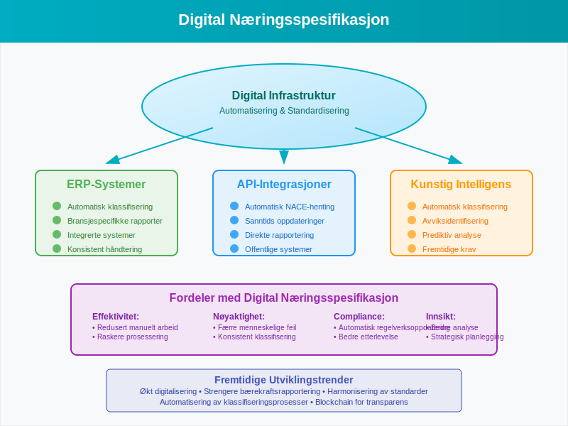

**Næringsspesifikasjon** er et fundamentalt konsept i norsk [regnskap](/blogs/regnskap/hva-er-regnskap "Hva er Regnskap? En Dybdeanalyse for Norge") som omfatter den systematiske klassifiseringen og spesifiseringen av virksomheters næringsaktiviteter. Dette er avgjørende for korrekt rapportering, skatteberegning og overholdelse av bransjespecifikke regnskapsregler.

For virksomheter som driver med [detaljhandel](/blogs/regnskap/hva-er-detaljhandel "Hva er Detaljhandel? Komplett Guide til Detaljhandelsregnskap") eller [engroshandel](/blogs/regnskap/hva-er-engroshandel "Hva er Engroshandel? Komplett Guide til Engroshandelsregnskap"), er korrekt næringsspesifikasjon særlig viktig for å sikre riktig [bokføring](/blogs/regnskap/hva-er-bokforing "Hva er Bokføring? En Komplett Guide til Norsk Bokføringspraksis") og rapportering.

## Grunnleggende om Næringsspesifikasjon

Næringsspesifikasjon handler om å **identifisere, klassifisere og dokumentere** de spesifikke aktivitetene en virksomhet driver med. Dette påvirker alt fra [kontoplan](/blogs/regnskap/hva-er-kontoplan "Hva er en Kontoplan? Komplett Guide til Kontoplaner i Norsk Regnskap") til skatteberegning og rapporteringskrav.

### Hovedkomponenter i Næringsspesifikasjon

* **NACE-koder** - Standardisert næringsklassifisering
* **Bransjespecifikke regnskapsregler** - Særlige krav for ulike næringer
* **Rapporteringskrav** - Spesifikke rapporter og frister
* **Skattemessige konsekvenser** - Ulike skatteregler per næring

## NACE-Koder og Næringsklassifisering

**NACE** (Nomenclature statistique des Activités économiques dans la Communauté Européenne) er det europeiske systemet for næringsklassifisering som også brukes i Norge. Hver virksomhet må registrere sin hovedaktivitet og eventuelle biaktiviteter.

### Struktur av NACE-Koder

NACE-systemet er hierarkisk oppbygget med følgende nivåer:

| Nivå | Beskrivelse | Eksempel | Antall siffer |
|------|-------------|----------|---------------|
| Seksjon | Hovedområde | A - Jordbruk, skogbruk og fiske | 1 bokstav |
| Avdeling | Underområde | 01 - Jordbruk og tjenester tilknyttet jordbruk | 2 siffer |
| Gruppe | Spesifikk aktivitet | 01.1 - Dyrking av ettårige vekster | 3 siffer |
| Klasse | Detaljert aktivitet | 01.11 - Dyrking av korn og andre ettårige vekster | 4 siffer |
| Underklasse | Mest detaljerte nivå | 01.110 - Dyrking av korn | 5 siffer |

### Viktige NACE-Seksjoner for Norske Virksomheter

* **A** - Jordbruk, skogbruk og fiske
* **B** - Bergverksdrift og utvinning
* **C** - Industri
* **F** - Bygge- og anleggsvirksomhet
* **G** - Varehandel; reparasjon av motorvogner
* **H** - Transport og lagring
* **I** - Overnattings- og serveringsvirksomhet
* **J** - Informasjon og kommunikasjon
* **K** - Finansierings- og forsikringsvirksomhet
* **L** - Omsetning og drift av fast eiendom
* **M** - Faglig, vitenskapelig og teknisk tjenesteyting

## Bransjespecifikke Regnskapsregler

Ulike næringer har **spesifikke regnskapsregler** som må følges. Dette påvirker hvordan [inntekter](/blogs/regnskap/hva-er-inntekter "Hva er Inntekter? Komplett Guide til Inntektstyper og Regnskapsføring") og [kostnader](/blogs/regnskap/hva-er-kostnader "Hva er Kostnader? Komplett Guide til Kostnadstyper og Regnskapsføring") skal registreres.

### Handel og Varehandel

For virksomheter innen handel gjelder spesielle regler for:

* **[Lagerbeholdning](/blogs/regnskap/hva-er-lagerbeholdning "Hva er Lagerbeholdning? Komplett Guide til Lagerregnskapet")** - Verdivurdering og registrering
* **Varekostnad** - Beregning av solgte varers kost
* **[Kundefordringer](/blogs/regnskap/hva-er-kundefordring "Hva er Kundefordring? Komplett Guide til Kundefordringer i Regnskap")** - Håndtering av utestående beløp
* **[Leverandørgjeld](/blogs/regnskap/hva-er-leverandorgjeld "Hva er Leverandørgjeld? Komplett Guide til Leverandørgjeld i Regnskap")** - Registrering av kjøp på kreditt

### Tjenesteyting

Tjenestevirksomheter har egne utfordringer:

* **Tidsregistrering** - Dokumentasjon av arbeidstimer
* **Prosjektregnskap** - Separate regnskaper per prosjekt
* **[Honorar](/blogs/regnskap/hva-er-honorar "Hva er Honorar i Regnskap? Komplett Guide til Honorarutbetalinger og Skattebehandling")** - Registrering av konsulentinntekter
* **Forskuddsbetalinger** - Håndtering av [forskuddsbetaling](/blogs/regnskap/hva-er-forskuddsbetaling "Hva er Forskuddsbetaling? Komplett Guide til Forskuddsbetalinger i Regnskap")

### Industri og Produksjon

Industrivirksomheter må håndtere:

* **Produksjonsregnskap** - Kostnadskalkyle for produksjon
* **[Anleggsmidler](/blogs/regnskap/hva-er-anleggsmidler "Hva er Anleggsmidler? Komplett Guide til Anleggsmidler i Regnskap")** - Maskiner og utstyr
* **[Avskrivning](/blogs/regnskap/hva-er-avskrivning "Hva er Avskrivning? Komplett Guide til Avskrivninger i Regnskap")** - Systematisk nedskrivning av eiendeler
* **Råvarer og halvfabrikata** - Spesiell lagerhåndtering

### [Primærnæringer](/blogs/regnskap/primarnaring "Hva er primærnæring? Komplett Guide til Primærnæring i Regnskap")

For jordbruk, skogbruk og fiske gjelder:

* **[Jordbruksfradrag](/blogs/regnskap/hva-er-jordbruksfradrag "Hva er Jordbruksfradrag? Komplett Guide til Jordbruksfradrag i Skatt og Regnskap")** - Spesielle skattefradrag
* **Biologiske eiendeler** - Levende dyr og planter
* **Sesongvariasjoner** - Håndtering av sesongbaserte inntekter
* **Subsidier og tilskudd** - Offentlig støtte

## MVA og Næringsspesifikasjon

**[Merverdiavgift (MVA)](/blogs/regnskap/hva-er-moms-mva "Hva er Moms/MVA? Komplett Guide til Merverdiavgift i Norge")** varierer betydelig mellom ulike næringer. Korrekt næringsspesifikasjon er avgjørende for riktig MVA-behandling.

### MVA-Satser per Næring

| Næring | MVA-Sats | Eksempler |
|--------|----------|-----------|
| Generell handel | 25% | De fleste varer og tjenester |
| Matvarer | 15% | Dagligvarer, ikke-alkoholholdige drikkevarer |
| Transport | 0% | Persontransport, gods |
| Finansielle tjenester | 0% | Bank, forsikring, verdipapirer |
| Helse og utdanning | 0% | Offentlige og private helsetjenester |
| Kultur og idrett | 0% | Museer, biblioteker, idrettsarrangementer |

### MVA-Registrering og Rapportering

Virksomheter må:

* **Registrere seg i [MVA-registeret](/blogs/regnskap/hva-er-mva-registeret "Hva er MVA-registeret? Komplett Guide til MVA-registrering og Plikter")** basert på næring
* **Levere [MVA-melding](/blogs/regnskap/hva-er-mva-melding "Hva er MVA-melding? Komplett Guide til MVA-rapportering og Frister")** regelmessig
* **Dokumentere** alle MVA-beregninger
* **Følge** bransjespecifikke MVA-regler

## Rapporteringskrav per Næring

Ulike næringer har **forskjellige rapporteringskrav** til offentlige myndigheter. Dette påvirker både hyppighet og innhold i rapporteringen.

### Månedlig Rapportering

Følgende næringer må ofte rapportere månedlig:

* **Detaljhandel** - [Datakasse](/blogs/regnskap/hva-er-datakasse "Hva er Datakasse? Komplett Guide til Kassasystem, Krav og Regnskapsføring") og salgsrapporter
* **Serveringssteder** - Omsetningsrapporter
* **Transport** - Kjørebøker og fraktdokumenter

### Kvartalsvis Rapportering

* **[Kvartalsrapporter](/blogs/regnskap/hva-er-kvartalsrapport "Hva er Kvartalsrapport? Komplett Guide til Kvartalsrapportering")** for større virksomheter
* **MVA-meldinger** for de fleste virksomheter
* **Lønnsrapportering** gjennom [A-meldingen](/blogs/regnskap/hva-er-a-melding "Hva er A-melding? Komplett Guide til A-meldingen og Lønnsrapportering")

### Årlig Rapportering

Alle virksomheter må levere:

* **Årsregnskap** til Regnskapsregisteret
* **Selvangivelse** til Skatteetaten
* **Årsrapport** for større selskaper

## Skattemessige Konsekvenser

**Næringsspesifikasjon** påvirker direkte hvilke skatteregler som gjelder for virksomheten. Dette inkluderer både ordinær skatt og eventuelle særskatter.

### Ordinær Næringsskatt

Alle næringer er underlagt:

* **Ordinær skattesats** på 22% for selskaper
* **[Fradrag](/blogs/regnskap/hva-er-fradrag "Hva er fradrag i regnskap? Komplett Guide til Skattefradrag og Regnskapsføring")** for driftskostnader
* **Avskrivningsregler** for anleggsmidler

### Særskatter per Næring

Enkelte næringer har tilleggsskatter:

* **[Grunnrenteskatt](/blogs/regnskap/hva-er-grunnrenteskatt "Hva er Grunnrenteskatt? Komplett Guide til Norsk Grunnrenteskatt")** - Kraft- og petroleumssektoren
* **Finansskatt** - Finansinstitusjoner
* **Miljøavgifter** - Industri med miljøpåvirkning

### Skattefradrag per Næring

Spesielle fradrag for:

* **Jordbruk** - [Jordbruksfradrag](/blogs/regnskap/hva-er-jordbruksfradrag "Hva er Jordbruksfradrag? Komplett Guide til Jordbruksfradrag i Skatt og Regnskap")
* **Forskning og utvikling** - SkatteFUNN-ordningen
* **Sjøfart** - Tonnasjeskatteordningen

## Praktisk Implementering

For å implementere korrekt næringsspesifikasjon i [regnskapet](/blogs/regnskap/hva-er-regnskap "Hva er Regnskap? En Dybdeanalyse for Norge"), må virksomheter følge en systematisk tilnærming.

### Trinn 1: Identifiser Hovedaktivitet

* **Analyser** virksomhetens inntektskilder
* **Bestem** hvilken aktivitet som genererer mest inntekt
* **Velg** riktig NACE-kode for hovedaktiviteten

### Trinn 2: Registrer Biaktiviteter

* **Identifiser** alle andre aktiviteter
* **Vurder** om de krever separate NACE-koder
* **Dokumenter** fordelingen av inntekter

### Trinn 3: Tilpass Kontoplanen

[Kontoplanen](/blogs/regnskap/hva-er-kontoplan "Hva er en Kontoplan? Komplett Guide til Kontoplaner i Norsk Regnskap") må tilpasses næringens behov:

* **Legg til** bransjespecifikke kontoer
* **Strukturer** kontoer etter aktivitetsområder
* **Sikre** korrekt [kontering](/blogs/regnskap/hva-er-kontering "Hva er Kontering? En Komplett Guide til Kontokoding i Regnskap")

### Trinn 4: Etabler Rutiner

* **Opprett** rutiner for bransjespecifikk dokumentasjon
* **Implementer** kontroller for korrekt klassifisering
* **Tren** personalet i næringsspesifikke krav

## Digitalisering og Næringsspesifikasjon

Moderne teknologi gjør næringsspesifikasjon mer effektiv gjennom **automatisering** og **standardisering**.

### ERP-Systemer

[ERP-systemer](/blogs/regnskap/hva-er-erp-system "Hva er ERP-system? Komplett Guide til Enterprise Resource Planning") kan:

* **Automatisk klassifisere** transaksjoner basert på næring
* **Generere** bransjespecifikke rapporter
* **Integrere** med offentlige rapporteringssystemer
* **Sikre** konsistent håndtering av næringsspesifikke regler

### API-Integrasjoner

[API-integrasjoner](/blogs/regnskap/api-integrasjon-automatisering-regnskap "API-integrasjon og Automatisering i Regnskap - Komplett Guide") muliggjør:

* **Automatisk** henting av NACE-koder fra Brønnøysundregistrene
* **Sanntids** oppdatering av bransjespecifikke regler
* **Direkte** rapportering til offentlige systemer

### Kunstig Intelligens

AI kan bidra til:

* **Automatisk** klassifisering av transaksjoner
* **Identifisering** av avvik fra bransjenormer
* **Prediksjon** av fremtidige rapporteringskrav

## Utfordringer og Løsninger

Næringsspesifikasjon bringer med seg flere **utfordringer** som virksomheter må håndtere.

### Vanlige Utfordringer

* **Komplekse** bransjespecifikke regler
* **Hyppige** endringer i regelverk
* **Mangel** på bransjeekspertise
* **Integrasjon** mellom ulike systemer

### Anbefalte Løsninger

* **Invester** i bransjespecifikk kompetanse
* **Implementer** robuste kontrollsystemer
* **Hold deg oppdatert** på regelverksendringer
* **Bruk** spesialiserte regnskapssystemer

## Fremtidige Utviklingstrender

Næringsspesifikasjon vil fortsette å utvikle seg med **nye teknologier** og **endrede krav**.

### Kommende Endringer

* **Økt digitalisering** av rapporteringsprosesser
* **Strengere** bærekraftsrapportering
* **Harmonisering** av europeiske standarder
* **Automatisering** av klassifiseringsprosesser

### Forberedelser for Fremtiden

Virksomheter bør:

* **Investere** i fleksible systemer
* **Bygge** digital kompetanse
* **Etablere** partnerskaper med teknologileverandører
* **Følge** internasjonale utviklingstrender

## Konklusjon

**Næringsspesifikasjon** er et komplekst, men kritisk område innen norsk regnskap. Korrekt implementering krever:

* **Grundig forståelse** av NACE-klassifiseringssystemet
* **Kunnskap** om bransjespecifikke regnskapsregler
* **Systematisk tilnærming** til implementering
* **Kontinuerlig oppdatering** av kunnskap og systemer

For virksomheter som ønsker å sikre korrekt regnskapsføring og rapportering, er det essensielt å investere i riktig kompetanse og systemer for håndtering av næringsspesifikasjon. Dette vil ikke bare sikre regelverksetterlevelse, men også gi verdifull innsikt i virksomhetens økonomiske ytelse sammenlignet med bransjenormer.

Ved å følge prinsippene og anbefalingene i denne artikkelen, kan virksomheter etablere et solid fundament for næringsspesifikk regnskapsføring som støtter både daglig drift og langsiktig strategisk planlegging.

