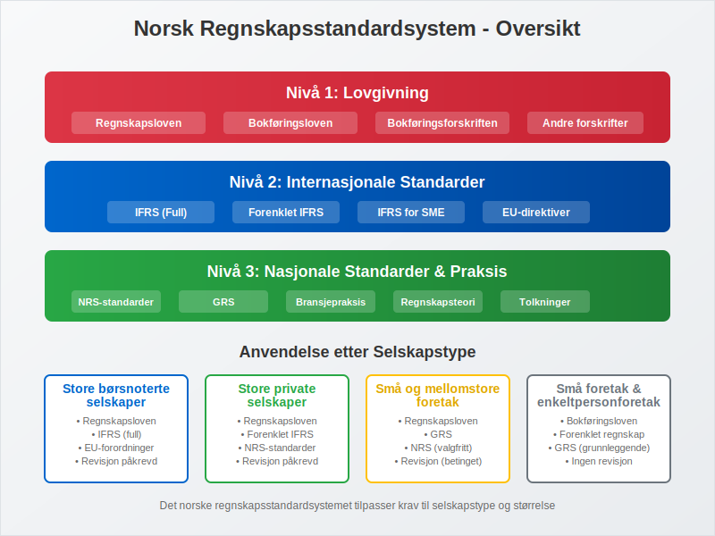
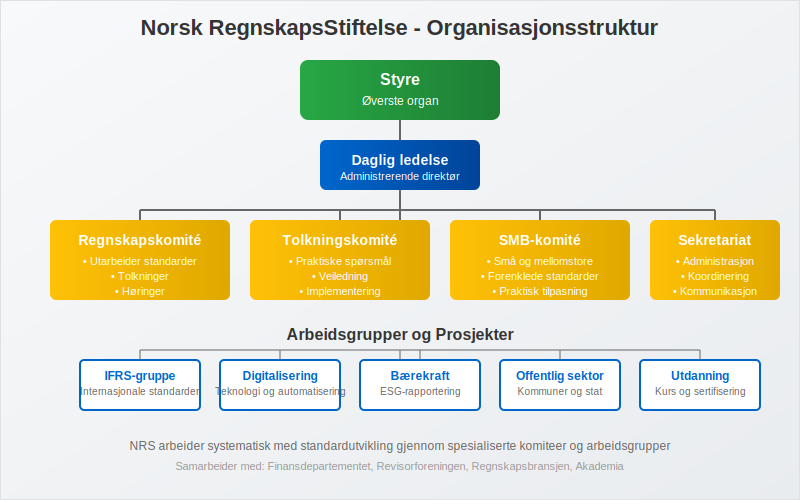
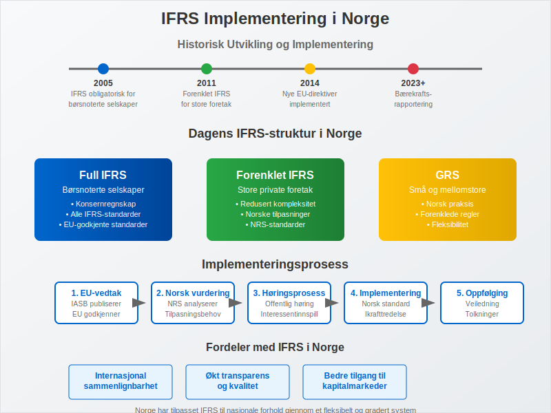
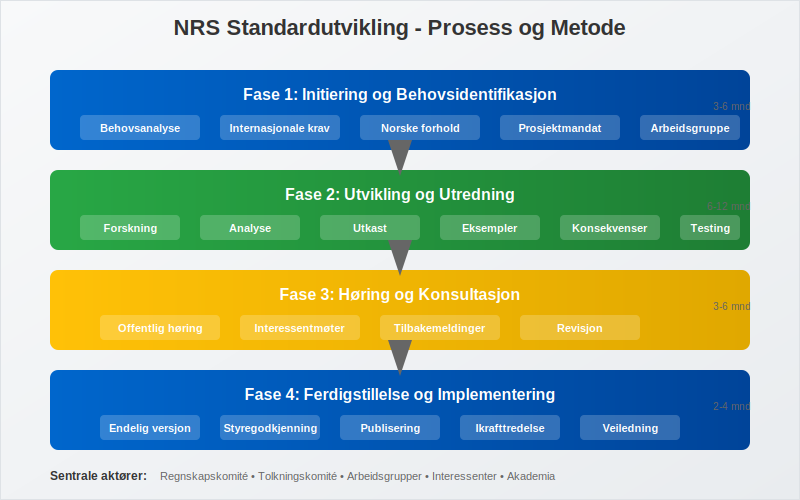
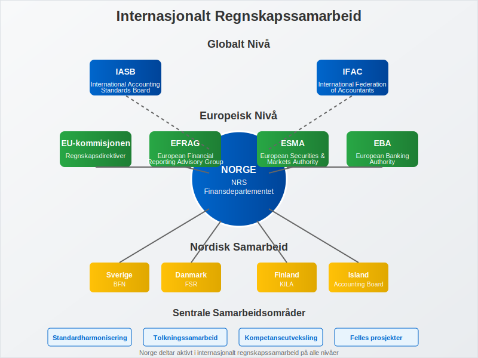
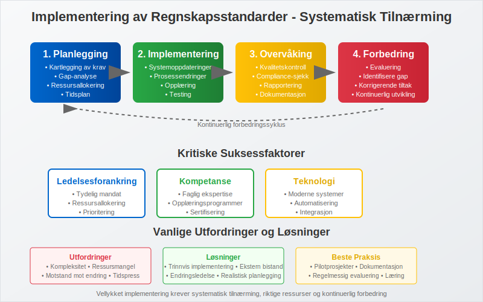

---
title: "Norsk standard (regnskap)"
seoTitle: "Norsk standard (regnskap)"
description: '**Norske regnskapsstandarder** utgjør det juridiske og tekniske rammeverket som regulerer finansiell rapportering i Norge. Dette omfattende systemet sikrer kon...'
---

**Norske regnskapsstandarder** utgjør det juridiske og tekniske rammeverket som regulerer finansiell rapportering i Norge. Dette omfattende systemet sikrer konsistens, sammenlignbarhet og pålitelighet i [regnskap](/blogs/regnskap/hva-er-regnskap "Hva er Regnskap? En Dybdeanalyse for Norge") på tvers av ulike selskapstyper og bransjer. Forståelse av disse standardene er avgjørende for alle som arbeider med [bokføring](/blogs/regnskap/hva-er-bokforing "Hva er Bokføring? En Komplett Guide til Norsk Bokføringspraksis") og finansiell rapportering i Norge.

Det norske regnskapsstandardsystemet bygger på prinsippene om [god regnskapsskikk](/blogs/regnskap/god-regnskapsskikk "God Regnskapsskikk - Prinsipper, Standarder og Beste Praksis i Norge"), som danner grunnlaget for kvalitetsregnskap og etisk regnskapsføring i norsk næringsliv.

## Seksjon 1: Oversikt over det Norske Regnskapsstandardsystemet

Det norske regnskapsstandardsystemet er hierarkisk oppbygd med flere nivåer av standarder og regelverk som sammen sikrer omfattende dekning av alle regnskapsmessige forhold.

### 1.1 Hierarkiet i Norske Regnskapsstandarder

Standardhierarkiet i Norge følger en klar struktur som sikrer konsistent anvendelse:

| **Nivå** | **Standard/Regelverk** | **Anvendelsesområde** | **Juridisk Status** |
|----------|------------------------|----------------------|-------------------|
| 1 | Regnskapsloven | Alle regnskapspliktige | Lov |
| 2 | [Bokføringsloven](/blogs/regnskap/hva-er-bokforingsloven "Hva er Bokføringsloven? Komplett Guide til Norsk Bokføringslovgivning") | Alle [bokføringspliktige](/blogs/regnskap/hva-er-bokforingsplikt "Hva er Bokføringsplikt? Komplett Guide til Bokføringskrav i Norge") | Lov |
| 3 | [Bokføringsforskriften](/blogs/regnskap/hva-er-bokforingsforskriften "Hva er Bokføringsforskriften? Detaljert Guide til Norske Bokføringsregler") | Alle bokføringspliktige | Forskrift |
| 4 | IFRS | Børsnoterte selskaper | EU-forordning |
| 5 | Forenklet IFRS | Store foretak | NRS-standard |
| 6 | God regnskapsskikk (GRS) | Små og mellomstore foretak | Sedvanerett |

### 1.2 Norsk RegnskapsStiftelse (NRS)

**Norsk RegnskapsStiftelse** er den sentrale institusjonen for standardsetting i Norge. Stiftelsen ble etablert i 1989 som en privat, uavhengig organisasjon med mandat til å utvikle norske regnskapsstandarder.

NRS har følgende hovedoppgaver:

* **Standardutvikling:** Utarbeide norske regnskapsstandarder (NRS)
* **Tolkningsarbeid:** Gi veiledning om anvendelse av standarder
* **Internasjonalt samarbeid:** Bidra til utvikling av internasjonale standarder
* **Utdanning og informasjon:** Spre kunnskap om regnskapsstandarder

## Seksjon 2: IFRS i Norge

**[International Financial Reporting Standards (IFRS)](/blogs/regnskap/hva-er-ifrs "Hva er IFRS? Komplett Guide til International Financial Reporting Standards")** har en sentral rolle i det norske regnskapsstandardsystemet, særlig for større selskaper og børsnoterte foretak.

### 2.1 IFRS for Børsnoterte Selskaper

Siden 2005 har alle børsnoterte selskaper i Norge vært pålagt å anvende IFRS i sitt [konsernregnskap](/blogs/regnskap/hva-er-konsern "Hva er Konsern? Komplett Guide til Konsernregnskap og Konsernforhold"). Dette sikrer:

* **Internasjonal sammenlignbarhet** av finansiell informasjon
* **Økt transparens** overfor internasjonale investorer
* **Harmonisering** med europeiske regnskapsstandarder
* **Forbedret kapitalmarkedstilgang** for norske selskaper

### 2.2 Forenklet IFRS for Store Foretak

For store foretak som ikke er børsnoterte, har NRS utviklet **Forenklet IFRS** - en tilpasset versjon av IFRS som:

* Reduserer kompleksiteten sammenlignet med full IFRS
* Beholder de viktigste prinsippene fra IFRS
* Tilpasses norske forhold og behov
* Gir fleksibilitet for nasjonale tilpasninger

## Seksjon 3: God Regnskapsskikk (GRS)

**[God regnskapsskikk](/blogs/regnskap/god-regnskapsskikk "God Regnskapsskikk - Prinsipper, Standarder og Beste Praksis i Norge")** er det grunnleggende prinsippet som gjelder for alle regnskapspliktige i Norge. GRS utvikles gjennom:

### 3.1 Kilder til God Regnskapsskikk

* **Regnskapslovgivning:** Regnskapsloven og tilhørende forskrifter
* **Regnskapsstandarder:** NRS-standarder og IFRS
* **Regnskapspraksis:** Etablert praksis i næringslivet
* **Regnskapsteori:** Akademisk forskning og utvikling
* **Internasjonale standarder:** Påvirkning fra internasjonale regnskapsstandarder

### 3.2 Grunnleggende Prinsipper i GRS

God regnskapsskikk bygger på flere fundamentale prinsipper:

* **Forsiktighetsregelen:** Ikke overvurdere eiendeler eller undervurdere gjeld
* **Sammenlignbarhet:** Konsistent anvendelse over tid og mellom foretak
* **Relevans:** Informasjonen må være nyttig for brukerne
* **Pålitelighet:** Informasjonen må være korrekt og etterprøvbar
* **Forståelighet:** Presentasjonen må være klar og oversiktlig

## Seksjon 4: NRS-Standarder

Norsk RegnskapsStiftelse har utviklet en rekke spesifikke standarder som utdyper og presiserer god regnskapsskikk for ulike områder.

### 4.1 Oversikt over Viktige NRS-Standarder

| **Standard** | **Tittel** | **Hovedinnhold** |
|--------------|------------|------------------|
| NRS 1 | Presentasjon av årsregnskap | Grunnleggende presentasjonsprinsipper |
| NRS 2 | Kontantstrømoppstilling | Utarbeidelse av [kontantstrømoppstilling](/blogs/regnskap/hva-er-kontantstromoppstilling "Hva er Kontantstrømoppstilling? Komplett Guide til Kontantstrømanalyse og Rapportering") |
| NRS 6 | Pensjonskostnader | Regnskapsføring av pensjonsforpliktelser |
| NRS 8 | [Goodwill](/blogs/regnskap/hva-er-goodwill "Hva er Goodwill? Komplett Guide til Goodwill i Regnskap og Verdivurdering") | Behandling av goodwill og andre immaterielle eiendeler |
| NRS 13 | Leieforhold | Regnskapsføring av leieavtaler |
| NRS 15A | Foretakssammenslutninger | Virksomhetsoppkjøp og fusjoner |
| NRS 19 | Skatt | Regnskapsføring av skattekostnad og utsatt skatt |

### 4.2 Implementering og Anvendelse

NRS-standardene implementeres gjennom:

* **Obligatorisk anvendelse:** For foretak som faller inn under standardens virkeområde
* **Overgangsbestemmelser:** Spesifikke regler for første gangs anvendelse
* **Veiledning:** Tolkningsuttalelser og praktiske eksempler
* **Oppdateringer:** Regelmessig revisjon og oppdatering av standarder

## Seksjon 5: Særlige Forhold for Ulike Selskapstyper

Det norske regnskapsstandardsystemet tar hensyn til ulike selskapstypers behov og kompleksitet.

### 5.1 Aksjeselskaper (AS)

**[Aksjeselskaper](/blogs/regnskap/hva-er-et-aksjeselskap "Hva er et Aksjeselskap? Komplett Guide til AS i Norge")** må følge:

* Regnskapsloven i sin helhet
* Relevante NRS-standarder
* Særlige krav til [aksjekapital](/blogs/regnskap/hva-er-aksjekapital "Hva er Aksjekapital? Komplett Guide til Aksjekapital i Norge") og [egenkapital](/blogs/regnskap/hva-er-egenkapital "Hva er Egenkapital? Komplett Guide til Egenkapital i Regnskap")
* Krav til ekstern revisjon (for store AS)

### 5.2 Enkeltpersonforetak (ENK)

**[Enkeltpersonforetak](/blogs/regnskap/hva-er-enkeltpersonforetak "Hva er Enkeltpersonforetak? Komplett Guide til ENK i Norge")** har forenklete krav:

* [Bokføringsplikt](/blogs/regnskap/hva-er-bokforingsplikt "Hva er Bokføringsplikt? Komplett Guide til Bokføringskrav i Norge") etter bokføringsloven
* Forenklet regnskapsføring
* Mindre omfattende rapporteringskrav
* Mulighet for kontantregnskap ved lav omsetning

### 5.3 Foreninger og Stiftelser

**[Foreninger](/blogs/regnskap/hva-er-forening "Hva er Forening? Komplett Guide til Foreninger og Regnskapsføring")** og stiftelser har spesielle regler:

* Tilpassede regnskapsprinsipper for ideelle organisasjoner
* Særlige regler for [kontingenter](/blogs/regnskap/hva-er-kontingent "Hva er Kontingent? Komplett Guide til Kontingentregnskapsføring") og medlemsavgifter
* Krav til åpenhet og transparens
* Spesielle regler for offentlige tilskudd

## Seksjon 6: Internasjonalt Samarbeid og Harmonisering

Norge deltar aktivt i internasjonalt regnskapssamarbeid for å sikre harmonisering og kvalitet i regnskapsstandarder.

### 6.1 Europeisk Samarbeid

* **EU-direktiver:** Implementering av regnskapsdirektiver
* **EFRAG:** Deltakelse i European Financial Reporting Advisory Group
* **Nordisk samarbeid:** Koordinering med andre nordiske land
* **Felles tolkninger:** Samarbeid om praktisk anvendelse

### 6.2 Globalt Samarbeid

* **IASB:** Bidrag til utvikling av IFRS
* **IFAC:** Deltakelse i International Federation of Accountants
* **Faglig utveksling:** Deling av erfaringer og beste praksis
* **Standardharmonisering:** Arbeid for global konvergens

## Seksjon 7: Fremtidige Utviklingstrender

Det norske regnskapsstandardsystemet utvikler seg kontinuerlig for å møte nye utfordringer og behov.

### 7.1 Digitalisering og Teknologi

* **[API-integrasjon](/blogs/regnskap/api-integrasjon-automatisering-regnskap "API-integrasjon og Automatisering i Regnskap - Komplett Guide til Digital Regnskapsføring"):** Automatisering av regnskapsføring
* **Kunstig intelligens:** Automatisk kategorisering og kontroll
* **Blockchain:** Sikker og transparent regnskapsføring
* **Sanntidsrapportering:** Kontinuerlig oppdatering av finansiell informasjon

### 7.2 Bærekraft og ESG-Rapportering

* **[ESG-standarder](/blogs/regnskap/hva-er-esg "Hva er ESG? Komplett Guide til Environmental, Social og Governance Rapportering"):** Environmental, Social og Governance rapportering
* **[EU-taksonomien](/blogs/regnskap/hva-er-eu-taksonomien "Hva er EU-taksonomien? Komplett Guide til EUs Taksonomi for Bærekraftige Aktiviteter"):** Klassifisering av bærekraftige aktiviteter
* **[CSRD](/blogs/regnskap/hva-er-csrd "Hva er CSRD? Komplett Guide til Corporate Sustainability Reporting Directive"):** Corporate Sustainability Reporting Directive
* **Integrert rapportering:** Kombinasjon av finansiell og ikke-finansiell informasjon

### 7.3 Regulatoriske Endringer

* **Forenkling:** Reduksjon av administrativ byrde for [små foretak](/blogs/regnskap/sma-foretak "Små Foretak “ Kriterier, Regnskapsstandard og Forenklinger")
* **Harmonisering:** Ytterligere tilnærming til internasjonale standarder
* **Fleksibilitet:** Tilpasning til nye forretningsmodeller
* **Kvalitetssikring:** Styrket kontroll og overvåking

## Seksjon 8: Praktisk Implementering og Compliance

Effektiv implementering av norske regnskapsstandarder krever systematisk tilnærming og kontinuerlig oppfølging.

### 8.1 Implementeringsprosess

For å sikre korrekt anvendelse av norske regnskapsstandarder bør foretak følge en strukturert prosess:

* **Kartlegging:** Identifisere hvilke standarder som gjelder
* **Gap-analyse:** Sammenligne eksisterende praksis med krav
* **Implementeringsplan:** Utvikle tidsplan og ressursallokering
* **Opplæring:** Sikre kompetanse hos regnskapspersonell
* **Testing:** Pilotprosjekter før full implementering
* **Dokumentasjon:** Etablere [internkontroll](/blogs/regnskap/hva-er-internkontroll "Hva er Internkontroll? Komplett Guide til Internkontrollsystemer") og prosedyrer

### 8.2 Kvalitetssikring og Kontroll

Kontinuerlig kvalitetssikring er avgjørende for å opprettholde standardkomplians:

* **Interne kontroller:** Systematiske kontrollrutiner
* **Ekstern revisjon:** Uavhengig verifikasjon av regnskapet
* **Benchmarking:** Sammenligning med bransjestandard
* **Kontinuerlig forbedring:** Regelmessig evaluering og oppdatering

## Seksjon 9: Utfordringer og Løsninger

Implementering av norske regnskapsstandarder kan medføre ulike utfordringer som krever målrettede løsninger.

### 9.1 Vanlige Utfordringer

* **Kompleksitet:** Mange og detaljerte standarder
* **Ressurskrav:** Behov for spesialisert kompetanse
* **Teknologiske krav:** Behov for oppdaterte systemer
* **Endringshåndtering:** Tilpasning til nye standarder
* **Kostnader:** Implementerings- og driftskostnader

### 9.2 Anbefalte Løsninger

* **Kompetanseutvikling:** Investering i opplæring og sertifisering
* **Teknologioppgradering:** Moderne [ERP-systemer](/blogs/regnskap/hva-er-erp-system "Hva er ERP-system? Komplett Guide til Enterprise Resource Planning") og regnskapsverktøy
* **Ekstern bistand:** Bruk av spesialiserte rådgivere
* **Gradvis implementering:** Trinnvis innføring av nye standarder
* **Samarbeid:** Erfaringsdeling med andre foretak

## Konklusjon

Det norske regnskapsstandardsystemet representerer et omfattende og sofistikert rammeverk som sikrer høy kvalitet i finansiell rapportering. Gjennom kombinasjonen av internasjonale standarder som **[IFRS](/blogs/regnskap/hva-er-ifrs "Hva er IFRS? Komplett Guide til International Financial Reporting Standards")**, nasjonale tilpasninger gjennom **NRS-standarder**, og det grunnleggende prinsippet om **[god regnskapsskikk](/blogs/regnskap/god-regnskapsskikk "God Regnskapsskikk - Prinsipper, Standarder og Beste Praksis i Norge")**, har Norge etablert et regnskapssystem som balanserer internasjonale krav med nasjonale behov.

For regnskapsførere, revisorer og bedriftsledere er forståelse av dette systemet avgjørende for å sikre korrekt og lovlig [regnskapsføring](/blogs/regnskap/hva-er-regnskap "Hva er Regnskap? En Dybdeanalyse for Norge"). Det kontinuerlige utviklingsarbeidet, ledet av **Norsk RegnskapsStiftelse** og i samarbeid med internasjonale organer, sikrer at norske regnskapsstandarder forblir relevante og oppdaterte i et stadig skiftende forretningslandskap.

Fremtiden vil bringe nye utfordringer knyttet til digitalisering, bærekraftsrapportering og globalisering, men det solide fundamentet i det norske regnskapsstandardsystemet gir en god plattform for å møte disse utfordringene på en konstruktiv måte.

