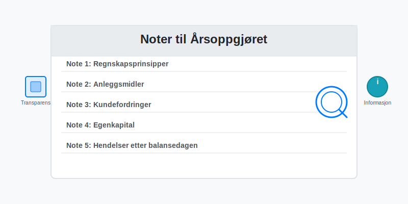
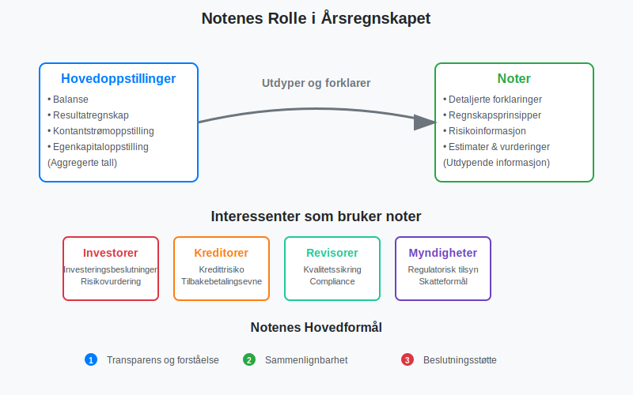
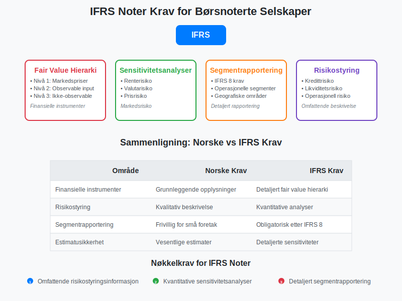
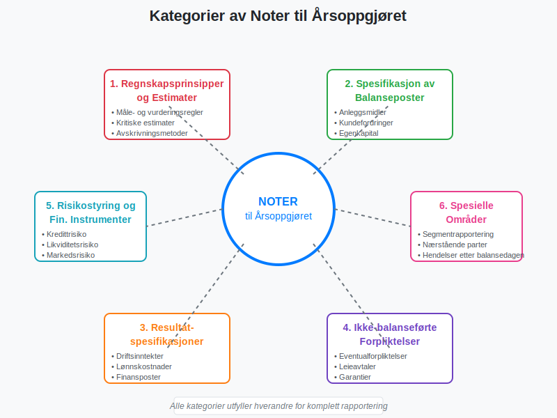
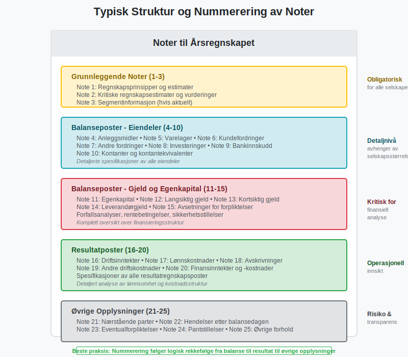
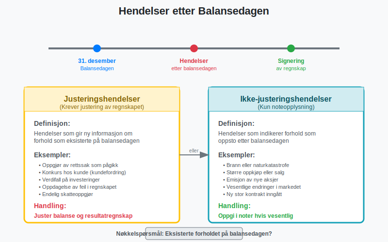
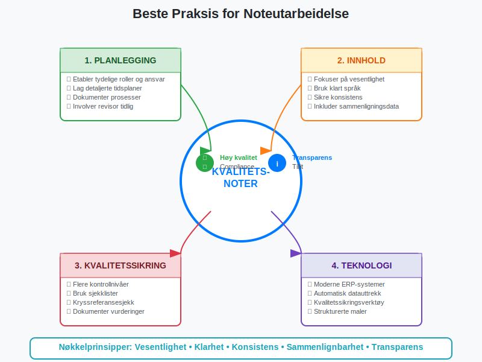

---
title: "Noter (årsoppgjør)"
meta_title: "Noter (årsoppgjør)"
meta_description: '**Noter** er en integrert del av [Ã¥rsregnskapet](/blogs/regnskap/hva-er-aarsregnskap "Hva er Ã…rsregnskap? Innhold, oppbygging og lovkrav i Norge") som gir det...'
slug: noter-aarsoppgjoer
type: blog
layout: pages/single
---

**Noter** er en integrert del av [årsregnskapet](/blogs/regnskap/hva-er-aarsregnskap "Hva er Årsregnskap? Innhold, oppbygging og lovkrav i Norge") som gir detaljerte [forklaringer](/blogs/regnskap/forklaring "Forklaring i regnskap") og tilleggsinformasjon til tallene presentert i balansen, resultatregnskapet og kontantstrømoppstillingen. Noter til årsoppgjøret er ikke bare en lovpålagt rapporteringskomponent, men også et kritisk verktøy for å sikre **transparens** og **forståelse** av selskapets økonomiske stilling og resultater.

Se også vår artikkel om [årsberetning](/blogs/regnskap/arsberetning "Årsberetning: Innhold, Krav og Guide til Norsk Årsberetning") for en fullstendig oversikt over årsrapportens struktur og innhold.

I norsk regnskapssammenheng reguleres noter primært av [bokføringsloven](/blogs/regnskap/hva-er-bokforingsloven "Hva er Bokføringsloven? Krav, Regler og Praktisk Veiledning") og regnskapsloven, samt [god regnskapsskikk](/blogs/regnskap/god-regnskapsskikk "God Regnskapsskikk - Prinsipper, Standarder og Beste Praksis i Norge"). For børsnoterte selskaper gjelder i tillegg [IFRS](/blogs/regnskap/hva-er-ifrs "Hva er IFRS? Komplett Guide til International Financial Reporting Standards")-standarder som stiller enda strengere krav til noteopplysninger.

## Hva er Noter til Årsoppgjøret?

Noter til årsoppgjøret er **tekstlige [forklaringer](/blogs/regnskap/forklaring "Forklaring i regnskap")** og **numeriske spesifikasjoner** som utdyper og supplerer informasjonen i de primære regnskapsoppstillingene. De fungerer som en bro mellom de aggregerte tallene i [balansen](/blogs/regnskap/hva-er-balanse "Hva er Balanse i Regnskap? Komplett Guide til Balansens Oppbygging og Funksjon") og [resultatregnskapet](/blogs/regnskap/hva-er-driftsregnskap "Hva er Driftsregnskap? Komplett Guide til Driftsregnskapet i Norge") og den detaljerte forståelsen som interessenter trenger for å ta informerte beslutninger.

### Formål med Noter

Noter tjener flere kritiske formål i finansiell rapportering:

* **Oppfyllelse av lovkrav:** Sikrer compliance med regnskapsstandarder og lovgivning
* **Økt transparens:** Gir innsikt i regnskapsprinsipper, estimater og vurderinger
* **Risikoinformasjon:** Beskriver finansielle og operasjonelle risikoer
* **Sammenlignbarhet:** Muliggjør sammenligning mellom perioder og selskaper
* **Beslutningsstøtte:** Gir investorer og kreditorer nødvendig informasjon

## Lovpålagte Krav til Noter

### Regnskapslovens Krav

Regnskapsloven § 7-1 til § 7-45 spesifiserer detaljerte krav til noteopplysninger. Kravene varierer basert på selskapets størrelse og type:

#### Store Foretak
Store foretak må oppgi omfattende noteinformasjon, inkludert:

* **Regnskapsprinsipper:** Detaljert beskrivelse av anvendte prinsipper
* **Estimatusikkerhet:** Områder med betydelig estimatusikkerhet
* **Segmentrapportering:** Informasjon om ulike forretningsområder
* **Risikostyring:** Omfattende beskrivelse av finansielle risikoer

#### Små Foretak
Små foretak har reduserte notekrav, men må fortsatt oppgi:

* **Grunnleggende regnskapsprinsipper**
* **Vesentlige poster** i balanse og resultatregnskap
* **Eventualforpliktelser** og **pantstillelser**

### IFRS-krav for Børsnoterte Selskaper

Børsnoterte selskaper som følger [IFRS](/blogs/regnskap/hva-er-ifrs "Hva er IFRS? Komplett Guide til International Financial Reporting Standards") har enda strengere notekrav, inkludert:

* **Fair value-hierarki** for finansielle instrumenter
* **Sensitivitetsanalyser** for markedsrisiko
* **Detaljert segmentrapportering** etter IFRS 8
* **Omfattende risikostyringsinformasjon**

## Kategorier av Noter

Noter til årsoppgjøret kan kategoriseres i flere hovedgrupper basert på deres innhold og formål:

### 1. Regnskapsprinsipper og Estimater

Disse notene beskriver de grunnleggende prinsippene som ligger til grunn for regnskapet:

* **MÃ¥le- og vurderingsregler** for ulike poster
* **Periodiseringsgrunnlag** og inntektsføringsprinsipper
* **Avskrivningsmetoder** for [anleggsmidler](/blogs/regnskap/hva-er-anleggsmidler "Hva er Anleggsmidler? Komplett Guide til Varige Driftsmidler")
* **Valutaomregning** for utenlandske datterselskaper
* **Kritiske regnskapsestimater** og vurderinger

### 2. Spesifikasjon av Balanseposter

Detaljerte oppdelinger av hovedpostene i balansen:

| Balansepost | Typiske Noteopplysninger |
|-------------|-------------------------|
| **[Anleggsmidler](/blogs/regnskap/hva-er-anleggsmidler "Hva er Anleggsmidler? Komplett Guide til Varige Driftsmidler")** | Anskaffelseskost, akkumulerte avskrivninger, årets avskrivninger |
| **Varelager** | Vurderingsmetode, nedskrivninger, forsikringsverdi |
| **[Kundefordringer](/blogs/regnskap/hva-er-kundefordring "Hva er Kundefordring? Komplett Guide til Fordringer og Reskontro")** | Aldersfordeling, tapsavsetninger, sikkerhetsstillelser |
| **[Egenkapital](/blogs/regnskap/hva-er-egenkapital "Hva er Egenkapital? Komplett Guide til Egenkapitalens Komponenter")** | Aksjekapitalens sammensetning, egenkapitalbevegelser |
| **Langsiktig gjeld** | Forfallstidspunkt, rentebetingelser, sikkerhetsstillelser |

### 3. Resultatspesifikasjoner

Utdypende informasjon om resultatregnskapets hovedposter:

* **[Driftsinntekter](/blogs/regnskap/hva-er-driftsinntekter "Hva er Driftsinntekter? Komplett Guide til Inntektsføring og Regnskapsføring")** fordelt på produktgrupper eller geografiske områder
* **[Lønnskostnader](/blogs/regnskap/hva-er-lonnskostnad "Hva er Lønnskostnad? Komplett Guide til Lønnsregnskapet") og antall ansatte**
* **Avskrivninger** fordelt på ulike anleggsmiddelkategorier
* **Finansposter** spesifisert på rente- og valutagevinster/-tap

### 4. Ikke-balanseførte Forpliktelser

Informasjon om forpliktelser som ikke fremgår av balansen:

* **Eventualforpliktelser:** Potensielle forpliktelser avhengig av fremtidige hendelser
* **Operasjonelle leieavtaler:** Fremtidige leieforpliktelser
* **Garantier:** Produktgarantier og andre garantiforpliktelser
* **Rettssaker:** Pågående rettstvister med økonomiske konsekvenser

### 5. Risikostyring og Finansielle Instrumenter

Omfattende beskrivelse av selskapets risikoeksponering:

* **Kredittrisiko:** Maksimal eksponering og konsentrasjonsrisiko
* **Likviditetsrisiko:** Forfallsanalyse av finansielle forpliktelser
* **Markedsrisiko:** Rente-, valuta- og prisrisiko
* **Sensitivitetsanalyser:** Effekt av endringer i markedsparametere

## Praktisk Utarbeidelse av Noter

### Planlegging og Struktur

Utarbeidelse av noter krever systematisk planlegging:

1. **Identifiser notekrav** basert på selskapets størrelse og regelverk
2. **Kartlegg vesentlige poster** som krever noteopplysninger
3. **Samle nødvendig informasjon** fra ulike avdelinger
4. **Strukturer notene** logisk og brukervennlig
5. **Kvalitetssikre** innhold og konsistens

### Notenes Nummerering og Referanser

Noter nummereres vanligvis sekvensielt og refereres til fra hovedoppstillingene:

* **Note 1:** Regnskapsprinsipper
* **Note 2:** Kritiske regnskapsestimater
* **Note 3:** Segmentinformasjon
* **Note 4-10:** Balanseposter (eiendeler)
* **Note 11-15:** Balanseposter (gjeld og egenkapital)
* **Note 16-20:** Resultatposter
* **Note 21-25:** Øvrige opplysninger

### Kvalitetssikring av Noter

Kvalitetssikring av noter er kritisk for å sikre korrekthet og compliance:

* **Intern gjennomgang** av alle noteopplysninger
* **Konsistenssjekk** mellom noter og hovedoppstillinger
* **Lovkravssjekk** mot gjeldende regelverk
* **Revisorgjennomgang** som del av [revisjonsprosessen](/blogs/regnskap/hva-er-arbeidspapirer-revisjon "Hva er Arbeidspapirer i Revisjon? Komplett Guide til Revisjonsdokumentasjon")

## Spesielle Noteområder

### Segmentrapportering

For selskaper med diversifiserte virksomheter er segmentrapportering en kritisk del av notene:

* **Forretningssegmenter:** Basert på produkter eller tjenester
* **Geografiske segmenter:** Basert på geografisk lokalisering
* **Segmentresultater:** Inntekter, kostnader og resultater per segment
* **Segmenteiendeler:** Allokering av eiendeler til segmenter

### [Nærstående Parter](/blogs/regnskap/naerstaende "Nærstående Parter i Regnskap")

Transaksjoner med [nærstående parter](/blogs/regnskap/naerstaende "Nærstående Parter i Regnskap") må opplyses detaljert:

* **Identifikasjon** av nærstående parter
* **Beskrivelse** av transaksjonstyper
* **Beløp** og vilkår for transaksjoner
* **Utestående saldi** ved periodens slutt

### Hendelser etter Balansedagen

Vesentlige hendelser som inntreffer etter balansedagen, men før regnskapet signeres:

* **Justeringshendelser:** Hendelser som gir ny informasjon om forhold som eksisterte på balansedagen
* **Ikke-justeringshendelser:** Hendelser som indikerer forhold som oppsto etter balansedagen

## Digitalisering og Automatisering av Noter

### Moderne Verktøy for Noteutarbeidelse

Teknologiske løsninger forenkler noteutarbeidelsen betydelig:

* **[ERP-systemer](/blogs/regnskap/hva-er-erp-system "Hva er ERP-system? Komplett Guide til Enterprise Resource Planning")** med integrerte rapporteringsmoduler
* **Spesialiserte regnskapsprogrammer** med notemal
* **Automatisk datauttrekk** fra underliggende systemer
* **Kvalitetssikringsverktøy** for konsistenssjekk

### XBRL og Strukturert Rapportering

For børsnoterte selskaper blir **XBRL** (eXtensible Business Reporting Language) stadig viktigere:

* **Standardiserte tagger** for noteopplysninger
* **Automatisk validering** av rapporterte data
* **Forbedret sammenlignbarhet** mellom selskaper
* **Effektivisert regulatorisk rapportering**

## Utfordringer og Beste Praksis

### Vanlige Utfordringer

Selskaper møter flere utfordringer ved utarbeidelse av noter:

* **Kompleksitet** i regelverk og standarder
* **Ressurskrevende** prosess med mange involverte parter
* **Balanse** mellom detaljnivå og lesbarhet
* **Konsistens** mellom perioder og med andre selskaper
* **Tidspres** i forbindelse med regnskapsavslutning

### Beste Praksis for Noteutarbeidelse

For å sikre høy kvalitet på noter bør selskaper følge etablerte beste praksis:

#### Planlegging og Organisering
* **Etabler tydelige roller** og ansvar for noteutarbeidelse
* **Lag detaljerte tidsplaner** med milepæler
* **Dokumenter prosesser** og kvalitetssikringsrutiner
* **Involver revisor** tidlig i prosessen

#### Innhold og Presentasjon
* **Fokuser på vesentlighet** - unngå unødvendige detaljer
* **Bruk klart språk** som er forståelig for målgruppen
* **Sikre konsistens** i terminologi og presentasjon
* **Inkluder relevante sammenligningsdata** fra tidligere perioder

#### Kvalitetssikring
* **Implementer flere kontrollnivåer** i gjennomgangsprosessen
* **Bruk sjekklister** basert på gjeldende regelverk
* **Utfør kryssreferansesjekk** mellom noter og hovedoppstillinger
* **Dokumenter alle vurderinger** og beslutninger

## Fremtidige Utviklingstrender

### Økt Fokus på Bærekraft

Med implementeringen av [CSRD](/blogs/regnskap/hva-er-csrd "CSRD - Corporate Sustainability Reporting Directive: Komplett Guide for Norske Bedrifter") vil noter til årsoppgjøret måtte inkludere mer omfattende bærekraftsinformasjon:

* **Miljøpåvirkning** og klimarisiko
* **Sosiale forhold** og menneskerettigheter  
* **Selskapsstyring** og etikk
* **Bærekraftsmål** og måloppnåelse

### Teknologisk Utvikling

Fremtidige teknologiske utviklinger vil påvirke noteutarbeidelsen:

* **Kunstig intelligens** for automatisk tekstgenerering
* **Maskinlæring** for identifikasjon av vesentlige forhold
* **Blockchain** for økt transparens og sporbarhet
* **Sanntidsrapportering** med kontinuerlig oppdaterte noter

### Regulatoriske Endringer

Regnskapsstandardene utvikler seg kontinuerlig:

* **Nye IFRS-standarder** med utvidede notekrav
* **Harmonisering** mellom nasjonale og internasjonale standarder
* **Økt fokus på** [risikostyring](/blogs/regnskap/hva-er-internkontroll "Hva er Internkontroll? Komplett Guide til Interne Kontrollsystemer") og transparens
* **Digitale rapporteringsformater** som standard

## Konklusjon

Noter til årsoppgjøret representerer en kritisk komponent i moderne finansiell rapportering som går langt utover å være en lovpålagt formalitet. De fungerer som et **transparent vindu** inn i selskapets økonomiske virkelighet og gir interessenter den dybdeinnsikten som er nødvendig for informerte beslutninger.

For å sikre høy kvalitet på noter må selskaper investere i:

* **Kompetente ressurser** med dyp forståelse av regelverk
* **Robuste prosesser** for datainnsamling og kvalitetssikring  
* **Moderne verktøy** som støtter effektiv utarbeidelse
* **Kontinuerlig oppdatering** på regulatoriske endringer

I en tid med økende krav til transparens og bærekraftsrapportering vil noter til årsoppgjøret fortsette å utvikle seg som et stadig viktigere kommunikasjonsverktøy mellom selskaper og deres interessenter. Selskaper som mestrer kunsten å utarbeide informative, presise og brukervennlige noter vil ha et betydelig konkurransefortrinn i kapitalmarkedene.

Gjennom systematisk tilnærming, fokus på vesentlighet og kontinuerlig forbedring kan noter til årsoppgjøret transformeres fra en byrdefull compliance-oppgave til et strategisk verktøy for å bygge tillit og støtte selskapets langsiktige verdiskaping.

