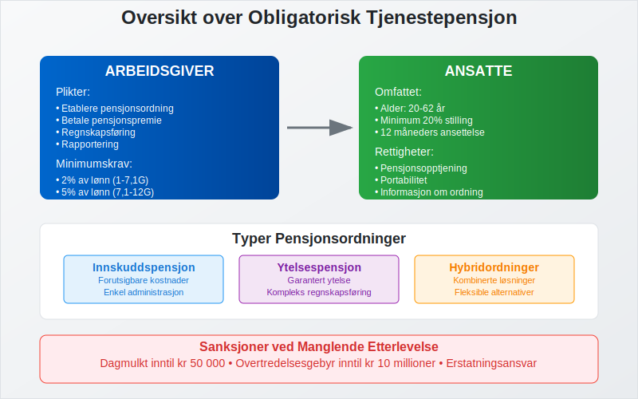
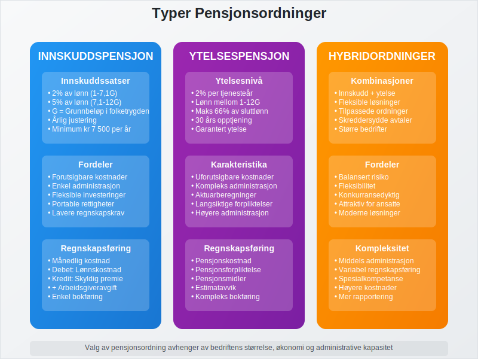
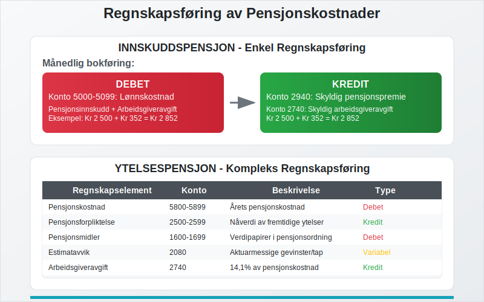
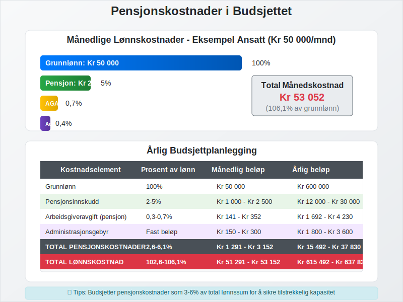
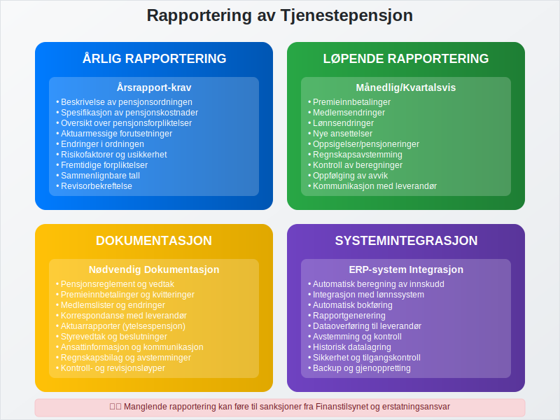

---
title: "Hva er obligatorisk tjenestepensjon?"
seoTitle: "Hva er obligatorisk tjenestepensjon?"
description: '**Obligatorisk tjenestepensjon** (OTP) er en lovpålagt pensjonsordning som alle norske arbeidsgivere må etablere for sine ansatte. Ordningen ble innført i 20...'
summary: "En praktisk guide til obligatorisk tjenestepensjon (OTP): lovkrav, valg av ordning, satser og regnskapsføring for norske arbeidsgivere."
---

**Obligatorisk tjenestepensjon** (OTP) er en lovpålagt pensjonsordning som alle norske arbeidsgivere må etablere for sine ansatte. Ordningen ble innført i 2006 gjennom lov om obligatorisk tjenestepensjon, og representerer en viktig del av det norske pensjonssystemet ved siden av [folketrygden](/blogs/regnskap/hva-er-folketrygden "Hva er Folketrygden? Komplett Guide til Norges Offentlige Pensjonssystem"). For en komplett oversikt over [tjenestepensjon](/blogs/regnskap/hva-er-tjenestepensjon "Hva er Tjenestepensjon? Komplett Guide til Bedriftspensjon og Regnskapsføring") generelt, inkludert ulike typer ordninger og regnskapsbehandling.
 
Merk at ansatte i offentlig sektor har egne pensjonsordninger med egne regelverk. Les mer i [Offentlig tjenestepensjon](/blogs/regnskap/offentlig-tjenestepensjon "Offentlig tjenestepensjon: Guide til Offentlige Pensjonsordninger og Regnskapsføring").

Arbeidsgivere kan også tilby en [Frivillig innskuddspensjon](/blogs/regnskap/frivillig-innskuddspensjon "Frivillig Innskuddspensjon: Guide til Frivillig Pensjonsordning") utover lovpålagt innskudd for å tiltrekke og beholde ansatte.

For ansatte som ønsker mer **oversikt** og **fleksibilitet**, kan de benytte [Egen pensjonskonto](/blogs/regnskap/hva-er-egen-pensjonskonto "Hva er Egen Pensjonskonto? En Guide til Egen Pensjonskonto i Norge") for å **samle pensjonsmidler** fra flere arbeidsgivere.

For bedrifter innebærer obligatorisk tjenestepensjon betydelige regnskapsmessige konsekvenser som må håndteres korrekt i [regnskapet](/blogs/regnskap/hva-er-regnskap "Hva er Regnskap? Komplett Guide til Regnskapsføring for Bedrifter") og [lønnskostnader](/blogs/regnskap/lonnskostnad "Lønnskostnad i Regnskap: Komplett Guide til Beregning og Føring").

## Seksjon 1: Lovkrav og Arbeidsgiverplikter

Alle arbeidsgivere i Norge som har ansatte i minst 20% stilling, må etablere obligatorisk tjenestepensjon. Dette gjelder uavhengig av bedriftens størrelse eller organisasjonsform.



### Hvem er omfattet av ordningen?

**Arbeidsgivere som må etablere OTP:**

* Alle [aksjeselskaper](/blogs/regnskap/hva-er-et-aksjeselskap "Hva er et Aksjeselskap? Komplett Guide til AS i Norge") med ansatte
* [Enkeltpersonforetak](/blogs/regnskap/hva-er-enkeltpersonforetak "Hva er Enkeltpersonforetak? Guide til ENK som Selskapsform") med ansatte
* [Ansvarlige selskaper](/blogs/regnskap/ansvarlig-selskap-delt-ansvar "Ansvarlig Selskap med Delt Ansvar: Komplett Guide til ANS") med ansatte
* Offentlige virksomheter og kommuner
* Ideelle organisasjoner med ansatte

**Ansatte som omfattes:**

* Alle ansatte mellom 20 og 62 år
* Minimum 20% stilling
* Ansettelsesforhold på minst 12 måneder

### Unntak fra ordningen

Enkelte grupper er unntatt fra kravet om obligatorisk tjenestepensjon:

* Ansatte som allerede har [tjenestepensjonsordning](/blogs/regnskap/hva-er-tjenestepensjonsordning "Hva er Tjenestepensjonsordning? Guide til Bedriftspensjon") som oppfyller minimumskravene
* Ansatte i offentlig sektor med eksisterende pensjonsordninger
* Selvstendig næringsdrivende uten ansatte
* Familiemedlemmer i [enkeltpersonforetak](/blogs/regnskap/hva-er-enkeltpersonforetak "Hva er Enkeltpersonforetak? Guide til ENK som Selskapsform")

## Seksjon 2: Pensjonsordninger og Alternativer

Arbeidsgivere kan velge mellom flere typer pensjonsordninger for å oppfylle kravet til obligatorisk tjenestepensjon.



### Innskuddsbasert Pensjon

**Innskuddspensjon** er den mest vanlige løsningen for små og mellomstore bedrifter:

| Innskuddssats | Lønnstrinn | Minimum årlig innskudd |
|---------------|------------|------------------------|
| 2% | 1-7,1G* | Kr 7 500 - Kr 37 000 |
| 5% | 7,1-12G* | Kr 37 000 - Kr 62 000 |

*G = Grunnbeløpet i folketrygden

**Fordeler med innskuddspensjon:**

* Forutsigbare kostnader for arbeidsgiver
* Enkel administrasjon
* Fleksibilitet i investeringsvalg
* Portable rettigheter for ansatte

### Ytelsesbasert Pensjon

**Ytelsespensjon** garanterer en bestemt pensjonsytelse basert på sluttlønn og tjenestetid:

* Minimum 2% av lønn mellom 1-12G per tjenesteår
* Maksimalt 66% av sluttlønn etter 30 års tjeneste
* Mer kompleks regnskapsføring
* Høyere administrasjonskostnader

### Hybridordninger

Mange større bedrifter velger **hybridløsninger** som kombinerer elementer fra både innskudds- og ytelsesbaserte ordninger.

## Seksjon 3: Regnskapsføring av Pensjonskostnader

Regnskapsføring av obligatorisk tjenestepensjon krever nøye oppfølging av både løpende kostnader og fremtidige forpliktelser.



### Innskuddspensjon - Regnskapsbehandling

For **innskuddsbaserte ordninger** er regnskapsføringen relativt enkel:

**Månedlig bokføring:**
```
Debet: Lønnskostnad (konto 5000-5099)
Kredit: Skyldig pensjonspremie (konto 2940)
```

**Ved betaling av premie:**
```
Debet: Skyldig pensjonspremie (konto 2940)
Kredit: Bank (konto 1920)
```

### Ytelsespensjon - Regnskapsbehandling

**Ytelsesbaserte ordninger** krever mer kompleks regnskapsføring i henhold til [regnskapsstandard](/blogs/regnskap/norsk-regnskapsstandard-nrs "Norsk Regnskapsstandard (NRS): Komplett Guide til Regnskapsregler"):

| Regnskapselement | Konto | Beskrivelse |
|------------------|-------|-------------|
| Pensjonskostnad | 5800-5899 | Årets pensjonskostnad |
| Pensjonsforpliktelse | 2500-2599 | Nåverdi av fremtidige ytelser |
| Pensjonsmidler | 1600-1699 | Verdipapirer i pensjonsordning |
| Estimatavvik | 2080 | Aktuarmessige gevinster/tap |

### Arbeidsgiveravgift på Pensjon

**Arbeidsgiveravgift** må beregnes på pensjonspremier:

* Standard sats: 14,1% (varierer etter geografisk sone)
* Gjelder både innskudds- og ytelsesbaserte ordninger
* Må inkluderes i [arbeidsgiveravgift](/blogs/regnskap/hva-er-arbeidsgiveravgift "Hva er Arbeidsgiveravgift? Komplett Guide til Beregning og Innbetaling")-beregningen

## Seksjon 4: Kostnader og Budsjettplanlegging

Pensjonskostnader utgjør en betydelig del av bedriftens totale [lønnskostnader](/blogs/regnskap/lonnskostnad "Lønnskostnad i Regnskap: Komplett Guide til Beregning og Føring") og må planlegges nøye.



### Beregning av Årlige Pensjonskostnader

**For innskuddspensjon:**

```
Årlig pensjonskostnad = (Lønn × Innskuddssats) + Administrasjonsgebyr + Arbeidsgiveravgift
```

**Eksempel beregning:**
* Ansatt med årslønn: Kr 500 000
* Innskuddssats: 5%
* Årlig innskudd: Kr 25 000
* Arbeidsgiveravgift (14,1%): Kr 3 525
* Administrasjonsgebyr: Kr 2 000
* **Total årlig kostnad: Kr 30 525**

### Budsjettplanlegging

Pensjonskostnader bør integreres i bedriftens [budsjettering](/blogs/regnskap/hva-er-budsjettering "Hva er Budsjettering? Komplett Guide til Budsjettplanlegging for Bedrifter"):

**Månedlige kostnader:**

| Kostnadselement | Prosent av lønn | Månedlig beløp* |
|-----------------|-----------------|-----------------|
| Pensjonsinnskudd | 2-5% | Kr 833 - Kr 2 083 |
| Arbeidsgiveravgift | 0,3-0,7% | Kr 125 - Kr 292 |
| Administrasjon | Fast beløp | Kr 150 - Kr 300 |

*Basert på gjennomsnittlig månedslønn Kr 41 667

## Seksjon 5: Valg av Pensjonsleverandør

Valg av riktig pensjonsleverandør påvirker både kostnader og administrative byrder for bedriften.

### Sammenligning av Leverandører

**Viktige faktorer ved valg:**

* **Kostnadsstruktur:** Administrasjonsgebyrer og forvaltningskostnader
* **Investeringsalternativer:** Antall fond og risikoprofiler
* **Digital løsning:** Integrasjon med [lønnssystem](/blogs/regnskap/hva-er-lonnslipp "Hva er Lønnsslipp? Komplett Guide til Lønnsutbetaling og Dokumentasjon")
* **Kundeservice:** Tilgjengelighet og kompetanse
* **Rapportering:** Kvalitet på rapporter til arbeidsgiver og ansatte

### Leverandørkategorier

| Leverandørtype | Fordeler | Ulemper |
|----------------|----------|---------|
| Tradisjonelle forsikringsselskaper | Erfaring, stabilitet | Høyere kostnader |
| Banker med pensjonsdivisjon | Helhetlige tjenester | Begrenset spesialisering |
| Rene pensjonsleverandører | Lave kostnader, digitale løsninger | Mindre erfaring |

## Seksjon 6: Rapportering og Dokumentasjon

Obligatorisk tjenestepensjon krever systematisk rapportering og dokumentasjon som del av bedriftens [internkontroll](/blogs/regnskap/hva-er-internkontroll "Hva er Internkontroll? Komplett Guide til Risikostyring og Kontrollsystemer").



### Årlig Rapportering

**Årsrapport-krav:**

* Beskrivelse av pensjonsordningen i [årsrapporten](/blogs/regnskap/hva-er-kvartalsrapport "Hva er Kvartalsrapport? Guide til Periodisk Regnskapsrapportering")
* Spesifikasjon av pensjonskostnader
* Oversikt over pensjonsforpliktelser (ytelsespensjon)
* Aktuarmessige forutsetninger og endringer

### Løpende Dokumentasjon

**Nødvendig dokumentasjon:**

* Pensjonsreglement og vedtak
* Premieinnbetalinger og kvitteringer
* Medlemslister og endringer
* Korrespondanse med pensjonsleverandør
* Aktuarrapporter (ytelsespensjon)

### Integrasjon med Regnskapssystem

Moderne [ERP-systemer](/blogs/regnskap/hva-er-erp-system "Hva er ERP-system? Enterprise Resource Planning for Bedrifter") kan automatisere mye av pensjonsadministrasjonen:

* Automatisk beregning av pensjonsinnskudd
* Integrasjon med lønnssystem
* Automatisk bokføring av pensjonskostnader
* Rapportgenerering for myndigheter

## Seksjon 7: Sanksjoner og Konsekvenser

Manglende etablering av obligatorisk tjenestepensjon kan få alvorlige konsekvenser for arbeidsgivere.

### Sanksjoner fra Finanstilsynet

**Finanstilsynet** kan ilegge følgende sanksjoner:

* **Dagmulkt:** Inntil Kr 50 000 per dag
* **Overtredelsesgebyr:** Inntil Kr 10 millioner
* **Offentliggjøring:** Av overtredelsen
* **Pålegg:** Om umiddelbar etablering av ordning

### Erstatningsansvar

Arbeidsgivere kan bli erstatningsansvarlige overfor ansatte for:

* Tapt pensjonsopptjening
* Renter og omkostninger
* Advokatkostnader i rettssaker

### Skattemessige Konsekvenser

Manglende pensjonsinnskudd kan påvirke:

* Fradragsrett for [lønnskostnader](/blogs/regnskap/lonnskostnad "Lønnskostnad i Regnskap: Komplett Guide til Beregning og Føring")
* Beregning av [arbeidsgiveravgift](/blogs/regnskap/hva-er-arbeidsgiveravgift "Hva er Arbeidsgiveravgift? Komplett Guide til Beregning og Innbetaling")
* Forhold til skattemyndighetene

## Seksjon 8: Fremtidige Endringer og Utvikling

Pensjonssystemet er i kontinuerlig utvikling, og bedrifter må følge med på endringer som påvirker obligatorisk tjenestepensjon.

### Kommende Regelverksendringer

**Forventede endringer:**

* Økte minimumskrav til innskuddssatser
* Strengere krav til investeringsalternativer
* Forbedret portabilitet mellom ordninger
* Digitalisering av rapportering

### Bærekraft og ESG

Tjenestepensjon blir stadig viktigere i [ESG-sammenheng](/blogs/regnskap/hva-er-esg "Hva er ESG? Environmental, Social & Governance i Regnskap og Rapportering"):

* Bærekraftige investeringsalternativer
* Rapportering av klimarisiko i pensjonsporteføljer
* Sosial bærekraft og ansattes velferd
* Governance-aspekter ved pensjonsstyring

## Konklusjon

Obligatorisk tjenestepensjon er en kompleks, men viktig del av norsk arbeidsliv som krever grundig forståelse og systematisk håndtering. For bedrifter innebærer dette:

**Viktige takeaways:**

* **Lovpålagt ordning** for alle arbeidsgivere med ansatte
* **Betydelige regnskapsmessige konsekvenser** som må håndteres korrekt
* **Valg mellom ulike pensjonsordninger** basert på bedriftens behov
* **Løpende administrasjon og rapportering** som del av internkontrollen
* **Alvorlige sanksjoner** ved manglende etterlevelse

Ved å etablere gode rutiner for håndtering av obligatorisk tjenestepensjon sikrer bedrifter både regelverksetterlevelse og en god pensjonsordning for sine ansatte. Dette bidrar til å styrke bedriftens attraktivitet som arbeidsgiver og sikrer langsiktig bærekraft i personalforvaltningen.

For bedrifter som trenger hjelp med implementering av obligatorisk tjenestepensjon, anbefales det å konsultere med [regnskapsførere](/blogs/regnskap/hva-er-en-regnskapsforer "Hva er en Regnskapsfører? Komplett Guide til Regnskapsføring") eller pensjonskonsulenter som kan gi skreddersydde råd basert på bedriftens spesifikke situasjon.


