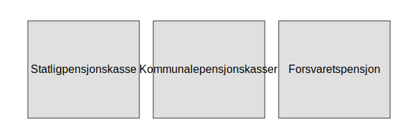

---
title: "Offentlig tjenestepensjon"
meta_title: "Offentlig tjenestepensjon"
meta_description: ''
slug: offentlig-tjenestepensjon
type: blog
layout: pages/single
---

**Offentlig tjenestepensjon** er pensjonsordninger for ansatte i offentlig sektor som komplement til **folketrygden**. Disse ordningene omfatter statlige, kommunale og fylkeskommunale pensjonskasser, og har særskilte regelverk, ytelsesnivåer og regnskapskrav sammenlignet med private ordninger som [obligatorisk tjenestepensjon](/blogs/regnskap/obligatorisk-tjenestepensjon "Obligatorisk tjenestepensjon Guide") og [frivillig innskuddspensjon](/blogs/regnskap/frivillig-innskuddspensjon "Frivillig Innskuddspensjon: Guide til Frivillig Pensjonsordning for Bedrifter og Ansatte").

## Seksjon 1: Hva er Offentlig tjenestepensjon?

**Offentlig tjenestepensjon** er pensjonsordninger etablert for ansatte i statlig, kommunal og fylkeskommunal sektor. Disse ordningene sikrer en forutsigbar pensjonsytelse basert på lønn og ansiennitet, og forvaltes av egne pensjonskasser som [Statens pensjonskasse](/blogs/regnskap/statens-pensjonskasse "Statens pensjonskasse") eller kommunale pensjonskasser.

## Seksjon 2: Typer Offentlig tjenestepensjon

| Ordningstype              | Forvalter                  | Beregningsgrunnlag             | Risikobærer       |
|:--------------------------|:---------------------------|:-------------------------------|:------------------|
| Statlig tjenestepensjon   | [Statens pensjonskasse](/blogs/regnskap/statens-pensjonskasse "Statens pensjonskasse") | Lønn og ansiennitet            | Offentlig sektor  |
| Kommunal tjenestepensjon  | Kommunale pensjonskasser   | Lønn og ansiennitet            | Offentlig sektor  |
| Forsvarets pensjon        | [Statens pensjonskasse](/blogs/regnskap/statens-pensjonskasse "Statens pensjonskasse") | Spesifiserte tjenesteår        | Offentlig sektor  |

## Seksjon 3: Regnskapsmessige implikasjoner

For offentlige virksomheter må pensjonsforpliktelser regnskapsføres i henhold til [god regnskapsskikk](/blogs/regnskap/god-regnskapsskikk "God regnskapsskikk: Prinsipper og Retningslinjer") og offentlige rapporteringsstandarder.

**Hovedpunkter for regnskapsføring:**

* Pensjonsforpliktelser må måles aktuarmessig og presenteres som langsiktige forpliktelser.
* Periodiserte pensjonskostnader påvirker balansens gjeldsside og resultatregnskapet.
* Noteopplysninger skal inkludere sensitivitet for antatt dødelighet, avkastning og diskonteringsrente.

| Post                             | Regnskapsføring                          |
|:---------------------------------|:-----------------------------------------|
| Akkumulert pensjonsforpliktelse  | Langsiktig gjeld                         |
| Periodisert pensjonskostnad      | Lønns- og pensjonskostnader              |
| Avstemming av forpliktelser      | Noteopplysninger med nøkkeltall og forutsetninger |

## Seksjon 4: Sammenligning med private ordninger

Offentlig tjenestepensjon har ofte **høyere forutsigbarhet** og **ytelsesgaranti** sammenlignet med private pensjonsordninger.

| Egenskap                  | Offentlig tjenestepensjon     | Obligatorisk tjenestepensjon   |
|:--------------------------|:------------------------------|:------------------------------|
| Ytelsesgaranti            | Ja                             | Nei                            |
| Investeringsrisiko        | Arbeidsgiver                   | Ansatt                         |
| Beregningsgrunnlag        | Lønn og ansiennitet            | Uttakspunkt og bidrag          |
| Forvaltningskostnader     | Lavere (statlig/kommunal)      | Varierende (kommersielle aktører) |

For en mer detaljert oversikt over private ordninger, se [Hva er obligatorisk tjenestepensjon?](/blogs/regnskap/obligatorisk-tjenestepensjon "Obligatorisk tjenestepensjon Guide") og [Hva er frivillig innskuddspensjon?](/blogs/regnskap/frivillig-innskuddspensjon "Frivillig Innskuddspensjon: Guide til Frivillig Pensjonsordning for Bedrifter og Ansatte").

## Seksjon 5: Videre lesning

* [Hva er tjenestepensjon?](/blogs/regnskap/hva-er-tjenestepensjon "Hva er Tjenestepensjon? Komplett Guide til Bedriftspensjon og Regnskapsføring")
* [Hva er folketrygden?](/blogs/regnskap/hva-er-folketrygden "Hva er Folketrygden? Komplett Guide til Norges Offentlige Pensjonssystem")
* [Obligatorisk tjenestepensjon](/blogs/regnskap/obligatorisk-tjenestepensjon "Hva er Obligatorisk tjenestepensjon")

