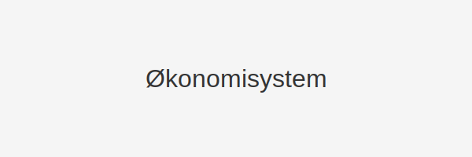

---
title: "Økonomisystem"
seoTitle: "Økonomisystem"
meta_description: 'Et **økonomisystem** er en integrert programvareløsning som hjelper bedrifter med å håndtere alle økonomiske prosesser, fra **bokføring** og **fakturering...'
slug: okonomisystem
type: blog
layout: pages/single
---

Et **økonomisystem** er en integrert programvareløsning som hjelper bedrifter med å håndtere alle økonomiske prosesser, fra **bokføring** og **fakturering** til **rapportering** og **analyse** av regnskapsdata. For norske virksomheter er et solid økonomisystem essensielt for å sikre **god regnskapspraksis** og etterlevelse av norske lover og forskrifter.

*Se også: [Hva er regnskap?](/blogs/regnskap/hva-er-regnskap "Hva er regnskap? En Dybdeanalyse for Norge") | [Hva er ERP-system?](/blogs/regnskap/hva-er-erp-system "Hva er ERP-system? Komplett Guide til Enterprise Resource Planning")*

## Hva er et økonomisystem?

> Et økonomisystem samler alle finansielle data i én plattform, slik at bedriften får full kontroll over **inntekter**, **kostnader**, **likviditet** og **rapportering** i sanntid.

## Nøkkelfunksjoner i et økonomisystem

- **Bokføring:** Automatisert registrering og klassifisering av alle transaksjoner.
- **Fakturering:** Generering og utsendelse av fakturaer i henhold til norske krav.
- **Rapportering:** Standardiserte og tilpassede rapporter for regnskap, budsjett og prognoser.
- **Bankintegrasjon:** Automatisk avstemming mot [banktransaksjoner](/blogs/regnskap/hva-er-banktransaksjoner "Hva er Banktransaksjoner? Komplett Guide til Bankavstemminger").
- **API-integrasjon:** Sømløs datautveksling med andre systemer, se [API-integrasjon og automatisering av regnskap](/blogs/regnskap/api-integrasjon-automatisering-regnskap "API-integrasjon og automatisering av regnskap").
- **Regnskapstilpasning:** Konfigurasjon for norske regnskapsstandarder og skatteregler.

## Typer økonomisystemer

| **Type**                           | **Beskrivelse**                                                                 |
|------------------------------------|---------------------------------------------------------------------------------|
| ERP-systemer                       | Komplett løsning for alle forretningsprosesser, inkl. regnskap, HR og lagerstyring. |
| Dedikerte økonomisystemer          | Fokusert på regnskap og økonomi med standardmoduler for fakturering og rapportering. |
| Skybaserte økonomisystemer         | Tilgang via nettleser, med automatisk oppdatering og skalerbar infrastruktur.    |
| Lokalt installerte økonomisystemer | Tradisjonelle installasjoner på egen server, med full kontroll over data.        |

## Fordeler med et moderne økonomisystem

- **Effektivisering:** Automatisert arbeidsflyt reduserer manuelle oppgaver og feil.
- **Kostnadsbesparelser:** Mindre tidsbruk på rutineoppgaver gir lavere driftskostnader.
- **Sanntidsinnsikt:** Oppdaterte nøkkeltall og rapporter tilgjengelig når som helst.
- **Skalerbarhet:** Systemet vokser med bedriften, uten behov for bytte.
- **Samsvar:** Forenkler etterlevelse av norske regnskapslover og revisjonskrav.

## Implementering og valg av økonomisystem

> Når du skal velge økonomisystem, bør du vurdere:

- **Pris:** Total eierkostnad inkludert lisenser, implementering og support.
- **Funksjonalitet:** Støtte for nødvendige moduler og integrasjoner.
- **Brukervennlighet:** Intuitivt grensesnitt og opplæringsbehov.
- **Leverandør:** Erfaring med norske regnskapsprosesser og regelverk.

For en grundig gjennomgang av tilgjengelige løsninger kan du også se [ERP-systemer](/blogs/regnskap/hva-er-erp-system "Hva er ERP-system? Komplett Guide til Enterprise Resource Planning").

