---
title: "Hva er omvendt avgiftsplikt?"
seoTitle: "Omvendt avgiftsplikt | Regler, bokføring og MVA-melding"
description: 'Omvendt avgiftsplikt betyr at kjøper beregner og betaler MVA i stedet for selger. Denne guiden forklarer når regelen gjelder, hvordan beregning og bokføring gjøres, og hva som rapporteres i MVA-meldingen.'
summary: "Omvendt avgiftsplikt betyr at kjøper beregner og rapporterer MVA i stedet for selger. Guiden dekker når regelen gjelder, beregning, bokføring og rapportering i MVA-meldingen."
---

**Omvendt avgiftsplikt** er en spesiell ordning innenfor merverdiavgiftssystemet hvor **kjøperen**, ikke selgeren, blir ansvarlig for å beregne og betale MVA til staten. Dette systemet brukes i spesifikke situasjoner for å forenkle avgiftsinnkrevingen og forhindre avgiftsunndragelse.

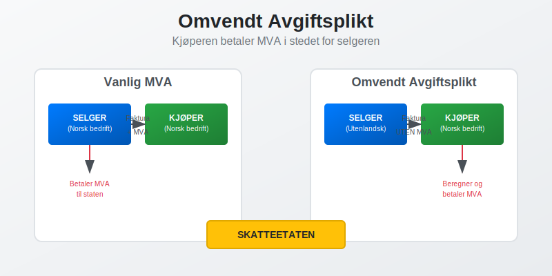

## Hva er Omvendt Avgiftsplikt?

**Omvendt avgiftsplikt** innebærer at ansvaret for å håndtere [MVA](/blogs/regnskap/hva-er-moms-mva "Hva er Merverdiavgift (MVA)? Komplett Guide til Norsk MVA-system") flyttes fra selger til kjøper. I stedet for at selgeren legger til MVA på fakturaen og betaler denne til staten, må kjøperen selv beregne og innbetale avgiften.

### Grunnleggende Prinsipper

Omvendt avgiftsplikt bygger på følgende prinsipper:

* **Ansvarsskifte** - kjøperen overtar selgerens MVA-ansvar
* **Selvfakturering** - kjøperen må selv beregne og rapportere MVA
* **Samtidig fradrag** - kjøperen kan ofte trekke fra samme MVA som inngående avgift
* **Forenkling** - reduserer administrative byrder for utenlandske leverandører

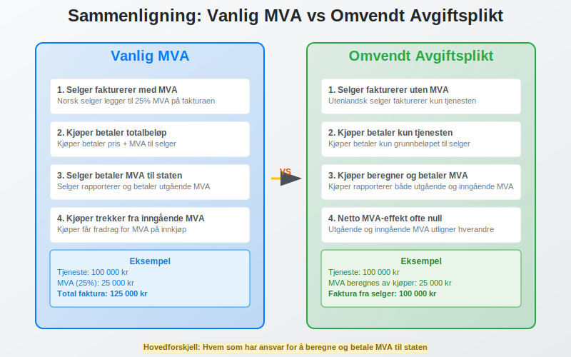

## Når Gjelder Omvendt Avgiftsplikt?

### Tjenester fra Utlandet

**Omvendt avgiftsplikt** gjelder når norske [foretak](/blogs/regnskap/hva-er-foretak "Hva er et Foretak? Komplett Guide til Foretaksformer i Norge") kjøper tjenester fra utenlandske leverandører:

* **Konsulenttjenester** og rådgivning
* **IT-tjenester** og programvareutvikling
* **Markedsføringstjenester** og reklame
* **Juridiske tjenester** og revisjon
* **Tekniske tjenester** og ingeniørarbeid
* **Utdanning** og kursvirksomhet

### Elektroniske Tjenester

For **elektroniske tjenester** gjelder omvendt avgiftsplikt når:

* Tjenesten leveres elektronisk
* Leverandøren er etablert utenfor Norge
* Kjøperen er et norsk foretak
* Tjenesten brukes i Norge

**Merk:** For digitale tjenester solgt til privatpersoner, gjelder ikke omvendt avgiftsplikt; disse omfattes av [VOEC-ordningen](/blogs/regnskap/voec "Hva er VOEC? Komplett guide til VOEC-ordningen").

### Varer med Installasjon

**Omvendt avgiftsplikt** kan også gjelde for:

* Varer levert med installasjon eller montering
* Bygge- og anleggsarbeider utført av utenlandske entreprenører ([Hva er en Entreprenør?](/blogs/regnskap/entreprenor "Hva er en Entreprenør?"))
* Reparasjoner av fast eiendom

| Situasjon | Omvendt avgiftsplikt | Vanlig MVA |
|-----------|---------------------|------------|
| **Norsk leverandør til norsk kunde** | Nei | Ja |
| **Utenlandsk tjeneste til norsk foretak** | Ja | Nei |
| **Utenlandsk vare til norsk forbruker** | Nei | Ja (ved import) |
| **Elektronisk tjeneste fra utlandet** | Ja (til foretak) | Nei |

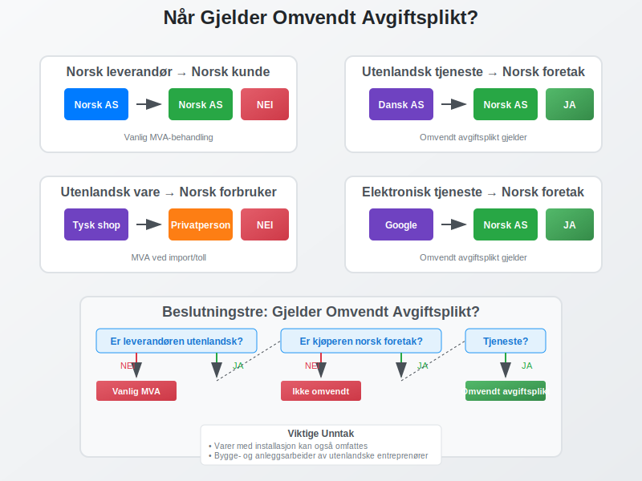

## Hvordan Fungerer Omvendt Avgiftsplikt?

### For Kjøperen (Norsk Foretak)

Når du kjøper tjenester som omfattes av omvendt avgiftsplikt:

1. **Motta faktura** uten MVA fra utenlandsk leverandør
2. **Beregn MVA** selv (vanligvis 25%)
3. **Rapporter** både utgående og inngående MVA i [MVA-meldingen](/blogs/regnskap/hva-er-mva-melding "Hva er MVA-melding? Guide til Innlevering og Frister")
4. **Trekk fra** inngående MVA hvis du har fradragsrett

### For Selgeren (Utenlandsk Leverandør)

Den utenlandske leverandøren:

* **Fakturerer uten** norsk MVA
* **Markerer** fakturaen med "omvendt avgiftsplikt"
* **Slipper** å registrere seg i Norge
* **Har ikke** ansvar for norsk MVA

### Praktisk Eksempel

**Situasjon**: Norsk [aksjeselskap](/blogs/regnskap/hva-er-et-aksjeselskap "Hva er et Aksjeselskap (AS)? Komplett Guide til Norske AS") kjøper IT-konsulentjenester for 100 000 kr fra dansk selskap.

**Prosess**:
1. Dansk selskap sender [faktura](/blogs/regnskap/hva-er-en-faktura "Hva er en Faktura? En Guide til Norske Fakturakrav") på 100 000 kr uten MVA
2. Norsk selskap beregner MVA: 100 000 kr × 25% = 25 000 kr
3. I MVA-meldingen rapporteres:
   - Utgående MVA: 25 000 kr
   - Inngående MVA: 25 000 kr (med fradragsrett)
4. Netto MVA-effekt: 0 kr (hvis full fradragsrett)

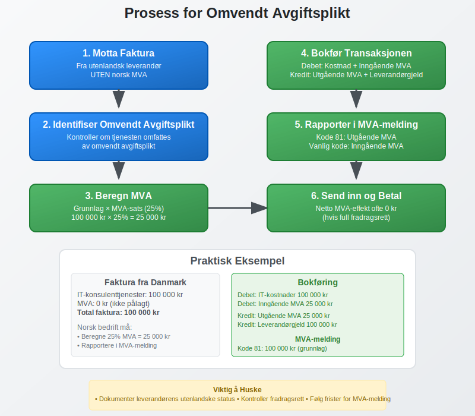

## Bokføring av Omvendt Avgiftsplikt

### Kontering ved Kjøp

Når du [bokfører](/blogs/regnskap/hva-er-bokforing "Hva er Bokføring? Komplett Guide til Norsk Bokføring") kjøp med omvendt avgiftsplikt:

**Eksempel**: Kjøp av konsulenttjenester for 100 000 kr

```
Debet: Kostnader (konsulenttjenester)     100 000 kr
Debet: Inngående MVA                       25 000 kr
Kredit: Utgående MVA                       25 000 kr
Kredit: Leverandørgjeld                   100 000 kr
```

### Spesielle Kontoer

For omvendt avgiftsplikt brukes ofte:

* **Konto 2740** - Utgående MVA omvendt avgiftsplikt
* **Konto 2700** - Inngående MVA omvendt avgiftsplikt
* **Konto 2701** - Inngående MVA ikke fradragsberettiget

### Dokumentasjon

**Viktig dokumentasjon** inkluderer:

* Originalfaktura fra utenlandsk leverandør
* Beregning av MVA-grunnlag
* Dokumentasjon på leverandørens utenlandske status
* Beskrivelse av tjenesten som er levert

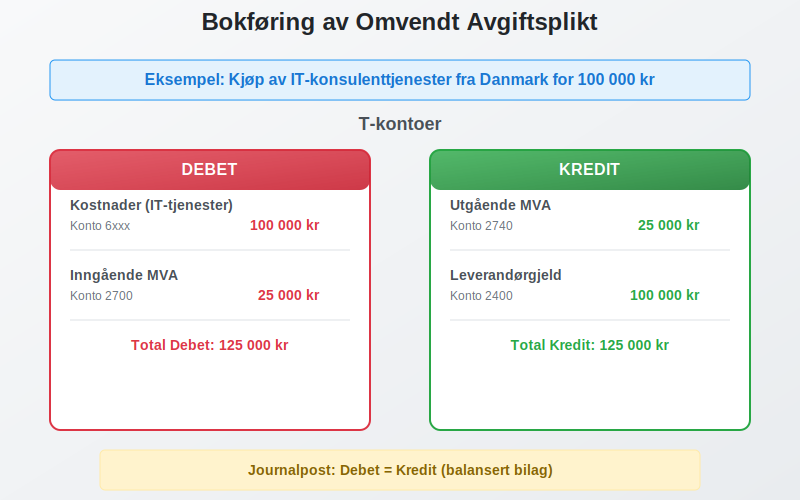

## Rapportering i MVA-melding

### Koder for Omvendt Avgiftsplikt

I **MVA-meldingen** brukes spesifikke koder:

| Kode | Beskrivelse | Grunnlag | MVA |
|------|-------------|----------|-----|
| **81** | Kjøp av tjenester fra utlandet (25%) | Ja | Ja |
| **82** | Kjøp av tjenester fra utlandet (15%) | Ja | Ja |
| **83** | Kjøp av tjenester fra utlandet (12%) | Ja | Ja |
| **86** | Kjøp av klimakvoter/gull (25%) | Ja | Ja |
| **88** | Kjøp av varer med installasjon (25%) | Ja | Ja |

### Utfylling av MVA-melding

**Trinn for rapportering**:

1. **Oppgi grunnlag** i relevant kodelinje (81, 82, 83, etc.)
2. **Beregn utgående MVA** automatisk eller manuelt
3. **Rapporter inngående MVA** på vanlig måte (hvis fradragsrett)
4. **Kontroller** at beløpene stemmer med [regnskapet](/blogs/regnskap/hva-er-regnskap "Hva er Regnskap? Komplett Guide til Norsk Regnskapsføring")

### Frister og Innlevering

**MVA-melding** med omvendt avgiftsplikt følger samme frister:

* **Månedlig** for store virksomheter
* **To-månedlig** for mellomstore virksomheter  
* **Årlig** for små virksomheter

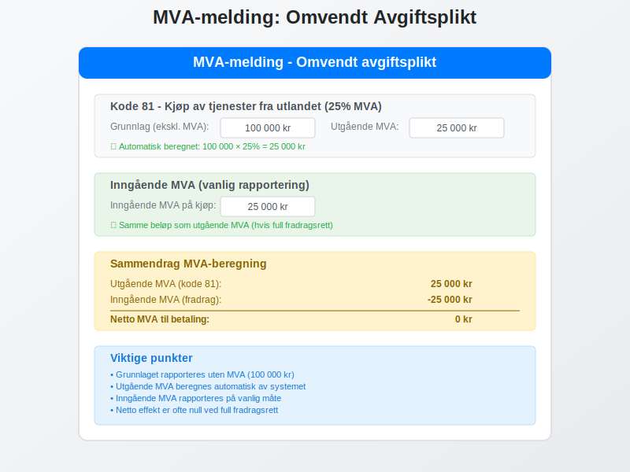

## Fradragsrett ved Omvendt Avgiftsplikt

### Når Har Du Fradragsrett?

**Fradragsrett** for inngående MVA ved omvendt avgiftsplikt avhenger av:

* **Virksomhetens aktivitet** - må være avgiftspliktig
* **Tjenestens bruk** - må brukes i avgiftspliktig virksomhet
* **Registreringsstatus** - må være registrert i MVA-registeret
* **Dokumentasjon** - må ha tilstrekkelig dokumentasjon

### Full Fradragsrett

**Full fradragsrett** gjelder når:

* Tjenesten brukes 100% i avgiftspliktig virksomhet
* [Foretaket](/blogs/regnskap/hva-er-foretak "Hva er et Foretak? Komplett Guide til Foretaksformer i Norge") kun driver avgiftspliktig aktivitet
* Alle betingelser for fradrag er oppfylt

### Delvis Fradragsrett

**Delvis fradragsrett** kan gjelde når:

* Tjenesten brukes både i avgiftspliktig og fritatt virksomhet
* Foretaket har blandet aktivitet
* Fordeling må dokumenteres og beregnes

### Ingen Fradragsrett

**Ingen fradragsrett** gjelder når:

* Tjenesten brukes i MVA-fritatt virksomhet
* Kjøperen ikke er registrert for MVA
* Tjenesten er til privat bruk

| Bruksområde | Fradragsrett | Eksempel |
|-------------|--------------|----------|
| **100% avgiftspliktig virksomhet** | Full | IT-system for salgsvirksomhet |
| **Blandet bruk** | Delvis | Regnskapssystem for blandet virksomhet |
| **MVA-fritatt virksomhet** | Ingen | Konsulenttjenester for bank |
| **Privat bruk** | Ingen | Personlig rådgivning |

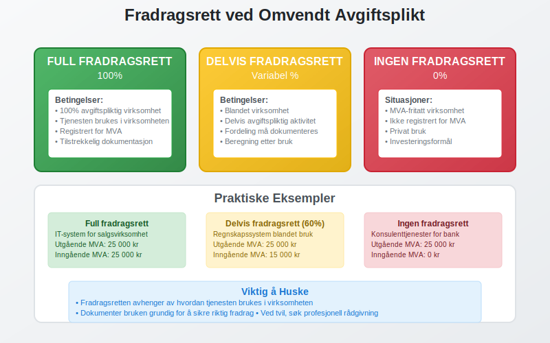

## Vanlige Feil og Fallgruver

### Typiske Feil

**Vanlige feil** ved omvendt avgiftsplikt:

* **Glemmer å beregne MVA** på kjøp fra utlandet
* **Feil MVA-sats** - bruker feil prosentsats
* **Manglende rapportering** i MVA-melding
* **Feil kontering** i regnskapet
* **Manglende dokumentasjon** av leverandørens status

### Konsekvenser av Feil

**Feil håndtering** kan føre til:

* **Tilleggsskatt** på 20% av MVA-beløpet
* **Forsinkelsesrente** fra forfallsdato
* **Kontrollavgift** ved grov uaktsomhet
* **Revisjoner** fra Skatteetaten

### Hvordan Unngå Feil

**Forebyggende tiltak**:

1. **Etabler rutiner** for identifisering av omvendt avgiftsplikt
2. **Opplær ansatte** i regelverket
3. **Bruk [ERP-systemer](/blogs/regnskap/hva-er-erp-system "Hva er ERP-system? Komplett Guide til Enterprise Resource Planning")** med MVA-funksjonalitet
4. **Dokumenter** alle transaksjoner grundig
5. **Gjennomgå** MVA-meldinger før innsending

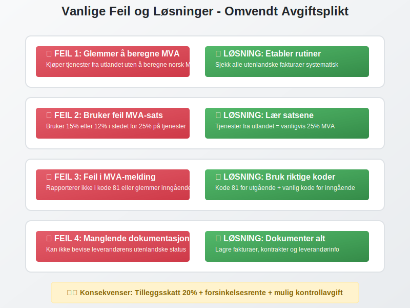

## Internasjonale Aspekter

### EU-regler

**EU-direktiver** påvirker omvendt avgiftsplikt:

* **Stedsregler** for tjenester
* **B2B-transaksjoner** mellom EU-land
* **Elektroniske tjenester** og digitale plattformer
* **Harmonisering** av regler

### Brexit-konsekvenser

**Brexit** har endret reglene for:

* Handel med Storbritannia
* Tjenestekjøp fra britiske selskaper
* Dokumentasjonskrav
* Tollbehandling

### Globale Trender

**Internasjonale utviklingstrekk**:

* Økt digitalisering av tjenester
* Strengere dokumentasjonskrav
* Automatisert rapportering
* Harmonisering av regler

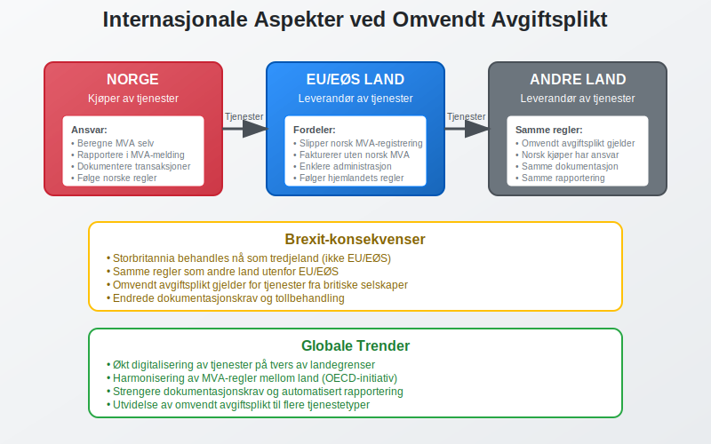

## Digitalisering og Fremtiden

### Teknologiske Løsninger

**Moderne teknologi** forenkler omvendt avgiftsplikt:

* **Automatisk gjenkjenning** av utenlandske leverandører
* **Integrerte MVA-beregninger** i regnskapssystemer
* **Digital dokumentasjon** og arkivering
* **API-integrasjoner** med Skatteetaten

### Fremtidige Endringer

**Forventede utviklinger**:

* Mer automatisert rapportering
* Strengere kontroll og overvåking
* Utvidelse til flere tjenestetyper
* Harmonisering med EU-regler

### Anbefalinger for Bedrifter

**Forberedelser** for fremtiden:

1. **Invester** i moderne regnskapssystemer
2. **Automatiser** MVA-prosesser
3. **Oppdater** rutiner og prosedyrer
4. **Følg med** på regelverksendringer

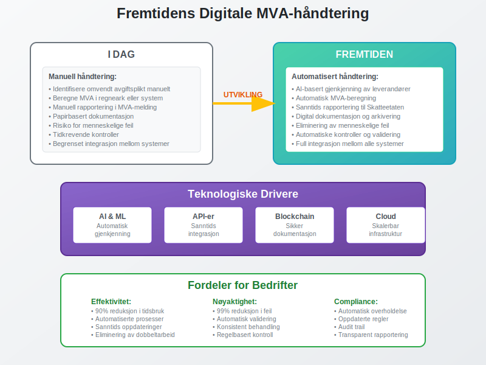

## Praktiske Tips og Råd

### Daglig Drift

**Praktiske råd** for håndtering:

* **Marker** fakturaer med omvendt avgiftsplikt tydelig
* **Opprett** egne leverandørkontoer for utenlandske leverandører
* **Bruk** standardiserte maler for beregninger
* **Dokumenter** alle vurderinger og beslutninger

### Kontroll og Oppfølging

**Kontrollrutiner**:

* **Månedlig gjennomgang** av utenlandske kjøp
* **Avstemming** mellom regnskap og MVA-melding
* **Kontroll** av fradragsberegninger
* **Arkivering** av dokumentasjon

### Når Søke Hjelp

**Kontakt profesjonell hjelp** ved:

* Usikkerhet om regelverket
* Komplekse internasjonale transaksjoner
* Kontroller fra Skatteetaten
* Implementering av nye systemer

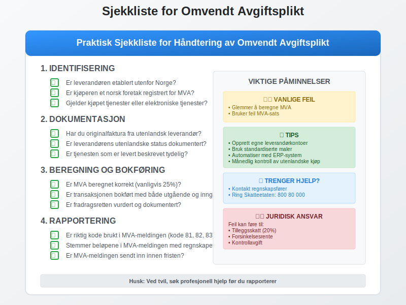

## Sammendrag

**Omvendt avgiftsplikt** er et viktig verktøy i MVA-systemet som:

* **Forenkler** avgiftsinnkreving for utenlandske leverandører
* **Sikrer** at MVA betales på tjenester fra utlandet
* **Krever** at norske kjøpere tar ansvar for MVA-beregning
* **Gir** fradragsrett når betingelsene er oppfylt

**Viktige punkter** å huske:

* Identifiser når omvendt avgiftsplikt gjelder
* Beregn og rapporter MVA korrekt
* Dokumenter alle transaksjoner grundig
* Følg opp fradragsrett systematisk
* Hold deg oppdatert på regelverksendringer

Ved å forstå og følge reglene for omvendt avgiftsplikt sikrer du at ditt [foretak](/blogs/regnskap/hva-er-foretak "Hva er et Foretak? Komplett Guide til Foretaksformer i Norge") overholder MVA-lovgivningen og unngår kostbare feil og sanksjoner.


