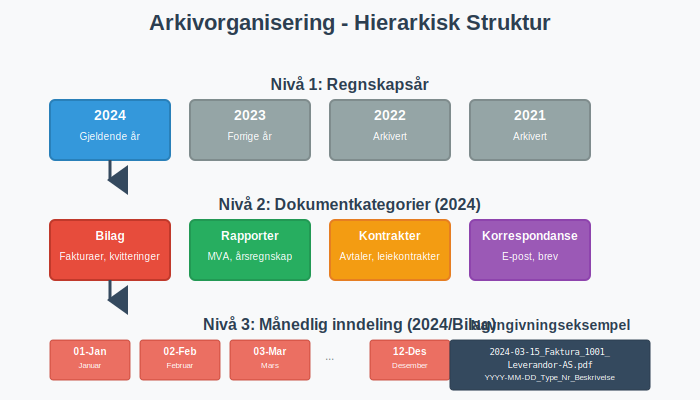

**Oppbevaring av regnskapsmateriale** er en lovpålagt forpliktelse som alle norske virksomheter må følge. Korrekt arkivering og oppbevaring av regnskapsdokumenter er ikke bare et juridisk krav, men også en kritisk del av god forretningspraksis som sikrer sporbarhet, transparens og mulighet for kontroll og revisjon.

Denne omfattende guiden dekker alle aspekter ved oppbevaring av regnskapsmateriale i Norge, fra lovkrav og frister til moderne digitale løsninger og sikkerhetsprinsipper.

## Lovgrunnlag for oppbevaring av regnskapsmateriale

Kravene til oppbevaring av regnskapsmateriale er forankret i **[bokføringsloven](/blogs/regnskap/hva-er-bokforingsloven "Hva er Bokføringsloven? Komplett Guide til Norsk Bokføringslovgivning")** og **[bokføringsforskriften](/blogs/regnskap/hva-er-bokforingsforskriften "Hva er Bokføringsforskriften? Detaljerte Regler for Norsk Bokføring")**. Disse lovverkene definerer både hva som skal oppbevares, hvor lenge det skal oppbevares, og i hvilken form oppbevaringen kan skje.


### Bokføringslovens krav

Bokføringsloven § 13 fastslår at **regnskapsmateriale** skal oppbevares i minst fem år etter regnskapsårets slutt. Dette omfatter:

* **[Regnskapsbilag](/blogs/regnskap/hva-er-bilag "Hva er Bilag i Regnskap? Komplett Guide til Regnskapsbilag og Dokumentasjon")** og grunnlagsdokumentasjon
* **[Hovedbok](/blogs/regnskap/hva-er-hovedbok "Hva er Hovedbok? En Komplett Guide til Hovedboken i Norsk Regnskap")** og andre regnskapsbøker
* **Ã…rsregnskap** og **Ã¥rsberetning**
* **Revisjonsberetninger** og **[arbeidspapirer fra revisjon](/blogs/regnskap/hva-er-arbeidspapirer-revisjon "Hva er Arbeidspapirer i Revisjon? Komplett Guide til Revisjonsdokumentasjon")**

## Oppbevaringsfrister - detaljert oversikt

Oppbevaringsfristene varierer avhengig av type dokument og virksomhetens karakter. Her er en komplett oversikt:


### Tabell: Oppbevaringsfrister for ulike dokumenttyper

| Dokumenttype | Oppbevaringsfrist | Lovgrunnlag | Merknad |
|--------------|-------------------|-------------|---------|
| **Regnskapsbilag** | 5 år | Bokføringsloven § 13 | Fra regnskapsårets slutt |
| **Hovedbok og hjelpebøker** | 5 år | Bokføringsloven § 13 | Inkluderer alle regnskapsbøker |
| **Årsregnskap** | 10 år | Regnskapsloven § 3-10 | Permanent oppbevaring anbefales |
| **Årsberetning** | 10 år | Regnskapsloven § 3-10 | Sammen med årsregnskapet |
| **Revisjonsberetning** | 10 år | Revisorloven § 6-4 | For revisjonspliktge selskaper |
| **Lønnsbilag** | 5 år | Bokføringsloven § 13 | Inkluderer [lønnsslipp](/blogs/regnskap/hva-er-lonnslipp "Hva er Lønnsslipp? Komplett Guide til Lønnsutbetalinger og Dokumentasjon") |
| **MVA-dokumenter** | 10 år | Merverdiavgiftsloven § 21-1 | Alle [MVA-relaterte](/blogs/regnskap/hva-er-moms-mva "Hva er Moms/MVA? Komplett Guide til Merverdiavgift i Norge") dokumenter |
| **Skattedokumenter** | 10 år | Skatteforvaltningsloven § 8-12 | Inkluderer [ligningspapirer](/blogs/regnskap/ligningspapirer "Ligningspapirer – Guide til krav, dokumentasjon og oppbevaring"), selvangivelse og andre vedlegg |
| **Kontrakter og avtaler** | 10 år | Anbefaling | Avhengig av kontraktens varighet |

### Spesielle oppbevaringskrav

Enkelte bransjer og virksomhetstyper har utvidede oppbevaringskrav:

* **Finansinstitusjoner**: 10 år for de fleste dokumenter
* **Forsikringsselskaper**: 30 år for forsikringskontrakter
* **Apotek**: 5 år for reseptjournaler
* **Revisorer**: 10 år for [arbeidspapirer](/blogs/regnskap/hva-er-arbeidspapirer-revisjon "Hva er Arbeidspapirer i Revisjon? Komplett Guide til Revisjonsdokumentasjon")

## Hvilke dokumenter må oppbevares?

En komplett oversikt over regnskapsmateriale som må oppbevares inkluderer:


### Primære regnskapsdokumenter

* **[Fakturaer](/blogs/regnskap/hva-er-en-faktura "Hva er en Faktura? En Guide til Norske Fakturakrav")** - både utgående og inngående
* **Kvitteringer og kassebilag**
* **Bankkontoutskrifter** og **[bankavstemming](/blogs/regnskap/hva-er-bankavstemming "Hva er Bankavstemming? Komplett Guide til Bankavstemmingsprosessen")**
* **Lønnsbilag** og **[lønnsslipp](/blogs/regnskap/hva-er-lonnslipp "Hva er Lønnsslipp? Komplett Guide til Lønnsutbetalinger og Dokumentasjon")**
* **Reiseregninger** og **utleggsbilag**
* **Kontrakter** og **avtaler**

### Regnskapsbøker og -systemer

* **[Hovedbok](/blogs/regnskap/hva-er-hovedbok "Hva er Hovedbok? En Komplett Guide til Hovedboken i Norsk Regnskap")** med alle kontoer
* **Hjelpebøker** (kunde-, leverandør-, lager-)
* **Journaler** og **bilagsregistre**
* **[Saldobalanse](/blogs/regnskap/hva-er-saldobalanse "Alt du trenger å vite om saldobalanse")** og **råbalanse**
* **Systemlogger** fra regnskapssystem

### Rapporter og oppgaver

* **[MVA-meldinger](/blogs/regnskap/hva-er-mva-melding "Hva er MVA-melding? Komplett Guide til Merverdiavgiftsrapportering")** og **MVA-oppgaver**
* **[A-meldinger](/blogs/regnskap/hva-er-a-melding "Hva er A-melding? Komplett Guide til Arbeidsgiver- og Arbeidstakerregisteret")** og **lønnsoppgaver**
* **Ã…rsregnskap** og **Ã¥rsberetning**
* **Selvangivelse** og **skatteoppgaver**
* **[Næringsoppgave](/blogs/regnskap/hva-er-naeringsoppgave "Hva er Næringsoppgave? Komplett Guide til Skatteoppgave for Næringsdrivende")**

## Krav til oppbevaringsform

Moderne regnskapslovgivning anerkjenner både fysisk og digital oppbevaring, men med spesifikke krav til hver form.


### Digital oppbevaring

**Digital oppbevaring** er i dag den foretrukne metoden for de fleste virksomheter. Kravene inkluderer:

#### Tekniske krav
* **Lesbarhet**: Dokumenter må være lesbare gjennom hele oppbevaringsperioden
* **Integritet**: Dokumenter må være beskyttet mot endring
* **Autentisitet**: Mulighet for å verifisere dokumentets opprinnelse
* **Tilgjengelighet**: Rask tilgang for kontroll og revisjon

#### Sikkerhetskrav
* **Backup**: Regelmessig sikkerhetskopi på separate lokasjoner
* **Tilgangskontroll**: Begrenset tilgang basert på roller og behov
* **Sporbarhet**: Loggføring av hvem som har tilgang til dokumenter
* **Kryptering**: Beskyttelse av sensitive data

### Fysisk oppbevaring

For virksomheter som fortsatt bruker **fysisk oppbevaring**:

* **Brannsikkerhet**: Dokumenter må beskyttes mot brann og vannskade
* **Organisering**: Systematisk arkivering for enkel gjenfinning
* **Tilgangskontroll**: Sikret oppbevaring med begrenset tilgang
* **Miljøkontroll**: Passende temperatur og fuktighet

## Digitale løsninger og beste praksis

Moderne virksomheter benytter i økende grad **digitale arkivløsninger** for oppbevaring av regnskapsmateriale.


### Typer digitale løsninger

#### Skybaserte arkivtjenester
* **Fordeler**: Automatisk backup, skalerbarhet, tilgang fra flere lokasjoner
* **Ulemper**: Avhengighet av internettforbindelse, datasikkerhet
* **Eksempler**: Microsoft 365, Google Workspace, spesialiserte arkivtjenester

#### Lokale arkivsystemer
* **Fordeler**: Full kontroll over data, ingen avhengighet av eksterne tjenester
* **Ulemper**: Høyere vedlikeholdskostnader, ansvar for backup og sikkerhet

#### Integrerte regnskapssystemer
Moderne **[ERP-systemer](/blogs/regnskap/hva-er-erp-system "Hva er ERP-system? Komplett Guide til Enterprise Resource Planning")** inkluderer ofte innebygde arkivfunksjoner som automatisk arkiverer:

* **[Bilag](/blogs/regnskap/hva-er-bilag "Hva er Bilag i Regnskap? Komplett Guide til Regnskapsbilag og Dokumentasjon")** ved registrering
* **Rapporter** ved generering
* **Transaksjonslogger** kontinuerlig

### Implementering av digitalt arkiv

#### Planleggingsfase
1. **Behovsanalyse**: Kartlegg dokumenttyper og volum
2. **Kravspesifikasjon**: Definer tekniske og juridiske krav
3. **Leverandørevaluering**: Sammenlign løsninger og kostnader
4. **Risikovurdering**: Identifiser potensielle utfordringer

#### Implementeringsfase
1. **Systemoppsett**: Konfigurer arkivstruktur og tilganger
2. **Datamigrering**: Overfør eksisterende dokumenter
3. **Testing**: Verifiser funksjonalitet og sikkerhet
4. **Opplæring**: Tren brukere i nye rutiner

#### Driftsfase
1. **Overvåking**: Kontinuerlig kontroll av systemytelse
2. **Vedlikehold**: Regelmessige oppdateringer og sikkerhetskontroller
3. **Backup-verifisering**: Test gjenoppretting av data
4. **Compliance-kontroll**: Sikre overholdelse av lovkrav

## Organisering og struktur av arkiv

En **systematisk tilnærming** til arkivorganisering er avgjørende for effektiv oppbevaring og gjenfinning av dokumenter.



### Hierarkisk struktur

#### Nivå 1: Regnskapsår
```
2024/
├── 2023/
├── 2022/
└── 2021/
```

#### Nivå 2: Dokumentkategorier
```
2024/
├── Bilag/
├── Rapporter/
├── Kontrakter/
└── Korrespondanse/
```

#### Nivå 3: Månedlig/tematisk inndeling
```
2024/Bilag/
├── 01-Januar/
├── 02-Februar/
├── ...
└── 12-Desember/
```

### Navngivningskonvensjoner

**Konsistente navngivningsregler** sikrer enkel gjenfinning:

* **Datoformat**: YYYY-MM-DD (ISO 8601)
* **Bilagsnummer**: Sekvensiell nummerering
* **Beskrivende navn**: Kort, men informativ beskrivelse
* **Versjonshåndtering**: V1, V2, etc. for reviderte dokumenter

**Eksempel på navngivning:**
```
2024-03-15_Faktura_1001_Leverandor-AS.pdf
2024-03-20_Lonnslipp_Mars_Ansatt-123.pdf
2024-03-31_MVA-melding_Q1-2024_Final.pdf
```

## Sikkerhet og backup-strategier

**Datasikkerhet** er kritisk for oppbevaring av regnskapsmateriale, spesielt med økende cybertrusler og strenge personvernkrav.


### 3-2-1 Backup-regelen

En robust backup-strategi følger **3-2-1 regelen**:

* **3 kopier** av alle kritiske data
* **2 forskjellige medietyper** (f.eks. disk og sky)
* **1 kopi offsite** (geografisk adskilt lokasjon)

### Tilgangskontroll

#### Rollebasert tilgang
* **Administrator**: Full tilgang til alle dokumenter og systeminnstillinger
* **Regnskapsfører**: Tilgang til regnskapsdokumenter og rapporter
* **Revisor**: Lesetilgang til alle dokumenter i revisjonsperioden
* **Leder**: Tilgang til rapporter og sammendrag

#### Autentisering
* **Sterke passord**: Minimum 12 tegn med kompleksitet
* **To-faktor autentisering**: Ekstra sikkerhetslag
* **Regelmessig passordendring**: Kvartalsvis eller halvårlig
* **Automatisk utlogging**: Etter inaktivitet

### Kryptering og datasikkerhet

* **Kryptering i hvile**: Alle lagrede dokumenter krypteres
* **Kryptering i transitt**: Sikker overføring av data
* **Nøkkelhåndtering**: Sikker oppbevaring av krypteringsnøkler
* **Regelmessige sikkerhetstester**: Penetrasjonstesting og sårbarhetsscanning

## Compliance og kontroll

**Overholdelse** av regnskapslover og -forskrifter krever systematisk tilnærming til compliance og kontroll.


### Internkontroll for arkivering

Etablering av **[internkontroll](/blogs/regnskap/hva-er-internkontroll "Hva er Internkontroll? Komplett Guide til Internkontrollsystemer")** for arkivering inkluderer:

#### Prosedyrer og rutiner
* **Arkiveringsprosedyrer**: Detaljerte instruksjoner for arkivering
* **Kvalitetskontroll**: Regelmessig kontroll av arkiverte dokumenter
* **Tilgangslogging**: Sporing av hvem som har tilgang til dokumenter
* **Regelmessig gjennomgang**: Ã…rlig evaluering av arkivsystem

#### Dokumentasjon
* **Arkivplan**: Oversikt over arkivstruktur og -prosedyrer
* **Oppbevaringspolicy**: Retningslinjer for oppbevaring og sletting
* **Beredskapsplan**: Prosedyrer ved systemfeil eller datatap
* **Opplæringsmateriell**: Dokumentasjon for brukere

### Forberedelse til kontroll og revisjon

#### Tilrettelegging for myndighetskontroll
* **Rask tilgang**: Mulighet for umiddelbar fremlegging av dokumenter
* **Strukturert presentasjon**: Logisk organisering av materiale
* **Komplett dokumentasjon**: Alle påkrevde dokumenter tilgjengelig
* **Sporbarhet**: Mulighet for å følge transaksjoner fra bilag til regnskap

#### Revisjonsklargjøring
* **[Arbeidspapirer](/blogs/regnskap/hva-er-arbeidspapirer-revisjon "Hva er Arbeidspapirer i Revisjon? Komplett Guide til Revisjonsdokumentasjon")**: Systematisk organisering av revisjonsmateriale
* **Støttedokumentasjon**: Tilleggsinformasjon for komplekse transaksjoner
* **Elektronisk tilgang**: Sikker tilgang for eksterne revisorer
* **Versjonskontroll**: Sporing av endringer i dokumenter

## Kostnader og ressursbehov

**Kostnadseffektiv** oppbevaring av regnskapsmateriale krever balansering av juridiske krav, sikkerhet og økonomiske hensyn.


### Kostnadselementer for digital oppbevaring

#### Direkte kostnader
* **Programvarelisenser**: MÃ¥nedlige/Ã¥rlige abonnementskostnader
* **Lagringsplass**: Kostnader basert på datavolum
* **Backup-tjenester**: Ekstra kostnader for sikkerhetskopier
* **Sikkerhetstjenester**: Kryptering og tilgangskontroll

#### Indirekte kostnader
* **Implementering**: Engangskostand for oppsett og migrering
* **Opplæring**: Tid og ressurser for brukeropplæring
* **Vedlikehold**: Løpende administrasjon og support
* **Compliance**: Kostnader for å sikre regeloverholdelse

### Sammenligning: Digital vs. fysisk oppbevaring

| Aspekt | Digital oppbevaring | Fysisk oppbevaring |
|--------|--------------------|--------------------|
| **Oppstartskostnad** | Høy (system og implementering) | Lav (arkivskap og mapper) |
| **Løpende kostnader** | Moderate (lisenser og lagring) | Lave (lokaler og vedlikehold) |
| **Tilgjengelighet** | Høy (24/7 tilgang) | Begrenset (kontortid) |
| **Sikkerhet** | Høy (med riktig implementering) | Moderat (fysisk sikring) |
| **Skalerbarhet** | Høy (enkel utvidelse) | Lav (krever mer plass) |
| **Søkbarhet** | Høy (elektronisk søk) | Lav (manuell søking) |

## Fremtidige trender og teknologi

**Teknologisk utvikling** påvirker kontinuerlig hvordan regnskapsmateriale oppbevares og håndteres.


### Kunstig intelligens og automatisering

* **Automatisk klassifisering**: AI-basert kategorisering av dokumenter
* **Intelligent søk**: Semantisk søk i arkiverte dokumenter
* **Anomalideteksjon**: Automatisk identifisering av avvik
* **Prediktiv analyse**: Forutsigelse av arkiveringsbehov

### Blockchain og distribuerte systemer

* **Uforanderlighet**: Kryptografisk sikring mot endringer
* **Desentralisert lagring**: Distribuert arkivering på flere noder
* **Smart kontrakter**: Automatisering av arkiveringsprosesser
* **Tidsstempling**: Kryptografisk bevis for dokumenters alder

### Regulatoriske endringer

* **Økt digitalisering**: Krav til elektronisk arkivering
* **Strengere sikkerhetskrav**: Utvidede krav til datasikkerhet
* **Miljøhensyn**: Fokus på bærekraftig arkivering
* **Internasjonale standarder**: Harmonisering av arkiveringskrav

## Praktiske råd og beste praksis

### Implementering av arkivsystem

1. **Start enkelt**: Begynn med grunnleggende digital arkivering
2. **Involver brukerne**: Sikre aksept og forståelse
3. **Test grundig**: Verifiser alle funksjoner før full implementering
4. **Dokumenter prosesser**: Opprett klare retningslinjer og prosedyrer

### Løpende drift og vedlikehold

* **Regelmessig backup-testing**: MÃ¥nedlig verifisering av sikkerhetskopier
* **Tilgangsgjennomgang**: Kvartalsvis kontroll av brukerrettigheter
* **Systemoppdateringer**: Planlagte oppdateringer av programvare
* **Kapasitetsplanlegging**: Overvåking av lagringsbehov

### Forberedelse til kontroll

* **Oppretthold orden**: Kontinuerlig organisering av arkiv
* **Dokumenter endringer**: Loggfør alle modifikasjoner
* **Tren personalet**: Regelmessig opplæring i arkiveringsprosedyrer
* **Oppretthold backup**: Sikre at alle data er sikkerhetskopiert

## Konklusjon

**Oppbevaring av regnskapsmateriale** er en kompleks, men kritisk del av virksomhetsdrift som krever systematisk tilnærming og kontinuerlig oppmerksomhet. Med riktig planlegging, implementering og vedlikehold kan virksomheter sikre både juridisk compliance og operasjonell effektivitet.

Moderne digitale løsninger tilbyr betydelige fordeler i form av tilgjengelighet, sikkerhet og kostnadseffektivitet, men krever også investering i teknologi, opplæring og sikkerhetstiltak. Uavhengig av valgt tilnærming er det avgjørende å opprettholde fokus på **kvalitet**, **sikkerhet** og **compliance** gjennom hele oppbevaringsperioden.

Ved å følge retningslinjene i denne guiden kan virksomheter etablere robuste arkivsystemer som ikke bare oppfyller lovkrav, men også støtter effektiv forretningsdrift og beslutningstaking.
