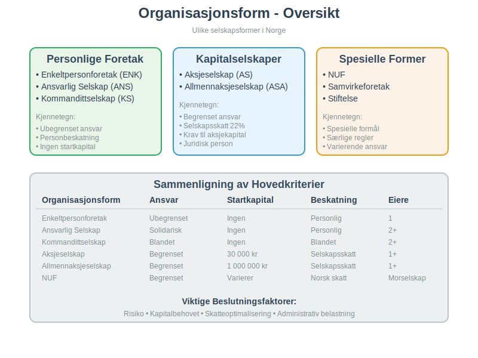
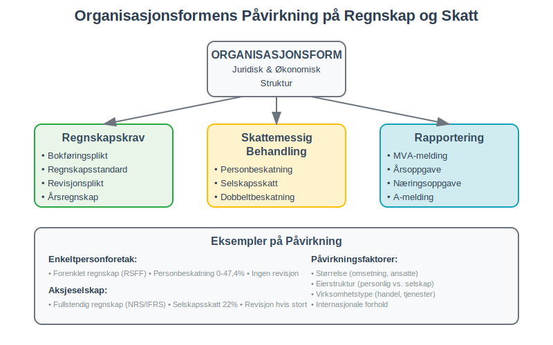
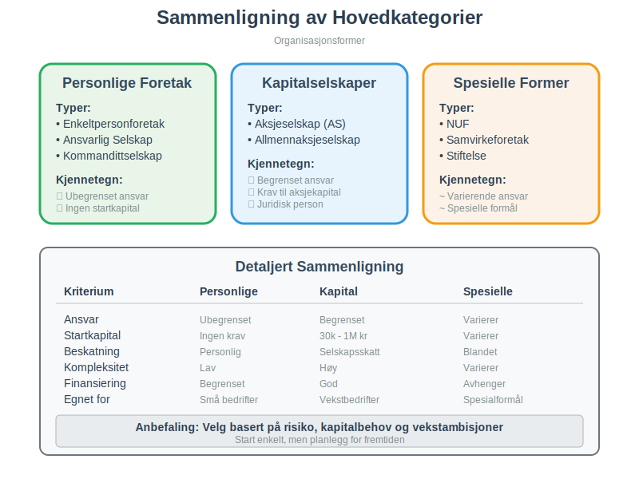
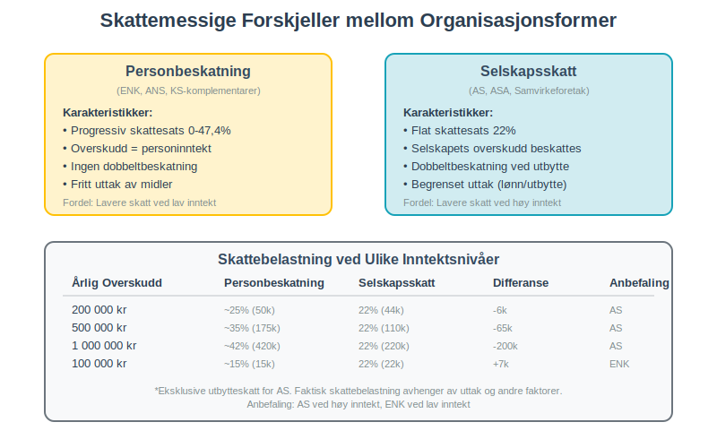
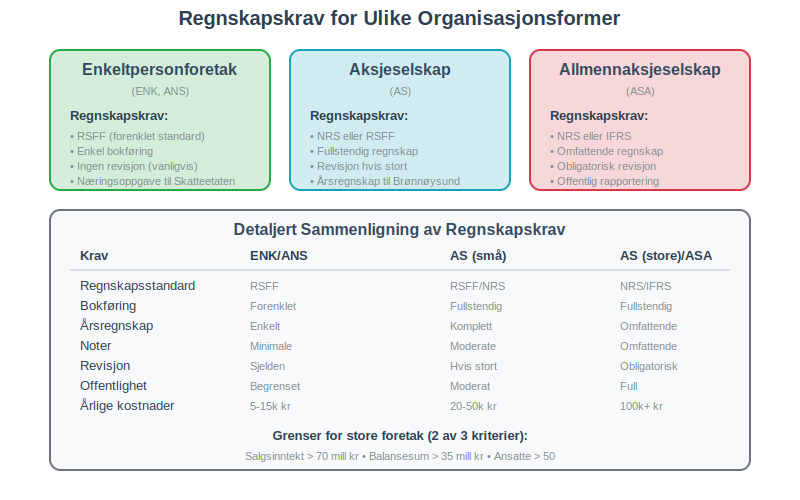
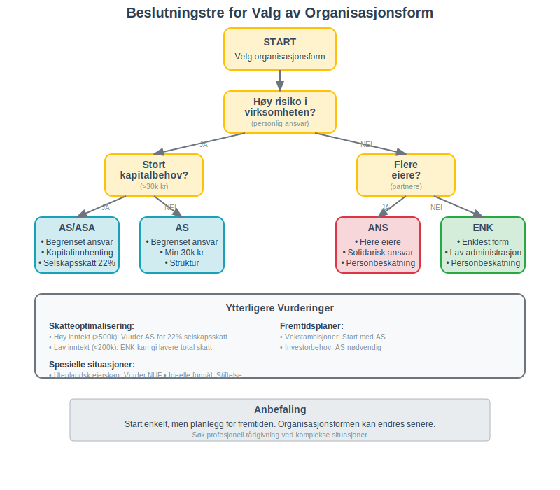
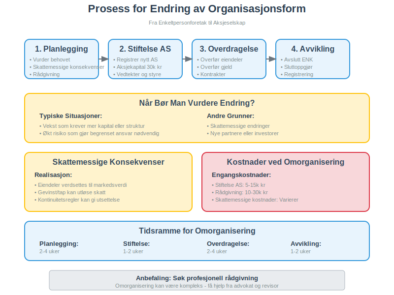
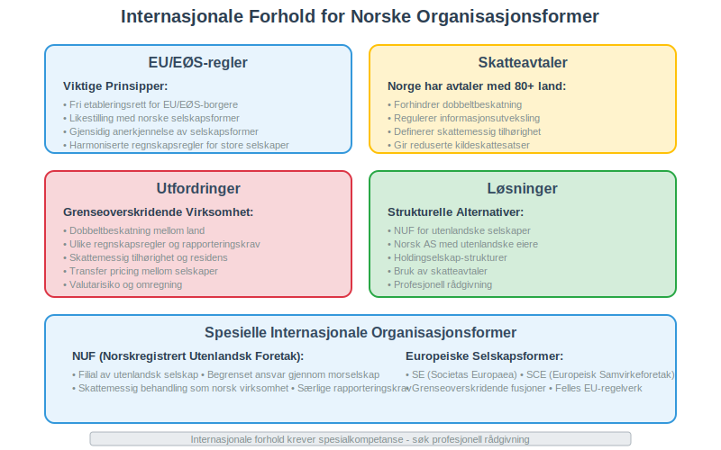
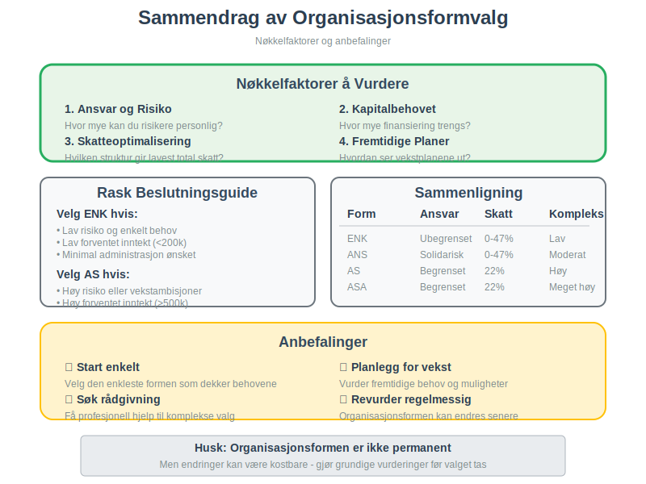

---
title: "Organisasjonsform"
meta_title: "Organisasjonsform"
meta_description: '**Organisasjonsform** er den juridiske og økonomiske strukturen som definerer hvordan en virksomhet er organisert, eiet og drevet. Valg av organisasjonsform er...'
slug: organisasjonsform
type: blog
layout: pages/single
---

**Organisasjonsform** er den juridiske og økonomiske strukturen som definerer hvordan en virksomhet er organisert, eiet og drevet. Valg av organisasjonsform er en av de viktigste beslutningene en gründer må ta, da det påvirker alt fra personlig ansvar og beskatning til kapitalstruktur og regnskapskrav.

Foretaksmodellen brukes ofte for å beskrive hvordan regnskaps- og skattemessige vurderinger skal utføres for ulike selskapsformer. Les mer i [Foretaksmodellen](/blogs/regnskap/foretaksmodellen "Foretaksmodellen: Modell for Regnskapsføring og Skattevurdering av Foretak").
For en mer fokusert oversikt over ulike selskapsformer, se [Selskapsform](/blogs/regnskap/selskapsform "Selskapsform: Oversikt over selskapsformer i Norge").

## Hva er Organisasjonsform?

En **organisasjonsform** definerer den juridiske rammen for hvordan en virksomhet skal drives og organiseres. Den bestemmer:

* **Eierstruktur** - hvem som eier virksomheten
* **Ansvarsfordeling** - hvem som har ansvar for gjeld og forpliktelser
* **Beskatning** - hvordan overskudd og tap behandles skattemessig
* **Kapitalstruktur** - krav til startkapital og finansiering
* **Styring og kontroll** - hvordan beslutninger tas
* **Regnskapskrav** - hvilke regnskaps- og rapporteringskrav som gjelder

### Betydning for Regnskapet

Organisasjonsformen påvirker direkte **regnskapsmessige forhold** som:

* [Bokføringsplikt](/blogs/regnskap/hva-er-bokforingsplikt "Hva er Bokføringsplikt? Komplett Guide til Regler og Krav") og regnskapsstandard
* Revisjonsplikt og kontrollkrav
* Skattemessig behandling av inntekter og kostnader
* Krav til [årsregnskap](/blogs/regnskap/hva-er-regnskap "Hva er Regnskap? Komplett Guide til Regnskapsføring") og rapportering

## Hovedkategorier av Organisasjonsformer

### Personlige Foretak

**Personlige foretak** kjennetegnes ved at eierne har **ubegrenset personlig ansvar** for virksomhetens forpliktelser:

### Ideelle Organisasjoner

#### Stiftelser
[Stiftelser](/blogs/regnskap/hva-er-stiftelse "Hva er Stiftelse? Juridiske og Regnskapsmessige Forhold") er juridiske personer uten eiere, opprettet for allmennyttige eller spesielle formål:

* **Formålsbundet** - virksomheten må være i tråd med vedtektenes formål
* **Ingen eiere** - ingen personer har eiendomsrett til stiftelsens kapital
* **Minimum NOK 100.000** i grunnkapital
* **Skattefordeler** mulig for allmennyttige stiftelser
* **Særegne regnskapsregler** og rapporteringskrav

#### Enkeltpersonforetak (ENK)
[Enkeltpersonforetaket](/blogs/regnskap/hva-er-enkeltpersonforetak "Hva er et Enkeltpersonforetak? Komplett Guide til Selskapsformen") er den enkleste organisasjonsformen:

For praktisk oppstart, se også [Starte Enkeltpersonforetak](/blogs/regnskap/starte-enkeltpersonforetak "Starte Enkeltpersonforetak: Steg-for-steg guide til oppstart av enkeltpersonforetak").

* **Én eier** som driver virksomheten i eget navn
* **Ubegrenset personlig ansvar** for alle forpliktelser
* **Ingen startkapital** kreves
* **Personbeskatning** - overskudd beskattes som [personinntekt](/blogs/regnskap/personinntekt "Personinntekt “ Komplett guide til personinntekt i norsk regnskap")
* Enkel oppstart og administrasjon

#### Ansvarlig Selskap (ANS)
Et [ansvarlig selskap](/blogs/regnskap/ansvarlig-selskap "Ansvarlig Selskap (ANS): Komplett Guide til Norsk Regnskap og Ansvarsstruktur") har flere eiere:

* **To eller flere deltakere** som driver virksomhet sammen
* **Ubegrenset og solidarisk ansvar** for alle deltakere
* **Selskapsavtale** regulerer forholdet mellom deltakerne
* **Personbeskatning** for alle deltakere

#### Kommandittselskap (KS)
Kommandittselskapet kombinerer ulike ansvarsformer:

* **Komplementarer** med ubegrenset ansvar (aktive eiere)
* **Kommandittister** med begrenset ansvar (passive investorer)
* Fleksibel struktur for investeringsformål
* **Blandet beskatning** avhengig av rolle

### Kapitalselskaper

**Kapitalselskaper** er egne juridiske personer med **begrenset ansvar** for eierne:

#### Aksjeselskap (AS)
[Aksjeselskapet](/blogs/regnskap/hva-er-et-aksjeselskap "Hva er et Aksjeselskap (AS)? Komplett Guide til Selskapsformen") er den mest populære selskapsformen:

* **Begrenset ansvar** for aksjonærene
* **Minimum 30 000 kr** i [aksjekapital](/blogs/regnskap/hva-er-aksjekapital "Hva er Aksjekapital? Komplett Guide til Aksjekapital i AS")
* **[Vedtekter](/blogs/regnskap/hva-er-vedtekter-for-aksjeselskap "Hva er Vedtekter for Aksjeselskap? Krav og Innhold")** som definerer selskapsstrukturen
* **Selskapsskatt** på 22% av overskudd
* Eget rettssubjekt med styre og generalforsamling
* Mulighet for ekstern kapitalinnhenting

#### [Allmennaksjeselskap (ASA)](/blogs/regnskap/hva-er-asa "Hva er ASA? En Guide til Allmennaksjeselskap (ASA)")
For større selskaper med behov for børsnotering, se vår guide om [Hva er ASA? En Guide til Allmennaksjeselskap (ASA)](/blogs/regnskap/hva-er-asa "Hva er ASA? En Guide til Allmennaksjeselskap (ASA)").

*   **Minimum 1 000 000 kr** i aksjekapital
*   **Strengere krav til rapportering og styring**
*   **Kan noteres på børs**
*   **Høyere grad av offentlighet og transparens**

### Spesielle Organisasjonsformer

#### Norskregistrert Utenlandsk Foretak (NUF)
[NUF-selskapsformen](/blogs/regnskap/hva-er-nuf-selskapsform "Hva er NUF Selskapsform? Komplett Guide til Norskregistrert Utenlandsk Foretak") for utenlandske selskaper:

* **Filial** av utenlandsk selskap
* Begrenset ansvar gjennom morselskapet
* Særlige regnskaps- og rapporteringskrav
* Skattemessig behandling som norsk virksomhet

#### Samvirkeforetak
Basert på demokratiske prinsipper:

* **Medlemseierskap** med demokratisk styring
* **Åpen medlemskap** for kvalifiserte medlemmer
* Overskudd fordeles etter medlemmenes deltakelse
* Vanlig innen landbruk, handel og tjenester

#### Stiftelse
For ideelle og allmennyttige formål:

* **Ingen eiere** - styres av et styre
* **Formålsbundet** virksomhet
* Kan ikke dele ut overskudd til private
* Ofte skattefritak for allmennyttige aktiviteter

## Detaljert Sammenligning av Organisasjonsformer

### Ansvar og Risiko

| Organisasjonsform | Type Ansvar | Omfang | Risiko for Eier |
|-------------------|-------------|---------|-----------------|
| **Enkeltpersonforetak** | Ubegrenset personlig | All gjeld og forpliktelser | Høy - personlig økonomi |
| **Ansvarlig Selskap** | Ubegrenset solidarisk | All gjeld, alle deltakere hefter | Høy - solidarisk ansvar |
| **Kommandittselskap** | Blandet | Komplementarer ubegrenset, kommandittister begrenset | Variabel |
| **Aksjeselskap** | Begrenset | Kun innskutt kapital | Lav - begrenset til aksjekapital |
| **[Allmennaksjeselskap (ASA)](/blogs/regnskap/hva-er-asa "Hva er ASA? En Guide til Allmennaksjeselskap (ASA)")** | Begrenset | Kun innskutt kapital | Lav - begrenset til aksjekapital |
| **NUF** | Begrenset | Gjennom morselskap | Lav - morselskapet hefter |

### Kapital og Finansiering

| Organisasjonsform | Startkapital | Kapitalinnhenting | Finansieringsmuligheter |
|-------------------|--------------|-------------------|-------------------------|
| **Enkeltpersonforetak** | Ingen krav | Personlig kapital | Begrenset - personlig kreditt |
| **Ansvarlig Selskap** | Ingen krav | Deltakernes kapital | Moderat - solidarisk ansvar |
| **Kommandittselskap** | Ingen krav | Komplementar + kommandittist | God - passive investorer |
| **Aksjeselskap** | 30 000 kr | Aksjeemisjon | Meget god - aksjer og lån |
| **[Allmennaksjeselskap (ASA)](/blogs/regnskap/hva-er-asa "Hva er ASA? En Guide til Allmennaksjeselskap (ASA)")** | 1 000 000 kr | Børsnotering mulig | Utmerket - offentlig marked |
| **NUF** | Varierer | Gjennom morselskap | Avhenger av morselskap |

### Skattemessige Forhold

| Organisasjonsform | Beskatningsnivå | Skattesats | Dobbeltbeskatning | Uttak |
|-------------------|-----------------|------------|-------------------|-------|
| **Enkeltpersonforetak** | Personlig | 0-47,4% (progressiv) | Nei | Fritt |
| **Ansvarlig Selskap** | Personlig | 0-47,4% (progressiv) | Nei | Etter avtale |
| **Kommandittselskap** | Blandet | Varierer | Delvis | Etter rolle |
| **Aksjeselskap** | Selskap + person | 22% + utbytteskatt | Ja | Begrenset |
| **[Allmennaksjeselskap (ASA)](/blogs/regnskap/hva-er-asa "Hva er ASA? En Guide til Allmennaksjeselskap (ASA)")** | Selskap + person | 22% + utbytteskatt | Ja | Begrenset |
| **NUF** | Norsk selskapsskatt | 22% | Avhenger av hjemland | Etter regler |

## Regnskapsmessige Konsekvenser

### Bokføringsplikt og Regnskapsstandard

Alle registrerte [foretak](/blogs/regnskap/hva-er-foretak "Hva er et Foretak? Komplett Guide til Foretaksformer i Norge") har [bokføringsplikt](/blogs/regnskap/hva-er-bokforingsplikt "Hva er Bokføringsplikt? Komplett Guide til Regler og Krav"):

#### [Små Foretak](/blogs/regnskap/sma-foretak "Små Foretak “ Kriterier, Regnskapsstandard og Forenklinger")
* **Regnskapsstandard for små foretak** (RSFF)
* Forenklet rapportering
* Færre notekrav
* Gjelder de fleste ENK, ANS og små AS

#### Store Foretak
* **Norsk regnskapsstandard** (NRS) eller **IFRS**
* Utvidede rapporteringskrav
* Omfattende noteopplysninger
* Gjelder store AS, ASA og konsern

### Revisjonsplikt

Revisjonsplikt avhenger av størrelse og organisasjonsform:

#### Fritatt for Revisjon
Små foretak som oppfyller **to av tre kriterier**:

* Salgsinntekt under **70 millioner kr**
* Balansesum under **35 millioner kr**
* Gjennomsnittlig under **50 ansatte**

#### Revisjonspliktige
* **Allmennaksjeselskaper** (ASA)
* **Store aksjeselskaper** som overskrider grensene
* **Morselskaper** i konsern
* Foretak med **særlige samfunnsinteresser**

### MVA-registrering og Rapportering

[MVA-registrering](/blogs/regnskap/hva-er-mva-registeret "Hva er MVA-registeret? Komplett Guide til Merverdiavgiftsregisteret") kreves når:

* Omsetning av avgiftspliktige varer/tjenester overstiger **50 000 kr** årlig
* Virksomheten driver avgiftspliktig aktivitet
* Import av varer til Norge

**Rapporteringsfrekvens** avhenger av omsetning:
* **Månedlig** for omsetning over 1 million kr
* **To-månedlig** for omsetning 50 000 - 1 million kr
* **Årlig** for små virksomheter under visse betingelser

## Valg av Organisasjonsform - Beslutningskriterier

### 1. Risikovurdering

**Spørsmål å stille:**
* Hvor stor er risikoen i virksomheten?
* Hvor mye personlig formue kan du risikere?
* Finnes det forsikringsløsninger som reduserer risiko?
* Er det behov for å skille privat og bedriftens økonomi?

**Anbefaling:**
* **Høy risiko** → Velg kapitalselskap (AS/ASA)
* **Lav risiko** → Personlig foretak kan være aktuelt
* **Usikker risiko** → Start med AS for sikkerhet

### 2. Kapitalbehovet

**Vurderingsfaktorer:**
* Hvor mye startkapital trengs?
* Er det behov for ekstern finansiering?
* Planlegges vekst som krever kapitalinnhenting?
* Skal det tas inn partnere eller investorer?

**Anbefaling:**
* **Stort kapitalbehov** → AS eller ASA
* **Lite kapitalbehov** → ENK eller ANS
* **Investorbehov** → AS med mulighet for aksjeemisjon

### 3. Skatteoptimalisering

**Skattemessige hensyn:**
* Forventet inntektsnivå og skattesats
* Behov for å beholde overskudd i virksomheten
* Planlagt uttak av midler
* Muligheter for skatteplanlegging

**Anbefaling:**
* **Høy personlig skattesats** → Vurder AS for 22% selskapsskatt
* **Lavt inntektsnivå** → ENK kan gi lavere total skatt
* **Reinvestering** → AS gir mulighet for skattemessig utsettelse

### 4. Administrativ Belastning

**Faktorer å vurdere:**
* Tid og ressurser til administrasjon
* Regnskaps- og rapporteringskrav
* Styring og møtevirksomhet
* Kostnader til revisjon og rådgivning

**Anbefaling:**
* **Enkel drift** → ENK har lavest administrativ belastning
* **Profesjonell drift** → AS gir struktur og troverdighet
* **Vekstambisjoner** → AS forbereder for fremtidig kompleksitet

## Endring av Organisasjonsform

### Når Bør Man Vurdere Endring?

**Typiske situasjoner:**
* **Vekst** som krever mer kapital eller struktur
* **Økt risiko** som gjør begrenset ansvar nødvendig
* **Skattemessige endringer** som påvirker optimal struktur
* **Nye partnere** eller investorer kommer inn
* **Internasjonalisering** som krever annen struktur

### Prosess for Omorganisering

#### Fra ENK til AS
1. **Stiftelse** av nytt aksjeselskap
2. **Overdragelse** av eiendeler og gjeld
3. **Skattemessig behandling** av overdragelsen
4. **Avvikling** av enkeltpersonforetaket
5. **Registrering** av endringene

#### Skattemessige Konsekvenser
* **Realisasjon** av eiendeler kan utløse skatt
* **Kontinuitetsregler** kan gi skattemessig utsettelse
* **Rådgivning** anbefales for optimal gjennomføring

### Kostnader ved Omorganisering

| Type Kostnad | Estimat | Beskrivelse |
|--------------|---------|-------------|
| **Stiftelseskostnader** | 5 000 - 15 000 kr | Registrering, advokat, revisor |
| **Skattemessige kostnader** | Varierer | Avhenger av realisasjonsgevinster |
| **Løpende merkostnader** | 20 000 - 50 000 kr/år | Regnskap, revisjon, administrasjon |
| **Rådgivning** | 10 000 - 30 000 kr | Juridisk og skattemessig bistand |

## Internasjonale Forhold

### Grenseoverskridende Virksomhet

**Utfordringer:**
* **Dobbeltbeskatning** mellom land
* **Ulike regnskapsregler** og rapporteringskrav
* **Skattemessig tilhørighet** og residens
* **Transfer pricing** mellom selskaper

### EU/EØS-regler

**Viktige prinsipper:**
* **Fri etableringsrett** for EU/EØS-borgere
* **Likestilling** med norske selskapsformer
* **Gjensidig anerkjennelse** av selskapsformer
* **Harmoniserte regnskapsregler** for store selskaper

### Skatteavtaler

Norge har **skatteavtaler** med over 80 land som:
* Forhindrer dobbeltbeskatning
* Regulerer informasjonsutveksling
* Definerer skattemessig tilhørighet
* Gir reduserte kildeskattesatser

## Fremtidige Utviklingstrekk

### Digitalisering og Automatisering

**Påvirkning på organisasjonsformer:**
* **Forenklede stiftelsesprosesser** gjennom digitale løsninger
* **Automatisert rapportering** reduserer administrativ belastning
* **Nye forretningsmodeller** krever tilpassede strukturer
* **Blockchain og smart contracts** kan endre eierstrukturer

### Bærekraft og ESG

**Økende fokus på:**
* **Miljørapportering** og bærekraftskrav
* **Samfunnsansvar** og etiske standarder
* **Governance** og styringsprinsipper
* **[Stakeholder-kapitalisme](/blogs/regnskap/kapitalisme "Hva er Kapitalisme? Komplett Guide til Kapitalisme i Økonomi og Regnskap")** vs. aksjonærfokus

### Regulatoriske Endringer

**Forventede utviklinger:**
* **EU-harmonisering** av selskapsrett
* **Skjerpede rapporteringskrav** for bærekraft
* **Digitale selskapsformer** og virtuelle generalforsamlinger
* **Grenseoverskridende fusjoner** og oppdelinger

## Konklusjon

Valg av **organisasjonsform** er en fundamental beslutning som påvirker alle aspekter av virksomhetsdriften. De viktigste faktorene å vurdere er:

### Nøkkelfaktorer
* **Ansvar og risiko** - hvor mye kan du risikere personlig?
* **Kapitalbehovet** - hvor mye finansiering trengs?
* **Skatteoptimalisering** - hvilken struktur gir lavest total skatt?
* **Administrativ belastning** - hvor mye tid og ressurser har du?
* **Fremtidige planer** - hvordan ser vekstplanene ut?

### Anbefalinger
* **Start enkelt** - velg den enkleste formen som dekker behovene
* **Planlegg for vekst** - vurder fremtidige behov
* **Søk rådgivning** - få profesjonell hjelp til komplekse valg
* **Revurder regelmessig** - organisasjonsformen kan endres

**Organisasjonsformen** er ikke permanent, men endringer kan være kostbare og komplekse. Det lønner seg derfor å gjøre grundige vurderinger før valget tas, og å søke profesjonell rådgivning når det er nødvendig.

