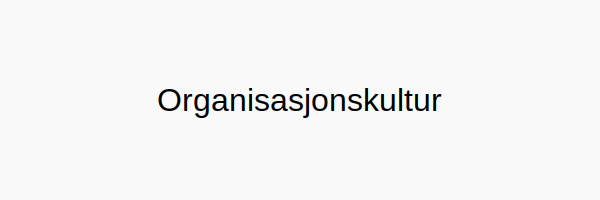
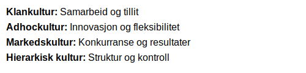
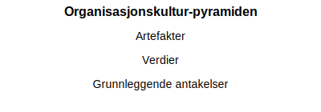

---
title: "Organisasjonskultur"
seoTitle: "Organisasjonskultur"
meta_description: '**Organisasjonskultur** omfatter de delte **verdiene**, **normene** og **holdningene** som former atferd og beslutninger i en organisasjon. En sterk og positiv ...'
slug: organisasjonskultur
type: blog
layout: pages/single
---

**Organisasjonskultur** omfatter de delte **verdiene**, **normene** og **holdningene** som former atferd og beslutninger i en organisasjon. En sterk og positiv organisasjonskultur kan fremme god **internkontroll**, effektivitet og etterlevelse av lover og regler, mens en svak kultur kan øke risikoen for feil og misligheter.

## Hva er Organisasjonskultur?

Organisasjonskultur beskriver de usynlige kreftene som påvirker hvordan ansatte samhandler, tar beslutninger og løser problemer. Den består ofte av tre nivåer:

| Nivå       | Beskrivelse                                       |
|------------|---------------------------------------------------|
| **Artefakter** | Synlige strukturer, symboler og atferdsmønstre    |
| **Verdier**    | Delte overbevisninger og mål                      |
| **Grunnleggende antakelser** | Ubevisste oppfatninger og måte å se verden på |

## Typer Organisasjonskultur

I følge Cameron & Quinn finnes det fire kulturtyper som ofte dominerer:

| Kulturtype  | Kjennetegn                         | Fokusområde              |
|-------------|------------------------------------|--------------------------|
| **Klankultur**    | Fellesskap, samarbeid og tillit      | Mennesker og utvikling   |
| **Adhockultur**   | Innovasjon, fleksibilitet og kreativitet | Eksperimentering og endring |
| **Markedskultur** | Konkurranse, måloppnåelse og resultater | Ekstern måloppnåelse     |
| **Hierarkisk kultur** | Struktur, kontroll og stabilitet      | Effektivitet og risikostyring |

## Hvordan Organisasjonskultur Påvirker Regnskap og Internkontroll

En organisasjons kultur påvirker direkte hvordan risikovurdering og kontrollaktiviteter gjennomføres. En åpen og tillitsbasert kultur legger til rette for tidlig identifisering av avvik, mens en rigid kultur kan hindre kommunikasjon om feil.

| Påvirkning            | Effekt på regnskapsprosesser                  |
|-----------------------|-----------------------------------------------|
| **Åpenhet og tillit**     | Forenkler rapportering av feil og misligheter  |
| **Fokus på resultater**   | Øker sannsynligheten for kreative løsninger, men kan skape ansvarsgap |
| **Streng kontroll**       | Sikrer overholdelse, men kan hemme innovasjon  |

## Bygge og Videreutvikle Organisasjonskultur

For å styrke kulturen anbefales det å jobbe målrettet med følgende tiltak:

* **Definere felles verdier:** Involver ledergruppe og ansatte i å beskrive ønsket kultur
* **Kommunikasjon:** Del historier og suksesseksempler som illustrerer verdiene
* **Opplæring og utvikling:** Tren ansatte i kulturbevisst atferd og ledelsespraksis
* **Belønning og anerkjennelse:** Synliggjør og belønn ønsket atferd
* **Måling og evaluering:** Bruk undersøkelser for å kartlegge kulturens styrker og forbedringsområder

## Samspill med Internkontroll

Organisasjonskultur er et sentralt element i **kontrollmiljøet**, som danner grunnlaget for hele internkontrollsystemet. For mer om internkontroll og COSO-rammeverket, se [Hva er internkontroll?](/blogs/regnskap/hva-er-internkontroll "Hva er Internkontroll? Systemer for Risikoforvaltning og Compliance").

## Oppsummering

En bevisst tilnærming til organisasjonskultur bidrar til å bygge et robust kontrollmiljø, styrke regnskapsprosesser og redusere risiko. Ved å forstå og utvikle kulturen kan norske virksomheter oppnå bedre internkontroll, økt medarbeiderengasjement og mer pålitelig økonomirapportering.

