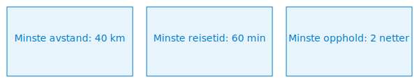

---
title: "Pendlerfradrag"
seoTitle: "Pendlerfradrag"
meta_description: '**Pendlerfradrag** er et **skattefradrag** for ansatte som pendler mellom hjem og arbeidssted og har dokumenterte merutgifter til reise, kost og losji. Dette fr...'
slug: pendlerfradrag
type: blog
layout: pages/single
---

**Pendlerfradrag** er et **skattefradrag** for ansatte som pendler mellom hjem og arbeidssted og har dokumenterte merutgifter til reise, kost og losji. Dette fradraget sikrer at pendlere får kompensert ekstra kostnader som følge av lengre pendlerreise.

## Hva er pendlerfradrag?

Pendlerfradrag gir rett til fradrag for merutgifter som følger av pendling når avstand eller reisetid mellom hjem og arbeidssted overstiger Skatteetatens krav. Fradraget omfatter både reise-, kost- og boutgifter i forbindelse med arbeidsreise.

## Krav for å få pendlerfradrag

| Krav               | Beskrivelse                                         |
|--------------------|-----------------------------------------------------|
| **Minste avstand** | 40 km én vei                                        |
| **Minste reisetid**| 60 min én vei                                       |
| **Minste oppholdstid** | 2 netter per uke                                 |
| **Dokumentasjon**  | Kjørebok, billetter og attestasjon fra arbeidsgiver |

## Beregning av fradraget

Fradragsberettiget beløp er summen av dokumenterte merutgifter til **reise**, **kost** og **losji**. Utgiftene skal dokumenteres i henhold til Skatteetatens regler.

| Fradragskategori | Beskrivelse                                                                    |
|------------------|--------------------------------------------------------------------------------|
| **Reisekostnader**| Faktiske kostnader for transport, se [Kjøregodtgjørelse](/blogs/regnskap/kjoregodtgjorelse "Kjøregodtgjørelse i regnskap: Guide til satser, regler og dokumentasjon") |
| **Boutgifter**    | Dokumenterte utgifter til losji i nærheten av arbeidssted                     |
| **Måltidsfradrag**| Sats i henhold til [Diett](/blogs/regnskap/diett "Diett i regnskap: Guide til normaltariffer, regler og regnskapsføring")         |

## Dokumentasjonskrav

For å kreve pendlerfradrag må følgende dokumentasjon foreligge:

* **Reisedokumentasjon:** Billetter eller kjørebok med reiserute og kilometerstand
* **Losjidokumentasjon:** Kvitteringer eller leiekontrakt for midlertidig bolig
* **Måltidsdokumentasjon:** Egenattest eller bilag i henhold til normaltariffer for diett
* **Attestasjon:** Bekreftelse fra arbeidsgiver på pendlerstatus og reisebehov

## Regnskapsføring av pendlerutlegg

> Pendlerutlegg refunderes ofte via lønnskjøring. Utlegg bokføres på egne kontoer i Norsk Standard Kontoplan.

| Konto    | Beskrivelse                       | Oppgavepliktig |
|----------|-----------------------------------|----------------|
| **7350** | Pendlerutlegg, oppgavepliktig     | Ja             |
| **7360** | Pendlerutlegg, ikke oppgavepliktig| Nei            |

### Bokføringseksempel

| Transaksjon                      | Debet                         | Kredit                       |
|----------------------------------|-------------------------------|------------------------------|
| Utbetaling pendlerutlegg         | 7350                          | 2400                         |
| Betaling til pendler             | 2400                          | 1920                         |

## Internlenker og relaterte emner

* [Hva er fradrag?](/blogs/regnskap/hva-er-fradrag "Hva er fradrag i regnskap? Komplett Guide til Skattefradrag og Regnskapsføring")
* [Kjøregodtgjørelse](/blogs/regnskap/kjoregodtgjorelse "Kjøregodtgjørelse i regnskap: Guide til satser, regler og dokumentasjon")
* [Diett](/blogs/regnskap/diett "Diett i regnskap: Guide til normaltariffer, regler og regnskapsføring")

**Oppsummering:** Pendlerfradrag sikrer at pendlere får kompensert reise-, kost- og boutgifter ved pendling over visse avstander. Korrekt dokumentasjon, attestasjon og bokføring er avgjørende for å oppnå fradraget.

