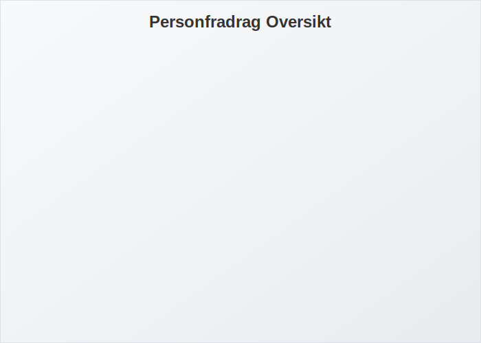
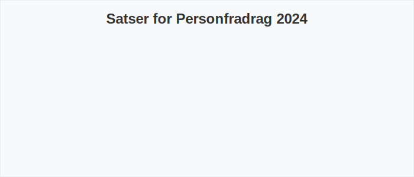

---
title: "Personfradrag i Norge - Alt du trenger å vite"
meta_title: "Personfradrag i Norge - Alt du trenger å vite"
meta_description: '**Personfradrag** er et personlig fradrag som alle skattytere i Norge får. Det reduserer den skattepliktige inntekten **før** beregning av kommunal- og fylkes...'
slug: personfradrag
type: blog
layout: pages/single
---

**Personfradrag** er et personlig fradrag som alle skattytere i Norge får. Det reduserer den skattepliktige inntekten **før** beregning av kommunal- og fylkesskatt, og er en sentral del av det norske skattesystemet.

## Hva er Personfradrag?

Personfradrag (ofte kalt grunnfradrag) er et fast beløp som trekkes fra bruttoinntekten for å kompensere for grunnleggende levekostnader. Beløpet fastsettes årlig av Stortinget.

## Hvordan beregnes Personfradrag?

Personfradraget er likt for alle skattytere i samme skatteklasse, men vil variere basert på alder og sivil status. Den generelle formelen for skattepliktig inntekt blir:

## Gjeldende satser for Personfradrag i 2024

Nedenfor ser du vedtatte satser for personfradrag 2024:

| Skatteklasse          | Personfradrag 2024 |
|-----------------------|--------------------|
| Klasse 1 (alminnelig) | 58 250 kr          |
| Klasse 2 (særskilt)   | 58 250 kr          |

## Praktisk Eksempel

Eksempel på beregning av skattepliktig inntekt for en lønnsmottaker:

| Bruttoinntekt | Personfradrag | Skattepliktig inntekt |
|--------------:|--------------:|-----------------------:|
| 600 000 kr    |     58 250 kr |               541 750 kr |

## Sammenhenger med andre fradrag

Personfradrag kan kombineres med andre fradrag:

* For mer om [minstefradrag](/blogs/regnskap/hva-er-minstefradrag "Hva er Minstefradrag? Komplett Guide til Minstefradrag i Norge 2024"), se den aktuelle artikkelen.
* Se også [Skjermingsfradrag](/blogs/regnskap/hva-er-skjermingsfradrag "Hva er Skjermingsfradrag? Guide til Skjermingsfradrag i Aksjer").
* Les om generelle [fradragsprinsipper](/blogs/regnskap/hva-er-fradrag "Hva er fradrag i regnskap? Komplett Guide til Skattefradrag og Regnskapsføring") for mer informasjon om hvilke kostnader som kan fradragsføres.

## Oppsummering

Personfradrag er et grunnleggende element i norsk skatteberegning som sikrer at alle får et standard fradrag for levekostnader. Å forstå satser og beregninger kan gi bedre skatteplanlegging og økt innsikt i egen økonomi.
