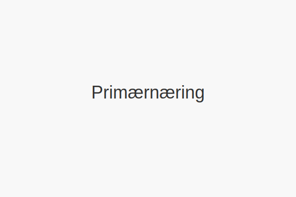

---
title: "Hva er primærnæring?"
meta_title: "Hva er primærnæring?"
meta_description: 'Primærnæring er en samlebetegnelse for virksomheter som utvinner ressurser direkte fra naturen. Dette inkluderer **jordbruk**, **skogbruk** og **fiske**. I no...'
slug: primarnaring
type: blog
layout: pages/single
---

Primærnæring er en samlebetegnelse for virksomheter som utvinner ressurser direkte fra naturen. Dette inkluderer **jordbruk**, **skogbruk** og **fiske**. I norsk regnskap og skatt har primærnæringer egne regler og særordninger på grunn av naturressurser, sesongvariasjoner og biologiske eiendeler.

Se vår detaljerte artikkel om [næringsvirksomhet](/blogs/regnskap/naeringsvirksomhet "Hva er næringsvirksomhet? Definisjon og Regnskapsmessig Behandling") for grunnleggende kriterier for næringsvirksomhet, og en oversikt over ulike næringstyper i Norge.

## Definisjon og omfang

Primærnæringer omfatter aktiviteter som tar utgangspunkt i råvarer fra naturen før de bearbeides videre. De viktigste sektorene er:

* **Jordbruk:** Produksjon av mat og fiber fra planter og husdyr.
* **Skogbruk:** Trelast, papir og biobrensel fra skogressurser.
* **Fiske og oppdrett:** Villfangst og oppdrett av fisk og skalldyr.

## Sammenheng med andre næringssektorer

Primærnæringer utgjør den første fasen i den økonomiske verdikjeden. De øvrige sektorene er **sekundærnæringer** (industri og utvinning) og **tertiærnæringer** (tjenestesektoren).

| Næringssektor      | Eksempler                                  | NACE-koder     |
|--------------------|---------------------------------------------|----------------|
| Primærnæringer     | Jordbruk, Skogbruk, Fiske                  | A01 - A03      |
| Sekundærnæringer   | Industri, Gruvevirksomhet                   | B - E          |
| Tertiærnæringer    | Tjenester, Handel, Transport                | F - U          |

## Særordninger og rapporteringskrav

Primærnæringer har flere særordninger og krav i regnskap og skatt:

1.  **Spesielle skjemaer:** Næringsoppgave for primærnæringer (N2/N3) med egne vedlegg.
2.  **Biologiske eiendeler:** Levende dyr, planter og avlinger må verdivurderes særskilt.
3.  **Sesongvariabilitet:** Periodisering av inntekter og kostnader krever tilpassede metoder, som [tømmerkonto](/blogs/regnskap/hva-er-tommerkonto "Hva er Tømmerkonto? Inntektsutjevning i Skogbruk").
4.  **Subsidier og tilskudd:** Offentlige tilskudd påvirker grunnlag for skattemessige fradrag, inkludert [jordbruksfradrag](/blogs/regnskap/hva-er-jordbruksfradrag "Hva er Jordbruksfradrag? Komplett Guide til Skattefradrag i Landbruket").

## Merverdiavgift (MVA)

Primærnæringer har høyere omsetningsgrense for MVA-plikt:

| Virksomhetstype  | Omsetningsgrense | Registreringsplikt |
|------------------|------------------|--------------------|
| Primærnæringer   | 70 000 kr        | Obligatorisk       |

For mer om MVA-plikt i primærnæringer, se [Hva er Avgiftsplikt (MVA)?](/blogs/regnskap/hva-er-avgiftsplikt-mva "Hva er Avgiftsplikt (MVA)? Komplett Guide til Merverdiavgift i Norge").

## Bokføringsplikt og forenklede regler

Primærnæringer kan ha forenklede bokføringsregler ved lav omsetning og få transaksjoner, men må likevel oppfylle grunnleggende bokføringskrav:

| Kriterium         | Krav                         |
|-------------------|------------------------------|
| Omsetning         | Over 0 kr                    |
| Dokumentasjon     | Bilag for alle transaksjoner |
| Rapportering      | Landbruksdirektoratet ved behov |

Se [Hva er bokføringsplikt?](/blogs/regnskap/hva-er-bokforingsplikt "Hva er Bokføringsplikt? Komplett Guide til Bokføringsplikt i Norge") for detaljer om bokføringsplikt i primærnæringer.

## Oppsummering

Primærnæringer er grunnsteinen i økonomien, men krever særskilt oppmerksomhet i regnskap og skatt på grunn av naturressurser, sesongvariasjoner og egne støtteordninger. Ved å følge de spesielle reglene for rapportering og verdivurdering, kan primærnæringer sikre korrekt regnskapsførsel og skattemessig behandling.

