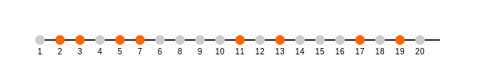

---
title: "Primtall"
seoTitle: "Primtall"
description: '**Primtall** er heltall større enn 1 som kun er delelige med 1 og seg selv. Dette abstrakte, men viktige, **matematiske konseptet** har sentrale anvendelser i ...'
---

**Primtall** er heltall større enn 1 som kun er delelige med 1 og seg selv. Dette abstrakte, men viktige, **matematiske konseptet** har sentrale anvendelser i **norsk regnskap**, særlig innen modulær aritmetikk for kontrollsifferalgoritmer.

## Definisjon og egenskaper

Et primtall *p* oppfyller kun divisjonsrelasjonene *1 ‰¤ p* og *p ‰¤ p*. De første primtallene er:

| Rang | Primtall |
|-----:|:---------|
| 1    | 2        |
| 2    | 3        |
| 3    | 5        |
| 4    | 7        |
| 5    | 11       |
| 6    | 13       |
| 7    | 17       |
| 8    | 19       |

Primtallene **2, 3, 5, 7, 11, 13, 17, 19** vises også grafisk nedenfor:

## Fordelinger og teoremer

En grunnleggende setning i tallteori er **primtallsatsen**, som beskriver fordelingen av primtall blant de positive heltallene. Kort fortalt sier den at antallet primtall mindre enn *n* er om lag *n / ln(n)*.

**Viktige egenskaper**:

* Det finnes uendelig mange primtall (Euclids bevis).
* Primtallene blir sjeldnere jo større tallene blir, men de forsvinner ikke.
* Avstanden mellom påfølgende primtall kan variere betydelig.

## Anvendelser i norsk regnskap

I regnskap og finansielle systemer benyttes primtall spesielt i **modulær aritmetikk** ved beregning av kontrollsiffer for bankkontonummer, organisasjonsnummer og andre identifikatorer.

For eksempel i [Hva er Kontonummer?](/blogs/regnskap/hva-er-kontonummer "Hva er Kontonummer? Struktur og Kontrollsiffer i Norge") og [Hva er Organisasjonsnummer?](/blogs/regnskap/hva-er-organisasjonsnummer "Hva er Organisasjonsnummer? Unike IDer for Norske Selskaper") brukes **modulus 11** (der 11 er et **primtall**) for å sikre gyldighet og unngå tastefeil.

### Modulær aritmetikk med primtall

1. Velg et **primtall** *p* som modul, ofte 11.
2. Multipliser hver sifferplass med en vektfaktor og summer resultatet.
3. Del summen med *p* (modulus *p*) og bruk resten til å beregne kontrollsiffer.

Denne teknikken reduserer risiko for manuelle feil og automatiserer validering i [banktransaksjoner](/blogs/regnskap/hva-er-banktransaksjoner "Hva er Banktransaksjoner? Komplett Guide til Bankoperasjoner og Regnskapsføring") og [Elektronisk Fakturering](/blogs/regnskap/hva-er-elektronisk-fakturering "Hva er Elektronisk Fakturering? Komplett Guide til Digitale Fakturaløsninger").

## Relaterte emner

* [Modulær aritmetikk](/blogs/regnskap/hva-er-matematikk "Modulær Aritmetikk “ Oversikt over aritmetiske operasjoner i regnskap")
* [Hva er Kontonummer?](/blogs/regnskap/hva-er-kontonummer "Hva er Kontonummer? Struktur og Kontrollsiffer i Norge")
* [Hva er Organisasjonsnummer?](/blogs/regnskap/hva-er-organisasjonsnummer "Hva er Organisasjonsnummer? Unike IDer for Norske Selskaper")

