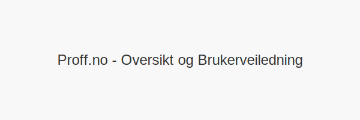

**Proff.no** er en norsk digital plattform for bedriftsinformasjon som gir tilgang til offisielle **regnskapstall**, kredittvurderinger, nøkkeltall og kontaktinformasjon om alle registrerte virksomheter i Norge. Tjenesten samler data fra blant annet [Brønnøysundregistrene](/blogs/regnskap/bronnoysundregistrene "Brønnøysundregistrene “ Offentlig register for norske bedrifter") og offentlig tilgjengelige regnskaper.

## Hva er Proff.no?

Proff.no er utviklet for å forenkle tilgang til viktig forretningsinformasjon. Plattformen henter data fra offentlige registre og presenterer den i en brukervennlig oversikt med grafer, tabeller og nyckeltall.

## Viktige funksjoner

* **Søk etter bedrift**: Finn firmaer ved navn eller organisasjonsnummer.
* **Regnskapstall**: Se årsregnskap, balanse og resultatrapporter.
* **Nøkkeltall**: Analyser omsetning, resultatmargin og egenkapitalprosent.
* **Kredittscore**: Få en indikasjon på bedriftens kredittverdighet.
* **Kontaktinformasjon**: Adresse, telefon og e-post til nøkkelpersoner.

## Slik bruker du Proff.no

1. Gå til Proff.no og skriv inn **firmaets navn** eller **organisasjonsnummer**.
2. Velg riktig oppføring i søkeresultatet.
3. Utforsk regnskapsrapporter, nøkkeltall og kontaktopplysninger.
4. Last ned PDF-rapporter eller eksportér data for videre analyse.

## Oversikt over funksjoner

| **Funksjon**           | **Beskrivelse**                                                                 |
|------------------------|---------------------------------------------------------------------------------|
| Søk etter bedrift      | Finn firmaer ved navn eller organisasjonsnummer.                                |
| Regnskapstall          | Vis årsregnskap, balanse og resultat.                                           |
| Nøkkeltall             | Se nøkkeltall som omsetning, resultatmargin og egenkapitalprosent.             |
| Kredittscore           | Få en score som reflekterer bedriftens kredittverdighet.                        |
| Kontaktinformasjon     | Adresse, telefon og e-post til bedriftens nøkkelpersoner.                       |

## Typiske brukstilfeller

1. Undersøke potensielle kunder og leverandører.
2. Analysere konkurrenters økonomi.
3. Verifisere juridisk status via [Brønnøysundregistrene](/blogs/regnskap/bronnoysundregistrene "Brønnøysundregistrene “ Offentlig register for norske bedrifter").
4. Forberede [due diligence](/blogs/regnskap/due-diligence "Due Diligence “ En Guide til Risiko- og Sårbarhetsanalyse").

## Konklusjon

Proff.no er et **kraftig verktøy** for alle som trenger rask og pålitelig tilgang til bedriftsinformasjon i Norge. Plattformens kombinasjon av offisielle data, oversiktlige rapporter og nøkkeltall gjør det enkelt å ta informerte beslutninger.

