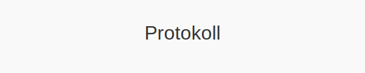
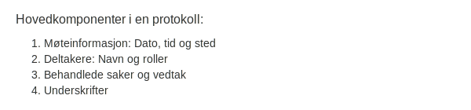
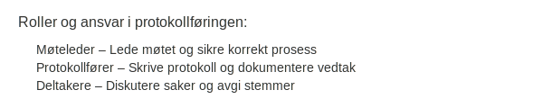
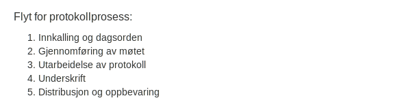

---
title: "Protokoll"
seoTitle: "Protokoll"
description: "Protokoll er et formelt møtereferat som dokumenterer saker, vedtak og deltakere i generalforsamlinger og styremøter, viktig for sporbarhet og etterlevelse."
summary: "Hva en protokoll er, lovkrav til innhold og hvordan den føres og oppbevares."
---

**Protokoll** er det formelle dokumentet som **dokumenterer** vedtak, diskusjoner og beslutningsprosesser i **generalforsamlinger**, **styremøter** og andre formelle selskapsorganer. En korrekt ført protokoll er avgjørende for å sikre **sporbarhet** og **gjennomsiktighet** i regnskapet.

## Hva er protokoll?

En **protokoll** er et offisielt møtereferat som dokumenterer hvem som var til stede, hvilke saker som ble behandlet, diskusjoner, vedtak og stemmeresultater. Protokoller er et lovpålagt krav for flere typer formelle møter i norske selskaper, blant annet ordinære og ekstraordinære generalforsamlinger og styremøter.

## Formelle krav til protokoll

For å oppfylle lovkrav må protokollene inneholde følgende:

*   Skal føres for både **ordinære og ekstraordinære generalforsamlinger** (se [Hva er generalforsamling?](/blogs/regnskap/hva-er-generalforsamling "Hva er generalforsamling? Guide til generalforsamling")).
*   Skal føres for **styremøter** i henhold til [Aksjeloven](/blogs/regnskap/hva-er-aksjeloven "Hva er Aksjeloven? Regler for Aksjeselskaper i Norge").
*   Må angi dato, sted, deltakerliste, behandlede saker, vedtak og stemmeresultater.
*   Protokollen skal underskrives av møteleder og minst ett annet møtevalgt medlem.
*   Oppbevares i minst **10 år** etter regnskapsårets slutt i henhold til [Bokføringsloven](/blogs/regnskap/hva-er-bokforingsloven "Hva er Bokføringsloven? Krav til bokføring og oppbevaring").

## Hovedkomponenter i en protokoll

| Komponent           | Beskrivelse                                   |
|---------------------|-----------------------------------------------|
| **Møteinformasjon**   | Dato, tid og sted                             |
| **Deltakere**         | Navn på møtedeltakere og deres roller         |
| **Behandlede saker**  | Overskrift og innhold for hver sak            |
| **Vedtak og stemmer** | Resultat av avstemming                         |
| **Underskrifter**     | Signaturer fra møteleder og møtevalgte medlemmer |

## Roller og ansvar

| Rolle            | Ansvar                                       |
|------------------|-----------------------------------------------|
| Møteleder        | Lede møtet og sikre korrekt prosess          |
| Protokollfører   | Skrive protokoll og dokumentere vedtak       |
| Styremedlemmer   | Diskutere saker og avgi stemmer               |
| Aksjonærer       | Delta, diskutere og stemme                   |

## Protokollprosessen

1. **Innkalling og dagsorden:** Distribuer innkalling i samsvar med [Vedtekter](/blogs/regnskap/hva-er-vedtekter-for-aksjeselskap "Hva er Vedtekter for Aksjeselskap?").
2. **Gjennomføring av møtet:** Lede møtet, behandle saker og registrere diskusjoner.
3. **Utarbeidelse av protokoll:** Protokollfører skriver referat med alle nødvendige detaljer.
4. **Underskrift:** Møteleder og utpekte medlemmer underskriver protokollen.
5. **Distribusjon og oppbevaring:** Arkiver protokollen i samsvar med [Bokføringsloven](/blogs/regnskap/hva-er-bokforingsloven "Hva er Bokføringsloven? Krav til bokføring og oppbevaring") og [Oppbevaring av regnskapsmateriale](/blogs/regnskap/oppbevaring-av-regnskapsmateriale "Oppbevaring av regnskapsmateriale").

## Oppbevaring av protokoll

I henhold til [Bokføringsloven](/blogs/regnskap/hva-er-bokforingsloven "Hva er Bokføringsloven? Krav til bokføring og oppbevaring") skal protokoller oppbevares i minst ti år etter regnskapsårets slutt. Protokoller regnes som regnskapsmateriale og må være tilgjengelige ved bokettersyn.

## Beste praksis

*   **Standardiser maler:** Bruk en fast mal for å sikre konsistens.
*   **Digital arkivering:** Vurder elektroniske protokoller og verifiser at digitale signaturer er gyldige.
*   **Versjonskontroll:** Sørg for at endringer er dokumentert og tidligere versjoner arkiveres.
*   **Sikker oppbevaring:** Beskytt protokoller mot uautorisert tilgang og datatap.
*   **Regelmessig opplæring:** Gi opplæring i korrekt protokollføring for nøkkelpersonell.

## Relaterte artikler

* [Hva er generalforsamling?](/blogs/regnskap/hva-er-generalforsamling "Hva er generalforsamling? Guide til generalforsamling")
* [Hva er vedtekter for aksjeselskap?](/blogs/regnskap/hva-er-vedtekter-for-aksjeselskap "Hva er Vedtekter for Aksjeselskap?")
* [Hva er aksjeloven?](/blogs/regnskap/hva-er-aksjeloven "Hva er Aksjeloven? Regler for Aksjeselskaper i Norge")
* [Oppbevaring av regnskapsmateriale](/blogs/regnskap/oppbevaring-av-regnskapsmateriale "Oppbevaring av regnskapsmateriale")
* [Noter](/blogs/regnskap/noter "Noter “ Guide til regnskapsnoter")

