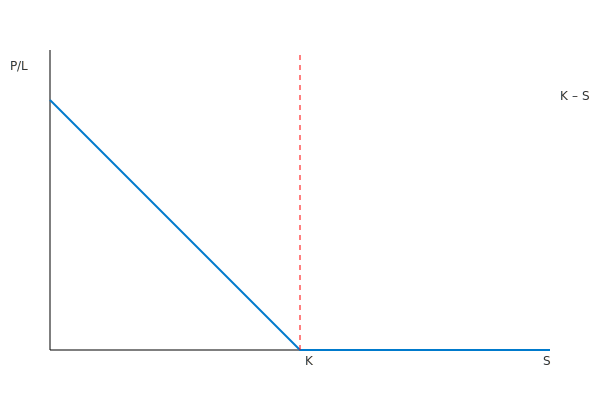

---
title: "Hva er en Put-opsjon?"
seoTitle: "Hva er en Put-opsjon?"
description: "En put-opsjon er en avtale som gir rett, men ikke plikt, til å selge en underliggende eiendel til en avtalt pris innen en gitt tidsperiode."
summary: "Forklaring av put-opsjoner, nøkkelbegreper, payoff og regnskapsmessig behandling."
---

En **put-opsjon** (salgsopsjon) er en type opsjonsavtale som gir innehaveren rett, men ikke plikt, til å **selge** den underliggende eiendelen til en forhåndsbestemt pris (strike) innen eller på utløpsdatoen. Put-opsjoner er viktige for risikostyring, investeringsbeskyttelse og selskapers finansielle planlegging.

Les mer om opsjoner generelt i [Hva er en Opsjon?](/blogs/regnskap/opsjon "Hva er en Opsjon?").

## Hva er en Put-opsjon?

For mer om opsjonsavtaler generelt, se [Hva er en Opsjonsavtale?](/blogs/regnskap/hva-er-opsjonsavtale "Hva er en Opsjonsavtale?").

En **put-opsjon** gir innehaveren rett til å selge en underliggende eiendel til en forhåndsbestemt **utøvelsespris** innen en angitt tidsperiode. Innehaveren tjener når markedsprisen på eiendelen er lavere enn utøvelsesprisen ved utløp.

## Grunnleggende elementer i en put-opsjon

En put-opsjon består av flere nøkkelfaktorer:

* **Underliggende eiendel** “ den finansielle eiendelen som kan selges.
* **Utøvelsespris (K)** “ den avtalte prisen innehaveren kan selge eiendelen for.
* **Utløpsdato (T)** “ siste dag opsjonen kan utøves.
* **Opsjonspremie** “ kostnaden for å erverve put-opsjonen.
* **Volatilitet (σ)** “ forventet variasjon i underliggende eiendels pris.

## Payoffdiagram for put-opsjon

Et payoffdiagram viser potensiell gevinst eller tap ved utløp av put-opsjonen:

## Nøkkelfaktorer og deres påvirkning

| Faktor                | Symbol | Effekt på put-opsjon  |
|------------------------|--------|-----------------------|
| **Aksjepris**          | S      | Negativ               |
| **Utøvelsespris**      | K      | Positiv               |
| **Tid til utløp**      | T      | Positiv               |
| **Risikofri rente**    | r      | Negativ               |
| **Volatilitet**        | σ      | Positiv               |
| **Utbytte**            | q      | Positiv               |

## Regnskapsmessig behandling av put-opsjoner

Regnskapsmessig innregning og måling følger [IFRS 9](/blogs/regnskap/hva-er-ifrs "Hva er IFRS?") for finansielle instrumenter. Ved første gangs innregning skal put-opsjoner måles til virkelig verdi, og transaksjonskostnader skal inkluderes dersom de ikke er del av handelsportefølje.

Videre må etterfølgende måling skje enten til virkelig verdi gjennom resultatregnskap eller gjennom totalresultat, avhengig av forretningsmodell og kontraktens karakteristika.

## Praktiske eksempler

1. **Spekulasjon**: En investor kjøper put-opsjoner for å dra nytte av forventet prisnedgang på en aksje med begrenset kapitalrisiko (maksimal risiko er opsjonspremien).
2. **Sikring**: Et selskap som eier underliggende eiendeler bruker put-opsjoner for å beskytte mot prisfall.

## Oppsummering

* En put-opsjon gir rett, men ikke plikt, til å selge en eiendel til en avtalt pris.
* Regnskapsmessig innregning følger IFRS 9 med virkelig verdi-måling.
* Put-opsjoner brukes både til spekulasjon og sikring.

## Se også

* [Hva er en Opsjonsavtale?](/blogs/regnskap/hva-er-opsjonsavtale "Hva er en Opsjonsavtale? Komplett Guide til Opsjoner i Regnskap")
* [Hva er en Call-opsjon?](/blogs/regnskap/call-opsjon "Hva er en Call-opsjon? En Guide til Kjøpsopsjoner i Regnskap")
* [Hva er Derivater?](/blogs/regnskap/derivater "Hva er Derivater? En Guide til Derivater i Regnskap")

