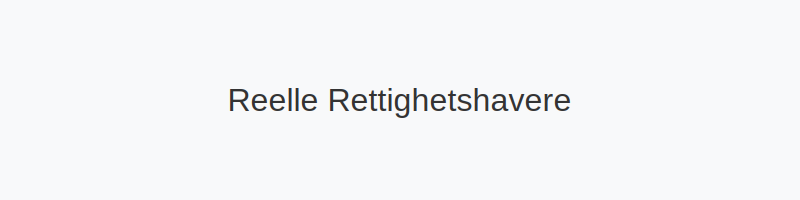
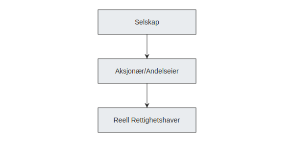

---
title: "Reelle Rettighetshavere: Ultimate Beneficial Ownership i Norge"
meta_title: "Reelle Rettighetshavere: Ultimate Beneficial Ownership i Norge"
meta_description: ''
slug: reelle-rettighetshavere
type: blog
layout: pages/single
---

Reelle rettighetshavere, også kjent som *ultimate beneficial owners (UBO)*, er de personene som i siste instans eier eller kontrollerer et selskap eller en juridisk enhet. Å identifisere **reelle rettighetshavere** har blitt et sentralt krav i norsk regnskaps- og rapporteringspraksis for å sikre åpenhet og hindre hvitvasking.

Denne veiledningen dekker:

* Definisjon og formål med identifisering av reelle rettighetshavere
* Regelverk og rapporteringskrav i Norge
* Praktiske trinn for registrering og dokumentasjon
* Regnskapsmessige og compliance-implikasjoner

## Hva er en reell rettighetshaver?

En reell rettighetshaver er den fysiske personen som til syvende og sist **eier**, **kontrollerer** eller **har betydelig innflytelse** i en juridisk enhet. Dette kan omfatte:

* Direkt eierandel gjennom aksjer eller andeler
* Kontroll via aksjeklasser med spesielle rettigheter
* Avtaler som gir rett til å utøve kontroll

## Regelverk og rapporteringskrav

Norsk lov krever at de fleste selskaper må identifisere og rapportere sine reelle rettighetshavere til [Foretaksregisteret](/blogs/regnskap/hva-er-foretaksregisteret "Hva er Foretaksregisteret?") innen fastsatte frister. Kravene følger av hvitvaskingsregelverket (**hvitvaskingsloven**) og bokføringsloven.

| Selskapsform               | Registrering av UBO                 | Frist        |
|-----------------------------|-------------------------------------|--------------|
| Aksjeselskap (AS)          | Foretaksregisteret                  | 31.12. året etter stiftelse |
| Ansvarlig selskap (ANS/DA)  | Foretaksregisteret                  | 31.12. året etter stiftelse |
| Enkeltpersonforetak (ENK)   | Foretaksregisteret (ved omsetning >50k)| 31.12. året etter omsetning overstiger terskel |

### Unntak og terskelverdier

Det finnes *unntak* for mindre enheter og offentlig eide selskaper. Dersom ingen personer oppfyller terskelen på **over 25 %** eierandel eller kontroll, skal registrering likevel gjennomføres med en erklæring om at ingen reelle rettighetshavere er funnet.

## Praktisk registrering

For å dokumentere reelle rettighetshavere må selskapet:

1. Kartlegge aksjeeierboken og eventuelle avtaler med kontrollrettigheter.
2. Innhente personlig informasjon (navn, fødselsdato, adresse og nasjonalitet).
3. Følge veiledning fra [Altinn](/blogs/regnskap/hva-er-altinn "Hva er Altinn? Komplett Guide til Digitalt Samfunn") for elektronisk innsending.
4. Dokumentere vurderinger og lagre internt som bilag for bokføringen.

## Regnskaps- og compliance-implikasjoner

Å ikke rapportere reelle rettighetshavere kan medføre **bøter**, **sanksjoner** eller **tvungen oppløsning**. I regnskapet behandles dokumentasjonen som en del av bilagskravene i henhold til [bokføringsloven](/blogs/regnskap/hva-er-bokforingsloven "Hva er Bokføringsloven?").

## Se også

* [Hva er en aksjonær?](/blogs/regnskap/hva-er-en-aksjonaer "Hva er en Aksjonær? En Komplett Guide")
* [Organisasjonsform](/blogs/regnskap/organisasjonsform "Organisasjonsform: Komplett Guide til Selskapsformer i Norge")

