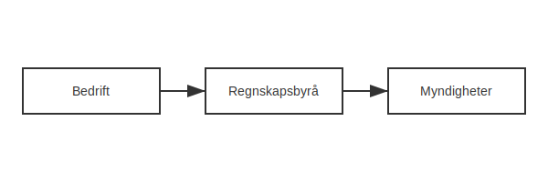

---
title: "Regnskapsbyrå - Hva gjør de og hvorfor er det viktig?"
seoTitle: "Regnskapsbyrå - Hva gjør de og hvorfor er det viktig?"
meta_description: '**Regnskapsbyrå** er selskaper som tilbyr tjenester innen **bokføring**, **rapportering**, **rådgivning** og **lønnsadministrasjon** til bedrifter og organi...'
slug: regnskapsbyra
type: blog
layout: pages/single
---

**Regnskapsbyrå** er selskaper som tilbyr tjenester innen **bokføring**, **rapportering**, **rådgivning** og **lønnsadministrasjon** til bedrifter og organisasjoner. I Norge er regnskapsbyråer sentrale for å sikre at virksomheter følger gjeldende lover og forskrifter, og at regnskapet gir et korrekt bilde av økonomien.

## Tjenester fra et Regnskapsbyrå

Regnskapsbyråer tilbyr en rekke tjenester, blant annet:

* **Bokføring**: Løpende registrering av inntekter og kostnader.
* **Årsregnskap**: Utarbeidelse av balanse, resultatregnskap og noter.
* **Lønnskjøring**: Beregning og utbetaling av lønn, samt rapportering til myndigheter.
* **MVA-behandling**: [MVA-melding](/blogs/regnskap/hva-er-mva-melding "Hva er MVA-melding? En Komplett Guide til Merverdiavgiftsrapportering") og mva-regnskap.
* **Rapportering** til offentlige myndigheter som Skatteetaten og [næringsoppgave](/blogs/regnskap/hva-er-naeringsoppgave-1 "Hva er næringsoppgave? Guide til Næringsoppgave 1").
* **Rådgivning**: Økonomisk analyse, budsjett, likviditetsstyring og skatterådgivning.

## Hvorfor bruke et Regnskapsbyrå?

Å samarbeide med et regnskapsbyrå gir flere fordeler:

| Fordel | Beskrivelse |
| :--- | :--- |
| **Kompetanse** | Tilgang til fagfolk med kjennskap til norsk regnskapslovgivning. |
| **Tidseffektivitet** | Frigjør tid for kjernevirksomheten. |
| **Risikoredusering** | Reduserer risikoen for feil og bøter. |
| **Oppdateringer** | Holder deg oppdatert på nye regler som [API-integrasjon og automatisering](/blogs/regnskap/api-integrasjon-automatisering-regnskap "API-integrasjon & Automatisering i Regnskap"). |

## Hvordan velge riktig Regnskapsbyrå?

Vurder følgende kriterier når du skal velge et regnskapsbyrå:

1.  Erfaring og referanser i din bransje.
2.  Kompatibilitet med ditt [regnskapssystem](/blogs/regnskap/hva-er-regnskap "Hva er et regnskapssystem?").
3.  Prismodell: Fastpris vs. timepris.
4.  Teknologisk plattform og integrasjoner.
5.  Nærhet og tilgjengelighet.

## Priser og prismodeller

Prisene varierer etter omfang og kompleksitet. Her er en generell oversikt:

| Modell | Beskrivelse | Egnet for |
| :--- | :--- | :--- |
| **Fastpris** | Fast månedlig eller årlig avgift. | Små bedrifter med forutsigbare behov. |
| **Timepris** | Betaling per time. | Prosjektbaserte oppdrag og sporadiske tjenester. |
| **Resultatbasert** | Honoraret avhengig av sparte kostnader eller oppnådd resultat. | Spesialrådgivning og skatteprosjekter. |

## Digitalisering og fremtidige trender

Bransjen utvikler seg raskt med fokus på *digitalisering*, *automatisering* og *skytjenester*. Moderne regnskapsbyråer tilbyr:

* **API-integrasjon**: Direkte kobling mellom regnskapssystem og bank, fakturaprogram eller ERP.
* **Sikker skylagring**: Kryptert, tilgjengelig fra hvor som helst.
* **Maskinlæring**: Automatisert kategorisering av bilag.
* **Dashbord**: Sanntidsrapportering for ledelsen.

## Oppsummering

Et regnskapsbyrå er en viktig samarbeidspartner for norske virksomheter som ønsker korrekt, effektiv og oppdatert regnskap. Ved å benytte et regnskapsbyrå kan du fokusere på kjernevirksomheten, samtidig som du sikrer lovlighet og økonomisk kontroll.

