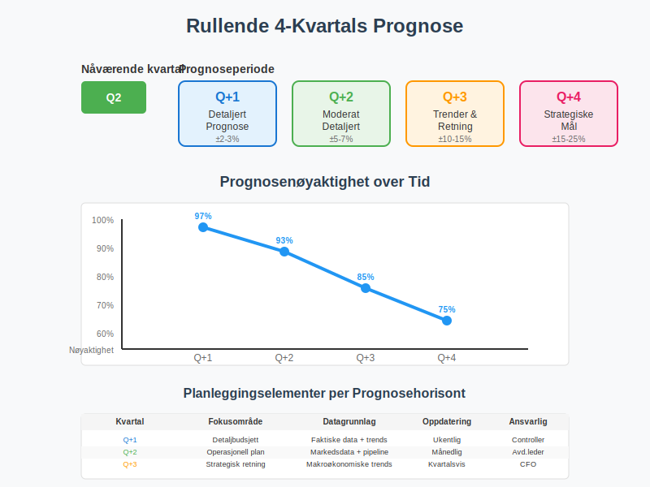
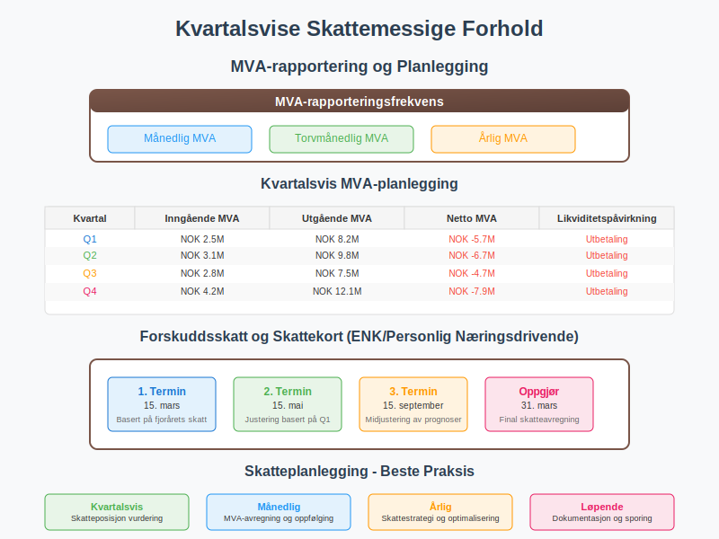

**Regnskapskvartaler Q1-Q4** er en grunnleggende organisering av regnskapsåret som deler de tolv månedene inn i fire kvartaler. Denne inndelingen er sentral for **finansiell rapportering**, [budsjettplanlegging](/blogs/regnskap/hva-er-budsjett "Hva er Budsjett? Komplett Guide til Budsjettplanlegging og Budsjettstyring") og økonomisk analyse både for norske og internasjonale selskaper. Forståelse av regnskapskvartaler er avgjørende for alle som arbeider med regnskap, finans eller forretningsanalyse.

## Definisjon og Struktur av Regnskapskvartaler

### Grunnleggende Inndeling

Regnskapsåret deles inn i **fire kvartaler** på følgende måte:

* **Q1 (Første kvartal):** Januar - Mars
* **Q2 (Andre kvartal):** April - Juni  
* **Q3 (Tredje kvartal):** Juli - September
* **Q4 (Fjerde kvartal):** Oktober - Desember

### Norske vs. Internasjonale Standarder

I Norge følger de fleste selskaper **kalenderår** som regnskapsår, noe som betyr at kvartalene sammenfaller med de tradisjonelle kalenderkvartalene. Dette er i tråd med [regnskapsloven](/blogs/regnskap/hva-er-regnskapsloven "Hva er Regnskapsloven? Komplett Guide til Norsk Regnskapslovgivning") og **Good Accounting Practice (GAP)**.

| **Land/Region** | **Vanlig Regnskapsår** | **Q1 Start** | **Kommentarer** |
|----------------|----------------------|--------------|------------------|
| Norge | Kalenderår (Jan-Des) | 1. januar | Regnskapsloven krever kalenderår |
| USA | Varierer | Ulikt | Mange selskaper bruker fiscal year |
| Japan | April-Mars | 1. april | Traditionelt basert på skoleår |
| Australia | Juli-Juni | 1. juli | Følger statens budsjettår |

## Regnskapskvartaler og Finansiell Rapportering

### Kvartalsrapportering

**Børsnoterte selskaper** på Oslo Børs må levere kvartalsrapporter som inneholder:

#### Påkrevd Innhold i Kvartalsrapporter
* **Resultatregnskap** for kvartalet og kumulativt
* **Balanse** per kvartalets slutt
* **Kontantstrømoppstilling** 
* **Nøkkeltall** og sammenligningstall
* **Kommentarer** til utvikling og utsikter

### Rapporteringsfrister

| **Kvartal** | **Rapporteringsfrist** | **Børskrav** | **Regnskapsloven** |
|------------|----------------------|-------------|-------------------|
| Q1 | 30. april | Børsnoterte | Ikke påkrevd |
| Q2 | 31. juli | Børsnoterte | [Halvårsregnskap](/blogs/regnskap/hva-er-halvarsregnskap "Hva er Halvårsregnskap? Krav og Innhold i Delårsrapporter") |
| Q3 | 31. oktober | Børsnoterte | Ikke påkrevd |
| Q4 | 30. april (årsregnskap) | Alle selskaper | [Årsregnskap](/blogs/regnskap/hva-er-arsregnskap "Hva er Årsregnskap? Komplett Guide til Årsrapporter og Regnskapsplikter") |

## Kvartalsvise Planlegging og Budsjett

### Budsjettplanlegging etter Kvartaler

**Virksomheter** bruker kvartaler som grunnlag for:

#### Operasjonell Planlegging
* **Salgsmål** og markedsføringskampanjer
* **Produksjonplanlegging** og lagerstyring
* **Personalplanlegging** og rekruttering
* **[Investeringer](/blogs/regnskap/hva-er-investering "Hva er Investering? Typer, Regnskap og Skattemessige Forhold")** i [anleggsmidler](/blogs/regnskap/hva-er-anleggsmidler "Hva er Anleggsmidler? Komplett Guide til Faste Eiendeler")

#### Finansiell Planlegging  
* **[Likviditetsstyring](/blogs/regnskap/hva-er-likviditet "Hva er Likviditet? Komplett Guide til Likviditetsanalyse og Kontantstrøm")** og kassaflyt
* **Finansieringsstrategier** og låneopptak
* **[Dividend](/blogs/regnskap/hva-er-utbytte "Hva er Utbytte? Regnskapsføring og Skattemessige Forhold")** og tilbakebetaling til eiere
* **Skattebetaling** og [merverdiavgift](/blogs/regnskap/hva-er-mva "Hva er Merverdiavgift (MVA)? Komplett Guide til MVA-regnskapet")

### Rullende Prognoser

Mange selskaper arbeider med **rullende 4-kvartals prognoser**:

* **Q+1:** Detaljert prognose for neste kvartal
* **Q+2:** Moderat detaljerte anslag
* **Q+3:** Overordnede trender og retning
* **Q+4:** Strategiske mål og milepæler

## Sesongvariasjoner og Kvartalseffekter

### Typiske Sesongmønstre

**Ulike bransjer** opplever forskjellige sesongvariasjoner:

#### Detaljhandel
* **Q1:** Post-jule nedgang, vintersalg
* **Q2:** Våroppgang, påskeshopping  
* **Q3:** Sommerferie, reiseperiode
* **Q4:** Julehandel, høyeste [omsetning](/blogs/regnskap/hva-er-omsetning "Hva er Omsetning? Definisjon og Beregning av Salgsinntekter")

#### Reiseliv og Turisme
* **Q1:** Lavest aktivitet, planlegging
* **Q2:** Påskeferie, økende booking
* **Q3:** Høysesong, maksimal kapasitet  
* **Q4:** Vinterturisme, julebord

#### Bygg og Anlegg
* **Q1:** Lavere aktivitet, værpåvirkning
* **Q2:** Oppstart, økt aktivitet
* **Q3:** Høysesong, maksimal produksjon
* **Q4:** Ferdigstillelse, værutfordringer

### Justering for Sesongvariasjoner

For **sammenlignbar analyse** brukes:

| **Metode** | **Beskrivelse** | **Bruksområde** |
|-----------|---------------|-----------------|
| Seasonally adjusted | Statistisk justering | Trendanalyse |
| YoY sammenligning | År-til-år sammenligning | Performance tracking |
| Rolling averages | Glidende gjennomsnitt | Utjevning av svingninger |
| Normalized ratios | Normaliserte [nøkkeltall](/blogs/regnskap/hva-er-nokkeltall "Hva er Nøkkeltall? Komplett Guide til Finansielle Nøkkeltall i Regnskap") | Bransjebenchmarking |

## Kvartalsvise Nøkkeltall og KPIer

### Finansielle Nøkkeltall per Kvartal

**Viktige målinger** som følges kvartalsvis:

#### Lønnsomhetsmål
* **[Bruttofortjeneste](/blogs/regnskap/hva-er-bruttofortjeneste "Hva er Bruttofortjeneste? Beregning og Analyse av Gross Profit")** margin
* **[EBITDA](/blogs/regnskap/hva-er-ebitda "Hva er EBITDA? Beregning og Analyse av Driftsresultat før Renter og Skatt")** og EBITDA-margin
* **[Nettoresultat](/blogs/regnskap/hva-er-nettoresultat "Hva er Nettoresultat? Beregning og Betydning av Årsresultat")** per aksje (EPS)
* **[Avkastning på egenkapital](/blogs/regnskap/hva-er-avkastning "Hva er Avkastning på Investering? Beregning og Analyse av ROI")** (ROE)

#### Effektivitetsmål
* **[Omløpshastighet på varelageret](/blogs/regnskap/hva-er-varelager "Hva er Varelager? En Komplett Guide til Lagerføring og Verdivurdering")**
* **[Kundefordringer](/blogs/regnskap/hva-er-debitor "Hva er Debitor i Regnskap? Komplett Guide til Kundefordringer og Debitorhåndtering")** omløpstid
* **[Leverandørgjeld](/blogs/regnskap/hva-er-kreditor "Hva er Kreditor i Regnskap? Komplett Guide til Leverandørgjeld og Kreditorhåndtering")** betalingstid
* **Working capital** effektivitet

#### Likviditetsmål
* **[Current ratio](/blogs/regnskap/hva-er-likviditet "Hva er Likviditet? Komplett Guide til Likviditetsanalyse og Kontantstrøm")**
* **Quick ratio**
* **Operasjonell kontantstrøm**
* **Fri kontantstrøm**

### Operasjonelle KPIer

**Ikke-finansielle** indikatorer per kvartal:

* **Kundetilfredshet** og NPS-score
* **Markedsandel** og konkurranseposisjon  
* **Medarbeidertilfredshet** og turnover
* **Miljø- og bærekraftsmål**

## Kvartalsvise Skattemessige Forhold

### MVA-rapportering

**[Merverdiavgift](/blogs/regnskap/hva-er-mva "Hva er Merverdiavgift (MVA)? Komplett Guide til MVA-regnskapet")** rapporteres **månedlig** eller **torvmånedlig**, men planlegges ofte kvartalsvis:

#### MVA-planlegging per Kvartal
* **Inngående MVA** på innkjøp og [investeringer](/blogs/regnskap/hva-er-investering "Hva er Investering? Typer, Regnskap og Skattemessige Forhold")
* **Utgående MVA** på salg og tjenester
* **Netto MVA-resultat** og likviditetspåvirkning
* **Refusjonskrav** og tilgodehavender

### Forskuddsskatt og Skattekort

**Personlig næringsdrivende** og **ENK** planlegger kvartalsvis:

| **Periode** | **Forskuddsskatt** | **Forfallsdato** | **Planleggingsaspekt** |
|------------|-------------------|------------------|----------------------|
| Q1 | 1. termin | 15. mars | Innbetaling basert på fjorårets skatt |
| Q2 | 2. termin | 15. mai | Justering basert på Q1 resultat |
| Q3 | 3. termin | 15. september | Midjusteriing av prognoser |
| Q4 | Oppgjør | 31. mars (neste år) | Final skatteavregning |

## Kvartalsanalyse og Benchmarking

### Intern Analyse

**Selskaper** sammenligner sine kvartalsresultater med:

#### Historiske Data
* **Samme kvartal** foregående år (YoY)
* **Forrige kvartal** (QoQ) med sesongsjustering
* **Rullende 12 måneders** periode (TTM)
* **Budget** og **prognose** avvik

#### Trendanalyse
* **3-5 års** kvartalsutvikling
* **Sesongkorrigerte** trender  
* **Sykliske** mønstre og avvik
* **Strukturelle** endringer over tid

### Ekstern Benchmarking

**Sammenligning** med bransje og konkurrenter:

#### Bransjesammenligninger
* **Bransjegjennomsnittet** for nøkkeltall
* **Best-in-class** prestasjonsstandarder
* **Peer group** analyser
* **Markedsleder** benchmarking

#### Markedsindekser
* **Oslo Børs** sektorindekser
* **Nordiske** sammenligninger
* **Globale** bransjeindekser
* **ESG-ratinger** og bærekraftsmål

| **Analysetype** | **Fokusområde** | **Hyppighet** | **Målgruppe** |
|---------------|---------------|--------------|-------------|
| Management reporting | Operasjonell styring | Månedlig/Kvartalsvis | Ledelse |
| Investor relations | Investor kommunikasjon | Kvartalsvis | Investorer |
| Benchmarking | Konkurranseposisjon | Halvårlig | Strategi |
| Compliance | Regnskapsrapportering | Kvartalsvis | Revisorer |

## Beste Praksis for Kvartalsstyring

### Planlegging og Forberedelse

**Effektiv kvartalsstyring** krever:

#### Pre-Quarter Planning
* **Budsjettgjennomgang** og prioriteringer
* **Ressursallokering** og kapasitetsplanlegging
* **Risikoevaluering** og beredskapsplaner
* **Mål-setting** og KPI-definering

#### Mid-Quarter Review
* **Månedlig** oppfølging av nøkkeltall
* **Forecast** oppdateringer og justeringer
* **Action plans** for avvik
* **Resource reallocation** ved behov

#### End-Quarter Close
* **Rask månedssklutt** og rapportering
* **Kvalitetssikring** av data
* **Variance analysis** og forklaringer
* **Learning** og prosessforbedringer

### Rapporteringskvalitet

**Høy kvalitet** på kvartalsrapportering sikres gjennom:

#### Dataintegritetet
* **Automatiserte** kontroller og validering
* **Konsistente** regnskapsprinsipper
* **Komplett** dokumentasjon og sporbarhiet
* **Revisors** kvalitetssikring

#### Kommunikasjon
* **Tydelige** og konsise rapporter
* **Visuell** fremstilling av data
* **Proaktiv** kommunikasjon av avvik
* **Timely** levering til interessenter

## Utfordringer og Fallgruver

### Typiske Utfordringer

**Kvartalsstyring** kan skape utfordringer:

#### Kortsiktig Fokus
* **[Kvartalskapitalisme](/blogs/regnskap/kapitalisme "Hva er Kapitalisme? Komplett Guide til Kapitalisme i Økonomi og Regnskap")** vs. langsiktig verdiskaping
* **Earnings management** og regnskapsmanipulasjon
* **Underinvestering** i [forskning og utvikling](/blogs/regnskap/hva-er-fou "Hva er Forskning og Utvikling (FoU)? Regnskapsføring og Skattefordeler")
* **Bærekraftsmål** blir nedprioritert

#### Operasjonelle Problemer
* **Ressurskrevende** rapporteringsprosesser
* **Seasonality** skaper unaturlige sammenligninger
* **Volatilitet** i kortsikte målinger
* **Gaming** av systemer og prosesser

### Risikostyring

**Mitigerende tiltak** inkluderer:

| **Risiko** | **Mitigerende Tiltak** | **Ansvarlig** |
|-----------|----------------------|-------------|
| Kortsiktig fokus | Balanserte scorecards | Styre/Ledelse |
| Data kvalitet | Automatiserte kontroller | CFO/Controller |
| Seasonality | Seasonal adjustment | Analysts |
| Gaming | Robuste KPIer | Audit/Risk |

## Fremtidige Trender og Utviklinger

### Digitalisering og Automatisering

**Teknologiske fremskritt** påvirker kvartalsstyring:

#### Sanntids Rapportering
* **Kontinuerlig** datainnsamling og analyse
* **Automated** financial close prosesser
* **Real-time** dashboards og KPIer
* **Predictive analytics** for prognoser

#### Kunstig Intelligens
* **Machine learning** for mønstergjenkjenning
* **Automated** anomali-deteksjon
* **Intelligent** variance analysis
* **Chatbots** for rapporteringsassistanse

### ESG og Bærekraftsrapportering

**Utvidet rapportering** inkluderer:

#### Miljømål (E)
* **CO2-fotavtrykk** per kvartal
* **Energieffektivitet** og fornybar energi
* **Avfall** og sirkulær økonomi
* **Vannforbruk** og miljøpåvirkning

#### Sosialt Ansvar (S)
* **Medarbeidertilfredshet** og mangfold
* **Samfunnsengasjement** og filantropi
* **Kundesikkerhet** og produktkvalitet
* **Supply chain** ansvar

#### Selskapsstyring (G)
* **Styrediversitet** og kompetanse
* **Etikk** og compliance programmer
* **Risikostyring** og internkontroll
* **Transparens** og stakeholder dialog

| **Trendområde** | **Tidshorisont** | **Påvirkning** | **Beredskapsnivå** |
|---------------|----------------|---------------|--------------------|
| Automated reporting | 1-2 år | Høy | Mange selskaper |
| Real-time analytics | 2-3 år | Høy | Early adopters |
| ESG integration | 1-3 år | Moderat | Stort flertall |
| AI-driven insights | 3-5 år | Høy | Få selskaper |

## Praktiske Verktøy og Ressurser

### Digitale Verktøy

**Programvare** for kvartalsstyring:

#### ERP-systemer
* **SAP** og Oracle for store selskaper
* **Microsoft Dynamics** for mellomstore
* **Visma** og **Unit4** for norske selskaper
* **NetSuite** for cloud-baserte løsninger

#### Rapporteringsverktøy
* **Power BI** og Tableau for visualisering
* **Excel** og Google Sheets for mindre selskaper
* **CCH Tagetik** for financial consolidation
* **Adaptive Insights** for planning og budgeting

#### Compliance og Governance
* **Board** og Solver for corporate performance management
* **GRC** platformer for risikostyring
* **ESG** rapporteringsverktøy
* **Audit** management systemer

### Kompetanseutvikling

**Nødvendig kompetanse** for kvartalsstyring:

#### Faglig Kompetanse
* **Regnskapsstandarter** (NGAAP/IFRS)
* **Finansiell analyse** og modelling
* **Skattelovgivning** og compliance
* **ESG** rammeverk og rapportering

#### Teknisk Kompetanse
* **Dataanalyse** og statistikk
* **Programvare** og systemintegrasjon
* **Automatisering** og prosessoptimalisering
* **Cybersikkerhet** for finansielle data

#### Soft Skills
* **Kommunikasjon** med forskjellige interessenter
* **Prosjektledelse** og tidstyring
* **Critical thinking** og problemløsning
* **Change management** og transformasjon

## Konklusjon

**Regnskapskvartaler Q1-Q4** er fundamentale byggesteiner i moderne finansstyring og rapportering. For norske selskaper representerer den kvartalsvise inndelingen ikke bare en administrativ nødvendighet, men en strategisk ramme for planlegging, kontroll og kommunikasjon med interessenter.

**Viktige erkjennelser:**

* **Strukturert planlegging:** Kvartaler gir en naturlig rytme for budsjettplanlegging og måloppfølging
* **Sammenlignbarhet:** Konsistent kvartalsinndeling muliggjør meningsfull sammenligning over tid og mellom selskaper
* **Interessentkommunikasjon:** Kvartalsrapporter er et kritisk verktøy for dialog med investorer, kreditorer og andre stakeholders
* **Operasjonell kontroll:** Regular kvartalsoppfølging sikrer tidlig varsling av avvik og mulighet for korrigerende tiltak

**Utfordringer og muligheter:**

Moderne virksomheter må balansere kravene til **kvartalsvis rapportering** med behovet for **langsiktig verdiskaping**. Dette krever:

* **Robuste systemer** for datainnsamling og kvalitetssikring
* **Balanserte målsetninger** som unngår kortsiktig optimalisering
* **Teknologisk modning** for å redusere rapporteringsbyrden
* **ESG-integrering** for fremtidig relevans

**Praktisk anvendelse:**

For å optimalisere kvartalsstyringen bør organisasjoner:

1. **Investere** i automatiserte rapporteringssystemer
2. **Utvikle** kompetanse innen dataanalyse og forecasting
3. **Etablere** klare roller og ansvar for kvartalsoppfølging
4. **Implementere** kontinuerlige forbedringsprocesser

Som grunnleggende tidsramme for finansiell styring vil regnskapskvartaler fortsette å spille en sentral rolle i norsk næringsliv. Ved å forstå og mestre kvartalsstyringen kan ledere og finansfolk bidra til mer informerte beslutninger, bedre ressursallokering og sterkere stakeholder-relasjoner.

**Fremtidige perspektiver:**

Den teknologiske utviklingen vil gradvis transformere hvordan vi arbeider med kvartalsdata - fra manuell datainnsamling til automatiserte, sanntidsbaserte analyser. ESG-rapportering vil bli en integrert del av kvartalskommunikasjonen, og **kunstig intelligens** vil muliggjøre mer sofistikerte prognoser og trendanalyser.

Organisasjoner som investerer i å mestre kvartalsstyringen i dag, posisjonerer seg for å dra nytte av disse teknologiske fremskrittene og regulatoriske endringene som kommer. Regnskapskvartaler er ikke bare en rapporteringskonvensjon - de er et verktøy for strategisk ledelse og verdskapning i en stadig mer kompleks forretningsverden.

