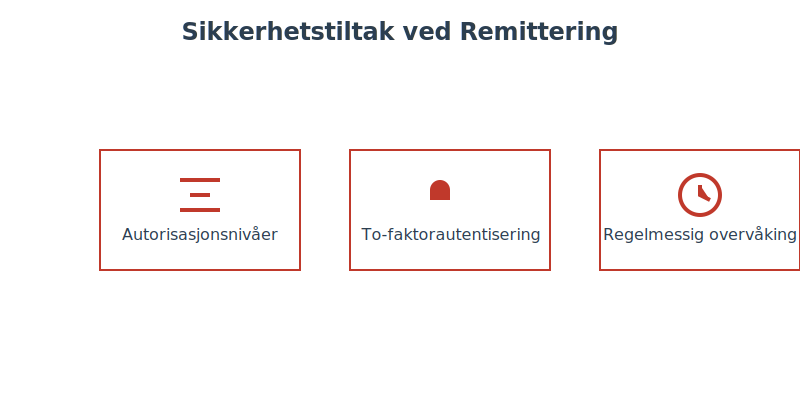
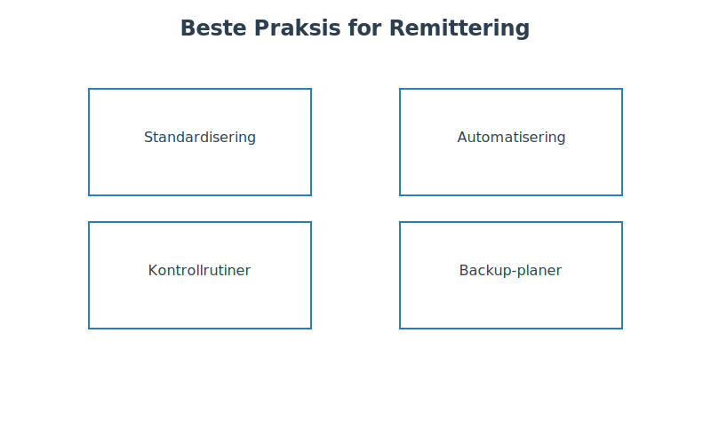

**Remittering** er en grunnleggende **betalingsmetode** innen regnskap som omfatter både **direkte remittering** og **indirekte remittering**. Remittering beskriver prosessen med å overføre midler mellom kontoer gjennom et betalingssystem, ofte via bank eller tredjepartsleverandører.

## Hva er Remittering?

Remittering, også kjent som *betalingsoverføring*, er en elektronisk prosess for å sende penger fra avsender til mottaker uten fysisk håndtering av kontanter eller papirbaserte betalingsmidler. Begrepet inkluderer flere metoder, hvor de mest vanlige er [direkte remittering](/blogs/regnskap/hva-er-direkte-remittering "Hva er Direkte Remittering? Komplett Guide til Direkte Overføringer") og indirekte remittering via mellommenn.


## Typer Remittering

De to hovedkategoriene av remittering er som følger:


| Type                    | Beskrivelse                                                    |
|-------------------------|----------------------------------------------------------------|
| **Direkte Remittering**   | Overføring direkte mellom kontoer uten mellomledd.               |
| **Indirekte Remittering** | Overføring via tredjepart, f.eks. betalingsplattform eller nettbank. |

## Prosessen for Remittering

En typisk remitteringsprosess innebærer flere steg for å sikre en sikker og korrekt transaksjon.


1. **Initiering:** Avsender spesifiserer betalingsdetaljer.
2. **Autorisering:** Banken eller tjenesteleverandøren verifiserer avsenderens legitimasjon.
3. **Behandling:** Midler reserveres og overføres i betalingsnettverket.
4. **Overføring:** Mottakers bank eller tjenesteleverandør krediterer mottakerkonto.
5. **Bekreftelse:** Bekreftelse sendes til både avsender og mottaker.

## Sammenligning av Direkte og Indirekte Remittering

Tabellen under viser en sammenligning av de to hovedformene for remittering:

| Kriterium            | Direkte Remittering              | Indirekte Remittering                |
|----------------------|----------------------------------|--------------------------------------|
| **Behandlingstid**   | Umiddelbar til 1 virkedag        | 1–3 virkedager                       |
| **Kostnad**          | Lav–middels                      | Middels–høy                          |
| **Sikkerhet**        | Høy                              | Variabel, avhengig av mellomledd     |
| **Sporbarhet**       | Utmerket                         | God                                  |
| **Avhengighet**      | Bank-til-Bank                    | Betalingsplattform eller bank        |

## Regnskapsføring av Remittering

Korrekt bokføring av remittering er avgjørende for nøyaktig regnskapsføring og bankavstemming.


**Ved betaling (avsender):**
```text
Debet: Leverandørgjeld / Utgift    XXX
Kredit: Bank                       XXX
```

**Ved mottak (mottaker):**
```text
Debet: Bank                        XXX
Kredit: Kundefordring / Inntekt    XXX
```

## Fordeler med Remittering

Remittering gir flere fordeler for både bedrifter og privatpersoner:


* **Effektivitet:** Rask og automatisert overføring.
* **Kostnadskontroll:** Reduserte transaksjonskostnader.
* **Sikkerhet:** Kryptert kommunikasjon og sporbarhet.
* **Fleksibilitet:** Både innenlandske og internasjonale overføringer.

## Risikostyring og Sikkerhet

Selv om remittering er en sikker betalingsmetode, må man implementere gode sikkerhetstiltak:



* **Autorisasjonsnivåer:** Dobbeltsignatur for store beløp.
* **To-faktorautentisering:** Sikrer brukeridentitet.
* **Regelmessig overvåking:** Kontinuerlig avstemming og revisjon.

## Regulatoriske Krav

Remittering er underlagt strenge regelverk for å sikre transparens og sikkerhet:


* **PSD2 (Betalingstjenestedirektivet):** EU-regelverk implementert i Norge.
* **Hvitvaskingsloven:** Krav om kundeidentifikasjon.
* **GDPR:** Personvern og databeskyttelse.
* **Finanstilsynet:** Overvåker betalingssystemer.

## Implementering i Bedriften

En strukturert tilnærming gir en vellykket implementering:


1. **Behovsanalyse:** Kartlegg eksisterende prosesser.
2. **Systemvalg:** Velg bank eller betalingsplattform.
3. **Testing:** Test med pilottransaksjoner.
4. **Utrulling:** Gradvis overgang.
5. **Optimalisering:** Løpende forbedringer.

## Beste Praksis

Følg disse retningslinjene for å optimalisere remitteringsprosessen:



* **Standardisering:** Konsistente betalingsformater.
* **Automatisering:** Bruk maler og automatiserte avstemmingsprosesser.
* **Kontrollrutiner:** Segregering av roller og dokumentasjon.
* **Backup-planer:** Alternative betalingsløsninger ved systemfeil.

## Konklusjon

**Remittering** er en robust og fleksibel betalingsmetode som dekker både direkte og indirekte overføringer. Ved å forstå typer, prosesser og regulatoriske krav, kan virksomheter dra nytte av effektive, sikre og kostnadseffektive betalingsløsninger.

For mer dypgående innsikt i direkte remittering, se [Hva er direkte remittering?](/blogs/regnskap/hva-er-direkte-remittering "Hva er Direkte Remittering? Komplett Guide til Direkte Overføringer").
