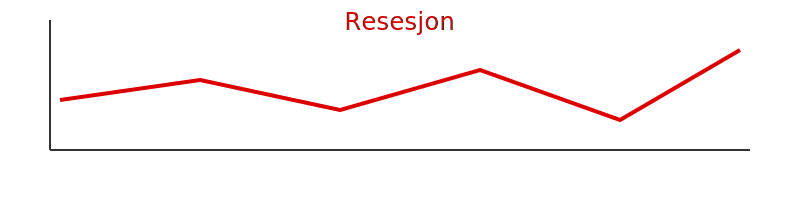

---
title: "Hva er Resesjon?"
seoTitle: "Hva er Resesjon?"
description: '**Resesjon** er en periode med vedvarende **fallende økonomisk aktivitet**, vanligvis definert som to påfølgende kvartaler med *negativ BNP-vekst*. Resesjon ...'
---

**Resesjon** er en periode med vedvarende **fallende økonomisk aktivitet**, vanligvis definert som to påfølgende kvartaler med *negativ BNP-vekst*. Resesjon er en sentral fase i [konjunktursyklusen](/blogs/regnskap/hva-er-konjunktur "Hva er Konjunktur? Komplett Guide til Konjunktursykluser og Økonomisk Planlegging") og har vidtrekkende konsekvenser for både makroøkonomien og bedriftenes regnskapspraksis.

## Definisjon av Resesjon

Resesjon beskriver en *lavkonjunktur* der den samlede økonomiske aktiviteten synker. Dette måles ofte ved at bruttonasjonalproduktet (BNP) faller i to påfølgende kvartaler. Resesjon kan føre til økt arbeidsledighet, reduserte investeringer og lavere forbruk.

## Årsaker til Resesjon

De vanligste årsakene til resesjon inkluderer:

* **Etterspørselsfall**: Nedgang i privat og offentlig forbruk.
* **Investeringstørke**: Lavere kapitalutgifter i næringslivet.
* **Stram pengepolitikk**: Høyere renter som demper kreditt og lån.
* **Eksterne sjokk**: For eksempel finanskriser eller handelskonflikter.

For en bredere forståelse av økonomiske drivere, se også [Makroøkonomi](/blogs/regnskap/makrookonomi "Makroøkonomi: Prinsipper og Betydning for Norsk Regnskap").

## Effekter på Norsk Økonomi

| Indikator              | Normal utvikling | Under resesjon        |
| ---------------------- | ---------------- | --------------------- |
| **BNP**                | Positiv vekst    | Negativ vekst         |
| **Arbeidsledighet**    | Lav              | Øker                  |
| **Forbruk**            | Stabil/økende    | Synker                |
| **Investeringer**      | Øker             | Reduseres             |
| **Priser**             | Moderat inflasjon| Deflasjon eller lav inflasjon |

I perioder med resesjon er det vanlig å observere *deflasjon*. Se [Deflasjon](/blogs/regnskap/hva-er-deflasjon "Hva er Deflasjon? Komplett Guide til Deflasjon i Regnskap og Økonomi").

## Regnskapsmessige implikasjoner

Under en resesjon må bedrifter tilpasse regnskapsføringen for å reflektere økonomisk nedgang:

1. **Økt avsetning for tap på kundefordringer**: Risikobildet endres, se [kundefordringer](/blogs/regnskap/hva-er-kundefordringer "Hva er Kundefordringer? Regnskapsføring og Styring").
2. **Nedskrivning av eiendeler**: Vurdering av virkelig verdi, se [nedskrivning](/blogs/regnskap/hva-er-nedskrivning "Hva er Nedskrivning? Regnskapsføring og Vurdering").
3. **Fokus på likviditetsstyring**: Kostnadsreduksjon og kontantstrøm, se [Likviditetsstyring](/blogs/regnskap/hva-er-likviditetsstyring "Hva er Likviditetsstyring? Metoder og Beste Praksis").

## Hvordan bedrifter kan forberede seg

Bedrifter kan styrke motstandskraften mot resesjon ved å:

* Utvikle fleksible kostnadsstrukturer og **kostnadsreduksjonstiltak**.
* Bygge opp **likviditetsreserver**.
* Diversifisere inntektskilder.
* Revidere budsjetter og prognoser ofte, se [Budsjettering](/blogs/regnskap/hva-er-budsjettering "Hva er Budsjettering? Komplett Guide til Budsjettplanlegging og Økonomisk Styring").

## Oppsummering

Resesjon er en betydelig utfordring for så vel økonomien som for den enkelte bedrift. Ved å forstå årsaker, indikatorer og regnskapsmessige implikasjoner, kan bedrifter tilpasse seg og bedre navigere i perioder med økonomisk nedgang.

For en dypere gjennomgang av denne fasen i konjunktursyklusen, se [Resesjon](/blogs/regnskap/resesjon "Hva er Resesjon? Betydning, årsaker og regnskapsmessige implikasjoner").

For kombinasjonen av *lav vekst* og *høy inflasjon*, se [Hva er Stagflasjon?](/blogs/regnskap/hva-er-stagflasjon "Hva er Stagflasjon? Forstå kombinasjonen av inflasjon og økonomisk stagnasjon").

