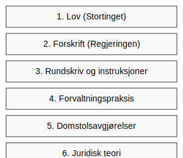

---
title: "Rettskildehierarkiet"
meta_title: "Rettskildehierarkiet"
meta_description: '**Rettskildehierarkiet** beskriver prioriteringen av ulike **rettskilder** som danner grunnlaget for norsk regnskapsførsel, god regnskapsskikk og skattemessig ...'
slug: rettskildehierarkiet
type: blog
layout: pages/single
---

**Rettskildehierarkiet** beskriver prioriteringen av ulike **rettskilder** som danner grunnlaget for norsk regnskapsførsel, god regnskapsskikk og skattemessig praksis.

## Hva er rettskildehierarkiet?

Rettskildehierarkiet viser rekkefølgen man skal følge når man vurderer og anvender ulike kilder, fra høyeste myndighetsnivå til mer veiledende referanser. Dette sikrer at regnskapsførsel og tolking av regelverk skjer konsistent og i henhold til lovgivningens intensjon.

| Rangering | Rettskilde                  | Beskrivelse                                                                                                         |
|-----------|-----------------------------|---------------------------------------------------------------------------------------------------------------------|
| 1         | Lov                         | Vedtatt av Stortinget. Eksempel: [bokføringsloven](/blogs/regnskap/hva-er-bokforingsloven "Hva er Bokføringsloven? Komplett Guide til Norsk Bokføringslovgivning")        |
| 2         | Forskrift                   | Utfyllende regler fastsatt av regjeringen eller departementet, som [bokføringsforskriften](/blogs/regnskap/hva-er-bokforingsforskriften "Hva er Bokføringsforskriften? Detaljert Guide til Norske Bokføringsregler") |
| 3         | Rundskriv og instruksjoner  | Veiledninger og tolkninger utstedt av myndigheter, for eksempel rundskriv fra Skatteetaten                             |
| 4         | Forvaltningspraksis         | Hvordan regelverket praktisk anvendes av tilsynsmyndigheter                                                          |
| 5         | Domstolsavgjørelser         | Prejudikater fra domstolene som gir rettslige holdepunkter                                                            |
| 6         | Juridisk teori              | Faglig litteratur og kommentarer som forklarer og tolker rettsregler                                                  |

## Hvorfor er hierarkiet viktig?

- **Konsistens:** Sikrer at regnskapsførsel følger samme prioriteringer over tid.
- **Forutsigbarhet:** Rettskildehierarkiet gir klare føringer for hvilken kilde som har forrang.
- **Rettssikkerhet:** Gir trygghet for regnskapsførere og brukere av regnskapet at regelverket er korrekt anvendt.

## Bruk av rettskildehierarkiet i praksis

Ved tvil om hvordan et regnskapsproblem skal løses, bør man alltid starte i toppen av hierarkiet:

1. Sjekk relevant lovtekst, for eksempel [bokføringsloven](/blogs/regnskap/hva-er-bokforingsloven "Hva er Bokføringsloven? Komplett Guide til Norsk Bokføringslovgivning").
2. Gå videre til gjeldende forskrifter, som [bokføringsforskriften](/blogs/regnskap/hva-er-bokforingsforskriften "Hva er Bokføringsforskriften? Detaljert Guide til Norske Bokføringsregler").
3. Konsulter rundskriv og veiledninger fra relevante myndigheter.
4. Undersøk tidligere forvaltningspraksis og domstolsavgjørelser.
5. Avslutt med juridisk teori for dypere forståelse.

## Andre ressurser

* [God regnskapsskikk](/blogs/regnskap/god-regnskapsskikk "God regnskapsskikk i Norge")
* [Hva er bokføringsloven?](/blogs/regnskap/hva-er-bokforingsloven "Hva er Bokføringsloven? Komplett Guide til Norsk Bokføringslovgivning")
* [Hva er bokføringsforskriften?](/blogs/regnskap/hva-er-bokforingsforskriften "Hva er Bokføringsforskriften? Detaljert Guide til Norske Bokføringsregler")

