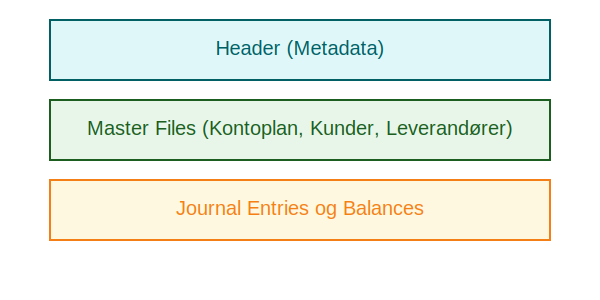

---
title: "Hva er SAF-T?"
meta_title: "Hva er SAF-T?"
meta_description: 'SAF-T (Standard Audit File for Tax) er en global standard for digital rapportering av regnskapsdata til skattemyndigheter. I Norge er **SAF-T** vedtatt som del ...'
slug: saf-t
type: blog
layout: pages/single
---

SAF-T (Standard Audit File for Tax) er en global standard for digital rapportering av regnskapsdata til skattemyndigheter. I Norge er **SAF-T** vedtatt som del av [bokføringsloven](/blogs/regnskap/hva-er-bokforingsloven "Hva er Bokføringsloven? Krav, Regler og Praktisk Veiledning") og krever at virksomheter kan eksportere regnskapsdata i et strukturert XML-format.

SAF-T gjør det enklere for Skatteetaten å gjennomføre effektivt [bokettersyn](/blogs/regnskap/bokettersyn "Bokettersyn - Komplett Guide til Regnskapskontroll") og intern revisjon ved å standardisere datautveksling og sikre **kompletthet**, **sporing** og **sporbarhet** av regnskapsinformasjon.

## Hvorfor SAF-T?

Ved å bruke **SAF-T** kan virksomheter:

* Automatisere eksport av regnskapsdata fra [ERP-systemer](/blogs/regnskap/erp-system "Hva er ERP-system? Komplett Guide til ERP i Regnskap") og regnskapsprogrammer.
* Redusere tidsbruk og manuelle feil ved forberedelse av dokumentasjon til skattemyndigheter.
* Sikre enhetlig format og struktur uavhengig av teknologileverandør.

## Hovedkomponenter i SAF-T-filen

Tabellen nedenfor gir en oversikt over de viktigste delene av en SAF-T-fil:

| **Element**            | **Beskrivelse**                                                      |
|------------------------|----------------------------------------------------------------------|
| **Header**             | Metadata om eksport, virksomhet, periode og versjon av SAF-T-schema. |
| **Master Files**       | Grunnleggende registre som kontoplan, kunder, leverandører og varer. |
| **Journal Entries**    | Bilagslinjer med transaksjoner, dato, beløp og referanser.           |
| **Balances**           | Periodisert saldooversikt per konto i regnskapet.                    |
| **Tax Details**        | Spesifikk informasjon om merverdiavgift og skatter.                  |

## Implementering i Norge

I Norge har Skatteetaten definert en norsk tilpasning av SAF-T i henhold til internasjonalt XML-schema. For å innfri kravene må regnskapssystemer støtte:

1.  Eksport av SAF-T-XML med korrekte feltnavn og strukturer.
2.  Validering mot gjeldende schema-versjon publisert by Skatteetaten.
3.  Dokumentasjon av prosesser og rutiner for generering av SAF-T-data.

For beste praksis ved automatisering av SAF-T-eksport, se vår guide til [API-integrasjon og automatisering](/blogs/regnskap/api-integrasjon-automatisering-regnskap "API-integrasjon og Automatisering i Regnskap").

## Fordeler og utfordringer

**Fordeler:**

* Standardisering sikrer konsistent rapportering på tvers av virksomheter.
* Redusert manuelt arbeid og færre formelle avvik.
* Raskere og mer presise analyser av regnskapsdata for skattemyndigheter.

**Utfordringer:**

* Teknisk implementasjon krever tilpasning av regnskapssystem.
* Løpende vedlikehold ved oppdatering av schema og bokføringsregler.

## Oppsummering

SAF-T representerer en viktig utvikling innen digitalisering av norsk regnskapsrapportering. Ved å adoptere SAF-T-standard kan virksomheter oppnå bedre internkontroll, mer effektive bokettersyn og sikre etterlevelse av [bokføringsloven](/blogs/regnskap/hva-er-bokforingsloven "Hva er Bokføringsloven? Krav, Regler og Praktisk Veiledning").

