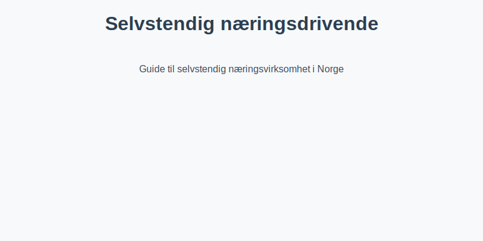

---
title: "Selvstendig næringsdrivende"
meta_title: "Selvstendig næringsdrivende"
meta_description: 'For en oversikt over selskapsformer, se [Hva er et Enkeltpersonforetak?](/blogs/regnskap/hva-er-enkeltpersonforetak "Hva er et Enkeltpersonforetak? Komplett Gui...'
slug: selvstendig-naeringsdrivende
type: blog
layout: pages/single
---

For en oversikt over selskapsformer, se [Hva er et Enkeltpersonforetak?](/blogs/regnskap/hva-er-enkeltpersonforetak "Hva er et Enkeltpersonforetak? Komplett Guide til Selskapsformen").

Selvstendig næringsdrivende er en person som **driver næringsvirksomhet i eget navn**, uten å være ansatt i egen virksomhet. Denne kategorien omfatter blant annet **enkeltpersonforetak (ENK)**, frilansere og konsulenter.

## Hva betyr det å være selvstendig næringsdrivende?

Som selvstendig næringsdrivende må du selv **dekke alle kostnader**, **ivareta kundekontakt** og **ansvar for regnskap og skatt**. Du har følgende karakteristika:

* **Egen næringsdrivende:** Du er ikke ansatt, og all inntekt regnes som **næringsinntekt**.
* **Skatt og avgifter:** Du betaler skatt basert på overskuddet etter fradrag, herunder **trygdeavgift** og **trinnskatt**.
* **Regnskapsplikt:** Avhengig av omsetning kan du ha forenklet eller full regnskapsplikt.
* **Ansvar:** Du har personlig ansvar for virksomhetens forpliktelser.

## Skattemessige regler

Selvstendig næringsdrivende rapporterer næringsinntekt i [næringsoppgaven](/blogs/regnskap/hva-er-naeringsoppgave "Hva er Næringsoppgave? Komplett Guide til Næringsoppgaven i Norge"). Følgende gjelder:

| Regel                          | Forklaring                                                             |
|--------------------------------|-------------------------------------------------------------------------|
| **Trygdeavgift**               | Betales av netto næringsinntekt (8,2 % for de fleste yrker)             |
| **Trinnskatt**                 | Progressiv skatt basert på personinntekt                              |
| **Skattepliktig overskudd**    | Resultatet etter kostnadsfradrag, avskrivninger og justeringer         |
| **MVA-registrering**           | Obligatorisk ved omsetning over 50 000 kr                             |

## Regnskapsplikt og rapportering

Avhengig av omsetning følger to nivåer:

* **Omsetning under 5 mill. kr:** Forenklet regnskapsplikt etter [bokføringsloven](/blogs/regnskap/hva-er-bokforingsloven "Hva er Bokføringsloven? Komplett Guide til Norsk Bokføringslovgivning").
* **Omsetning over 5 mill. kr:** Full regnskapsplikt med krav til dobbelt bokføring og årsregnskap.

## Fordeler og ulemper

| Fordeler                                      | Ulemper                                      |
|-----------------------------------------------|----------------------------------------------|
| Enkel etablering og lavt byråkrati            | Personlig ansvar for all gjeld               |
| Fleksibel arbeidstid og full kontroll         | Vanskelig å hente ekstern kapital            |
| Direkte skattemessig fradrag for kostnader    | Kan ha høy marginalskatt ved høyt overskudd  |
| Ingen krav til startkapital                   | Begrenset kontinuitet ved eierens sykdom/død |

## Når bør du velge selvstendig næringsdrivende?

Selvstendig næringsdrivende passer godt for:

1. **Frilansere og konsulenter** med lav investeringsbehov.
2. **Små virksomheter** med enkel drift og få ansatte.
3. **Prosjekter** med kort varighet eller variabel omsetning.

## Relaterte artikler

* [Hva er et Enkeltpersonforetak?](/blogs/regnskap/hva-er-enkeltpersonforetak "Hva er et Enkeltpersonforetak? Komplett Guide til Selskapsformen")
* [Personinntekt](/blogs/regnskap/personinntekt "Personinntekt “ Komplett guide til personinntekt i norsk regnskap")
* [Næringsinntekt](/blogs/regnskap/naeringsinntekt "Næringsinntekt “ Komplett guide til næringsinntekt i norsk regnskap")

## Konklusjon

Å være selvstendig næringsdrivende gir **frihet og fleksibilitet**, men krever også **ansvar for alt fra regnskap til kundehåndtering**. Grundig planlegging av skatt, regnskap og forsikring er nøkkelen til suksess.

