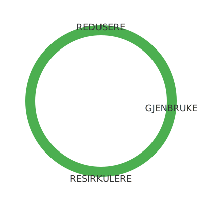

---
title: "Sirkulær økonomi"
seoTitle: "Sirkulær økonomi"
meta_description: '**Sirkulær økonomi** er en modell for å **optimalisere ressursbruk** og redusere avfall ved å designe produkter og tjenester for gjenbruk, reparasjon og res...'
slug: sirkulaer-okonomi
type: blog
layout: pages/single
---

**Sirkulær økonomi** er en modell for å **optimalisere ressursbruk** og redusere avfall ved å designe produkter og tjenester for gjenbruk, reparasjon og resirkulering. Denne tilnærmingen bygger på prinsippene for [Bærekraft](/blogs/regnskap/baerekraft "Bærekraft i Regnskap: En Komplett Guide til Bærekraft og Bærekraftsrapportering") og har økende betydning for norsk regnskapspraksis og rapportering.

## Hva er sirkulær økonomi?

I en **sirkulær økonomi** fokuserer man på å:

* **Redusere** bruk av nye ressurser.
* **Gjenbruke** materialer og produkter så lenge som mulig.
* **Reparere** og oppgradere varer for å forlenge levetiden.
* **Resirkulere** materialer tilbake til produksjon.

| Prinsipp    | Beskrivelse                                          |
|-------------|------------------------------------------------------|
| Redusere    | Minimere råvareforbruk og avfall                     |
| Gjenbruke   | Bruke eksisterende produkter og komponenter på nytt   |
| Reparere    | Fikse defekte produkter for å forlenge levetiden      |
| Resirkulere | Omforme materialer til nye produkter eller råvarer    |

## Implementering i regnskap og rapportering

Å integrere **sirkulær økonomi** i regnskapsprosesser innebærer:

1. *Materielloversikt* “ Kartlegge ressursbruk og avfallsmengder.
2. *Kostnadsfordeling* “ Allokere kostnader for reparasjon, omarbeiding og gjenvinning.
3. *KPI-er* “ Definere indikatorer som vektede kostnader per enhet ombruk eller resirkulering.
4. *Rapportering* “ Inkludere sirkulærøkonomi-mål i bærekraftsrapporten etter [CSRD-direktivet](/blogs/regnskap/hva-er-csrd "Hva er CSRD? Corporate Sustainability Reporting Directive - Komplett Guide") og [EU-taksonomien](/blogs/regnskap/hva-er-eu-taksonomien "Hva er EU-taksonomien? Komplett Guide til EUs Klassifiseringssystem for Bærekraftige Aktiviteter").

## Eksempler fra norsk næringsliv

| Virksomhet     | Tiltak                                    | Resultat                                  |
|----------------|-------------------------------------------|-------------------------------------------|
| Eksempel AS    | Innført system for ombruk av emballasje   | Reduksjon av plastavfall med 30 %         |
| Gjenbruk Norge | Reparasjonstjeneste for elektronikk       | Økt produktlevetid med gjennomsnittlig 2 år |

Ved å integrere **sirkulær økonomi** i regnskap og rapportering kan virksomheter oppnå bedre ressursutnyttelse, lavere kostnader og styrket omdømme.

*Artikkelen ble sist oppdatert for å gi en grundig oversikt over prinsipper og regnskapsmessige implikasjoner av sirkulær økonomi.*

