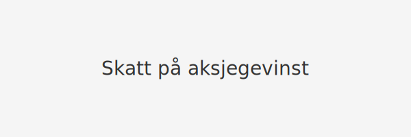

---
title: "Skatt på aksjegevinst"
meta_title: "Skatt på aksjegevinst"
meta_description: '**Skatt på aksjegevinst** omfatter skattereglene for gevinst ved salg av aksjer for både privatpersoner og bedrifter i Norge. Denne artikkelen går i dybden p...'
slug: skatt-pa-aksjegevinst
type: blog
layout: pages/single
---

**Skatt på aksjegevinst** omfatter skattereglene for gevinst ved salg av aksjer for både privatpersoner og bedrifter i Norge. Denne artikkelen går i dybden på de ulike skatteregimene, inkludert aksjonærmodellen, skjermingsfradrag, fritaksmetoden og aksjesparekonto (ASK), samt praktiske eksempler på beregning og rapportering.

## Oversikt over skatteregimer

| MÃ¥lgruppe                        | Skatteregime                               | Skattepliktig andel           | Effektiv skattesats     |
|----------------------------------|---------------------------------------------|-------------------------------|-------------------------|
| Privatperson (direkte aksjegevinst) | Aksjonærmodellen med skjermingsfradrag     | 100% av netto gevinst         | 22% av netto gevinst    |
| Privatperson (ASK)               | Aksjesparekonto (ASK)                     | 22% ved uttak av overskudd    | 22% ved uttak          |
| Selskap                          | Fritaksmetoden                             | 3% av gevinst                 | 0,66% (3% × 22%)       |
| Selskap (unntak/fritak)          | Fritaksmetoden, særregler                 | Varierer                      | Varierer               |

## Privatpersoner: Aksjonærmodellen og skjermingsfradrag

Les mer i vår [Aksjonærmodellen - Komplett Guide til Norsk Aksjebeskatning](/blogs/regnskap/aksjonaermodellen-guide "Aksjonærmodellen - Komplett Guide til Norsk Aksjebeskatning") for detaljer om prinsippene bak aksjonærmodellen og beregning av skjermingsfradrag.

* **Skjermingsfradrag** beskytter en normalavkastning mot beskatning.
* Skjermingsfradraget beregnes som:  
  _Skjermingsgrunnlag × Skjermingsrente_
* Restgevinst etter skjerming beskattes som alminnelig inntekt (22%).

## Aksjesparekonto (ASK)

En [aksjesparekonto](/blogs/regnskap/hva-er-aksjesparekonto "Hva er Aksjesparekonto? Fordeler, begrensninger og regler") lar privatpersoner utsette skatt på aksjegevinster og utbytte innenfor kontoen.  

* **Innskuddsramme:** 300 000 kr (2024)  
* **Skatteutsettelse:** Gevinst og utbytte er skattefritt inntil uttak av overskudd  
* **Uttaksskatt:** 22% beregnes ved uttak av gevinst  

## Bedrifter: Fritaksmetoden

Se vår [Fritaksmetoden - Skattefritak for aksjegevinst og utbytte](/blogs/regnskap/hva-er-fritaksmetoden "Fritaksmetoden - Komplett guide til skattefritak av aksjegevinst og utbytte") for en detaljert gjennomgang av vilkårene og beregningen.

* **Skattefri del:** 97% av gevinsten  
* **Skattepliktig del:** 3% av gevinsten  
* Effektiv skattesats: 0,66% (3% × 22%)

## Praktiske eksempler

| Scenario                           | Kjøp         | Salg         | Skattepliktig gevinst       | Skatt                  |
|------------------------------------|--------------|--------------|-----------------------------|------------------------|
| Privat (direkte aksjegevinst)      | 100 000 kr   | 150 000 kr   | 50 000 kr                   | 11 000 kr (22%)        |
| Privat (ASK)                       | 100 000 kr   | 150 000 kr   | 50 000 kr ved uttak         | 11 000 kr (22%)        |
| Selskap                            | 500 000 kr   | 650 000 kr   | 4 500 kr (3% av 150 000 kr) | 990 kr (0,66%)         |

## Rapportering

* Privatpersoner rapporterer aksjegevinster og -tap i RF-1030.  
* Selskaper rapporterer via RF-1167 og årsregnskapet.

For mer omfattende info om beregning av kapitalgevinst, se [Hva er kapitalgevinst?](/blogs/regnskap/hva-er-kapitalgevinst "Hva er kapitalgevinst? Komplett Guide til Skatt og Regnskapsføring").

